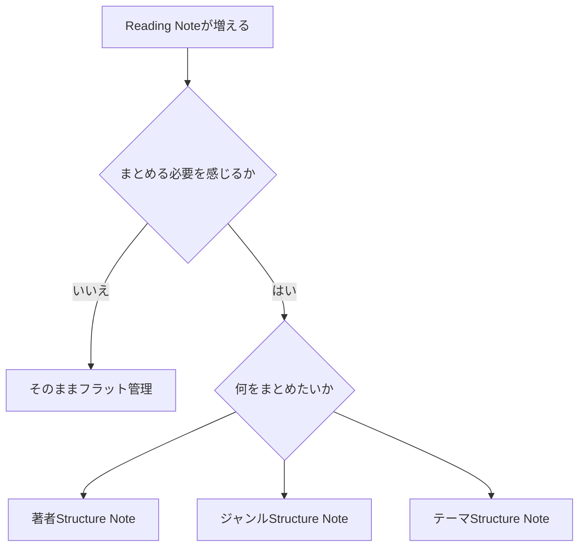
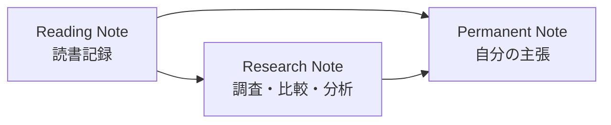
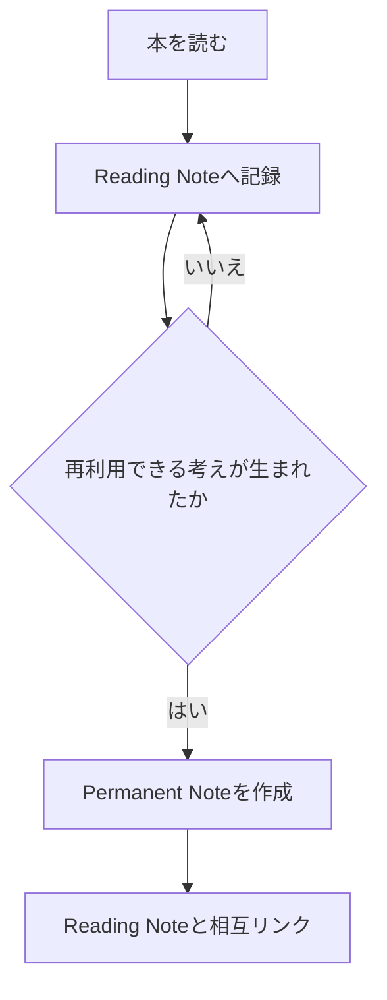
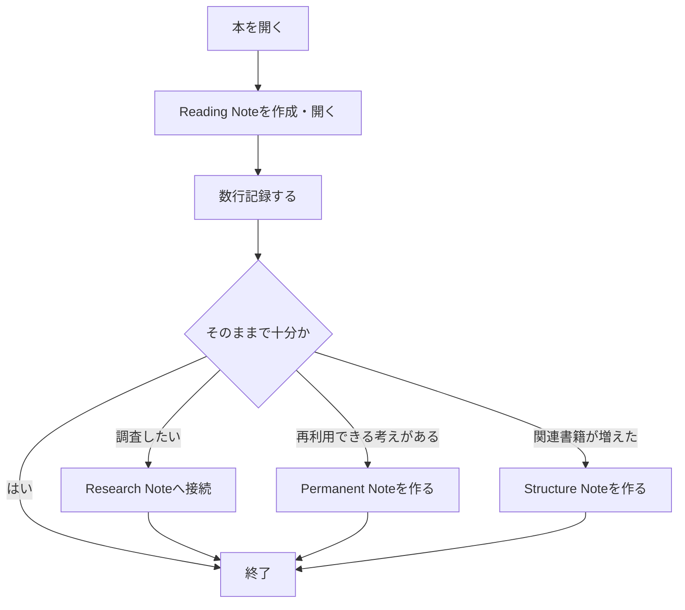

# Reading - 運用方針

`21_Reading`は、本の内容を完全に要約する場所ではなく、**読んだという活動を低い負担で残し、次に読むきっかけを作る場所**として使う。

読書ノートそのものを精密なデータベースにしない。分類や書誌情報の整理よりも、読書を再開・継続しやすいことを優先する。

> **「どう分類するか」より「本を開いたあと30秒で記録を開始できるか」を設計基準にする。**

---

## 基本方針

- 一冊につき一つのReading Noteを作る
- Reading Noteは `21_Reading/Books/` に保存する
- `Books`配下は原則としてフラットに管理する
- 著者別・ジャンル別のサブフォルダは作らない
- 読了していない本も記録対象とする
- 数ページしか読めなかった日も記録してよい
- 途中で読むのをやめた本も残してよい
- 再読した場合は、新しいノートを作らず同じノートへ追記する
- 完全な要約や分析をReading Noteの必須条件にしない

Reading Noteは「本を管理するための台帳」ではなく、**読書の痕跡と思考を残すための記録**として扱う。

---

## ディレクトリ構成

```
21_Reading/
├─ Reading - 運用方針.md
└─ Books/
   ├─ 書籍A.md
   ├─ 書籍B.md
   └─ 書籍C.md
```

`Books`以下には著者やジャンルごとのフォルダを作らない。

分類が必要になった場合は、ファイルを移動して整理するのではなく、Structure Noteによって関係を作る。

---

## Reading Noteの作り方

Reading Noteでは、最低限以下の情報が残っていればよい。

- 読んだ日
- 読んだ範囲
- 気になった点
- 感想
- 疑問
- 後で考えたいこと

すべてを書く必要はない。

数行でも記録が残れば、**その日の読書記録は完成とする。

```
## 2026-10-03

p.1–20。

習慣と環境の関係が気になった。

## 2026-10-06

p.21–47。

前回気になった点について説明があった。
```

ページ番号も必須ではない。

「第3章まで」「目次だけ確認」「気になった箇所だけ再読」などでもよい。

また、

Reading Noteの日付記録は古いものから新しいものへ並べ、新しい読書記録はノート末尾へ追記する。** これは、**「今どうなっているか」よりも「どう読んできたか」も重要**だから。
1. 追記が最も簡単
2. 読書の進行そのものが1つのストーリーになる
3. 過去記録を動かさなくて良い


---

## Reading Noteのファイル名

ファイル名はQuartz上で安定したURLとするため、書籍タイトルを翻訳書も含めて全てローマ字化したslugを使用する。

- 書籍タイトルをローマ字化する
- 単語等の区切りには `-` を使用する
- 小文字を基本とする
- 英語の正式タイトルが存在する場合でも、ファイル名の命名規則は変更しない
- 正式な日本語書名はYAMLの`title`および`aliases`で保持する

**余計なIF選択肢を生み出さず、一本化することで作業負担を減らす**

---
## YAML

Reading Note専用のYAMLは作らない。

普段のZettelkastenで使用しているYAMLを、そのまま利用する。

読書管理のためだけに以下のような専用プロパティは追加しない。

- `author`
- `genre`
- `status`
- `started`
- `finished`
- `rating`
- `publisher`
- `isbn`
- `pages`

必要な情報があれば本文やStructure Noteで扱う。

YAMLを充実させること自体を目的にしない。

### title

`title`には原則として書籍タイトルのみを記載する。

```
title: ファスト＆スロー
```

著者名を`title`へ含める必要はない。

### aliases

`aliases`は必要な場合のみ使用する。

例：

- 原題
- 別邦題
- 略称
- 表記揺れ

```
aliases:
  - Thinking, Fast and Slow
```

著者名をaliasesとして扱わない。

---

## type

Reading Noteは原則として`literature`として扱う。

Reading Noteは、

- 外部資料である書籍を基礎としている
- 長期間保持する
- 読書体験や出典を残す
- Permanent Noteの根拠になることがある

という性質を持つため、一時的な`fleeting`とは分ける。

---

## 著者・ジャンルの管理

著者やジャンルによってフォルダ分類は行わない。

同じ著者やジャンルのReading Noteが蓄積し、**一覧したい・比較したい・関係を整理したいという必要が生じた時点でStructure Noteを作る。**



Structure Noteを作る冊数に固定基準は設けない。

「3冊になったら作る」のようなルールではなく、

- 前にも同じテーマの本を読んだ
- この著者の本を複数比較したい
- 関連書籍を一覧したい
- 複数冊の関係が見えてきた

と感じた時点を作成タイミングとする。

---

## Reading Noteと精読を分ける

通常のReading Noteでは、精密な分析を必須にしない。

章構造の分析、複数資料との比較、論点整理などが必要になった場合は、Reading Noteを重くするのではなくResearch側で扱う。



Reading NoteそのものをResearchへ移動・変更しない。

Reading Noteには、

- どの本を読んだか
- どこを読んだか
- 何を感じたか
- 何が気になったか

という読書体験を残す。

Research Noteでは、

- 複数資料の比較
- 問いの検討
- 章構造の分析
- 事実確認
- 論点整理

などを行う。

---

## Zettelkastenへの接続

Reading Noteを丸ごとPermanent Noteへ変更しない。

読書中に、特定の本だけに依存せず、別の状況でも再利用できる主張が生まれた場合のみPermanent Noteとして切り出す。



Reading Noteには具体的な読書体験と出典を残す。

Permanent Noteには、その読書をきっかけとして生まれた**自分の言葉による主張**を書く。

例：

```
## 2026-10-03

p.35–42。

環境によって行動開始の難しさが変わるという説明が気になった。

→ [[環境設計は行動開始の摩擦を左右する]]
```

---

## 読書記録を重くしない

Reading Noteでは、空の見出しを大量に用意しない。

以下のようなテンプレートを毎回埋めることは必須にしない。

```
要約
重要ポイント
感想
引用
疑問
反論
関連書籍
評価
学び
今後の行動
```

こうした項目が必要な本では追加してよいが、すべての本へ要求しない。

基本形は、

```
## YYYY-MM-DD

読んだ範囲。

気になったこと。
```

程度でよい。

---

## 読了しない本の扱い

読了していないことを失敗として扱わない。

以下もすべて有効な読書記録とする。

- 数ページだけ読んだ
- 目次だけ確認した
- 一章だけ読んだ
- 必要な部分だけ参照した
- 途中で興味を失った
- 今は読む必要がないと判断した
- 数年後に再読した

Reading Noteの目的は、読了冊数を増やすことではなく、**読書という活動と思考の履歴を残すこと**にある。

---

## 運用フロー



Reading Note作成時点では、Research Note、Permanent Note、Structure Noteの作成を必須にしない。

必要性が生じたものだけ後から発展させる。

---

## 判断原則

運用に迷った場合は、以下の順番で判断する。

1. 読書そのものを邪魔しないか
2. 30秒程度で記録を開始できるか
3. 今その情報を管理する必要が本当にあるか
4. 後から必要になった時に追加できないか
5. 分類よりリンクやStructure Noteで解決できないか

迷った場合は、**作らない・増やさない・分類しない側を優先する。**

読書量やノートが増え、実際の不便が発生してから仕組みを追加する。

---

## この運用の目的

この仕組みの目的は、完成度の高い読書データベースを作ることではない。

目的は、

- 読書習慣を再開する
- 読書を継続しやすくする
- 読んだことを軽く残す
- 過去の読書へ戻れるようにする
- 必要な知識だけZettelkastenへ接続する

ことである。

**Reading Noteは読書のために存在する。Reading Noteを書くために読書する状態にはしない。**
## 関連ノート

- [ツェッテルカステン向けのVaultのフォルダ構成](zettelkasten-vault-folder-structure.md)
- [活動記録はジャーナルとして残す](keep-activity-logs-as-journal.md)
- [知識や経験を自分のネットワークに編み込んでいく](weaving-knowledge-into-zettelkasten.md)


