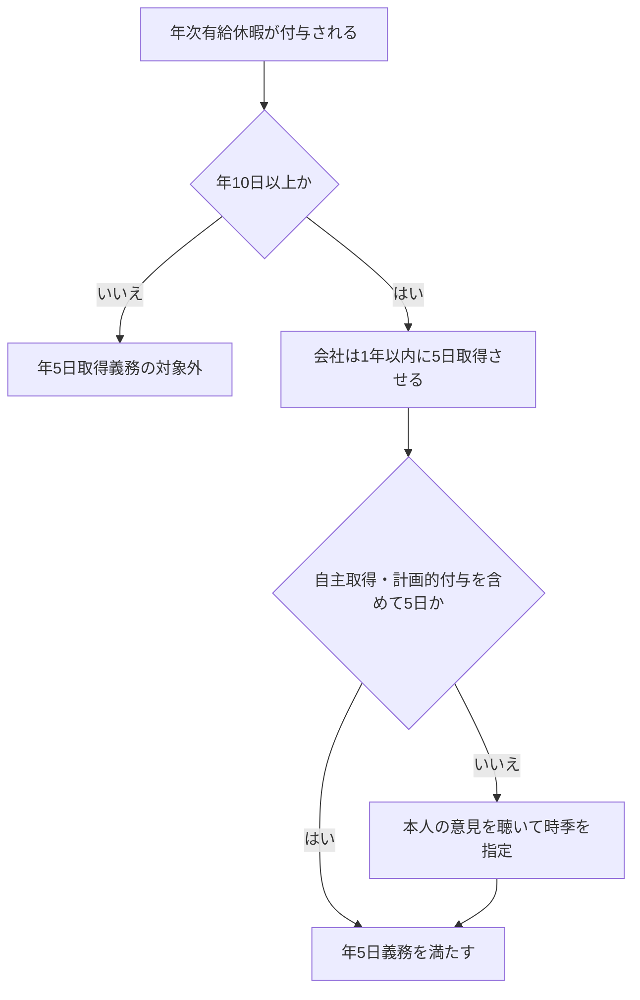

# 年次有給休暇の年5日取得義務と会社の責任

年次有給休暇について、「残っている日数をすべて消化しなければならない」という一般的な義務はない。一方で、年10日以上の年次有給休暇が付与される労働者には、基準日から1年以内に少なくとも5日を取得させる会社側の義務がある。[厚生労働省の労働者向け案内](https://work-holiday.mhlw.go.jp/kyuuka-sokushin/roudousya.html)

## 誰が何を負うのか

| 論点 | 内容 |
| --- | --- |
| 対象 | 年10日以上の年次有給休暇が付与される労働者。パートタイム労働者も対象になり得る。 |
| 期限 | 有給の基準日から1年以内 |
| 必要日数 | 5日 |
| 責任主体 | 取得させる義務を負うのは会社 |
| 従業員の自主取得 | その日数は5日に算入される |
| 計画的付与 | その日数も5日に算入される |

たとえば年間10日が付与され、自主的な取得が3日なら、会社は残り2日を取得させる必要がある。すでに5日取得している場合、年5日取得義務を理由に会社が追加で指定する必要はない。

## 会社から「あと何日取ってください」と言われる理由

従業員が自主的に5日を取得していないとき、会社は本人の意見を聴き、その希望を尊重しながら取得時季を指定できる。これは、有給残高をすべて消化させるためではなく、年5日の取得義務を果たすための制度である。[厚生労働省の事業主向け案内](https://work-holiday.mhlw.go.jp/kyuuka-sokushin/jigyousya.html)

従業員が自分から有給を申請しないこと自体に、労働基準法上の罰金が直接科されるわけではない。義務を果たさなかった場合に問題となるのは会社側であり、罰則として30万円以下の罰金が定められている。[厚生労働省のQ&A](https://www.check-roudou.mhlw.go.jp/qa/roudousya/yukyu/q1.html)

## 別に考えるべきもの

| 概念 | 意味 |
| --- | --- |
| 年5日取得義務 | 対象者に、基準日から1年以内に5日取得させる会社の義務 |
| 有給残高 | 現在使える有給の日数。多いこと自体は全消化義務を意味しない。 |
| 時効消滅 | 年次有給休暇の請求権は原則として発生から2年で消滅する。 |

会社からの案内を受けたときは、「年5日まであと何日か」と「いつ失効する有給があるか」を分けて確認する。個別の就業規則、付与日、計画年休の有無によって扱いが変わるため、最終的には会社の管理簿や人事担当への確認が必要である。

