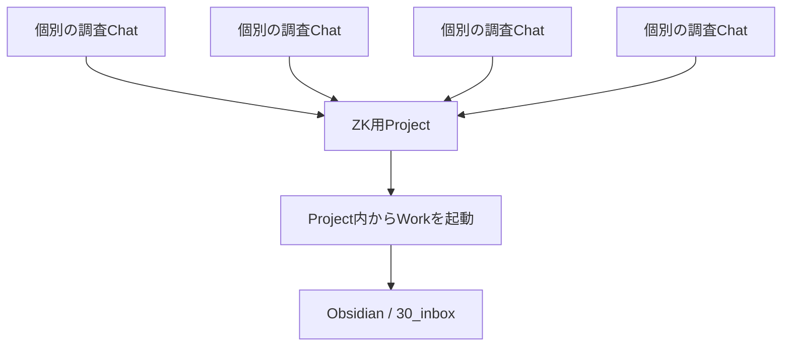

# ChatGPT Project + WorkでZKノートをObsidianへ一括保存する運用

ChatGPTで調べた内容をZettelkasten（ZK）ノートとして残す場合、各スレッドの最後にAIへまとめさせ、その内容をObsidianへ保存している。

目的は「知識を完全に自分の文章へ書き直すこと」ではなく、**同じことを後から繰り返し調べ直すコストを減らすこと**にある。

AIが生成したノートは一旦 `ai-generated` として保存し、そのまま残してもよい。重要になったノートだけ後日自分で加筆・修正し、必要に応じて `ai-generated` を外す。

問題は、各ChatスレッドでZK向けのまとめを作ったあと、

```text
ChatGPT
→ 内容をコピー
→ Obsidianを開く
→ 新規ノート作成
→ 貼り付け
→ 保存
```

という転記作業が毎回必要になることだった。

## 単純なWork引き継ぎでは手間はあまり減らない

当初は、各スレッドを個別にWorkへ引き継ぎ、Obsidianへ保存させる方法を検討した。

しかしこの方法では、

```text
スレッドA → Work → 権限確認 → 保存
スレッドB → Work → 権限確認 → 保存
スレッドC → Work → 権限確認 → 保存
```

となり、コピペは減っても、

- 各スレッドをWorkへ切り替える
- フォルダーアクセスを許可する
- ファイル操作を行わせる

という作業をスレッドごとに繰り返す必要がある。

複数スレッドを一度まとめてからWorkへ渡す方法も考えられるが、その「まとめ」を人間が各スレッドからコピペして作るのであれば、**作業場所が変わっただけで本質的な省力化にはならない**。

## Projectをスレッドの集約地点にする

この問題を解消するため、ZK化対象のスレッドをChatGPTの同一Projectへ集約する。

構成は次のようになる。



各Chat自体は独立しているため、一つの巨大なスレッドにまとめる必要はない。

Projectは、**複数のChatを後からまとめてWorkに参照させるためのコンテナ**として使う。

## 各ChatではZKノート化直前まで完成させる

各スレッドでは、調査や追加質問を行ったあと、最後にそのスレッド内でZKノートとして使える状態まで整理しておく。

例：

```text
疑問が発生
↓
ChatGPTで調査
↓
追加質問・訂正
↓
スレッド全体を整理
↓
ZKノート本文を完成
```

ここではまだObsidianへ保存しない。

WorkにProject全体を渡した際、元の長い会話そのものを再解釈させるより、**各スレッドの末尾に完成したZKノートが存在する状態**にしておく方が安定する。

ChatとWorkの役割を分ける。

| Chat | Work |
|---|---|
| 調査 | Projectコンテキスト確認 |
| 追加質問 | ZK化済み内容の抽出 |
| 誤りの訂正 | ファイル化 |
| 内容の整理 | Obsidianへの保存 |
| ZKノート本文作成 | 複数ノートの一括処理 |

## Projectへの既存Chat移動

既存の通常ChatもProjectへ移動できる。

ただし実際の操作では、デスクトップ版とブラウザ版で挙動に差があった。

確認できた環境では、

- ブラウザ版では既存ChatをProjectへドラッグ＆ドロップ可能
- デスクトップ版ではドラッグ＆ドロップで追加できなかった
- ブラウザ側でProjectへ登録したChatは、その後デスクトップ版でもProject内から利用可能

だった。

そのため、既存Chatの整理はブラウザ版で行う方が確実。

今後作る新しい調査Chatについては、最初からZK用Project内で開始すれば、後から移動する作業自体を減らせる。

## Project設定

ZK運用用のProjectを作成し、Obsidian Vaultをソースフォルダーとして登録する。

Project内からWorkを起動すると、Projectに登録されたChatのコンテキストと、設定したローカルフォルダーを利用して処理できる。

今回の用途ではProjectのメモリは**デフォルトメモリ**を使用する。

Project限定メモリは、外部コンテキストを遮断する用途では有効だが、Workとの併用条件に制約があるため、このZK書き出し用途には向かない。

## Obsidian側では `30_inbox` を受け皿にする

WorkにいきなりVault内の恒久配置先まで決めさせるのではなく、一旦すべて `30_inbox` へ保存する。

```text
Chatで調査
↓
Projectに蓄積
↓
Workで一括ファイル化
↓
30_inbox
↓
人間が確認
↓
必要に応じて恒久配置
```

この方式なら、

- ファイル名が適切か
- 既存ノートと重複していないか
- リンク先は適切か
- 本当に残す価値があるか

を後から確認できる。

Workによる誤分類や意図しない既存ノート編集も避けやすい。

## 実際に成立した運用

最終的に次の手順で、複数のChatからZKノートをObsidianへ一括保存できた。

1. ZK化したいChatをProjectへ登録する
2. 各Chat内で事前にZKノート本文まで作成しておく
3. デスクトップ版ChatGPTを起動する
4. 対象Project内からWorkを起動する
5. WorkにProjectコンテキストを確認させる
6. 各Chatで作成済みのZKノートを抽出させる
7. Obsidianの `30_inbox` にMarkdownファイルとして保存させる

結果として、

```text
複数Chat
↓
Project
↓
1回のWork
↓
複数Markdown
↓
30_inbox
```

という一括処理が成立した。

## この運用の意味

この仕組みにより、従来必要だった、

```text
各スレッド
→ コピー
→ Obsidian
→ 新規ファイル
→ 貼り付け
```

という反復操作を大幅に削減できる。

役割分担は次のように整理できる。

```text
Chat
= 調査・議論・ZK本文作成

Project
= 関連Chatの集約

Work
= コンテキスト確認・ファイル操作

30_inbox
= AI生成ノートの一時受け皿

Obsidian
= 長期的な知識の正本
```

特に重要なのは、**Chat履歴そのものを最終的な知識ベースにしないこと**。

Chatは調査ログとして使い、再利用したい内容だけをMarkdownノートへ圧縮する。

```text
Chat履歴
↓
AI-generated ZK note
↓
必要なら後から人間が修正
↓
恒久的な知識
```

という段階構造にすることで、すべてのAI生成ノートを即座に人間が書き直す必要もなくなる。

## 運用上の方針

- AI生成ノートは一旦 `ai-generated` として保存してよい
- 重要度の低いノートはそのままでもよい
- 必要になったノートだけ後から自分で修正する
- 新規ノートは原則 `30_inbox` へ保存する
- 既存ノートへの直接編集・削除・移動は慎重に扱う
- 各Chatでは、Workに渡す前にZK本文まで完成させる
- 新しい調査はなるべく最初からZK用Project内で開始する
- 既存ChatのProject移動はブラウザ版を使用する

## 今後の改善候補

各スレッド末尾のZK出力形式を統一すると、Workでの一括処理をさらに安定させられる。

例えば、毎回以下を揃える。

```markdown
# ノートタイトル

本文

## 関連ノート候補
- [[...]]

## 未解決
- ...

タグ候補: ai-generated
```

さらにProject側の指示として、

```text
各Chatの最終ZKノートを優先して抽出する。
会話途中の案ではなく、最終的に整理された内容を採用する。
新規Markdownは30_inboxへ保存する。
既存ファイルの削除・上書き・移動は事前確認する。
```

といったルールを固定すると、Chat → Project → Work → Obsidian の流れを定型化できる。
