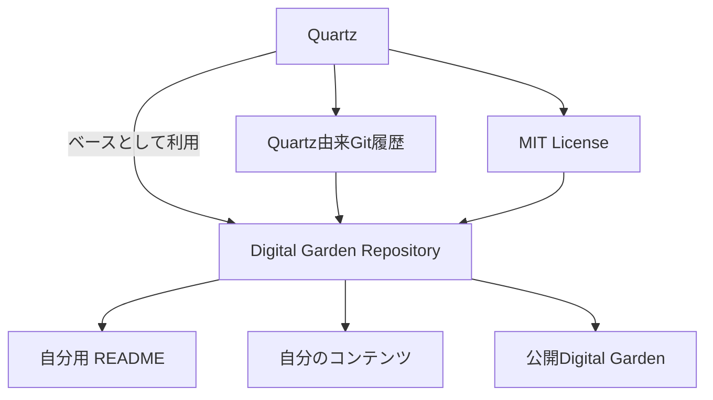

# Quartz由来のGitHubリポジトリ表示について

## 結論

現在の `digital-garden` リポジトリは、**Quartzをベースにした独立リポジトリのままで問題ない**。

Quartz由来のGit履歴を引き継いでいるため、GitHub上では多数の `Contributors` や過去のコミットが表示されているが、これは異常ではない。

正式なGitHub Forkへ作り直す必要も、Contributor表示を消すために履歴を書き換える必要もない。

## Contributorsが多数表示される理由

GitHubの `Contributors` は、現在のデフォルトブランチに含まれているGitのコミット履歴をもとに表示される。

そのため、Quartz本家の履歴を保持した状態で自分のリポジトリを作成している場合、

- Quartz本家の開発者
- 過去のQuartzコントリビューター
- 自分自身

がContributorとして表示される。

これは、

> その人たちが自分のDigital Gardenの内容を書いた

という意味ではなく、

> 現在のリポジトリのGit履歴に、その人たちのQuartzへのコミットが含まれている

という意味。

## Forkに変更する必要はない

GitHubの正式なForkは、主に以下のような用途に向いている。

- 本家へPull Requestを送りたい
- 本家との派生関係をGitHub上で明示したい
- upstreamとの差分管理を中心に運用したい

一方、今回の目的は、

> Quartzを土台として、自分の公開Digital Gardenを長期運用する

ことなので、独立リポジトリのままで問題ない。

Contributor表示を整理するだけのためにGit履歴をリセットすると、Quartzの変更履歴まで失うため、メリットは小さい。

## READMEは自分用に置き換える

一方で、トップの `README.md` はQuartz本家の内容がそのまま残っていた。

元READMEには、

- Quartz本体の説明
- 開発者向け情報
- Sponsor案内
- Quartz本体の利用・開発情報

などが含まれていた。

これは自分のDigital Gardenリポジトリの説明としては適切ではないため、**自分のサイト用READMEへ置き換える方が自然**。

実際に、Quartz由来READMEから、Digital Gardenについて説明するREADMEへ置き換える方針にした。

READMEには最低限、

- このリポジトリがDigital Gardenであること
- Obsidianのノートを公開していること
- Quartzを利用していること
- 公開サイトへのリンク
- 使用技術
- Quartzのライセンスに関する簡単な記述

などを載せればよい。

## ライセンス

QuartzはMIT Licenseなので、Quartz由来コードを使用している以上、`LICENSE.txt` などのライセンス情報は維持する。

READMEを自分用に書き換えることと、Quartzのライセンス表記を保持することは別問題。

したがって、

```text
README.md
→ 自分のDigital Gardenについて説明する

LICENSE.txt
→ Quartz由来コードのライセンス情報として維持

Git履歴 / Contributors
→ Quartz由来のものが残っていて問題なし
```

という分担になる。

## 決定事項

- `digital-garden` は独立リポジトリのまま運用する
- GitHub Forkへ作り直さない
- Quartz由来のContributor表示はそのままでよい
- Contributorを減らすためのGit履歴書き換えは行わない
- Quartz本家のREADMEは、自分のDigital Garden用READMEへ置き換える
- Quartzのライセンス情報は保持する

## 今後の整理

今回の変更によって、GitHub上でも役割が明確になる。



つまり、

> **Quartzの技術的な履歴とライセンスは残しつつ、リポジトリの説明とコンテンツは自分のDigital Gardenとして整理する**

というのが現在の運用方針です。

