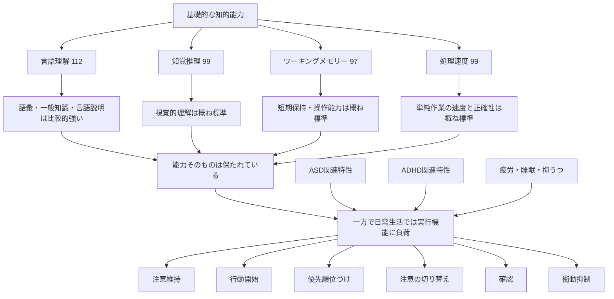

# WAIS-IV・AQ・CAARSのフィードバック整理と精神科再診で確認したいこと

心理検査のフィードバックでは、**知的能力そのものに大きな問題があるというより、基礎的な理解・処理能力は概ね標準範囲に保たれており、その一方で、日常生活では注意・切り替え・優先順位づけ・行動開始・確認などの実行機能に負荷がかかりやすい**という構図が示された。

また、AQではASD関連特性、CAARSでは特に不注意を中心としたADHD関連特性が強く示されており、これらの発達特性に加えて、現在の疲労・睡眠・抑うつなどの状態が生活上の困難をさらに強めている可能性が考えられている。

---

## 検査全体の構図



今回の検査結果では、「能力としてできない」というよりも、**自分自身で行動や注意を管理する必要がある状況で、本来持っている能力を安定して発揮しにくい**という理解が中心になる。

---

## WAIS-IV

### 全体結果

|指標|得点|評価の概要|
|---|---|---|
|全検査IQ FSIQ|104|平均|
|言語理解 VCI|112|平均よりやや高い|
|知覚推理 PRI|99|平均|
|ワーキングメモリー WMI|97|平均|
|処理速度 PSI|99|平均|

4指標はいずれも97〜112の範囲に収まっており、極端な能力差はみられない。

そのため、

- 特定の認知能力だけが著しく低い
- 知的能力全般が低いために生活上の問題が起きている

というタイプの結果ではない。

### 言語理解

比較的強い領域。

特に、

- 語彙量
- 一般的知識
- 言葉の意味を理解する力
- 言葉で説明する力
- 身につけた知識を必要な場面で利用する力

が良好と評価されている。

一方で、複数の概念から共通する本質を取り出し、簡潔な言葉にまとめるような課題は、標準範囲ではあるものの、本人の他の言語能力と比較すると相対的に弱い。

これは「言語が苦手」という意味ではなく、

> 知識や語彙は豊富だが、抽象化して一つの概念へ圧縮する処理では負荷がかかりやすい

という特徴として理解できる。

### 知覚推理

視覚情報について、

- 形や位置関係を把握する
- 全体構造をつかむ
- 視覚情報を頭の中で組み立てる

といった能力は概ね標準。

一方で、初めて見る視覚情報から規則性や法則を発見し、そこから推論する課題では、やや苦手さがみられた。

### ワーキングメモリー

- 耳から入った情報を一時的に保持する
- 注意を向けながら情報を覚えておく
- 暗算など、保持した情報を頭の中で操作する

といった能力は標準範囲。

ここはCAARSの「不注意・記憶の問題」が非常に高いことと、一見矛盾して見える。

ただし、WAISと日常生活では要求される能力が異なる。

WAISでは、

- 静かな環境
- 一対一
- 課題が明確
- 何をすればよいか指示される
- 比較的短時間
- 外部から課題構造が与えられる

という条件で実施される。

一方、日常生活では、

1. 何をするか決める
2. 優先順位をつける
3. 行動を開始する
4. 注意を維持する
5. 別の刺激に注意を奪われないようにする
6. 必要なことを適切なタイミングで思い出す
7. 最後に確認する

という一連の管理を自分で行う必要がある。

したがって、

> 記憶容量そのものが弱いというより、注意や記憶を日常生活の中で安定運用することに難しさがある

と考える方が整合的。

### 処理速度

- 単純な視覚情報を素早く見分ける
- 見本に従って正確に作業する
- 時間制限下で単純作業を進める

能力は標準範囲。

単純で手順が明確な作業について、特に大きな苦手さは確認されていない。

---

## WAIS-IVからみた得意・苦手

### 得意な領域

- 語彙量
- 一般的知識
- 言葉による説明
- 既知の知識を必要な場面で活用すること

### 相対的に負荷がかかりやすい領域

- 複数の事柄に共通する特徴を抽象化する
- 本質を簡潔な言葉にまとめる
- 初めて見る情報から規則性を発見する

ただし、これらも絶対的に低いわけではなく、本人の他の能力と比較した場合の相対的な弱さである。

---

## AQ

AQ総得点は**37点**。

資料上のカットオフ値33点を上回っており、ASDに関連する特性が比較的強く示された。

ただし、AQは診断そのものではなく、あくまでASD関連特性の強さを見る質問紙。

最終的な診断には、

- 成育歴
- 幼少期からの行動
- 学校生活
- 対人関係
- 現在の生活上の支障
- 他の精神状態

などを含めた総合判断が必要になる。

### 特に強く出た領域

#### 注意の切り替え

特に高い。

例えば、

- 一つの作業から別の作業に移る
- 予定変更へ対応する
- 気持ちを切り替える
- 頭のモードを変える
- 中断後に元の作業へ戻る

といった場面で負荷を感じやすい可能性がある。

#### コミュニケーション・社会的スキル

これらも高め。

- 相手の意図を読む
- 状況に合わせて対応を変える
- 対人距離を調整する
- 社会的状況を読み取る

といった処理で負担を感じやすい可能性がある。

重要なのは、「できない」というより、

> できていても、そのために多くの認知資源やエネルギーを使用している可能性

があるという点。

### 細部への関心・想像力

これらは基準値付近。

ASD関連特性が全領域で均等に強いわけではなく、特に注意の切り替えや社会的処理の領域で目立っている。

---

## CAARS

今回の検査結果の中で、日常生活上の困難との関連が特に強く出ている部分。

### 主な結果

- 不注意・記憶の問題：非常に高い
- 多動性・落ち着きのなさ：高い
- 衝動性・情緒不安定：高い
- 自己概念の問題：高い
- DSM-IV不注意型症状：非常に高い
- DSM-IV多動性・衝動性症状：やや高い
- 総合ADHD症状：高い
- ADHD指標：高い

そのため、単純な「多動性中心」のプロファイルというより、**不注意を中心としたADHD関連特性が強い**と読める。

---

## 不注意の具体像

報告書では、問診内容とも一致するものとして、

- 集中が途中で切れる
- 忘れ物が多い
- 抜けが発生する
- 課題を整理・管理しにくい
- 確認せずに判断してしまう
- 報告・連絡・相談が苦手
- 後になってミスが分かる
- やるべきことが分かっていても着手できない
- 必要なことより興味のあることを優先する
- 先延ばしする

といった問題が挙げられている。

これらは単純な「集中力不足」ではなく、より広く**実行機能の問題**として整理されている。

---

## 実行機能として理解すると分かりやすい

今回示されている困難には、以下の要素が含まれる。

|実行機能|起こり得る困難|
|---|---|
|優先順位づけ|何から手をつけるべきか決めにくい|
|行動開始|やるべきことが分かっていても始められない|
|注意維持|作業中に集中が切れる|
|注意切替|別作業への移行や中断後の復帰が難しい|
|ワーキングメモリーの運用|やることを途中で忘れる|
|衝動抑制|確認前に判断・行動する|
|モニタリング|自分のミスに後から気づく|
|計画|作業を順序立てて進めにくい|

そのため、

> 「理解できない」  
> 「能力がない」

というより、

> 「知識や能力はあるが、それを必要なタイミングで安定して運用するところに問題が生じやすい」

という理解が適切。

---

## 「自己概念の問題」が高い意味

CAARSでは自己概念の問題も高かった。

報告書では、

> うまくいかない出来事が重なり、自分自身に対する否定的な評価につながっている可能性

が示されている。

例えば、

```
注意・実行機能の問題
        ↓
忘れる・遅れる・ミスする
        ↓
叱られる・失敗経験が増える
        ↓
「自分はできない」という評価
        ↓
心理的負荷・疲労が増える
        ↓
さらに注意・実行機能が落ちる
```

という悪循環が成立する可能性がある。

これは「性格的に自己肯定感が低い」と断定しているわけではなく、長期間の困難や失敗経験による二次的影響も考えられるという意味。

---

## ASD・ADHD・現在の体調は分けて考える必要がある

報告書は、今回の困難を発達特性だけで説明してはいない。

現在の、

- 強い疲労
- 睡眠状態
- 抑うつ
- 通勤負荷
- 職場での刺激
- 対人関係による負荷

なども、注意や実行機能に影響している可能性があるとしている。

そのため、

```
もともとの発達特性
        ＋
現在の心身コンディション
        ↓
現在の日常生活上の困難
```

として考える必要がある。

---

## 検査結果全体からみた重要なポイント

今回の結果では、

> 課題や手順が明確で、外部から構造を与えられている状況では、標準的な能力を発揮できる

一方、

> 自分で計画・開始・優先順位づけ・切り替え・確認まで行う必要がある状況では、能力を安定して発揮しにくい

という特徴がみられる。

そのため、本人の努力量だけを増やすより、**実行機能を外部から補助する仕組み**の方が合理的。

---

## 推奨されている環境調整

報告書では以下のような対策が提案されている。

- 業務や期限を可視化する
- 作業を小さな単位に分割する
- 確認手順を事前に決める
- 重要な判断の前に一度止まって確認する
- 感覚刺激を減らす
- 十分な休息を確保する
- 睡眠・抑うつについて治療を継続する
- 特性や体力に合った働き方を検討する

共通する考え方は、

> **頭の中だけで管理しない**

こと。

例えば、

- 「忘れないように気をつける」  
    → 忘れても拾える仕組みを作る
- 「ちゃんと確認する」  
    → 確認項目をチェックリスト化する
- 「優先順位を考える」  
    → 優先順位を見える場所に表示する
- 「集中する」  
    → 刺激を減らし、作業時間を区切る

といった外部化が有効と考えられる。

---

# 精神科再診で確認したいこと

このフィードバック後、初めての精神科再診では、検査結果の説明を受け直すだけでなく、**結果を診断・治療・生活調整へどう反映するか**を確認することが重要。

## 優先して確認したい4点

### 1. 医師はこの検査結果をどう診断的に評価するか

確認したいこと：

- ADHDについて診断を検討できる状態なのか
- ASDについて診断を検討するのか、それとも傾向として扱うのか
- 追加で成育歴などを確認する必要があるか
- 他の疾患や現在の精神状態による影響をどう考えるか

検査結果だけで診断が確定するわけではないため、医師の総合評価が重要。

---

### 2. 現在の生活上の困難とどう結びつけるか

検査結果そのもの以上に、診察で重要なのは現実の支障。

特に伝える価値が高いのは、

- 集中が切れる
- 確認前に判断してしまう
- 後からミスに気づく
- 報告・連絡・相談が難しい
- やることは分かっているが始められない
- 優先順位づけが難しい
- 先延ばしが起こる
- 強い疲労がある
- 睡眠や抑うつの問題がある

など。

すべてを話すより、現在特に生活や仕事を阻害しているものを2〜3個、具体例つきで伝える方が診察につながりやすい。

---

### 3. 治療方針が変わるのか

確認したいこと：

- 現在の治療を継続するのか
- ADHDを想定した治療を検討するのか
- ASDについて特別な治療・支援が必要なのか
- 疲労・睡眠・抑うつの改善を先に優先するのか
- 薬物療法以外に心理療法・生活調整を組み合わせるのか
- 職場環境調整について診断書や意見書が必要になる可能性があるか

---

### 4. 発達特性と現在の体調をどう切り分けるか

医師への質問例：

> 検査ではADHDやASDに関連する特性が強く出ていますが、現在の疲労や抑うつ、睡眠状態による影響とはどのように区別して考えますか？

この区別は重要。

発達特性は比較的長期に持続する特徴だが、疲労・睡眠不足・抑うつによって注意力や実行機能はさらに低下する。

現在の困難が、

```
発達特性
＋
現在のコンディション悪化
```

のどちらからどの程度生じているかを考える必要がある。

---

## 診察の最初に伝えるとよい要約

診察時間が短い場合は、冒頭で目的を明確にする。

> 心理検査のフィードバックを受けました。今日は、この結果を先生が診断的にどう捉えるかと、今後の治療方針が変わるのかを確認したいです。

これだけでも診察の焦点が定まりやすい。

---

## 医師に特に伝える価値が高いこと

検査結果の数値自体は報告書を見れば分かる。

本人から伝える価値が高いのは、

> **分からない・理解できないというより、分かっているのに実行できない**

という日常場面。

例えば、

- やるべきことは理解しているのに開始できない
- 注意しているつもりでも確認を飛ばす
- 覚えていたはずのことが必要なタイミングで抜ける
- 優先順位を理解していても別のことを始める
- 後から見れば明らかなミスにその場では気づけない

といった具体例。

これらはCAARSで示された実行機能上の問題と対応する。

---

# 現時点での整理

## 検査結果から比較的明確なこと

- 全検査IQは104で平均
- 基礎的な知的能力は概ね標準
- 言語理解は比較的強い
- ワーキングメモリーと処理速度は標準
- 知覚推理も標準
- 能力の極端な凸凹は少ない
- AQは37点でASD関連特性が比較的強い
- 特に注意の切り替え、コミュニケーション、社会的スキルの負荷が示唆される
- CAARSでは不注意関連症状が非常に強い
- 多動・衝動性、自己概念についても高値
- 日常生活上の困難は「単なる集中力不足」より実行機能として捉える方が適切
- 発達特性だけでなく、疲労・睡眠・抑うつなどの影響も考慮する必要がある

## まだ確定していないこと

- ADHDの正式診断
- ASDの正式診断
- 現在の困難のうち、発達特性がどの程度を占めるか
- 抑うつ・疲労・睡眠の影響がどの程度あるか
- 今後の薬物療法を変更するか
- 職場環境調整をどの程度必要とするか

これらは精神科医による総合判断が必要。

---

## 次の行動

1. 精神科再診で医師の診断的評価を確認する
2. 現在特に困っている実生活上の問題を具体例で伝える
3. 治療方針が変わるか確認する
4. 発達特性と疲労・抑うつ・睡眠の影響をどう考えるか確認する
5. 必要に応じて、実行機能を外部化する生活・仕事上の仕組みを具体化する
6. 診断・治療方針が固まった後、今回の検査結果と実生活での対策を別ノートへ分離して整理する

今回の結果は、**「知的能力が低いために困難が起きている」という説明よりも、「能力はあるが、それを自力で安定運用する実行機能に負荷がかかりやすい」という説明の方が整合的**という点が中心になる。