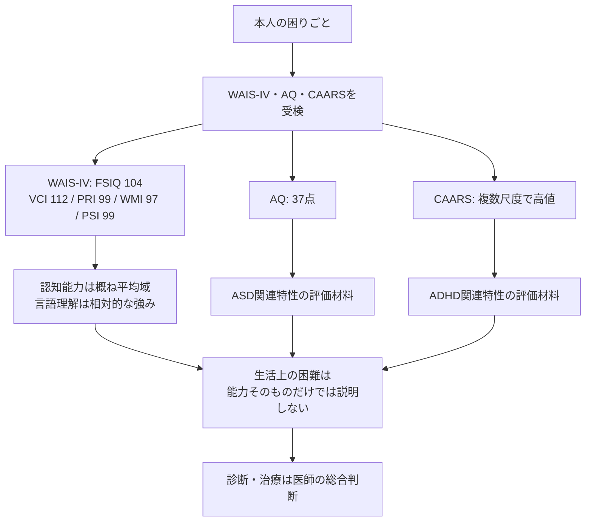

# WAIS-IV・AQ・CAARSによる心理検査の結果と認知特性

## このノートの扱い

このノートは、本人が受けた心理検査の**実データ**と、その結果についてAIに求めた解説を整理した私的記録である。一般的なサンプルや仮想事例ではない。数値は診断を確定するものではなく、診断・治療に関する判断は医師による総合評価を優先する。

検査時点までの服用・常備薬は、[服用・常備薬の履歴](medication-history.md)を参照する。現在使用中の薬は、このノートでも同リンク先でも管理しない。

WAIS-IV、AQ、CAARSは、いずれも成人の認知特性や発達特性を理解する際に使われるが、測定している対象は異なる。

- **WAIS-IV**：知的能力や認知機能の構造を見る
- **AQ**：ASD（自閉スペクトラム症）に関連する特性の強さを見る
- **CAARS**：成人ADHDに関連する症状や特性を見る

今回の検査では、知的能力そのものに大きな問題があるというより、**認知能力は概ね平均域に保たれている一方、ADHD関連特性とASD関連特性の双方が示されている**という結果になった。

## 検査結果の概要

|検査|結果|主な意味|
|---|---|---|
|WAIS-IV 全検査IQ（FSIQ）|104|全般的知的能力は平均域|
|言語理解（VCI）|112|相対的な強み|
|知覚推理（PRI）|99|平均域|
|ワーキングメモリー（WMI）|97|平均域|
|処理速度（PSI）|99|平均域|
|AQ|37点|カットオフ33点を上回る|
|CAARS|複数尺度で高値|ADHD関連特性、とくに不注意が強い|

心理検査だけでASDやADHDの診断が確定するわけではない。



一方で、今回のAQ・CAARSについては、単に「多少その傾向がある」という程度ではなく、**診断評価において十分に考慮される程度の特性が検査上示されている**と考えられる。

---

## WAIS-IV

WAIS-IVはASDやADHDを直接診断する検査ではなく、認知能力の構造を見るための検査である。

今回の結果は、

- FSIQ 104
- VCI 112
- PRI 99
- WMI 97
- PSI 99

であり、全体として大きな凹凸は少なく、基本的な知的能力は平均域にある。

### 相対的な強み

特に**言語理解（VCI 112）**が高い。

具体的には、

- 語彙量
- 一般的な知識
- 言葉の意味を理解する能力
- 言語によって説明する能力
- 身につけた知識を必要な場面で活用する能力

などが比較的得意と考えられる。

つまり、

```
知識を蓄積する
    ↓
意味を理解する
    ↓
言語化する
    ↓
説明・活用する
```

という能力は強みになっている。

### 相対的に苦手な部分

一方で、報告書では、

- 初めて見る視覚情報から規則性を見つける
- 視覚情報から法則を推測する
- 複数の概念に共通する本質を抽出する
- 抽象的な内容を簡潔な言葉にまとめる

といった課題について、相対的な苦手さが指摘されている。

これは「能力が低い」という意味ではなく、**本人の他の能力、とくに言語知識の強さと比較した場合に苦手さが目立つ**という意味である。

---

## WAIS-IVが平均でも日常生活では困る理由

今回、ワーキングメモリーは97、処理速度は99であり、どちらも平均域である。

それにもかかわらず、CAARSでは不注意や記憶の問題が非常に高く出ている。

これは矛盾ではない。

WAIS-IVの検査場面では、

- やるべき課題が明確
- 指示が明確
- 手順が決まっている
- 検査者が進行を管理する
- 目の前の一つの課題へ集中できる

という環境が用意されている。

一方、日常生活では、

```
何をするか決める
    ↓
優先順位を決める
    ↓
作業を開始する
    ↓
注意を維持する
    ↓
別件が入ったら切り替える
    ↓
元の作業へ戻る
    ↓
ミスを確認する
    ↓
期限までに終わらせる
```

という一連の管理を自分自身で行う必要がある。

そのため今回の所見は、

> 能力そのものが不足しているというよりも、持っている能力を自律的に管理して安定して使うことに負荷がかかりやすい

と考えると理解しやすい。

報告書では、これを**実行機能の弱さ**として説明している。

---

## AQ

AQは、ASDに関連する特性を質問紙によって評価する尺度である。

主に次の5領域を見る。

|領域|内容|
|---|---|
|社会的スキル|人との関わり方や距離感の調整|
|注意の切り替え|気持ちや注意を別の対象へ移す能力|
|細部への関心|細部へ注意が向きやすい傾向|
|コミュニケーション|相手の意図理解や伝達|
|想像力|相手の立場や状況をイメージする能力|

今回のAQ総合得点は**37点**であり、報告書に示されているカットオフ値33点を上回っている。

したがって、

> ASDに関連する特性が比較的強く認められる

という結果になっている。

とくに目立つのは、

- 注意の切り替え
- コミュニケーション
- 社会的スキル

である。

具体的には、

- 一つのことから別のことへ注意を移すことに負荷がかかる
- 相手の意図を読み取ることに負荷がかかる
- 状況に応じて人とのやり取りを調整することに負荷がかかる
- 人の多い場面や刺激の多い場面で消耗しやすい

などの可能性が示されている。

AQ 37点だからASDと確定するわけではないが、**ASD関連特性を検討する十分な材料になる結果**と考えられる。

---

## CAARS

CAARSは成人ADHDの特性を評価する質問紙である。

今回の結果では、特に**不注意／記憶の問題が非常に強く示されている**。

その他にも、

- 多動性／落ち着きのなさ
- 衝動性／情緒不安定
- 自己概念の問題
- DSM-IV不注意症状
- 総合ADHD症状
- ADHD指標

などで高値が出ている。

報告書では、

> 全体としてADHD傾向が示唆されるプロフィール

と評価されている。

特に重要なのは、CAARSの数値だけでなく、実際の日常生活上の困難とも一致していることである。

例として、

- 集中が途中で切れる
- 確認せず判断してしまう
- 後になってミスが判明する
- 報告・連絡・相談が苦手
- やるべきことが分かっていても着手できない
- 必要なことより興味のあることを優先する
- 先延ばしにする

といった問題が確認されている。

つまり、

```
CAARSでの高得点
        ＋
実生活上の困難
        ＋
問診内容との一致
```

という複数の材料が揃っており、ADHD関連特性については比較的強く支持されている。

---

## ADHDとASDのどちらが強く示されているか

今回の報告書だけを比較すると、**ADHD関連特性の方がより強く示されている**。

|観点|ADHD|ASD|
|---|---|---|
|検査|CAARS|AQ|
|結果|不注意を中心に複数尺度で高値|37点、カットオフ33点超|
|日常生活との一致|非常に多い|一致する部分あり|
|主な特徴|不注意、着手困難、先延ばし、衝動、自己管理|注意切替、対人調整、コミュニケーション|
|報告書の評価|ADHD傾向が示唆される|ASD関連特性が比較的強い|

ただし、

```
ADHDかASDか
```

という二者択一ではない。

今回の結果からはむしろ、

```
基礎的な知的能力
        ↓
概ね平均域

＋

ADHD関連特性
        ↓
かなり強く示唆
特に不注意・実行機能

＋

ASD関連特性
        ↓
明確に示唆
特に注意切替・対人調整

＋

疲労・睡眠・抑うつ
        ↓
現在の困難を増幅している可能性
```

という形で捉える方が報告書全体に合っている。

---

## 現在の症状だけでは診断できない理由

ADHDやASDでは、現在の状態だけでなく、**幼少期から同様の特性が存在していたか**が重要になる。

例えば現在、

> 仕事で確認不足によるミスが多い

としても、

- 最近の睡眠不足
- 強いストレス
- 抑うつ
- 疲労

によって起きている可能性もある。

一方、学生時代にも、

> 問題文を最後まで読まず回答する  
> 提出前に見直さない  
> 忘れ物が多い

などが繰り返されていたのであれば、現在の仕事環境だけでは説明しにくくなり、発達特性を支持する材料になる。

重要なのは、過去と現在で**表面的に同じ行動である必要はない**ことである。

例えば、

```
子ども時代
宿題になかなか取りかかれない

成人後
仕事の報告書になかなか着手できない
```

は、どちらも「着手困難」という共通した特徴として捉えられる。

同様に、

```
子ども時代
授業中に別のことへ注意が移る

成人後
仕事中に別件へ注意が移り、元の作業を忘れる
```

は、「注意維持・注意切替」の問題として共通する。

---

## ADHDについて過去を振り返る際のポイント

特に確認する価値があるのは以下のようなもの。

- 忘れ物が多かった
- 提出物を忘れた
- ケアレスミスが多かった
- 問題文を最後まで読まなかった
- 授業中に注意が逸れやすかった
- 宿題を後回しにした
- 試験勉強を直前まで始められなかった
- 整理整頓が苦手だった
- 時間管理が苦手だった
- やるべきことより興味のあることを優先した
- 一度気が逸れると元の作業へ戻りにくかった
- 話を最後まで聞かずに行動した

診断上は、こうした特徴が家庭・学校・仕事など複数の場面で存在していたかも重要になる。

---

## ASDについて過去を振り返る際のポイント

ASDについては、社会的コミュニケーションだけでなく、こだわりや感覚特性なども含めて見る必要がある。

例えば、

- 一人で過ごす方が楽だった
- 友人関係を作ることが難しかった
- 暗黙の了解が分かりにくかった
- 冗談や比喩を文字通り受け取りやすかった
- 相手の意図を理解するのに意識的な努力が必要だった
- 会話のタイミングが取りにくかった
- 急な予定変更が強い負担になった
- 独自の手順や順番へのこだわりがあった
- 特定の対象へ非常に強い興味を持った
- 音、光、におい、衣服の感触、人混みなどが苦手だった

などが確認対象になる。

---

## 診断時に特に整理しておくとよい領域

今回の検査結果から考えると、過去から現在まで次の6領域を時系列で整理すると有用である。

1. **不注意・忘れ物**
2. **先延ばし・着手困難**
3. **確認不足・衝動的判断**
4. **注意の切り替え**
5. **対人コミュニケーション**
6. **予定変更や環境刺激への反応**

例えば、

|時期|不注意|着手・先延ばし|注意切替|対人・感覚|
|---|---|---|---|---|
|小学校|||||
|中学校|||||
|高校|||||
|その後|||||
|現在|||||

という形で、具体的な出来事を書き出していけばよい。

目的は「診断名に当てはまりそうな出来事を探す」ことではなく、**実際に昔からどのような困難や特徴が続いてきたのかを確認すること**にある。

---

## 全体としての理解

今回の心理検査から読み取れる中心的なポイントは、

> 基礎的な理解力・記憶力・処理能力そのものに大きな問題があるのではなく、注意を維持する、切り替える、優先順位を決める、行動を開始する、衝動を抑える、確認するといった自己管理・実行機能の場面で能力を安定して発揮しにくい可能性がある。

ということである。

加えて、

- ASD関連特性として注意切替や対人調整への負荷
- ADHD関連特性として不注意・実行機能上の困難
- 疲労、睡眠、抑うつによる困難の増幅

が重なっている可能性が示されている。

そのため、単純に「集中力が弱い」「能力が低い」と考えるより、

**持っている能力を安定して使うために、実行機能を外部から補助する必要がある**

と捉える方が、今回の検査結果には合っている。

具体的には、

- 業務や期限を可視化する
- 作業を小さな単位に分ける
- 確認手順を固定する
- 重要な判断では一度停止して確認する
- 注意や記憶を頭の中だけに任せない
- 刺激の多い環境を減らす
- 疲労や睡眠状態を考慮する

といった環境調整が、本人の努力だけに頼るより有効と考えられる。

なお、この心理検査結果はASD・ADHDその他の疾患を確定するものではない。最終的な診断には、現在の症状だけでなく、生育歴、幼少期の行動、学校・家庭・仕事での状況、睡眠や気分状態などを含め、医師が総合的に判断する必要がある。
