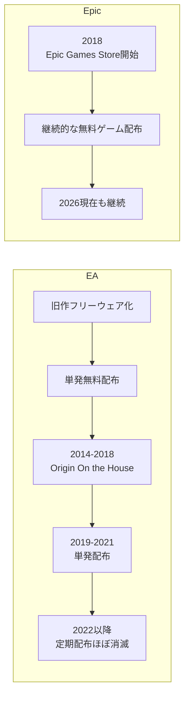

# Epic Games Store・EAのPCゲーム無料配布履歴

このスレッドでは、PC向けゲームストア／パブリッシャーが過去に無料配布したゲームについて、

- Epic Games Store
- Electronic Arts / Origin / EA app

の2系統を調査し、配布履歴を一覧化した。

目的は単に「無料だったゲーム」を列挙することではなく、

- いつ配布されたか
- ゲーム本編なのか
- 取得後も所有できる配布だったのか
- 日本語でタイトルを判別できるか
- 再配布なのか
- 地域限定なのか
- 他の「無料プレイ施策」とどう違うのか

まで整理し、所有ゲームとの照合などに使えるデータにすること。

スマートフォン向けは対象外とした。

---

# 共通の整理基準

今回の調査では「無料」という表現を広く取りすぎないよう、基本的に以下を対象とした。

## 対象

- PCゲーム本編
- ゲームコレクション
- 期間限定で0円取得できたもの
- 期間中に取得すれば、配布終了後もライブラリに残るもの
- パブリッシャー自身によるフリーウェア化

## 原則対象外

- スマートフォン向けゲーム
- DLC単体
- コスメ
- スターターパック
- ゲーム内アイテム
- Free-to-Playゲームの報酬パック
- 無料週末
- 時間制限付き無料プレイ
- 体験版
- EA Playなどのサブスクリプション
- Prime Gamingなど別サービス経由の配布

したがって、

> 「過去に一時的に無料で遊べたゲーム」

ではなく、

> 「無料でライブラリへ取得できたPCゲーム」

を中心に整理している。

---

# Epic Games Store

## 調査対象期間

当初は2026年9月から2010年頃まで遡る方針だった。

しかし、Epic Games Store自体が2018年12月に開始されたため、実際の対象期間は、

**2018年12月 ～ 2026年9月12日**

となった。

2010～2017年についてはEpic Games Storeの無料配布履歴そのものが存在しない。

---

## Epic Games Store最初の無料配布

Epic Games Store開業直後の最初の無料配布は、

- Subnautica
- Super Meat Boy

だった。

最初の配布開始日は2018年12月14日。

したがって、Epic Games Storeの無料配布履歴を遡る場合の起点は2018年12月になる。

---

## Epic版一覧の作成方針

配布履歴には以下のカラムを設けた。

|項目|内容|
|---|---|
|配布開始日|無料取得開始日|
|配布終了日|無料取得終了日|
|年|配布年|
|English title|英語正式名|
|日本語名・読み|日本語題または読み|
|表記区分|公式・一般表記か、カナ読み参考か|
|種別|ゲーム、ゲームコレクションなど|
|再配布|過去にも無料配布されたか|
|出典|配布履歴確認用URL|

英語名だけではタイトルを見ても判別しにくいため、必ず日本語欄を追加した。

日本語欄は、

1. 公式日本語タイトル
2. 日本で一般的に使われている表記
3. それらが確認しにくい場合はカナ読み

の順で付ける方針とした。

厳密な商品識別には英語正式名を使う。

---

## Epicで除外したもの

履歴サイトにはゲーム以外の配布物が混ざることがあるため、以下は除外した。

- DLC
- スターターパック
- Free-to-Play向けパック
- コスメ
- ステータスアップグレード
- スマホ版向け配布

つまり、ゲーム本編またはゲームコレクションを中心とした一覧にしている。

---

## Epic無料配布履歴の規模

2026年9月12日時点まで整理した結果、

**663配布行**

となった。

同じゲームが再配布された場合は別行として残している。

年別の配布履歴数は次の通り。

|年|配布行数|年内ユニークタイトル数|
|---|---|---|
|2026|59|59|
|2025|91|91|
|2024|84|82|
|2023|84|84|
|2022|91|90|
|2021|84|83|
|2020|103|102|
|2019|65|63|
|2018|2|2|
|2017以前|0|0|

2026年分については9月12日時点まで。

---

## 2026年9月時点の最新配布

2026年9月12日時点では、9月10日開始の、

- Astral Ascent
- Luftrausers

まで収録した。

9月17日以降に開始予定のタイトルについては、まだ「配布されたゲーム」ではないため一覧に含めなかった。

直近の例は次の通り。

|配布開始|English title|日本語名・読み|
|---|---|---|
|2026-09-10|Astral Ascent|アストラル・アセント|
|2026-09-10|Luftrausers|ルフトラウザーズ|
|2026-09-03|Alone With You|アローン・ウィズ・ユー|
|2026-08-27|Breathedge|ブレスエッジ|
|2026-08-27|Rival Stars Horse Racing|ライバル・スターズ・ホース・レーシング|

---

## Epic版で作成したExcel

以下のシートを作成した。

### はじめに

- 対象期間
- 対象・除外条件
- 日本語表記ルール
- データ件数
- 主な出典

### 配布履歴

配布単位ですべて記録。

再配布も別行。

### ユニークタイトル

同じ英語タイトルの再配布を1つに集約。

- 初回配布日
- 最終配布日
- 配布回数

も確認できる。

### 年別集計

2010～2026年まで表示。

Epic Games Store開始前の2010～2017年は0件として明示した。

---

# Electronic Arts / Origin

Epicに続いて、

**Electronic Artsで過去に無料配布されたPCゲーム**

について同じ考え方で調査した。

EAの場合はEpicより仕組みが複雑だった。

単一の無料配布制度だけではなく、

- 公式フリーウェア化
- Originでの単発無料配布
- Origin On the House
- コード入力による無料配布
- 地域限定配布
- 購入者への補償

など複数の方式が存在する。

---

# EA無料配布の大まかな流れ

```
timeline
    title EA / Origin PCゲーム無料提供の流れ
    2010 : Command & Conquer: Tiberian Sun + Firestormをフリーウェア化
    2012 : Battlefield 1942を無料提供
    2014 : Origin On the House開始
         : The Sims 2 Ultimate Collection無料配布
    2015 : Red Alert 2などを配布
    2016 : Need for Speed: Most Wantedなどを配布
    2017 : Mass Effect 2などを配布
    2018 : Origin On the House終了
    2019 : The Sims 4期間限定無料配布
    2021 : Ultima Underworldなど旧作を配布
    2022 : The Sims 4が常設無料化
```

---

# Origin On the House

EAの無料配布で最も重要なのが、

**Origin On the House**

である。

2014年3月に開始された。

Epic Games Storeの無料ゲームに近く、

> 配布期間中に取得すると、その後もOriginライブラリに保持できる

という制度だった。

2018年7月に終了している。

EAの無料配布履歴を確認するときは、特に**2014～2018年**が中心になる。

---

# EA無料配布タイトル

## 2010年

EAはCommand & Conquerシリーズ15周年に合わせて、

- Command & Conquer: Tiberian Sun
- Firestorm

をフリーウェア化した。

|配布開始|English title|日本語名・読み|
|---|---|---|
|2010-02頃|Command & Conquer: Tiberian Sun + Firestorm|コマンド＆コンカー：タイベリアン・サン ＋ ファイアストーム|

Originのキャンペーンではなく、ゲーム自体を無料化したケース。

---

## 2011年

今回確認できた該当配布はなし。

---

## 2012年

Battlefieldシリーズ10周年記念として、

**Battlefield 1942**

がOriginで無料提供された。

|配布開始|English title|日本語名|
|---|---|---|
|2012-11-05|Battlefield 1942|バトルフィールド1942|

2014年頃まで無料でダウンロードできた。

その後、On the Houseでも再配布されている。

---

## 2013年

一般ユーザーへの無条件無料配布としては0件。

ただし、2013年発売のSimCityでサーバー問題が発生した際、購入者向け補償が行われた。

対象者は次の8作品から1本を選択できた。

- Battlefield 3
- Bejeweled 3
- Dead Space 3
- Mass Effect 3
- Medal of Honor: Warfighter
- Need for Speed: Most Wanted
- Plants vs. Zombies
- SimCity 4: Deluxe Edition

これは、

> SimCity購入者への補償

であり、一般向け無料配布とは異なるため主一覧から分離した。

---

# 2014年

Origin On the Houseが始まった年。

|配布期間|English title|日本語名・読み|備考|
|---|---|---|---|
|2014-03-27 ～ 05-08|Dead Space|デッドスペース|On the House第1弾|
|2014-04-18 ～ 05-08|Battlefield 1942|バトルフィールド1942|再配布|
|2014-05-08 ～ 06-16|Plants vs. Zombies: Game of the Year Edition|Plants vs. Zombies：ゲーム・オブ・ザ・イヤー エディション||
|2014-05-28 ～ 06-03|Battlefield 3|バトルフィールド 3||
|2014-06-16 ～ 08-05|Peggle|Peggle（ペグル）||
|2014-07-23 ～ 07-31|The Sims 2 Ultimate Collection|ザ・シムズ2 アルティメット・コレクション|別枠配布|
|2014-08-05 ～ 09-16|Wing Commander III: Heart of the Tiger|ウィングコマンダーIII：ハート・オブ・ザ・タイガー||
|2014-09-16 ～ 10-28|Bejeweled 3|ビジュエルド3||
|2014-10-08 ～ 10-14|Dragon Age: Origins|ドラゴンエイジ：オリジンズ|短期配布|
|2014-10-28 ～ 12-09|Crusader: No Remorse|クルセイダー：ノー・リモース||
|2014-12-09 ～ 2015-01-20|SimCity 2000: Special Edition|シムシティ2000 スペシャルエディション||

---

## The Sims 2 Ultimate Collection

The Sims 2 Ultimate Collectionは通常のOn the Houseとは異なり、

`I-LOVE-THE-SIMS`

というコードをOriginで入力する方式だった。

期間中は誰でも取得でき、その後もライブラリに残ったため無料配布一覧に含めた。

---

# 2015年

|配布期間|English title|日本語名・読み|備考|
|---|---|---|---|
|2015-01-20 ～ 03-03|Theme Hospital|テーマホスピタル||
|2015-03-03 ～ 04-28|Syndicate (1993)|シンジケート||
|2015-04-28 ～ 07-07|Ultima VIII Gold Edition|ウルティマVIII ゴールドエディション||
|2015-04-28 ～ 07-07|Amazing Adventures: The Caribbean Secret|アメージング・アドベンチャーズ：ザ・カリビアン・シークレット|地域限定|
|2015-07-07 ～ 09-15|Zuma's Revenge!|ズーマズ・リベンジ！||
|2015-09-15 ～ 12-01|Command & Conquer: Red Alert 2 + Yuri's Revenge|コマンド＆コンカー：レッドアラート2 ＋ ユーリズ・リベンジ||
|2015-09-16 ～ 09-17|Theme Hospital|テーマホスピタル|障害時の臨時代替|
|2015-12-01 ～ 2016-02-02|Jade Empire: Special Edition|ジェイド エンパイア：スペシャルエディション||

Red Alert 2配布時にはOrigin側でサーバー障害が起き、Theme Hospitalが一時的に代替配布された。

---

# 2016年

|配布期間|English title|日本語名|
|---|---|---|
|2016-02-02 ～ 03-15|Need for Speed: Most Wanted (2012)|ニード・フォー・スピード モスト・ウォンテッド|
|2016-03-25 ～ 05-31|Medal of Honor: Pacific Assault|メダル オブ オナー パシフィックアサルト|
|2016-05-31 ～ 10-07|Nox|ノックス|
|2016-10-07 ～ 2017-01-05|Dungeon Keeper|ダンジョンキーパー|

---

# 2017年

|配布期間|English title|日本語名・読み|備考|
|---|---|---|---|
|2017-01-05 ～ 03-07|Mass Effect 2|マスエフェクト2||
|2017-03-07 ～ 05-16|Syberia II|シベリアII|地域限定|
|2017-03-07 ～ 05-16|Theme Hospital|テーマホスピタル|地域限定|
|2017-05-16 ～ 06-15|Dead in Bermuda|デッド・イン・バミューダ|地域限定|
|2017-05-16 ～ 06-15|Medal of Honor: Pacific Assault|メダル オブ オナー パシフィックアサルト|地域別代替|
|2017-06-15 ～ 09-05|Medal of Honor: Pacific Assault|メダル オブ オナー パシフィックアサルト|再配布|
|2017-09-05 ～ 11-14|SteamWorld Dig|スチームワールド ディグ||
|2017-11-14 ～ 2018-02-14|Plants vs. Zombies: Game of the Year Edition|Plants vs. Zombies：ゲーム・オブ・ザ・イヤー エディション|再配布|

On the Houseでは時期によって地域ごとに別のタイトルが配布される場合があった。

そのため、

> 世界全体の配布一覧 ＝ 日本のユーザーが取得できたタイトル一覧

とは限らない。

---

# 2018年

|配布期間|English title|日本語名・読み|備考|
|---|---|---|---|
|2018-02-14 ～ 03-16|Dead Space|デッドスペース|再配布|
|2018-03-16 ～ 04-17|Dead in Bermuda|デッド・イン・バミューダ|地域限定|
|2018-03-16 ～ 04-17|Medal of Honor: Pacific Assault|メダル オブ オナー パシフィックアサルト|地域別代替|
|2018-04-17 ～ 07-25|Peggle|Peggle（ペグル）|On the House最後の配布|

Peggleを最後にOn the Houseは終了した。

---

# 2019年

|配布期間|English title|日本語名|
|---|---|---|
|2019-05-21 ～ 05-28|The Sims 4 Standard Edition|ザ・シムズ4 スタンダードエディション|

期間中にOriginへ追加すれば、その後もライブラリに保持できた。

---

# 2020年

The Sims 4 Standard Editionが一部地域で再び無料配布された。

ただし米国などを中心とする地域限定だったため、一般配布とは区別して記録した。

---

# 2021年

|配布期間|English title|日本語名・読み|
|---|---|---|
|2021-08-06 ～ 09-03|Ultima Underworld: The Stygian Abyss|ウルティマ・アンダーワールド：ザ・スティジアン・アビス|
|2021-08-06 ～ 09-03|Ultima Underworld II: Labyrinth of Worlds|ウルティマ・アンダーワールドII：ラビリンス・オブ・ワールズ|
|2021-08-06 ～ 09-03|Syndicate (1993)|シンジケート（1993）|

Origin August Classicsとして旧作3本が無料提供された。

---

# 2022年以降

今回採用した、

> 期間限定で取得し、その後も保持できるPCゲーム本編

という条件では、2022～2026年について新規配布を確認できなかった。

ただし2022年10月18日から、

**The Sims 4**

本編が常設無料化された。

これは期間限定キャンペーンではなく、その後ずっと無料で取得できるようになったため主一覧とは分けた。

---

# EAの年別配布規模

|年|配布履歴数|年内ユニークタイトル数|
|---|---|---|
|2026|0|0|
|2025|0|0|
|2024|0|0|
|2023|0|0|
|2022|0|0|
|2021|3|3|
|2020|1|1|
|2019|1|1|
|2018|4|4|
|2017|8|7|
|2016|4|4|
|2015|8|7|
|2014|11|11|
|2013|0|0|
|2012|1|1|
|2011|0|0|
|2010|1|1|

今回の整理では、

- 配布履歴：42行
- ユニークタイトル：約30本

となった。

---

# EAで主一覧から除外した無料施策

EAは「無料」という言葉が使われる施策が多いため、以下を区別する必要がある。

|制度|一時的に無料プレイ|配布終了後も利用|今回の主一覧|
|---|---|---|---|
|Origin On the House|○|○|○|
|期間限定0円購入|○|○|○|
|EA公式フリーウェア|○|○|○|
|Origin Game Time|○|×|×|
|無料週末|○|×|×|
|EA Play|契約中のみ|×|×|
|DLC無料配布|DLCのみ|○|×|
|Prime Gaming|○|○の場合あり|×|
|常設Free-to-Play|○|常時無料|別扱い|

特に、

**「無料でプレイできた」ことと「ゲームを無料取得できた」ことは別**

として扱う必要がある。

---

# Epic Games StoreとEAの違い

両社は無料ゲームを配布しているが、運用方法は大きく異なる。

|比較|Epic Games Store|EA / Origin|
|---|---|---|
|本格的な開始|2018年|2010年以前から単発あり|
|定期無料配布|2018年以降継続|2014～2018年が中心|
|主な制度|Epic無料ゲーム|Origin On the House|
|配布本数|非常に多い|比較的少ない|
|再配布|あり|あり|
|地域差|一部あり|比較的大きい時期あり|
|現在の定期配布|継続|実質終了|

規模としては、

- Epic：2018～2026年で663配布行
- EA：2010～2026年で42配布行

となり、大きな差がある。

---

## 無料配布制度の変遷



---

# 今回作成したデータ

このスレッドでは、チャット上の整理とは別にExcelファイルも作成した。

## Epic Games Store版

`epic_games_store_free_games_2018-2026_ja.xlsx`

内容：

- はじめに
- 配布履歴
- ユニークタイトル
- 年別集計

配布履歴は663行。

---

## Electronic Arts版

`ea_pc_free_games_2010-2026_ja.xlsx`

内容：

- はじめに
- 配布履歴
- ユニークタイトル
- 年別集計
- 条件付き・別枠
- 除外基準

配布履歴42行、ユニークタイトル約30本。

EAについてはEpicより条件が複雑なため、

- 一般配布
- 地域限定
- 再配布
- 地域別代替
- 補償
- 常設無料化

を分離している。

---

# 今後の利用方法

このデータは、単なるゲーム史の一覧ではなく、現在のゲームライブラリと照合する用途にも使える。

例えば、

```
flowchart LR
    A[無料配布履歴] --> C[所有ゲーム一覧と照合]
    B[Steam / Epic / EAなどの所持タイトル] --> C
    C --> D[過去に取得済みのゲーム]
    C --> E[配布されたが取得していないゲーム]
    C --> F[重複所有タイトル]
```

といった整理が可能。

特にEpic Games Storeは無料配布本数が多いため、

- 実際に取得しているタイトル
- 配布されたが取り逃したタイトル

を分けて確認すると有用。

EAについては配布数が少ないため、Origin / EA appの現在のライブラリと全件照合することも現実的。

---

## 関連ノート

- [PCゲームライブラリ（Steam / Epic Games Store）](pc-game-library.md)：実際の所持タイトルと照合するための一覧。

# まとめ

今回の調査から、

- Epic Games Storeの無料配布は2018年12月開始
- 2010～2017年のEpic無料配布は存在しない
- 2026年9月12日までに663配布行を整理
- EAは2010年以前から旧作無料化の実績がある
- EAの主要無料配布制度は2014～2018年のOrigin On the House
- EAでは約42配布履歴、約30ユニークタイトルを確認
- EAは地域限定・代替配布・補償など条件が複雑
- 2022年以降、EAでEpicのような継続的無料配布は行われていない
- The Sims 4のような常設無料化は期間限定配布と分けて扱う

という違いが整理できた。

無料ゲーム履歴を今後さらに拡張するなら、

- Ubisoft
- GOG
- Steam
- Humble
- Amazon / Prime Gaming
- Microsoft Store

などについても同じ基準で分離し、最終的に「PCゲーム無料配布履歴」のStructureノートから各ストア別ノートへリンクする形が扱いやすい。
