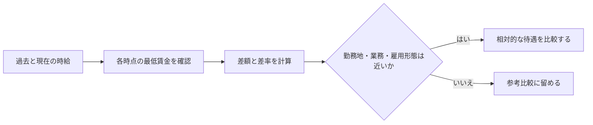

# 時給の相対的な待遇を最低賃金との差額と差率で評価する

## このノートの主張

時給を過去と比較するときは、名目額だけでなく、その時点の最低賃金との差額・差率を見る。これにより、その仕事が最低賃金に対してどれほど高く評価されていたかを、時期をまたいで比較できる。

|比較指標|式|分かること|
|---|---|---|
|差額|時給 − その時点の最低賃金|最低賃金をどれだけ上回るか|
|差率|時給 ÷ その時点の最低賃金|時期が違っても比較できる相対的な水準|

この方法は、職種、勤務時間、勤務地、雇用形態、業務内容が異なる求人を同一視するためのものではない。比較条件が近い場合に、「名目上は上がったが、最低賃金に対する上乗せはどう変化したか」を読むための基準である。



## 本人の勤務記録を用いた比較

アルバイトや派遣の時給を過去と比較するとき、名目上の時給だけを見ると待遇改善を過大評価しやすい。

大阪では最低賃金そのものが大きく上昇しているため、

> **時給 − その時点の最低賃金**

を見ることで、その仕事が最低賃金に対してどの程度のプレミアムを持っていたのかを比較しやすくなる。

## 2022年のAmazon関連物流仕分け

2022年ごろ、荒本の東ロジスティックセンターでAmazon関連荷物の仕分け業務に就業していた。

雇用関係はAmazon直接雇用ではなく、

```
flowchart LR
    A[Amazon関連物流] --> B[外部物流倉庫]
    B --> C[株式会社パートナー]
    C --> D[派遣労働者]
```

という構造だった。

株式会社パートナーから派遣され、Amazon関連のFBA荷物などを仕分けし、各物流センターへの配送につなげる作業を行っていた。

当時の時給は**1,200円**だった。

2022年10月以降の大阪府最低賃金は1,023円なので、

**1,200円 − 1,023円 = 177円**

最低賃金より高かった。

比率では、

**1,200 ÷ 1,023 ≒ 1.173**

となり、最低賃金より約17.3％高い。

当時は単に時給1,200円だったというだけでなく、**最低賃金と比較して明確に高時給の仕事だった**といえる。

## 2026年の同地域・同派遣会社の求人

2026年には、株式会社パートナーが荒本周辺・東大阪市本庄東で物流仕分けスタッフを募集しており、時給はおおむね**1,300〜1,400円**となっている。

業務も配送先ごとの段ボール仕分けなど、2022年当時の作業に近い。

ただし、現在確認できる求人にはAmazonとは明記されていないため、

> 2022年と完全に同じ仕事が1,300〜1,400円になった

とは断定できない。

比較できるのは、

- 同じ株式会社パートナー
- 荒本周辺
- 物流倉庫
- 配送商品の仕分け

という条件までである。

## 2026年に2022年と同じ待遇を維持するなら

2026年10月以降の大阪府最低賃金は1,231円。

2022年と同じ「最低賃金+177円」を維持するなら、

**1,231円 + 177円 = 1,408円**

となる。

また、2022年と同じ「最低賃金より約17.3％高い」という比率を維持するなら、

**1,231円 × 1.173 ≒ 1,444円**

となる。

したがって、2022年当時のAmazon関連物流仕分けと同程度の相対的待遇を2026年に求めるなら、

**時給1,400〜1,450円程度**

が基準になる。

|時給|最低賃金1,231円との差|最低賃金比|
|---|---|---|
|1,250円|+19円|+1.5%|
|1,300円|+69円|+5.6%|
|1,350円|+119円|+9.7%|
|1,400円|+169円|+13.7%|
|1,408円|+177円|+14.4%|
|約1,444円|+213円|+17.3%|
|1,500円|+269円|+21.9%|

1,300円まで上昇していたとしても、2022年と比較すると最低賃金に対するプレミアムはかなり縮小している。

名目上は、

**1,200円 → 1,300円**

と100円上がっているが、

**最低賃金との差は177円 → 69円**

まで縮小する。

そのため、時給1,300円では2022年当時ほど「割のよい仕事」とはいえない。

## 現在の勤務先でも同じ現象が起きている

現在の勤務先では、

- 2023年5月：時給1,070円
- 2026年10月：時給1,250円

となっている。

名目賃金だけを見れば、

**+180円、約16.8％の上昇**

となる。

しかし、大阪府最低賃金と比較すると状況は異なる。

|時点|時給|大阪最低賃金|差|
|---|---|---|---|
|2023年5月|1,070円|1,023円|+47円|
|2026年10月|1,250円|1,231円|+19円|

つまり、

```
2023年
最低賃金 1,023円 ── +47円 ── 時給1,070円

2026年
最低賃金 1,231円 ─ +19円 ─ 時給1,250円
```

となる。

時給は180円上昇したにもかかわらず、最低賃金との差は**47円から19円へ縮小**している。

この場合、賃金上昇のかなりの部分は独自の待遇改善ではなく、**最低賃金上昇への追随**と考えたほうが実態に近い。

## 名目時給だけでは高時給かどうか判断できない

2022年の物流仕分けと2026年の現在勤務先を金額だけで比較すると、

- 2022年物流仕分け：1,200円
- 2026年現在勤務先：1,250円

なので、現在勤務先のほうが50円高い。

しかし最低賃金との差を見ると、

|仕事|最低賃金との差|
|---|---|
|2022年Amazon関連物流仕分け|+177円|
|2026年現在勤務先|+19円|

となる。

現在の1,250円より、2022年の1,200円のほうが**その時代における高時給度は明らかに高い**。

これは賃金を長期間比較するときに重要な違いである。

## 時給を見るときの基準

過去の求人と現在の求人を比較するときは、

> **時給そのものではなく、その時点の最低賃金との差額・差率を見る**

と分かりやすい。

たとえば2026年10月以降の大阪なら、おおむね次の感覚になる。

|時給|最低賃金との差|相対的位置|
|---|---|---|
|1,250円|+19円|ほぼ最低賃金|
|1,300円|+69円|やや上|
|1,350円|+119円|中程度|
|1,400円|+169円|2022年の物流仕分けに近い|
|1,450円|+219円|2022年と同程度以上|
|1,500円|+269円|明確に高め|

そのため、2022年に荒本で行っていたAmazon関連物流仕分けと同程度の条件を現在求めるなら、

**最低でも1,400円程度、できれば1,450円前後**

を一つの比較基準にできる。

これは「2022年の時給1,200円が、2026年には単純にいくらになるか」という換算ではない。

**その仕事が最低賃金に対してどれだけ高く評価されていたかを維持するなら、現在いくら必要か**

という考え方である。

この形なら、個別の求人メモというより**賃金比較の判断原則を残すPermanent候補**として使いやすいです。
