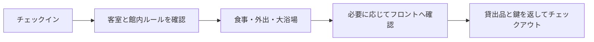

# 初めてのホテル宿泊チェックリスト

Booking.comで予約したホテルへ1泊したときに、客室、食事、大浴場、外出、チェックアウトで確認したことの記録。ここにある一部は宿泊先固有の運用であり、次回は館内表示とフロントの案内を優先する。

## 基本の考え方

> ホテルに明示されたルールがあるなら従う。明示がなければ一般的なマナーで扱い、判断できなければフロントへ聞く。

この考え方を持つと、スリッパ、タオル、館内着、食堂、貴重品などの細部を一律の作法として覚える必要はない。

## 客室と館内の使い分け

|場面|今回の判断|確認すべきこと|
|---|---|---|
|客室|入口で靴を脱ぎ、室内ではスリッパを使った|客室内の掲示、スリッパの種類|
|館内移動|大浴場まではスリッパで移動できた|館内着・スリッパで移動できる範囲|
|外出|靴に履き替え、客室を施錠した|鍵をフロントへ預ける方式か|
|食堂|鍵・スマホなど必要な物だけを持った|食事券、返却口、ゴミ箱、利用時間|
|客室のPC|リュックに収納して客室へ置いた|セーフティーボックスの有無、施錠|

ノートPCなどを外出時に客室へ置く場合は、ロックまたはスリープ状態にし、目立つ場所へ出しっぱなしにせず、客室を確実に施錠する。セーフティーボックスがあってもPCが入るとは限らない。

## 大浴場と貴重品

今回の大浴場には100円返却式ロッカーがあり、スマホ、財布、部屋の鍵をロッカーに入れ、鍵だけを持って入浴できた。スマホを脱衣所へ持ち込むこと自体より、カメラ付き端末を操作せず速やかに施錠することが重要である。

|物|今回の扱い|ホテルごとに確認する点|
|---|---|---|
|部屋の鍵|大浴場ではロッカーへ入れた|館内移動でも預ける必要があるか|
|スマホ・財布|ロッカーへ入れた|ロッカーの種類、貴重品預かり|
|タオル|フェイスタオルは洗身用に再利用し、バスタオルは大浴場後に使った|持参・備付・交換のルール|
|スリッパ|大浴場入口で脱いだ|入口の案内と置場|

## 食事、客室備品、ゴミ

食堂がセルフサービスなら、食器・トレーは返却ラックへ、使用済みティッシュなどの紙ごみは返却場所にゴミ箱があればそこへ捨てる。ドリンクバー、食事時間、持ち帰りの可否はホテルごとの案内に従う。

客室にあった個包装の煎茶は、宿泊者用の消耗品として扱った。ケトル、コップ、タオル、ルームウェアなどの備品とは分けて考える。コンビニの飲食ごみは客室の分別表示を確認し、液体漏れや強い臭いを避ける。

## 館内着と早朝の配慮

浴衣・ガウン型のルームウェアは上下が分かれていない場合がある。客室内での着方は本人の判断でよいが、廊下や大浴場など共用部へ出るなら、はだけない服装を選ぶ。

早朝に濡れた衣類を乾かしたい場合は、まずタオルで水分を取り、広げて自然乾燥する。ドライヤーを使う必要があるなら、周囲が休んでいる時間帯を避けるか、短時間・弱風に抑える。

## チェックアウト

|分類|今回の扱い|
|---|---|
|客室備品（タオル・ルームウェア・ケトル等）|客室の分かりやすい場所へ残す|
|消耗品（個包装のお茶など）|案内に反しない範囲で扱う|
|フロントから借りた充電器|鍵と一緒にフロントへ返却する|
|部屋の鍵|フロントへ返却する|

今回の一泊で、チェックインからチェックアウトまでの流れを経験した。次回は、まず客室と館内の案内を読み、個別の不明点だけフロントで確認する。
