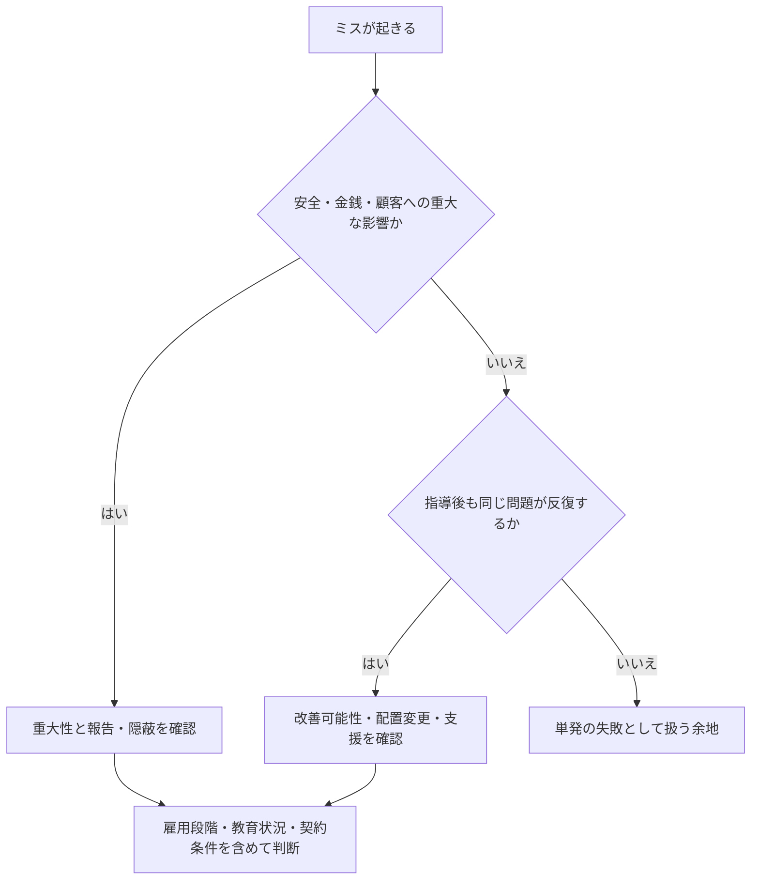

# ミス・能力不足による雇用終了：反復・改善・職務適合の見方

## このノートの読み方

裁判・労働行政上の判断と、個人ブログなどの体験談は根拠の性質が異なる。ここでは両者を混同せず、前者は法的判断の例、後者は職場で起きた経験の例として扱う。個別の雇用関係について結論を出す資料ではない。

> ミスの回数や損害額だけから解雇の可否は決められない。重大性、反復、指導後の改善、職務への影響、雇用段階をまとめて見る必要がある。

|見る軸|確認する内容|単独で結論にしない理由|
|---|---|---|
|ミスの性質|安全・金銭・顧客・設備への影響|大きな損害でも事情により扱いが異なる|
|反復と改善|指導後に同じ問題が続くか|一回の失敗と定着しない問題は異なる|
|雇用段階|初日、試用期間、本採用後|教育や評価に許される期間が異なる|
|職務との適合|必要な処理速度、同時処理、判断|別の職種なら継続できる場合がある|



以下の裁判例と体験談は、この枠組みを具体化するための材料である。

アルバイトやパートが「仕事ができない」「ミスが多い」といった理由で実際にクビになることはある。ただし、調べていくと、**単純に「ミスの大きさ」だけで解雇が決まるわけではない**ことが分かる。

むしろ重要なのは、次の複数要素の組み合わせである。

- ミスの重大性
- 発生頻度
- 同じ種類のミスを繰り返すか
- 指導後に改善するか
- 他人のフォローが恒常的に必要か
- 顧客・金銭・安全への影響
- ミスを隠したか、報告したか
- その仕事に必要な能力との適性
- 雇用主がどの程度まで教育期間を許容するか
- 試用期間か、長期雇用か
- 職種ごとの要求水準

したがって、

> 「○円の損害を出したらクビ」
> 
> 「ミスを○回したらクビ」

という一律の線引きはできない。

---

## ミスの程度と典型例

|程度|典型的な内容|解雇との関係|
|---|---|---|
|軽微|入力間違い、確認漏れ、配膳先間違い、商品名忘れ|単発なら通常は弱い|
|軽微だが反復|同じ入力ミス、確認漏れ、指示忘れを何度も繰り返す|累積すると重い|
|中程度|レジ差額、発注ミス、複数注文の誤処理、書類送付ミス|頻度と改善状況次第|
|重大|高額商品・大量商品を駄目にする、金銭管理ミス、設備破損|1回でも問題になり得る|
|重大事故級|安全事故、重要情報漏えい、顧客に重大影響|一発でも解雇につながり得る|

ただし、重大な一発ミスよりも、**軽いミスを何度指導しても繰り返すケースの方が、能力不足を理由とした解雇では重要になることがある。**

---

## 実際に見つかった特徴的な事例

### 軽い・中程度のミスでも解雇された例

成人の労働者まで広げて調べると、次のような例があった。

- プラスチック工場
    - 入社2日目に数量確認ミス
    - 3日目に原料投入ミス
    - 初めて複数機械を担当した日に作業遅延と複数のミス
    - 約8日で即日解雇
    - ただし裁判では、入社直後で不慣れであり、取り返しのつかない結果も生じていないとして**解雇無効**
- 病院事務
    - 健診データ入力ミス
    - 計測結果入力ミス
    - 住所入力不備
    - 書類封入忘れ
    - 整理番号間違い
    - 電話メモ不備
    - 試用期間中に解雇
    - ただし指摘後に改善が見られたため**解雇無効**
- 建具工事会社の事務職
    - 10現場すべてを同じ現場名で入力
    - 取引先名の入力忘れ
    - 別の地名を誤入力
    - 二重計上
    - 赤字訂正後も同じミスを残す
    - 約2か月で解雇
    - **解雇有効**

この建具会社の例は特に重要である。

一つ一つは「高額事故」ではない。しかし、

```
単純な入力ミス
↓
訂正される
↓
同じミス
↓
具体的に赤字で直される
↓
それでも訂正版に同じミス
↓
翌月も同様
```

という状態まで続いたため、能力不足が重く評価された。

---

## 大きなミスでもクビにならなかった例

一方で、ネット上の本人談では、比較的大きな失敗でも雇用が続いた例がある。

- クレジットカード決済で500円を5,000円として処理
    - 修正対応
    - 解雇されず
- 商品2個を25個とレジ入力
    - 決済前に発覚
    - 解雇されず
- キッチンで熱い油に洗剤を入れ、油6Lを全廃棄
    - 報告・謝罪
    - 雇用継続
- 決済用カードリーダーを誤って廃棄し約2万円の損害
    - その他にも紛失あり
    - 雇用継続

この比較から、損害額だけでは解雇を予測できない。

---

## 重大なミスでクビになった例

本人談では、明確に重大なミスが原因となった例もある。

### 食洗機を故障させた例

成人後のカフェ勤務で、

- 食洗機をゴミ箱だと誤認
- 大量の生ごみを投入
- 食洗機を故障
- その職場をクビ

という事例がある。

これは「仕事が少し遅い」という話ではなく、設備の用途そのものを誤認し、業務設備を破損させた重大事故型である。

### 仕込み50本分を間違えた例

居酒屋で、

- ねぎま用の肉を50本分間違えて仕込む
- 開店直前に発覚
- その後クビ

という本人談もあった。

---

## 「一発の大事故」より「改善しない反復」が問題になる

調査全体で一貫していたのは、

> ミスそのものより、指導後も改善しないこと

が重視される傾向である。

典型的な流れは次のようになる。

```
小さなミス
↓
注意
↓
再発
↓
指導
↓
また再発
↓
他スタッフのフォローが必要
↓
本人を1人分の戦力として数えられなくなる
↓
配置変更・シフト減少・試用期間終了・解雇
```

つまり、

**「ミスをする人」**  
ではなく、

**「通常の人員1人として任せることが難しい状態が続く人」**

になると、解雇・雇止め・シフト排除につながりやすい。

---

## 学生を除外すると事例数は急減した

最初はアルバイト全般を対象に探していたが、途中から、

- 高校生を除外
- 大学生を除外
- 学生時代の体験談を除外
- 成人・非学生のみ

という条件に変更した。

この条件を厳密に適用すると、事例数はかなり減った。

理由は次の通り。

- 「バイトをクビになった」と書かれていても年齢不明
- ミス内容は具体的だが学生かどうか不明
- 主婦や成人パートであることは分かるが、具体的なミス内容が不明
- 「クビになりそう」と書かれているだけで、実際にはまだ解雇されていない
- 学生時代の体験談だった

そのため、前半で挙げた一部の事例については、**成人非学生の例として扱うのは不適切**と後から修正した。

---

## 成人・非学生の個人ブログ／note

裁判例や公的資料だけでなく、本人による体験談も調べた。

### 三倉ゆんさん

30歳時点の本人談。

飲食店で初日に、

- 厨房にメモを置き忘れる
- 料理をどこへ運ぶべきか判断できない
- 「ホール見て」の意味が分からない
- 聞き返す
- 動作が遅い

といった問題があり、翌日、

> 昨日の様子を見ていて難しい

という趣旨を伝えられ、実質1日で終了。

金銭損失や物損はなく、**仕事の速度・指示理解・状況判断だけで見切られた例**として特徴的。

### 乾いぬさん

20代、第二新卒の看護師。

- 独り立ちが遅い
- 試用期間延長
- 他スタッフの患者の吸入薬を準備した際、生理食塩水を2ml多く入れる
- 実際の投与前に発見され、患者への実害なし
- 勤務態度には問題なし
- 能力が病院の基準に達していないとして本採用されず

ここでは「2ml多かった」という一件だけが理由ではなく、**それ以前から独り立ちの遅さ・能力評価が積み上がっていた**ことが重要。

### どんどんさん

成人の正社員本人談。

- 指示を忘れる
- 修正箇所を忘れる
- 同じことを直せない
- 納期に間に合わない
- 上司や配置を変えても改善しない

約2年間会社側が配置変更等を試した後、最終的に退職勧奨。

法律上は解雇ではなく自己退職だが、

**小さな能力不足が長期間改善しなかった例**

として参考になる。

### ゆらさん

主婦・育児中のパート。

- 繁忙期にミスを連発
- 最終的に「もういいから、早く帰って」と言われる
- パートを失う

成人・非学生・本人談であることは明確だが、**個々のミス内容までは書かれていない**。

### 森永渚さん

23歳フリーターとしてロンドンで勤務。

- 「実力不足」
- 「要求基準に達していない」

として戦力外通告。

ただし、具体的なミスの内容は不明。

---

## 個人ブログから見える3つの「切られ方」

本人談を比較すると、同じ能力不足でも大きく3パターンに分かれる。

### 1. 即判断型

例：三倉さん

```
初日
↓
仕事の速度・判断・指示理解が合わない
↓
今後教育しても難しいと判断
↓
翌日終了
```

損害の大きさではなく、**適性のミスマッチを早期に判断するタイプ**。

### 2. 試用期間評価型

例：乾いぬさん

```
教育
↓
独り立ちが遅い
↓
試用期間延長
↓
小さなミス
↓
総合的に能力基準未達
↓
本採用せず
```

一つの事故ではなく、**試用期間全体の評価**で決まる。

### 3. 長期改善待ち型

例：どんどんさん

```
ミス・忘れ
↓
指導
↓
配置変更
↓
上司変更
↓
別業務
↓
それでも改善なし
↓
退職を促す
```

会社がかなり長期間改善を待つケース。

---

## 「同じ人でも職場によって評価が全く違う」

学生を含めた初期調査で、非常に重要な例があった。

ある本人は、

- イタリアン → 1週間でクビ
- 家電量販店 → 2年間勤務
- コールセンター → 大学卒業まで勤務

という経歴だった。

イタリアンでは、

- 卓番
- 料理
- 配膳
- 同時処理

をうまくこなせなかった。

しかし別職種では長期勤務できた。

このことから、

> 「ある職場で仕事ができなかった」
> 
> ≠
> 
> 「労働能力そのものが低い」

と考えるべき。

特に飲食店のような、

- マルチタスク
- 短時間判断
- 空間把握
- 状況把握
- 同時進行

を要求する仕事と、

- 手順化しやすい仕事
- 1件ずつ処理できる仕事
- 電話・説明中心の仕事

では必要能力がかなり違う。

---

## 裁判・労働行政と現場の「クビ」は別物

重要なのは、

> 「会社からクビと言われた」
> 
> と
> 
> 「その解雇が法的に有効」

は別問題であること。

実際、

- ミスが複数あった
- 本人に落ち度があった
- 会社が能力不足と判断した

にもかかわらず、裁判所や労働委員会が

- ミスは解雇相当ではない
- 指導が不足している
- 改善可能性がある
- 入社直後で判断が早すぎる

として解雇を無効にした事例が複数あった。

逆に、

- 簡単な仕事
- 何度も具体的に訂正
- 同じミスを反復
- 短期間に多数
- 改善が見られない

というケースでは解雇が有効とされた。

---

## 現時点での整理

「バイトや労働者は、どの程度のミスでクビになるのか」という問いに対しては、次のように考えるのが最も実態に近い。

### クビになりにくい

- 単発の軽い入力ミス
- 初めて行う作業での失敗
- ミス後に自分で報告する
- 一度注意されて改善する
- 周囲が通常範囲のフォローをすれば済む
- 実害が小さい
- その後再発しない

### クビに近づく

- 同じミスを何度も繰り返す
- 赤字訂正されても直せない
- 指示されたことをすぐ忘れる
- 周囲が常時フォローしないと仕事が成立しない
- 仕事の基本手順が研修後も定着しない
- 顧客・金銭・安全に影響する
- 自分のミスを隠す
- 配置転換しても改善しない

### 一発でも危険

- 重大な安全事故
- 高額な金銭・設備損害
- 顧客に重大な影響
- 重大な情報漏えい
- 故意や隠蔽を伴う

---

## 結論

成人・非学生に限定し、裁判例・公的資料・本人ブログまで見た結果、

**「少し仕事が遅い」「普通の人もする程度のミスをたまにする」だけでクビになるケースは、確認できる公開事例としては多くない。**

一方で、

- 初日だけで適性がないと判断される
- 試用期間で能力基準未達と判断される
- 小さなミスを何度指導しても改善しない
- 他人のフォローが恒常化する
- 安全・顧客・金銭に影響する
- 重大な設備破損を起こす

といった条件では、実際にクビ・雇止め・退職勧奨につながった例がある。

特に重要なのは、

> **ミスの大きさよりも、「改善するか」「1人分の戦力として任せられるか」が大きい**

という点。

また、同じ人物でも職種を変えると長期勤務できる例があるため、能力不足の問題は本人全体の能力より、**特定職種との適性ミスマッチ**として見る方が妥当な場合も多い。

---

## この調査で途中修正した点

初期段階では、学生・年齢不明・成人を混ぜて事例を提示していた。

その後、条件を

- 学生除外
- 成人・非学生
- ミス内容が具体的
- 実際に解雇された
- 本人ブログと裁判例を分ける

と厳格化した結果、一部の初期事例は成人の事例として扱えないことが判明した。

したがって、最終的には、

**「年齢・属性が確認できない体験談を、成人非学生の証拠として使わない」**

という扱いに修正した。

---

## 関連して今後掘れる論点

- 同じミスを何回繰り返すと実際に解雇に近づくか
- 試用期間中と本採用後で能力不足解雇のハードルがどう違うか
- アルバイト・パートと正社員で解雇の実態がどう違うか
- 飲食・小売・事務・医療・製造で要求される能力の違い
- 「シフトを入れない」という事実上の解雇
- 仕事の適性とマルチタスク能力の関係
- 個人ブログと裁判記録で、本人側の認識がどの程度異なるか
