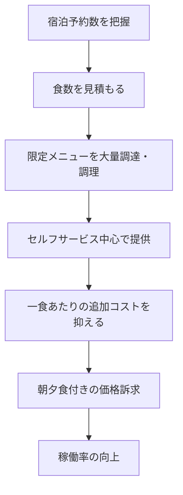

# ユニバーサルホテルの低価格モデルと予約経路の比較

ユニバーサルホテルの朝夕食付き低価格プランを、東横INNと予約サイトの比較を通じて考えた記録。料金、特典、提供内容は店舗・日付・予約経路で変わるため、以下は2026年9月時点の調査と運営構造に関する推定を含む。

## 観察できる特徴と推定

ユニバーサルホテルは岡山を本拠とし、岡山・倉敷を起点に中国・近畿方面へ展開している。朝食・夕食・大浴場を含む店舗があること、夕食が限定メニューとセルフサービスを中心に提供されることは確認対象にできる。一方、地域集中の経営意図や正確な原価は公表資料だけでは断定できない。

低価格は「客室に本来有料の食事を無料で付ける」より、客室・食事・共用設備を一体の商品として設計した結果と考える方が自然である。

ホテルは空室でも建物・設備・フロントなどの固定費が発生する。一定の追加原価で販売できるなら、低価格でも稼働率を高めて固定費回収に寄与しうる。ただし、これは一般的な運営構造からの推定であり、同チェーンの財務情報を示すものではない。

|観点|ユニバーサルホテルの記録上の特徴|東横INNとの比較軸|
|---|---|---|
|食事|朝食・夕食を含む店舗がある|東横INNは無料朝食が基本|
|運営|限定メニュー・セルフサービス・大量調理が中心とみられる|標準化した客室・サービスで運営|
|価値|食事を含む総額と実用性|立地、安定した品質、公式会員制度|
|注意|店舗ごとの設備・食事内容を確認する|料金は日付・店舗・会員条件で変わる|

## 予約サイトと公式サイトの比較

Booking.comで予約できることと、Booking.comが最安であることは別である。Geniusは対象施設・対象プランに割引や特典が付く無料のロイヤルティ制度だが、公式会員割引やオンライン決済割引があるチェーンでは、公式予約が有利な場合もある。

1. Booking.comで候補、Genius対象、税・手数料を含む支払額を確認する。
2. チェーンホテルなら公式サイトでも同じ日程・部屋条件を確認する。
3. 食事、大浴場、立地、キャンセル期限、支払方法、会員特典を同じ表で比べる。
4. 最安値だけでなく、目的に対する総額と条件がよい予約経路を選ぶ。

|比較項目|確認する内容|
|---|---|
|最終支払額|税・手数料を含む額、現地払い・事前払い|
|食事と設備|朝食・夕食・大浴場の有無と利用条件|
|柔軟性|キャンセル期限、変更条件|
|会員特典|Genius、公式会員、ポイント|
|立地|駅からの距離、到着時刻との相性|

> Genius割引がある場合でも、公式料金が同額以下なら公式予約を優先候補にする。反対に、Genius適用後の総額と条件が明確に優位なら予約サイトを選ぶ。

## この記録の限界

このノートにあった料金帯、Geniusの到達条件、特典、各ホテルの提供内容は調査時点の情報である。予約直前には公式サイトと予約画面を再確認し、推定と公開情報を混同しない。
