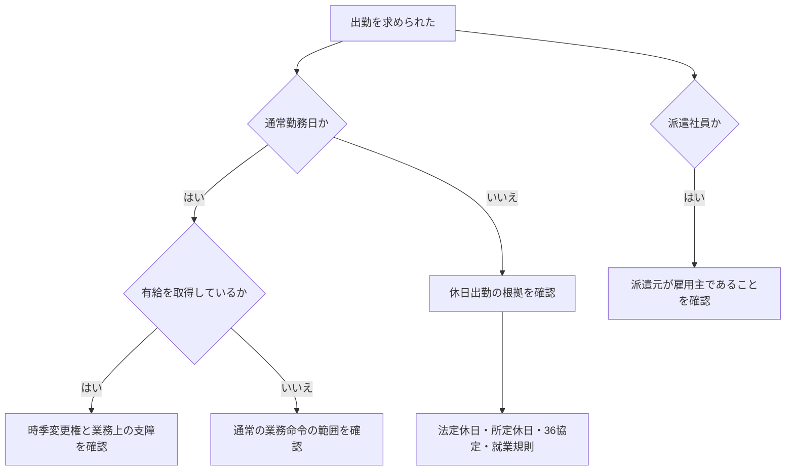

# 出勤命令・有給休暇・休日労働の判断順序

## 調査の範囲

このノートは、出勤命令、有給休暇、休日労働、派遣、36協定の関係を整理した一般資料である。就業規則、労働契約、労働日・休日の指定、個別事情によって結論が変わるため、個別事案への法的判断には用いない。

## 判断の起点

「社長が出勤を求めた」という一点から結論を出さず、まずその日と本人の雇用関係を確認する。

|最初に確認すること|主な論点|次に見るもの|
|---|---|---|
|その日は通常勤務日か休日か|有給の時季変更か、休日出勤か|就業規則、休日の指定、労働時間|
|本人は有給を取得しているか|時季変更権の要件|業務への支障、代替要員、事前調整|
|本人は派遣社員か|雇用主と指揮命令の関係|派遣元・派遣先の役割|
|時間外・法定休日労働になるか|36協定と割増賃金|協定の有無、上限、労働契約|



以下は、この順序で読むための一般的な整理である。

会社で、特定部署の従業員が同じ日に全員休もうとしている場合、社長や会社側が出勤を求めることはあり得る。

ただし、「社長だから自由に従業員を招集できる」という単純な話ではない。

問題になるのは主に、

- その日が通常勤務日なのか休日なのか
- 有給休暇を取得しているのか
- 業務に実際の支障が出るのか
- 雇用形態は何か
- 派遣社員の場合、誰が雇用主なのか
- 休日出勤や時間外労働になるのか
- 36協定が締結されているか
- 就業規則や労働契約に出勤命令の根拠があるか

といった点である。

---

## 通常勤務日に部署全員が有給を取得した場合

例えば、

- 金曜日は通常勤務日
- 土日月は連休
- 金曜日にある部署の従業員全員が有給休暇を取得
- その結果、その部署の出勤者が0人になる

というケースを考える。

年次有給休暇は原則として、労働者が取得したい時季を指定して取得する制度である。

一方で、その日に休まれることで**「事業の正常な運営を妨げる」**場合には、会社側に年休の取得時季を変更する**時季変更権**が認められることがある。

したがって、

> 部署全員が休む  
> → 必要な業務が完全に停止する  
> → 他部署から代替要員を確保できない  
> → 業務を別日に回すこともできない

という事情があれば、会社が一部の従業員について有給取得日を別日に変更し、その日は出勤するよう求めることはあり得る。

ただし、

> 「全員休むのは気に入らない」  
> 「連休前だから休ませたくない」  
> 「人手不足だから、とにかく誰か出勤しろ」

といった理由だけで、自由に有給を取り消せるわけではない。

判断では、

- 会社や部署の規模
- 業務内容
- その日の業務量
- 代替要員の有無
- 他部署で代行できるか
- 会社が事前に調整を試みたか
- 有給申請がいつ行われたか

などが考慮される。

---

## 「社長の権限」で呼び出すという考え方

重要なのは、社長個人に

> 「有給を取り消す特別な権利」

があるわけではないという点である。

実際には、

```
会社（使用者）
    ↓
社長・管理職などが会社を代表して指揮命令
    ↓
従業員
```

という関係になる。

したがって、社長が出勤を求める場合でも、

> 社長の個人的判断だから可能

なのではなく、

> 使用者である会社が、労働法・労働契約・就業規則等の範囲内で業務命令を行う

という構造になる。

---

## かなり前から全員の有給取得を把握していた場合

会社がかなり前から、

- Aさん：有給
- Bさん：有給
- Cさん：有給
- Dさん：有給

という状況を把握していたにもかかわらず何も調整せず、直前になって、

> 「明日は全員出勤しろ」

と命じるケースでは、会社側の対応にも問題が生じやすい。

会社側には、

- 代替要員を検討する
- 有給取得者同士を調整する
- 業務日程を変更する
- 他部署から応援を出す

など、年休を取得できるよう配慮することも求められる。

そのため、

> 会社がかなり前から全員休むことを知っていたか

と、

> 当日や直前になって突然複数人から有給申請が出たか

では事情が大きく異なる。

---

# 雇用形態による違い

年次有給休暇は正社員だけの制度ではない。

条件を満たしていれば、

- 正社員
- 契約社員
- パート
- アルバイト

にも適用される。

したがって、

> 契約社員だから有給を自由に取り消せる  
> パートだから出勤を強制しやすい  
> アルバイトだから有給より会社都合を優先できる

という仕組みではない。

基本的には、いずれも労働基準法上の「労働者」として年次有給休暇制度の対象となる。

---

## 派遣社員だけは構造が異なる

派遣社員については注意が必要である。

派遣労働では、

```
派遣元会社
    │
    ├─ 雇用契約
    │
派遣社員
    │
    └─ 実際の勤務
         ↓
       派遣先会社
```

という関係になる。

つまり、派遣社員を雇用しているのは**派遣先ではなく派遣元**である。

そのため、派遣先企業の社長が、

> 「うちの部署が人手不足だから、その派遣社員の有給を取り消す」

と直接判断することはできない。

派遣社員の年休について時季変更権を行使する主体は原則として**派遣元会社**になる。

派遣先に人員が必要であれば、

- 派遣元へ代替要員を依頼する
- 派遣元と勤務体制を調整する
- 派遣契約上の人員配置を見直す

といった対応が必要になる。

---

## 雇用形態別の整理

|雇用形態|有給について判断する使用者|
|---|---|
|正社員|勤務先会社|
|契約社員|勤務先会社|
|パート|勤務先会社|
|アルバイト|勤務先会社|
|派遣社員|派遣元会社|

特に派遣社員については、

> 派遣先の社長＝その人の雇用主

ではない点が重要である。

---

# 36協定とは何か

36協定（サブロク協定）は、労働基準法第36条に基づく労使協定である。

原則として労働基準法では、

- 1日8時間
- 1週40時間

を超えて労働させることはできない。

また、法定休日に労働させる場合にも制限がある。

会社がこれらを超えて、

- 時間外労働
- 法定休日労働

を命じるためには、原則として36協定を締結し、労働基準監督署へ届け出る必要がある。

---

## 36協定が関係するケース・しないケース

例えば、

### ケース1：通常勤務日の有給を変更して出勤

```
金曜日
本来は通常勤務日
↓
有給を取得予定
↓
時季変更
↓
通常勤務
```

これは原則として、36協定そのものの問題ではない。

中心となるのは**年休の時季変更権**である。

---

### ケース2：通常勤務後に残業

```
通常勤務
↓
さらに残業
```

法定労働時間を超える場合、36協定が関係する。

---

### ケース3：本来休みの日に出勤

```
休日
↓
会社から出勤命令
```

この場合は、

- その休日が法定休日なのか
- 単なる会社所定休日なのか
- 週40時間を超えるのか
- 就業規則に休日出勤命令の根拠があるのか

などを確認する必要がある。

法定休日に働かせるのであれば、36協定が必要になる。

---

## 法定休日と所定休日は同じではない

会社が休みとしている日すべてが「法定休日」とは限らない。

例えば週休2日の会社で、

- 土曜日：所定休日
- 日曜日：法定休日

としているケースがある。

この場合、

- 土曜日に出勤
- 日曜日に出勤

では法的な扱いが異なる可能性がある。

したがって、

> 「休日に出勤させられた＝必ず36協定違反」

とも、

> 「36協定がある＝すべての休日に自由に出勤命令できる」

とも限らない。

---

# 36協定があれば自由に働かせられるわけではない

36協定は、

> 会社に無制限の残業命令権を与える制度

ではない。

時間外労働には上限があり、原則として、

- 月45時間
- 年360時間

が基本的な上限になる。

特別条項付き36協定がある場合でも、別途上限が設けられている。

また、

> 残業代を払えば何時間でも働かせてよい

という制度でもない。

考え方としては、

```
労働基準法
原則として法定時間外労働・法定休日労働は禁止
        ↓
36協定を締結
        ↓
一定範囲で時間外・休日労働が可能
        ↓
実際に働けば割増賃金等が必要
```

となる。

---

# 「休日に突然呼び出す」場合は別問題

今回の話で特に区別する必要があるのが、

### A

通常勤務日に有給を取得している人を出勤させる

のと、

### B

もともと休日だった人を新たに出勤させる

ケースである。

Aは主に、

> 年次有給休暇の時季変更権

の問題。

Bは主に、

- 労働契約
- 就業規則
- 休日の種類
- 法定労働時間
- 36協定
- 休日労働命令の根拠

などの問題になる。

したがって、

> 「社長には従業員を招集する権限があるか」

という問いだけでは結論は出ず、

> その日は本来どのような勤務日なのか

をまず確認する必要がある。

---

# 全体の整理

```
社長が「出勤してほしい」
        │
        ├─ その日は通常勤務日？
        │      │
        │      └─ 有給取得中
        │             ↓
        │       時季変更権の問題
        │
        └─ その日は休日？
               ↓
        休日出勤命令の問題
               ↓
        就業規則・労働契約
        36協定
        法定休日かどうか
        労働時間上限
```

さらに、

```
本人が派遣社員か？
        │
        ├─ NO
        │    ↓
        │  原則として勤務先会社が使用者
        │
        └─ YES
             ↓
          雇用主は派遣元
             ↓
          派遣先社長が直接
          有給を取り消すことはできない
```

---

## このスレッドで確認した重要点

- 社長だから無条件に有給を取り消して従業員を出勤させられるわけではない。
- 通常勤務日の有給については、事業の正常な運営を妨げる場合に時季変更が認められることがある。
- 部署全員が有給という事実だけで、自動的に会社側が有利になるわけではない。
- 業務への具体的支障、代替要員、事前調整などが重要になる。
- 年休制度は正社員だけではなく、契約社員・パート・アルバイトにも適用される。
- 派遣社員の場合、雇用主は派遣元であり、派遣先企業が直接年休を取り消す構造ではない。
- 通常勤務日に有給を変更して働かせる問題と、休日に新たに出勤させる問題は別。
- 36協定は、法定労働時間を超える残業や法定休日労働を行わせるための労使協定。
- 36協定が存在しても、会社が無制限に残業・休日出勤を命令できるわけではない。
- 実際に休日出勤を命じられるかは、36協定だけでなく就業規則や労働契約も確認する必要がある。

---

## 関連して別ノート化できる論点

このノートからさらに分けるなら、次のテーマは独立性が高い。

- 年次有給休暇の時季変更権
- 派遣社員に対する指揮命令権と雇用主の違い
- 36協定と時間外・休日労働
- 法定休日と所定休日の違い
- 就業規則による休日出勤命令の根拠

ただし、今回の内容量であれば、まずは**「会社による出勤命令と有給・36協定」についてのliteratureノート1本として保持する**方が管理しやすい。
