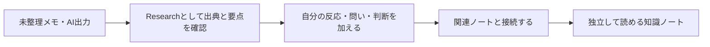

# AI整理済みObsidianノートを公開可能な知識へ育てる方針

> これはAI整理済みノートをどう育てるかについての方針検討である。話者表示、CSS、テンプレートは未実装の案であり、現行の必須運用ではない。

AIが整理した文章は、そのまま公開可能な知識になるとは限らない。出典、自分の判断、他ノートとの関係を確かめながら、知識の素材から再利用できるノートへ育てる。

| 段階 | 主な役割 | 確認すること |
| --- | --- | --- |
| 知識素材 | AI出力、引用、調査結果を保持する | 出典と検証可能性 |
| 対話・内省 | 自分の疑問、賛否、経験を残す | 誰の判断か |
| 公開候補 | 他者にも読める形へ整える | 主張、根拠、関連リンク |

AIの関与は、ノートの内容上の役割とは別に扱う。AIが下書きを作ったことだけで公開可否や知識価値を決めず、自分が何を確認し、どう判断したかを本文で追えるようにする。

話者表示、アイコン、Templaterショートカット、Quartz上の見せ方は、思考形成の経路を表すための将来候補である。導入する場合は、既存のYAML・公開ルール・テーマとの重複を確認してから最小の試作で検証する。
