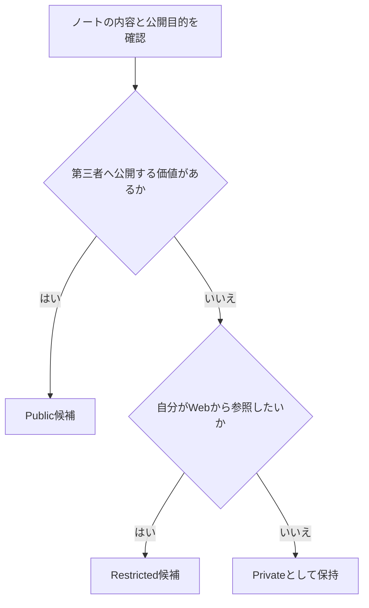

# AI時代のDigital Gardenにおける公開・限定公開の設計

> これは2026年9月時点の設計検討記録である。公開設定、Cloudflare Access、YAML項目はこのノートだけで確定しない。現行の公開運用と実装状態は、Context Vaultと実環境を正本として確認する。

中心となる考えは、情報量を減らすことではなく、公開の目的に応じて情報を分けることである。

| 区分 | 想定する内容 | 扱い |
| --- | --- | --- |
| Public | 他者が読んで意味を持つ知識、説明、作品 | 通常の公開候補 |
| Restricted | 自分ではWebから参照したいが、広く見せる必要がない情報 | 認証保護などの仕組みを検討する候補 |
| Private | 個人情報、認証情報、公開すべきでない記録 | 公開リポジトリや公開サイトに置かない |

Cloudflare Accessで特定パスを認証保護する案は、Restrictedの閲覧経路を作るための候補である。ただし、公開リポジトリに置かれた内容そのものを秘匿する仕組みではない。公開経路の制御と、保存場所・リポジトリの公開性は別々に判断する。

Deep ResearchのPDFや会話由来の資料は、公開の有無だけでなく、出典、再利用性、個人情報、将来の更新負担を見て扱う。資料を残すことと、第三者へ見せることは同じではない。

| 判断時に分けるもの | 役割 |
| --- | --- |
| draft | Quartz上で公開対象にするかという既存の公開制御 |
| 公開区分の設計 | Public／Restricted／Privateをどう使い分けるかという将来設計 |
| Cloudflare Access | Restrictedの閲覧経路として検討した実装候補 |

未解決なのは、RestrictedのURL設計、検索・Graph・RSSへの含め方、認証方式、公開リポジトリを維持するかどうかである。これらは実装前に対象範囲、脅威モデル、ロールバック方法を含む個別計画を作って判断する。

結論として、Digital Gardenは「すべて公開」か「すべて非公開」かの二択ではない。外向けに育てる知識と、自分用の参照情報を区別し、公開目的に合わせて情報の境界を設計する。
