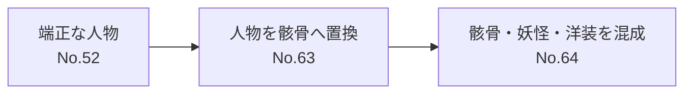

# 河鍋暁斎の世界 2026｜鑑賞ガイド詳細版

> **時点の扱い**：この展覧会は2026年9月23日に会期終了した。以下は会期中の鑑賞用メモとして残し、現在の展示情報や出品状況を示すものではない。

## 基本情報

「ゴールドマン コレクション　河鍋暁斎の世界」の鑑賞前後に参照するためのノート。

- 会場：神戸市立博物館
- 会期：2026年7月11日〜9月23日
- 前期：7月11日〜8月16日
- 後期：8月18日〜9月23日
- 記録時点：後期
- 作品番号は出品目録準拠
- ○印は出品目録における**日本初出品**

---

# この展示をどう見るか

河鍋暁斎を見る際には、

> 「奇抜な妖怪や動物を描いた面白い絵師」

だけで理解しない方がよい。

今回の展示では、

- 端正な人物画
- 宗教画
- 動物画
- 妖怪画
- 骸骨
- 鬼
- 戯画
- 版画

までが並ぶ。

したがって、中心となる問いは、

> **これだけ異なる絵を、なぜ同じ一人の絵師が描けたのか？**

である。

---

# 鑑賞のための6つの軸

## 1. 「うまい」と「ふざけている」は対立しない

暁斎の狂画は、単純に絵を崩した結果ではない。

人物、動物、衣装、身体、構図などを描写する力があった上で、

- 誇張する
- 動物に置き換える
- 骸骨に置き換える
- 鬼に置き換える
- 動きを大きくする
- 本来あり得ない状況を作る

という操作をしている。

したがって、

> **何を正確に描き、どこを意図的に崩しているか**

を見る。

---

## 2. 動物は人間の代役になる

暁斎の作品では、

- 蛙
- 猫
- 猿
- 狸
- 鴉

などが頻繁に登場する。

重要なのは動物そのものだけではない。

蛙が射的をする。
動物が曲芸をする。
猫や狸が人間的な行動をする。

つまり、

> 動物を描きながら、人間社会を描く

という構造がある。

動物の身体的特徴をどこまで残しながら、人間らしい行動を成立させているのかを見る。

---

## 3. 骸骨は「死」だけを表しているわけではない

骸骨作品では、

- 宴会する
- 楽器を演奏する
- 踊る

など、生きている人間と同じ行動をする。

ここでは、

> 「死者を描く」というより、
> **肉体だけを骸骨に置き換えて人間を描いている**

と考えると理解しやすい。

その結果、

- 生と死
- 滑稽さ
- 欲望
- 宴会
- 娯楽

などが同時に見えてくる。

---

## 4. 鬼・妖怪は必ずしも怖くない

鬼や妖怪という題材から「恐怖」を期待すると、暁斎の面白さを半分しか拾えない。

見るべきなのは、

- 酒を飲む
- 食事を準備する
- 遊ぶ
- 慌てる
- 働く
- 人間のように振る舞う

といった行動。

つまり、

> **異形のものを描くことによって、人間らしさを強調する**

という逆転が起きる。

---

## 5. 「聖」と「俗」を分けすぎない

暁斎は、

- 観音
- 鍾馗
- 達磨
- 恵比寿
- 大黒

なども描く。

しかし、神仏だから常に荘厳に描くとは限らない。

真剣な宗教画がある一方で、

- 神が絵を描く
- 鍾馗が奇妙な状況に置かれる

など、俗的・戯画的な世界にも接続する。

したがって、

> **同じ伝統的モチーフが、荘厳と笑いの両方へ振れる**

ことを見る。

---

## 6. 肉筆と版画を比較する

最後の「版画の名品」では、単に新しい主題が出てくるのではなく、

> **これまで見てきた暁斎が「版画」という別媒体に移る**

と考える。

### 肉筆

見るポイント：

- 筆圧
- 墨の濃淡
- 線の速度
- かすれ
- 筆の入り・抜き
- 描き込み

### 版画

見るポイント：

- 輪郭線
- 色面
- 摺り
- 色の重なり
- 線の均一性
- 印刷物としての構図

特に同じ題材を比較すると分かりやすい。

例：

**猫**
- 第2章の肉筆作品
- No.106《猫の月見》

**鍾馗**
- 第5章
- No.99《鍾馗図》

---

# 第1章　ゴールドマン・コレクションのスターたち

ここでは暁斎の代表的な方向性を一気に確認できる。

## No.15 百鬼夜行図屛風

### 見るところ

妖怪を一体ずつ確認する前に、まず離れて全体を見る。

- 画面がどちらへ動いているか
- 妖怪同士がどう連続しているか
- 視線をどう誘導しているか
- 大画面をどう埋めているか

を見る。

### 問い

> 多数の異形の存在を、どうやって一つの画面として統一しているのか？

---

## No.16・17 地獄太夫と一休

同一主題の作品が並ぶため比較が重要。

見るもの：

- 地獄太夫の衣装
- 人物の姿勢
- 骸骨
- 色彩
- 墨
- 背景
- 視線の誘導

特に、

> 緻密で美しいものと、奇怪なものが同じ画面に共存する

ことに注目する。

---

## No.18・19 幽霊図下絵／幽霊図

今回の展示で特に比較に向いた組み合わせ。

### 見方

1. 下絵を見る
2. 完成作を見る
3. 戻って下絵を見る

比較する：

- 消えた線
- 強調された部分
- 姿勢
- 輪郭
- 顔
- 衣服
- 余白

### 問い

> 暁斎は「完成させる」時に何を捨てたのか？

---

## No.3 蛙の学校

後の「けもの」章につながる作品。

蛙を単にかわいく描くのではなく、

> 人間的な社会行動を蛙へ移植する

という暁斎の方法を見る。

---

# 第2章　けもの

## この章のテーマ

> **動物を描いて、人間を見る。**

---

## No.22 枯木に夜鴉

狂画や擬人化とは違う方向を見るために重要。

見るもの：

- 墨
- 枝
- 鴉
- 余白
- 空間
- 静けさ

他の賑やかな作品と比べる。

---

## No.26 ○ 蛙の射的場

蛙を使った擬人化の分かりやすい例。

見るところ：

- 蛙の身体はどこまで蛙か
- 人間的なポーズをどう成立させるか
- 表情がなくても行動が読めるか

### 問い

> 人間らしさは顔ではなく、姿勢や動作から生まれているのではないか？

---

## No.31 動物の曲芸

動物に人間の芸をさせる。

「動物画」と「人間社会の戯画」の境界を見る。

---

## No.36 ○ 猫又図

猫と妖怪の境界。

見るところ：

- 猫としての身体
- 妖怪としての異様さ
- ポーズ
- 尾
- 表情
- 動き

### 問い

> どこまでなら「猫」で、どこから「猫又」なのか？

---

## No.38 ○ 蝶と菊に猫

No.36とは違い、猫そのものの観察にも注目する。

- 視線
- 重心
- 獲物への注意
- 猫と蝶の距離

を見る。

---

# 第3章　ひと

## この章のテーマ

> 人間そのものと、人間を別の姿へ置き換えた表現を比較する。

---

## No.52 ○ 月下唐美人図

暁斎の「奇抜ではない側」を確認するため重要。

見るもの：

- 顔
- 衣服
- 姿勢
- 線
- 月
- 空間

その後に骸骨作品を見る。

---

## No.63 ○ 月下骸骨宴会図

骸骨が宴会している。

重要なのは、

> 骸骨なのに「誰が何をしているか」が理解できる

こと。

つまり人物画で使う身体表現が、骨格だけになっても機能している。

---

## No.64 三味線を弾く洋装の骸骨と踊る妖怪

異質な要素が集中する。

- 洋装
- 骸骨
- 三味線
- 妖怪
- 踊り

### 問い

> 本来無関係に見えるものを、何によって一つの場面へまとめているのか？

---

## 比較

### No.52 → No.63 → No.64

この順番で見る。

「暁斎の人物表現」の幅が分かりやすい。

---

#### 第4章　おに

##### この章のテーマ

> **鬼の姿より、鬼の行動を見る。**

---

##### No.66 ○ 酒のツマミに鰹を準備する鬼

鬼が食事の準備をしている。

見るところ：

- 手
- 道具
- 姿勢
- 作業
- 表情

###### 問い

> 鬼である必要があるのか？
> 
> 人間で描いた場合と何が変わるのか？

---

##### No.68 ○ 鬼に酒肴図

酒と鬼。

恐怖ではなく、

- 飲食
- 娯楽
- 欲望

という非常に人間的な領域を見る。

---

##### No.69 ○ 大津絵夕立図

第4章で優先したい作品。

既存の図像・伝統を、暁斎自身の表現としてどう扱っているかを見る。

---

##### No.74 ○ 化物絵巻

一枚の絵とは異なり、巻物なので、

> **時間とともに見る**

という要素が加わる。

- 前後関係
- 登場
- 移動
- 場面転換

を見る。

---

#### 第5章　かみ・ほとけ

##### この章のテーマ

> **聖なるものを描く暁斎と、戯画を描く暁斎は別人なのか？**

答えを決めず、作品間の振幅を見る。

---

##### No.75 ○ 鍾馗騎象図

見るところ：

- 鍾馗の身体
- 象の重量
- 両者のサイズ感
- 画面の重心
- 動き

後のNo.99《鍾馗図》と比較する。

---

##### No.81 恵比寿を描く大黒

非常に暁斎らしい構造。

> 神様が、別の神様を描く。

つまり、

- 絵の中に画家がいる
- 描く行為自体が絵の主題になる

という入れ子構造。

---

##### No.85 ○ 異代同戯図

「古いもの」と「当代」をどのようにつないでいるかを見る。

伝統的な形式を維持するだけではなく、戯画として機能させる点に注目する。

---

##### No.88 ○ 竜頭観音図

狂画とは対照的な作品として見る。

- 顔
- 線
- 墨
- 静けさ
- 神聖性

###### 問い

> 《猫又図》《骸骨宴会図》と同じ作者だと感じる部分はどこにあるか？

---

##### No.90 達磨図

色彩よりも、

- 墨
- 筆
- 線

そのものを見る。

筆数が少ない作品ほど、一筆の役割が大きい。

---

#### 第6章　版画の名品

##### 現在は後期展示

後期に見ることができる作品：

|No.|作品|
|---|---|
|93|不可和合戦之図|
|94 ○|江戸名所築地浪除乃夜景|
|96-2|天竺渡来大評判　象の戯遊|
|97|正真猛虎写生図|
|99 ○|鍾馗図|
|102 ○|滑稽狂画双六|
|103-1|応需暁斎楽画　第二号　榊原健吉山中遊行之図|
|104-2|百喜夜興姿影絵|
|105-2|新板かげづくし|
|106 ○|猫の月見|
|108 ○|木樵に烏|
|110 ○|蛸図|

---

##### No.99 ○ 鍾馗図

後期展示で特に比較したい作品。

第5章の鍾馗作品と比較する。

###### 比較軸

|肉筆|版画|
|---|---|
|筆の速度|彫られた線|
|墨の濃淡|色面|
|筆圧|線の均一性|
|一点もの|複製可能な印刷物|

###### 問い

> 同じ鍾馗でも、媒体が変わることで何が失われ、何が強くなるか？

---

##### No.106 ○ 猫の月見

第2章の猫作品と比較する。

特に、

- 猫の輪郭
- 毛の表現
- シルエット
- 背景
- 月

を見る。

###### 問い

> 肉筆の猫と版画の猫では、どちらが「猫らしい」と感じるか？
> 
> それはなぜか？

---

##### No.94 ○ 江戸名所築地浪除乃夜景

妖怪・動物・鬼とは違う方向。

「暁斎らしさ＝奇怪さ」と固定しないために見る。

- 夜
- 建築
- 水
- 光
- 人
- 空間

を見る。

---

##### No.102 ○ 滑稽狂画双六

絵画作品としてだけでなく、

> **遊ぶための印刷物**

として見る。

鑑賞者が壁に飾って見る絵と、  
人が触って遊ぶ絵では、  
構図や情報量がどう変わるか。

---

#### 展示全体の比較ルート

##### ルートA：人間を別の姿へ置き換える

#chatgpt-mermaid-_r_542_{font-family:-apple-system,BlinkMacSystemFont,"Segoe UI",sans-serif;font-size:14px;fill:rgb(26, 28, 31);}@keyframes edge-animation-frame{from{stroke-dashoffset:0;}}@keyframes dash{to{stroke-dashoffset:0;}}#chatgpt-mermaid-_r_542_ .edge-animation-slow{stroke-dasharray:9,5!important;stroke-dashoffset:900;animation:dash 50s linear infinite;stroke-linecap:round;}#chatgpt-mermaid-_r_542_ .edge-animation-fast{stroke-dasharray:9,5!important;stroke-dashoffset:900;animation:dash 20s linear infinite;stroke-linecap:round;}#chatgpt-mermaid-_r_542_ .error-icon{fill:rgba(255, 255, 255, 0.96);}#chatgpt-mermaid-_r_542_ .error-text{fill:rgb(26, 28, 31);stroke:rgb(26, 28, 31);}#chatgpt-mermaid-_r_542_ .edge-thickness-normal{stroke-width:1px;}#chatgpt-mermaid-_r_542_ .edge-thickness-thick{stroke-width:3.5px;}#chatgpt-mermaid-_r_542_ .edge-pattern-solid{stroke-dasharray:0;}#chatgpt-mermaid-_r_542_ .edge-thickness-invisible{stroke-width:0;fill:none;}#chatgpt-mermaid-_r_542_ .edge-pattern-dashed{stroke-dasharray:3;}#chatgpt-mermaid-_r_542_ .edge-pattern-dotted{stroke-dasharray:2;}#chatgpt-mermaid-_r_542_ .marker{fill:rgba(26, 28, 31, 0.494);stroke:rgba(26, 28, 31, 0.494);}#chatgpt-mermaid-_r_542_ .marker.cross{stroke:rgba(26, 28, 31, 0.494);}#chatgpt-mermaid-_r_542_ svg{font-family:-apple-system,BlinkMacSystemFont,"Segoe UI",sans-serif;font-size:14px;}#chatgpt-mermaid-_r_542_ p{margin:0;}#chatgpt-mermaid-_r_542_ .label{font-family:-apple-system,BlinkMacSystemFont,"Segoe UI",sans-serif;color:rgb(26, 28, 31);}#chatgpt-mermaid-_r_542_ .cluster-label text{fill:rgb(26, 28, 31);}#chatgpt-mermaid-_r_542_ .cluster-label span{color:rgb(26, 28, 31);}#chatgpt-mermaid-_r_542_ .cluster-label span p{background-color:transparent;}#chatgpt-mermaid-_r_542_ .label text,#chatgpt-mermaid-_r_542_ span{fill:rgb(26, 28, 31);color:rgb(26, 28, 31);}#chatgpt-mermaid-_r_542_ .node rect,#chatgpt-mermaid-_r_542_ .node circle,#chatgpt-mermaid-_r_542_ .node ellipse,#chatgpt-mermaid-_r_542_ .node polygon,#chatgpt-mermaid-_r_542_ .node path{fill:rgb(224, 237, 254);stroke:rgb(83, 154, 248);stroke-width:1px;}#chatgpt-mermaid-_r_542_ .rough-node .label text,#chatgpt-mermaid-_r_542_ .node .label text,#chatgpt-mermaid-_r_542_ .image-shape .label,#chatgpt-mermaid-_r_542_ .icon-shape .label{text-anchor:middle;}#chatgpt-mermaid-_r_542_ .node .katex path{fill:#000;stroke:#000;stroke-width:1px;}#chatgpt-mermaid-_r_542_ .rough-node .label,#chatgpt-mermaid-_r_542_ .node .label,#chatgpt-mermaid-_r_542_ .image-shape .label,#chatgpt-mermaid-_r_542_ .icon-shape .label{text-align:center;}#chatgpt-mermaid-_r_542_ .node.clickable{cursor:pointer;}#chatgpt-mermaid-_r_542_ .root .anchor path{fill:rgba(26, 28, 31, 0.494)!important;stroke-width:0;stroke:rgba(26, 28, 31, 0.494);}#chatgpt-mermaid-_r_542_ .arrowheadPath{fill:rgba(26, 28, 31, 0.494);}#chatgpt-mermaid-_r_542_ .edgePath .path{stroke:rgba(26, 28, 31, 0.494);stroke-width:1px;}#chatgpt-mermaid-_r_542_ .flowchart-link{stroke:rgba(26, 28, 31, 0.494);fill:none;}#chatgpt-mermaid-_r_542_ .edgeLabel{background-color:rgb(255, 255, 255);text-align:center;}#chatgpt-mermaid-_r_542_ .edgeLabel p{background-color:rgb(255, 255, 255);}#chatgpt-mermaid-_r_542_ .edgeLabel rect{opacity:0.5;background-color:rgb(255, 255, 255);fill:rgb(255, 255, 255);}#chatgpt-mermaid-_r_542_ .labelBkg{background-color:rgba(255, 255, 255, 0.5);}#chatgpt-mermaid-_r_542_ .cluster rect{fill:rgba(255, 255, 255, 0.96);stroke:rgba(26, 28, 31, 0.08);stroke-width:1px;}#chatgpt-mermaid-_r_542_ .cluster text{fill:rgb(26, 28, 31);}#chatgpt-mermaid-_r_542_ .cluster span{color:rgb(26, 28, 31);}#chatgpt-mermaid-_r_542_ div.mermaidTooltip{position:absolute;text-align:center;max-width:200px;padding:2px;font-family:-apple-system,BlinkMacSystemFont,"Segoe UI",sans-serif;font-size:12px;background:rgba(255, 255, 255, 0.96);border:1px solid rgba(26, 28, 31, 0.08);border-radius:2px;pointer-events:none;z-index:100;}#chatgpt-mermaid-_r_542_ .flowchartTitleText{text-anchor:middle;font-size:18px;fill:rgb(26, 28, 31);}#chatgpt-mermaid-_r_542_ rect.text{fill:none;stroke-width:0;}#chatgpt-mermaid-_r_542_ .icon-shape,#chatgpt-mermaid-_r_542_ .image-shape{background-color:rgb(255, 255, 255);text-align:center;}#chatgpt-mermaid-_r_542_ .icon-shape p,#chatgpt-mermaid-_r_542_ .image-shape p{background-color:rgb(255, 255, 255);padding:2px;}#chatgpt-mermaid-_r_542_ .icon-shape .label rect,#chatgpt-mermaid-_r_542_ .image-shape .label rect{opacity:0.5;background-color:rgb(255, 255, 255);fill:rgb(255, 255, 255);}#chatgpt-mermaid-_r_542_ .label-icon{display:inline-block;height:1em;overflow:visible;vertical-align:-0.125em;}#chatgpt-mermaid-_r_542_ .node .label-icon path{fill:currentColor;stroke:revert;stroke-width:revert;}#chatgpt-mermaid-_r_542_ .node .neo-node{stroke:rgb(83, 154, 248);}#chatgpt-mermaid-_r_542_ [data-look="neo"].node rect,#chatgpt-mermaid-_r_542_ [data-look="neo"].cluster rect,#chatgpt-mermaid-_r_542_ [data-look="neo"].node polygon{stroke:url(#chatgpt-mermaid-_r_542_-gradient);filter:drop-shadow( 1px 2px 2px rgba(185,185,185,1));}#chatgpt-mermaid-_r_542_ [data-look="neo"].swimlane.cluster rect{filter:none;}#chatgpt-mermaid-_r_542_ [data-look="neo"].node path{stroke:url(#chatgpt-mermaid-_r_542_-gradient);stroke-width:1px;}#chatgpt-mermaid-_r_542_ [data-look="neo"].node .outer-path{filter:drop-shadow( 1px 2px 2px rgba(185,185,185,1));}#chatgpt-mermaid-_r_542_ [data-look="neo"].node .neo-line path{stroke:rgb(83, 154, 248);filter:none;}#chatgpt-mermaid-_r_542_ [data-look="neo"].node circle{stroke:url(#chatgpt-mermaid-_r_542_-gradient);filter:drop-shadow( 1px 2px 2px rgba(185,185,185,1));}#chatgpt-mermaid-_r_542_ [data-look="neo"].node circle .state-start{fill:#000000;}#chatgpt-mermaid-_r_542_ [data-look="neo"].icon-shape .icon{fill:url(#chatgpt-mermaid-_r_542_-gradient);filter:drop-shadow( 1px 2px 2px rgba(185,185,185,1));}#chatgpt-mermaid-_r_542_ [data-look="neo"].icon-shape .icon-neo path{stroke:url(#chatgpt-mermaid-_r_542_-gradient);filter:drop-shadow( 1px 2px 2px rgba(185,185,185,1));}#chatgpt-mermaid-_r_542_ .node text{font-size:14px;font-weight:600;letter-spacing:normal;fill:rgb(0, 79, 153);}#chatgpt-mermaid-_r_542_ .edgeLabels text{font-size:13px;font-weight:600;letter-spacing:-0.08px;fill:rgb(0, 79, 153);}#chatgpt-mermaid-_r_542_ .node tspan[font-weight="normal"],#chatgpt-mermaid-_r_542_ .edgeLabels tspan[font-weight="normal"]{font-weight:600;}#chatgpt-mermaid-_r_542_ .edgeLabel .label rect{opacity:1;rx:13px;ry:13px;fill:rgb(245, 250, 255);stroke:rgb(206, 219, 229);stroke-width:1px;}#chatgpt-mermaid-_r_542_ .node rect,#chatgpt-mermaid-_r_542_ .node circle,#chatgpt-mermaid-_r_542_ .node ellipse,#chatgpt-mermaid-_r_542_ .node polygon,#chatgpt-mermaid-_r_542_ .node path{fill:rgb(229, 243, 255);stroke:rgba(0, 0, 0, 0.1);stroke-width:1px;}#chatgpt-mermaid-_r_542_ .node rect{rx:16px;ry:16px;}#chatgpt-mermaid-_r_542_ .node.mermaid-decision .label-container{fill:rgb(245, 250, 255);stroke:rgb(206, 219, 229);stroke-dasharray:2,2;}#chatgpt-mermaid-_r_542_ .edgePaths .flowchart-link{stroke:rgb(206, 219, 229);stroke-width:1px;stroke-linecap:round;stroke-linejoin:round;}#chatgpt-mermaid-_r_542_ .marker{fill:rgb(206, 219, 229);stroke:rgb(206, 219, 229);}#chatgpt-mermaid-_r_542_ :root{--mermaid-font-family:-apple-system,BlinkMacSystemFont,"Segoe UI",sans-serif;}蛙No.26猫・妖怪No.36骸骨No.63鬼No.66・68

100%

問い：

> 人間を直接描かなくても、人間らしさを描けるのはなぜか？

---

##### ルートB：端正と狂画

#chatgpt-mermaid-_r_53t_{font-family:-apple-system,BlinkMacSystemFont,"Segoe UI",sans-serif;font-size:14px;fill:rgb(26, 28, 31);}@keyframes edge-animation-frame{from{stroke-dashoffset:0;}}@keyframes dash{to{stroke-dashoffset:0;}}#chatgpt-mermaid-_r_53t_ .edge-animation-slow{stroke-dasharray:9,5!important;stroke-dashoffset:900;animation:dash 50s linear infinite;stroke-linecap:round;}#chatgpt-mermaid-_r_53t_ .edge-animation-fast{stroke-dasharray:9,5!important;stroke-dashoffset:900;animation:dash 20s linear infinite;stroke-linecap:round;}#chatgpt-mermaid-_r_53t_ .error-icon{fill:rgba(255, 255, 255, 0.96);}#chatgpt-mermaid-_r_53t_ .error-text{fill:rgb(26, 28, 31);stroke:rgb(26, 28, 31);}#chatgpt-mermaid-_r_53t_ .edge-thickness-normal{stroke-width:1px;}#chatgpt-mermaid-_r_53t_ .edge-thickness-thick{stroke-width:3.5px;}#chatgpt-mermaid-_r_53t_ .edge-pattern-solid{stroke-dasharray:0;}#chatgpt-mermaid-_r_53t_ .edge-thickness-invisible{stroke-width:0;fill:none;}#chatgpt-mermaid-_r_53t_ .edge-pattern-dashed{stroke-dasharray:3;}#chatgpt-mermaid-_r_53t_ .edge-pattern-dotted{stroke-dasharray:2;}#chatgpt-mermaid-_r_53t_ .marker{fill:rgba(26, 28, 31, 0.494);stroke:rgba(26, 28, 31, 0.494);}#chatgpt-mermaid-_r_53t_ .marker.cross{stroke:rgba(26, 28, 31, 0.494);}#chatgpt-mermaid-_r_53t_ svg{font-family:-apple-system,BlinkMacSystemFont,"Segoe UI",sans-serif;font-size:14px;}#chatgpt-mermaid-_r_53t_ p{margin:0;}#chatgpt-mermaid-_r_53t_ .label{font-family:-apple-system,BlinkMacSystemFont,"Segoe UI",sans-serif;color:rgb(26, 28, 31);}#chatgpt-mermaid-_r_53t_ .cluster-label text{fill:rgb(26, 28, 31);}#chatgpt-mermaid-_r_53t_ .cluster-label span{color:rgb(26, 28, 31);}#chatgpt-mermaid-_r_53t_ .cluster-label span p{background-color:transparent;}#chatgpt-mermaid-_r_53t_ .label text,#chatgpt-mermaid-_r_53t_ span{fill:rgb(26, 28, 31);color:rgb(26, 28, 31);}#chatgpt-mermaid-_r_53t_ .node rect,#chatgpt-mermaid-_r_53t_ .node circle,#chatgpt-mermaid-_r_53t_ .node ellipse,#chatgpt-mermaid-_r_53t_ .node polygon,#chatgpt-mermaid-_r_53t_ .node path{fill:rgb(224, 237, 254);stroke:rgb(83, 154, 248);stroke-width:1px;}#chatgpt-mermaid-_r_53t_ .rough-node .label text,#chatgpt-mermaid-_r_53t_ .node .label text,#chatgpt-mermaid-_r_53t_ .image-shape .label,#chatgpt-mermaid-_r_53t_ .icon-shape .label{text-anchor:middle;}#chatgpt-mermaid-_r_53t_ .node .katex path{fill:#000;stroke:#000;stroke-width:1px;}#chatgpt-mermaid-_r_53t_ .rough-node .label,#chatgpt-mermaid-_r_53t_ .node .label,#chatgpt-mermaid-_r_53t_ .image-shape .label,#chatgpt-mermaid-_r_53t_ .icon-shape .label{text-align:center;}#chatgpt-mermaid-_r_53t_ .node.clickable{cursor:pointer;}#chatgpt-mermaid-_r_53t_ .root .anchor path{fill:rgba(26, 28, 31, 0.494)!important;stroke-width:0;stroke:rgba(26, 28, 31, 0.494);}#chatgpt-mermaid-_r_53t_ .arrowheadPath{fill:rgba(26, 28, 31, 0.494);}#chatgpt-mermaid-_r_53t_ .edgePath .path{stroke:rgba(26, 28, 31, 0.494);stroke-width:1px;}#chatgpt-mermaid-_r_53t_ .flowchart-link{stroke:rgba(26, 28, 31, 0.494);fill:none;}#chatgpt-mermaid-_r_53t_ .edgeLabel{background-color:rgb(255, 255, 255);text-align:center;}#chatgpt-mermaid-_r_53t_ .edgeLabel p{background-color:rgb(255, 255, 255);}#chatgpt-mermaid-_r_53t_ .edgeLabel rect{opacity:0.5;background-color:rgb(255, 255, 255);fill:rgb(255, 255, 255);}#chatgpt-mermaid-_r_53t_ .labelBkg{background-color:rgba(255, 255, 255, 0.5);}#chatgpt-mermaid-_r_53t_ .cluster rect{fill:rgba(255, 255, 255, 0.96);stroke:rgba(26, 28, 31, 0.08);stroke-width:1px;}#chatgpt-mermaid-_r_53t_ .cluster text{fill:rgb(26, 28, 31);}#chatgpt-mermaid-_r_53t_ .cluster span{color:rgb(26, 28, 31);}#chatgpt-mermaid-_r_53t_ div.mermaidTooltip{position:absolute;text-align:center;max-width:200px;padding:2px;font-family:-apple-system,BlinkMacSystemFont,"Segoe UI",sans-serif;font-size:12px;background:rgba(255, 255, 255, 0.96);border:1px solid rgba(26, 28, 31, 0.08);border-radius:2px;pointer-events:none;z-index:100;}#chatgpt-mermaid-_r_53t_ .flowchartTitleText{text-anchor:middle;font-size:18px;fill:rgb(26, 28, 31);}#chatgpt-mermaid-_r_53t_ rect.text{fill:none;stroke-width:0;}#chatgpt-mermaid-_r_53t_ .icon-shape,#chatgpt-mermaid-_r_53t_ .image-shape{background-color:rgb(255, 255, 255);text-align:center;}#chatgpt-mermaid-_r_53t_ .icon-shape p,#chatgpt-mermaid-_r_53t_ .image-shape p{background-color:rgb(255, 255, 255);padding:2px;}#chatgpt-mermaid-_r_53t_ .icon-shape .label rect,#chatgpt-mermaid-_r_53t_ .image-shape .label rect{opacity:0.5;background-color:rgb(255, 255, 255);fill:rgb(255, 255, 255);}#chatgpt-mermaid-_r_53t_ .label-icon{display:inline-block;height:1em;overflow:visible;vertical-align:-0.125em;}#chatgpt-mermaid-_r_53t_ .node .label-icon path{fill:currentColor;stroke:revert;stroke-width:revert;}#chatgpt-mermaid-_r_53t_ .node .neo-node{stroke:rgb(83, 154, 248);}#chatgpt-mermaid-_r_53t_ [data-look="neo"].node rect,#chatgpt-mermaid-_r_53t_ [data-look="neo"].cluster rect,#chatgpt-mermaid-_r_53t_ [data-look="neo"].node polygon{stroke:url(#chatgpt-mermaid-_r_53t_-gradient);filter:drop-shadow( 1px 2px 2px rgba(185,185,185,1));}#chatgpt-mermaid-_r_53t_ [data-look="neo"].swimlane.cluster rect{filter:none;}#chatgpt-mermaid-_r_53t_ [data-look="neo"].node path{stroke:url(#chatgpt-mermaid-_r_53t_-gradient);stroke-width:1px;}#chatgpt-mermaid-_r_53t_ [data-look="neo"].node .outer-path{filter:drop-shadow( 1px 2px 2px rgba(185,185,185,1));}#chatgpt-mermaid-_r_53t_ [data-look="neo"].node .neo-line path{stroke:rgb(83, 154, 248);filter:none;}#chatgpt-mermaid-_r_53t_ [data-look="neo"].node circle{stroke:url(#chatgpt-mermaid-_r_53t_-gradient);filter:drop-shadow( 1px 2px 2px rgba(185,185,185,1));}#chatgpt-mermaid-_r_53t_ [data-look="neo"].node circle .state-start{fill:#000000;}#chatgpt-mermaid-_r_53t_ [data-look="neo"].icon-shape .icon{fill:url(#chatgpt-mermaid-_r_53t_-gradient);filter:drop-shadow( 1px 2px 2px rgba(185,185,185,1));}#chatgpt-mermaid-_r_53t_ [data-look="neo"].icon-shape .icon-neo path{stroke:url(#chatgpt-mermaid-_r_53t_-gradient);filter:drop-shadow( 1px 2px 2px rgba(185,185,185,1));}#chatgpt-mermaid-_r_53t_ .node text{font-size:14px;font-weight:600;letter-spacing:normal;fill:rgb(0, 79, 153);}#chatgpt-mermaid-_r_53t_ .edgeLabels text{font-size:13px;font-weight:600;letter-spacing:-0.08px;fill:rgb(0, 79, 153);}#chatgpt-mermaid-_r_53t_ .node tspan[font-weight="normal"],#chatgpt-mermaid-_r_53t_ .edgeLabels tspan[font-weight="normal"]{font-weight:600;}#chatgpt-mermaid-_r_53t_ .edgeLabel .label rect{opacity:1;rx:13px;ry:13px;fill:rgb(245, 250, 255);stroke:rgb(206, 219, 229);stroke-width:1px;}#chatgpt-mermaid-_r_53t_ .node rect,#chatgpt-mermaid-_r_53t_ .node circle,#chatgpt-mermaid-_r_53t_ .node ellipse,#chatgpt-mermaid-_r_53t_ .node polygon,#chatgpt-mermaid-_r_53t_ .node path{fill:rgb(229, 243, 255);stroke:rgba(0, 0, 0, 0.1);stroke-width:1px;}#chatgpt-mermaid-_r_53t_ .node rect{rx:16px;ry:16px;}#chatgpt-mermaid-_r_53t_ .node.mermaid-decision .label-container{fill:rgb(245, 250, 255);stroke:rgb(206, 219, 229);stroke-dasharray:2,2;}#chatgpt-mermaid-_r_53t_ .edgePaths .flowchart-link{stroke:rgb(206, 219, 229);stroke-width:1px;stroke-linecap:round;stroke-linejoin:round;}#chatgpt-mermaid-_r_53t_ .marker{fill:rgb(206, 219, 229);stroke:rgb(206, 219, 229);}#chatgpt-mermaid-_r_53t_ :root{--mermaid-font-family:-apple-system,BlinkMacSystemFont,"Segoe UI",sans-serif;}月下唐美人図No.52竜頭観音図No.88地獄太夫と一休No.16・17骸骨・妖怪No.63・64

99%

問い：

> 暁斎の「画力」はどの作品群にも共通しているか？

---

##### ルートC：同じモチーフを媒体で比較

#chatgpt-mermaid-_r_53o_{font-family:-apple-system,BlinkMacSystemFont,"Segoe UI",sans-serif;font-size:14px;fill:rgb(26, 28, 31);}@keyframes edge-animation-frame{from{stroke-dashoffset:0;}}@keyframes dash{to{stroke-dashoffset:0;}}#chatgpt-mermaid-_r_53o_ .edge-animation-slow{stroke-dasharray:9,5!important;stroke-dashoffset:900;animation:dash 50s linear infinite;stroke-linecap:round;}#chatgpt-mermaid-_r_53o_ .edge-animation-fast{stroke-dasharray:9,5!important;stroke-dashoffset:900;animation:dash 20s linear infinite;stroke-linecap:round;}#chatgpt-mermaid-_r_53o_ .error-icon{fill:rgba(255, 255, 255, 0.96);}#chatgpt-mermaid-_r_53o_ .error-text{fill:rgb(26, 28, 31);stroke:rgb(26, 28, 31);}#chatgpt-mermaid-_r_53o_ .edge-thickness-normal{stroke-width:1px;}#chatgpt-mermaid-_r_53o_ .edge-thickness-thick{stroke-width:3.5px;}#chatgpt-mermaid-_r_53o_ .edge-pattern-solid{stroke-dasharray:0;}#chatgpt-mermaid-_r_53o_ .edge-thickness-invisible{stroke-width:0;fill:none;}#chatgpt-mermaid-_r_53o_ .edge-pattern-dashed{stroke-dasharray:3;}#chatgpt-mermaid-_r_53o_ .edge-pattern-dotted{stroke-dasharray:2;}#chatgpt-mermaid-_r_53o_ .marker{fill:rgba(26, 28, 31, 0.494);stroke:rgba(26, 28, 31, 0.494);}#chatgpt-mermaid-_r_53o_ .marker.cross{stroke:rgba(26, 28, 31, 0.494);}#chatgpt-mermaid-_r_53o_ svg{font-family:-apple-system,BlinkMacSystemFont,"Segoe UI",sans-serif;font-size:14px;}#chatgpt-mermaid-_r_53o_ p{margin:0;}#chatgpt-mermaid-_r_53o_ .label{font-family:-apple-system,BlinkMacSystemFont,"Segoe UI",sans-serif;color:rgb(26, 28, 31);}#chatgpt-mermaid-_r_53o_ .cluster-label text{fill:rgb(26, 28, 31);}#chatgpt-mermaid-_r_53o_ .cluster-label span{color:rgb(26, 28, 31);}#chatgpt-mermaid-_r_53o_ .cluster-label span p{background-color:transparent;}#chatgpt-mermaid-_r_53o_ .label text,#chatgpt-mermaid-_r_53o_ span{fill:rgb(26, 28, 31);color:rgb(26, 28, 31);}#chatgpt-mermaid-_r_53o_ .node rect,#chatgpt-mermaid-_r_53o_ .node circle,#chatgpt-mermaid-_r_53o_ .node ellipse,#chatgpt-mermaid-_r_53o_ .node polygon,#chatgpt-mermaid-_r_53o_ .node path{fill:rgb(224, 237, 254);stroke:rgb(83, 154, 248);stroke-width:1px;}#chatgpt-mermaid-_r_53o_ .rough-node .label text,#chatgpt-mermaid-_r_53o_ .node .label text,#chatgpt-mermaid-_r_53o_ .image-shape .label,#chatgpt-mermaid-_r_53o_ .icon-shape .label{text-anchor:middle;}#chatgpt-mermaid-_r_53o_ .node .katex path{fill:#000;stroke:#000;stroke-width:1px;}#chatgpt-mermaid-_r_53o_ .rough-node .label,#chatgpt-mermaid-_r_53o_ .node .label,#chatgpt-mermaid-_r_53o_ .image-shape .label,#chatgpt-mermaid-_r_53o_ .icon-shape .label{text-align:center;}#chatgpt-mermaid-_r_53o_ .node.clickable{cursor:pointer;}#chatgpt-mermaid-_r_53o_ .root .anchor path{fill:rgba(26, 28, 31, 0.494)!important;stroke-width:0;stroke:rgba(26, 28, 31, 0.494);}#chatgpt-mermaid-_r_53o_ .arrowheadPath{fill:rgba(26, 28, 31, 0.494);}#chatgpt-mermaid-_r_53o_ .edgePath .path{stroke:rgba(26, 28, 31, 0.494);stroke-width:1px;}#chatgpt-mermaid-_r_53o_ .flowchart-link{stroke:rgba(26, 28, 31, 0.494);fill:none;}#chatgpt-mermaid-_r_53o_ .edgeLabel{background-color:rgb(255, 255, 255);text-align:center;}#chatgpt-mermaid-_r_53o_ .edgeLabel p{background-color:rgb(255, 255, 255);}#chatgpt-mermaid-_r_53o_ .edgeLabel rect{opacity:0.5;background-color:rgb(255, 255, 255);fill:rgb(255, 255, 255);}#chatgpt-mermaid-_r_53o_ .labelBkg{background-color:rgba(255, 255, 255, 0.5);}#chatgpt-mermaid-_r_53o_ .cluster rect{fill:rgba(255, 255, 255, 0.96);stroke:rgba(26, 28, 31, 0.08);stroke-width:1px;}#chatgpt-mermaid-_r_53o_ .cluster text{fill:rgb(26, 28, 31);}#chatgpt-mermaid-_r_53o_ .cluster span{color:rgb(26, 28, 31);}#chatgpt-mermaid-_r_53o_ div.mermaidTooltip{position:absolute;text-align:center;max-width:200px;padding:2px;font-family:-apple-system,BlinkMacSystemFont,"Segoe UI",sans-serif;font-size:12px;background:rgba(255, 255, 255, 0.96);border:1px solid rgba(26, 28, 31, 0.08);border-radius:2px;pointer-events:none;z-index:100;}#chatgpt-mermaid-_r_53o_ .flowchartTitleText{text-anchor:middle;font-size:18px;fill:rgb(26, 28, 31);}#chatgpt-mermaid-_r_53o_ rect.text{fill:none;stroke-width:0;}#chatgpt-mermaid-_r_53o_ .icon-shape,#chatgpt-mermaid-_r_53o_ .image-shape{background-color:rgb(255, 255, 255);text-align:center;}#chatgpt-mermaid-_r_53o_ .icon-shape p,#chatgpt-mermaid-_r_53o_ .image-shape p{background-color:rgb(255, 255, 255);padding:2px;}#chatgpt-mermaid-_r_53o_ .icon-shape .label rect,#chatgpt-mermaid-_r_53o_ .image-shape .label rect{opacity:0.5;background-color:rgb(255, 255, 255);fill:rgb(255, 255, 255);}#chatgpt-mermaid-_r_53o_ .label-icon{display:inline-block;height:1em;overflow:visible;vertical-align:-0.125em;}#chatgpt-mermaid-_r_53o_ .node .label-icon path{fill:currentColor;stroke:revert;stroke-width:revert;}#chatgpt-mermaid-_r_53o_ .node .neo-node{stroke:rgb(83, 154, 248);}#chatgpt-mermaid-_r_53o_ [data-look="neo"].node rect,#chatgpt-mermaid-_r_53o_ [data-look="neo"].cluster rect,#chatgpt-mermaid-_r_53o_ [data-look="neo"].node polygon{stroke:url(#chatgpt-mermaid-_r_53o_-gradient);filter:drop-shadow( 1px 2px 2px rgba(185,185,185,1));}#chatgpt-mermaid-_r_53o_ [data-look="neo"].swimlane.cluster rect{filter:none;}#chatgpt-mermaid-_r_53o_ [data-look="neo"].node path{stroke:url(#chatgpt-mermaid-_r_53o_-gradient);stroke-width:1px;}#chatgpt-mermaid-_r_53o_ [data-look="neo"].node .outer-path{filter:drop-shadow( 1px 2px 2px rgba(185,185,185,1));}#chatgpt-mermaid-_r_53o_ [data-look="neo"].node .neo-line path{stroke:rgb(83, 154, 248);filter:none;}#chatgpt-mermaid-_r_53o_ [data-look="neo"].node circle{stroke:url(#chatgpt-mermaid-_r_53o_-gradient);filter:drop-shadow( 1px 2px 2px rgba(185,185,185,1));}#chatgpt-mermaid-_r_53o_ [data-look="neo"].node circle .state-start{fill:#000000;}#chatgpt-mermaid-_r_53o_ [data-look="neo"].icon-shape .icon{fill:url(#chatgpt-mermaid-_r_53o_-gradient);filter:drop-shadow( 1px 2px 2px rgba(185,185,185,1));}#chatgpt-mermaid-_r_53o_ [data-look="neo"].icon-shape .icon-neo path{stroke:url(#chatgpt-mermaid-_r_53o_-gradient);filter:drop-shadow( 1px 2px 2px rgba(185,185,185,1));}#chatgpt-mermaid-_r_53o_ .node text{font-size:14px;font-weight:600;letter-spacing:normal;fill:rgb(0, 79, 153);}#chatgpt-mermaid-_r_53o_ .edgeLabels text{font-size:13px;font-weight:600;letter-spacing:-0.08px;fill:rgb(0, 79, 153);}#chatgpt-mermaid-_r_53o_ .node tspan[font-weight="normal"],#chatgpt-mermaid-_r_53o_ .edgeLabels tspan[font-weight="normal"]{font-weight:600;}#chatgpt-mermaid-_r_53o_ .edgeLabel .label rect{opacity:1;rx:13px;ry:13px;fill:rgb(245, 250, 255);stroke:rgb(206, 219, 229);stroke-width:1px;}#chatgpt-mermaid-_r_53o_ .node rect,#chatgpt-mermaid-_r_53o_ .node circle,#chatgpt-mermaid-_r_53o_ .node ellipse,#chatgpt-mermaid-_r_53o_ .node polygon,#chatgpt-mermaid-_r_53o_ .node path{fill:rgb(229, 243, 255);stroke:rgba(0, 0, 0, 0.1);stroke-width:1px;}#chatgpt-mermaid-_r_53o_ .node rect{rx:16px;ry:16px;}#chatgpt-mermaid-_r_53o_ .node.mermaid-decision .label-container{fill:rgb(245, 250, 255);stroke:rgb(206, 219, 229);stroke-dasharray:2,2;}#chatgpt-mermaid-_r_53o_ .edgePaths .flowchart-link{stroke:rgb(206, 219, 229);stroke-width:1px;stroke-linecap:round;stroke-linejoin:round;}#chatgpt-mermaid-_r_53o_ .marker{fill:rgb(206, 219, 229);stroke:rgb(206, 219, 229);}#chatgpt-mermaid-_r_53o_ :root{--mermaid-font-family:-apple-system,BlinkMacSystemFont,"Segoe UI",sans-serif;}猫の肉筆作品第2章猫の月見No.106鍾馗の肉筆作品第5章鍾馗図No.99

100%

問い：

> 肉筆と版画で、線・色・動きはどう変わるか？

---

#### 最優先13点

時間が限られる場合：

|優先|No.|作品|
|---|---|---|
|1|15|百鬼夜行図屛風|
|2|16・17|地獄太夫と一休|
|3|18・19|幽霊図下絵／幽霊図|
|4|26 ○|蛙の射的場|
|5|36 ○|猫又図|
|6|52 ○|月下唐美人図|
|7|63 ○|月下骸骨宴会図|
|8|64|三味線を弾く洋装の骸骨と踊る妖怪|
|9|69 ○|大津絵夕立図|
|10|75 ○|鍾馗騎象図|
|11|88 ○|竜頭観音図|
|12|99 ○|鍾馗図|
|13|106 ○|猫の月見|

---

#### 鑑賞時の観察方法

作品を見る順番を、

1. 離れて全体を見る
2. 主役を見る
3. 周辺を見る
4. 線を見る
5. 表情・姿勢を見る
6. 「何が変なのか」を探す
7. 「なぜ成立しているのか」を考える

とする。

特に暁斎の場合、

> 「変な絵だった」

で終わらせず、

> **「何が普通ではないのか」**
> 
> **「普通ではないのに、なぜ自然に見えるのか」**

まで考える。

---

#### 会場では実物でしか確認できないものを優先する

図録で後から確認できるもの：

- 作品名
- 年代
- 解説
- 図像
- 細かな情報

会場で優先するもの：

- 実物の大きさ
- 墨の濃淡
- 色
- 筆跡
- 線の細さ
- 紙・絹の質感
- 絵の迫力
- 展示距離から受ける印象

したがって、

> **作品解説を完全に理解してから次へ進もうとしない。**

実物を見て感じた差異を記録し、詳細は図録で回収する。

---

#### 鑑賞後に残すこと

##### 作品

- 最も好きだった作品：
- 最も暁斎らしいと感じた作品：
- 最も画力を感じた作品：
- 最も笑った作品：
- 最も不気味だった作品：
- 実物で印象が変わった作品：
- 日本初出品で印象に残った作品：
- 図録で調べ直したい作品：

##### 暁斎について

鑑賞前のイメージ：

鑑賞後のイメージ：

変化した点：

##### 今後のZK候補

鑑賞後、必要に応じて以下をPermanent化する。

- 河鍋暁斎における動物の擬人化
- 河鍋暁斎における骸骨と生死
- 河鍋暁斎の鬼の人間性
- 河鍋暁斎における聖と俗
- 河鍋暁斎の正統的画力と狂画
- 河鍋暁斎における肉筆と版画
- 河鍋暁斎の「異形」を用いた人間表現

これらは鑑賞前に結論を作るのではなく、実作品を見た後の自分の観察を中心に作成する。
