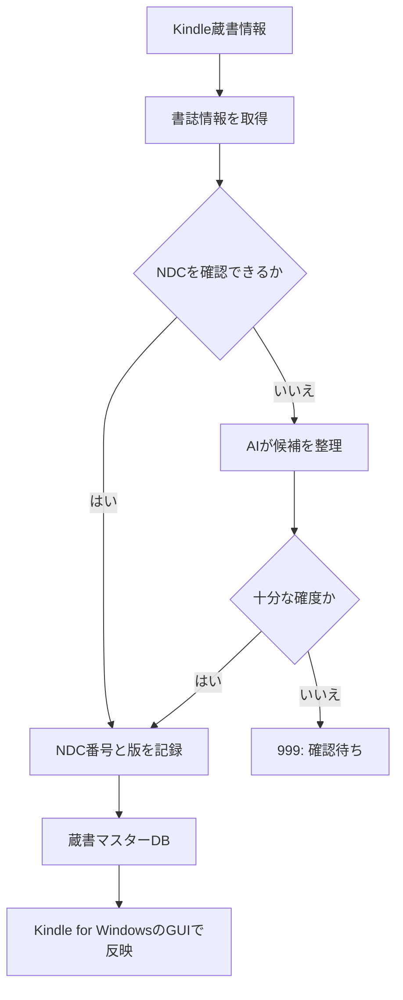

# Kindle蔵書管理は「NDC判定」と「Amazonへの反映」を分離して自動化する

Kindle蔵書をNDC（日本十進分類法）で整理する目的は、分類作業を精緻化することではなく、整理に使う時間を読書へ戻すことである。そこで、書誌情報の取得・NDC判定・蔵書DBへの記録と、Kindle Collectionへの反映を別工程にする。

このノートは2026年9月時点の設計メモであり、AmazonやKindle for Windowsの現行仕様を保証するものではない。実装やサービス仕様の確認は、着手時に公式情報と実画面で行う。

## 役割の分離

|工程|担当|残すもの|
|---|---|---|
|書誌情報の取得|NDL Searchなどの書誌情報源|書名・著者・ISBNなど|
|NDC判定|書誌情報を優先し、AIは補助|NDC番号・版・根拠・確信度|
|蔵書の管理|手元のCSV／SQLiteなど|蔵書マスター|
|Collectionへの反映|Kindle for Windowsの公式GUI|反映結果・例外|

AIはNDCを断定する分類器ではなく、表記ゆれの照合、候補の比較、例外の抽出を補助する。書誌情報で判断できないものは、根拠と確信度を残したうえで人間が確認する。



## NDCの扱い

現在のCollectionはNDC新訂9版を基準にしている。そのため、NDC番号だけでなく、少なくとも次を分けて記録する。

```text
ndc_code: 933.7
ndc_edition: 9
ndc_source: NDL
confidence: high
```

NDC9とNDC10を無意識に混在させない。NDC10へ移行するか、既存のNDC9を維持するかは未決定であり、移行する場合は既存Collectionとの対応表を先に設計する。

`[999] その他`は、特殊分類ではなく、NDCが未確定の本を一時的に置く保留先として扱う。判定できた本は通常のCollectionへ移し、判断不能なものだけを残す。

## Amazonへの反映は公式GUIに限定する

Amazonに一般利用者向けのKindle Collection書き込みAPIが公開されていない前提では、非公開APIの解析や認証情報を扱う自動化は採用しない。仕様変更、認証、利用規約、誤操作時の復旧といった保守リスクが、今回の目的に見合わないためである。

蔵書分類の正本はAmazonではなく手元の蔵書マスターに置く。Kindle側は、分類済みの結果をCollectionへ反映する場所に限定する。

## 段階的な自動化

1. AIが書名と登録先Collectionの候補を作り、人間がGUI操作する。
2. 検索語の入力や候補提示を半自動化し、人間が実行前に確認する。
3. 単冊処理で、検索・選択・Collection登録・結果確認を自動化する。
4. 少数バッチへ拡張し、処理済み状態、失敗理由、再実行手順を記録する。

固定座標や時間待機ではなく、検索結果・ダイアログ・Collection登録の状態を確認して進める。曖昧な検索結果、ログイン要求、UI変更などの例外は自動処理を止めて人間へ戻す。

## 未決事項と次の確認

- NDC9を維持するか、NDC10へ移行するか
- 蔵書マスターをCSV、SQLiteなどのどれで管理するか
- Kindle for Windowsで使える操作キーとCollection一覧
- NDLで判定できない本のAI補助基準
- GUI自動化の主ツール

次に実装へ進む場合は、10〜20冊程度の小さな試行で、書誌取得・NDC判定・GUI反映の各工程を個別に確かめる。
