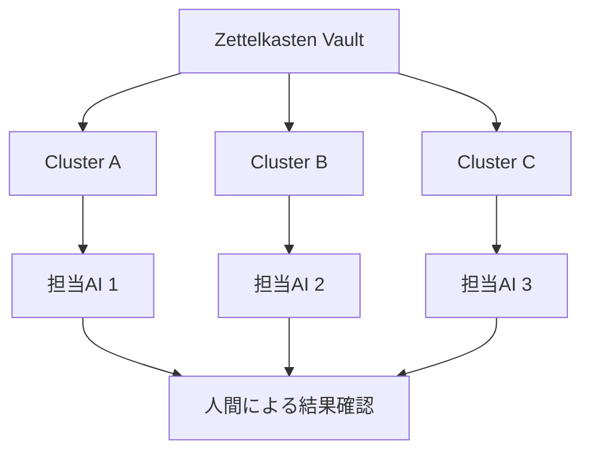
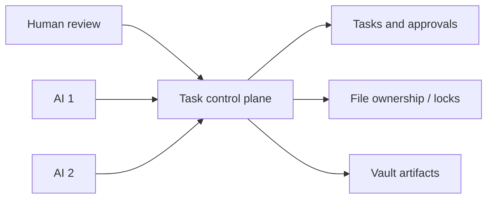

# 複数AIによるZettelkasten整理の分担方針（2026年9月の検討記録）

## このノートの位置付け

このノートは、**2026年9月時点**で複数のAIサービスへZettelkasten整理を分担させる可能性を調べ、運用方法を検討した記録である。当時のサービス仕様、料金、利用枠、提供状況、製品名は現在の事実を保証しない。後に実行・比較・公開・契約判断へ使う場合は、公式情報で改めて確認する。

ここで確定した中心的な運用判断は、工程ごとにAIを切り替えるのではなく、**関連するノート群をまとめたクラスタ単位で担当を分ける**ことである。

## 当時の結論

Zettelkastenの整理では、統合・分割・リンク・役割判定の判断が連続する。途中で別のAIへ切り替えると、判断根拠、保留事項、対象範囲を人間が再説明しなければならず、分担による効率化を損ないやすい。

| 比較 | 工程単位での切替 | クラスタ単位での分担 |
| --- | --- | --- |
| 判断の連続性 | AIの切替ごとに失われやすい | 同じ担当内で維持しやすい |
| 人間の引き継ぎ負荷 | 高くなりやすい | クラスタ境界で限定できる |
| 品質比較 | 工程差とAI差が混ざる | 近い規模のクラスタで比較できる |
| 現時点の採用 | 採用しない | 原則として採用する |

一つのクラスタは、原則として一つのAIが、対象確認・提案・承認後の処理・結果確認まで担当する。AIの担当変更は、クラスタの完了または明示的な中断を境界とする。

## AI間で共通に守るもの

AIごとに表現や関係発見の違いがあってもよい。一方で、知識構造を壊さないためのルールは共通化する必要がある。

- `type`、tags、title、aliases、ファイル名、Markdownリンクの規則
- Research、Zettelkasten、Permanent、Literature等の役割判断
- 本文の意味・発話者・根拠・保留事項を保持する基準
- 統合、分割、移動、削除、リンク追加に必要な承認
- 変更前の退避、変更後のYAML・リンク検証、作業結果の記録

比較で重視するのは文章の好みではなく、統合・分割・役割判定・情報保持・ルール遵守といった知識構造上の品質である。

## 自動オーケストレーションを直ちに作らない理由

異なるAIを自動連携させるには、単なる引き継ぎノートだけでは足りない。少なくとも、タスクの取得、排他制御、ファイル所有、進捗通知、失敗時の再割当、人間承認を扱う仕組みが必要になる。

当時は、SQLiteとAPIを用いたタスクキュー、claim、heartbeat、lock、lease等を備える管理基盤を将来案として検討した。ただし、仕組みの開発・保守がZettelkasten整理そのものを上回るリスクがあるため、直ちには作らないとした。

現時点では、人間がクラスタの割当、並行作業の回避、結果確認を担う。これは自動化の不足ではなく、変更の安全性を保つための意図的な運用である。

## 当時調べたサービス候補

以下は2026年9月時点の調査・検討記録であり、現在の提供内容、料金、利用可否、製品名を示すものではない。

| 候補 | 当時の検討観点 | 留意点 |
| --- | --- | --- |
| ChatGPT Work | 既存作業との連続性、クラスタ単位での整理品質 | 利用枠と人間の確認負荷を観察する必要がある |
| Perplexity Pro | GUI中心で試しやすく、ローカルフォルダ操作を比較する候補 | 実際の統廃合・横断整理の安定性は試験が必要 |
| Google側のAgent環境 | 当時はAntigravity 2.0／CLI系を、ローカルファイル・複数Agent機能の候補として検討 | 仕様・名称・料金・利用枠は実行前に公式情報で確認が必要 |

当時の比較では、利用回数や人間の介入回数を仮の数値で説明した箇所があった。それらは実測値やサービス間の優劣を示すデータではない。比較するなら、近い規模・性質のクラスタを別々に担当させ、次の観点を記録する。

| 評価項目 | 確認すること |
| --- | --- |
| ルール遵守 | Operations、Policy、承認境界を守れるか |
| クラスタ理解 | ノート間の関係と境界を適切に把握できるか |
| 統合・分割 | 過剰な統合・分割をせず、理由を説明できるか |
| 情報保持 | 本人の意図、根拠、時系列、保留を失わないか |
| ファイル安全性 | YAML、リンク、既存構造を壊さないか |
| 人間負荷 | 指示、確認、修正に必要な時間がどの程度か |
| 最終品質 | 確認後にZettelkastenへ残せる品質か |

## 実施するときの境界

複数AIへ実作業を依頼する場合も、各AIに同じ変更権限を与えるわけではない。クラスタ、対象ファイル、許可された操作、作業中の所有範囲を明示し、同じノートを複数のAIが同時に編集しないようにする。

1. 人間が、対象クラスタと担当AIを決める。
2. 担当AIは、共通ルール・現在の作業状態・対象ノートを必要な範囲で読む。
3. 変更案を提示し、人間の承認後にだけ実施する。
4. 結果確認と親クラスタ用ログへの記録を終えてから、次のクラスタを別AIへ割り当てる。

異種サービス間を自動連携させること、契約や利用枠を前提に作業を分担すること、同一クラスタを並行編集することは、このノートだけでは承認されない。

## 将来確認すること

- 現在のAI環境で、Operations・Policy・Flowをどこまで再利用できるか。
- 無料・有料の利用枠が、実際のクラスタ単位の作業量に足りるか。
- 同程度のクラスタにおける品質と人間負荷の差。
- 複数Agent機能が、ファイル所有・承認・監査の要件を満たすか。
- 将来、自動オーケストレーション基盤を作るだけの反復的な課題が生じているか。
