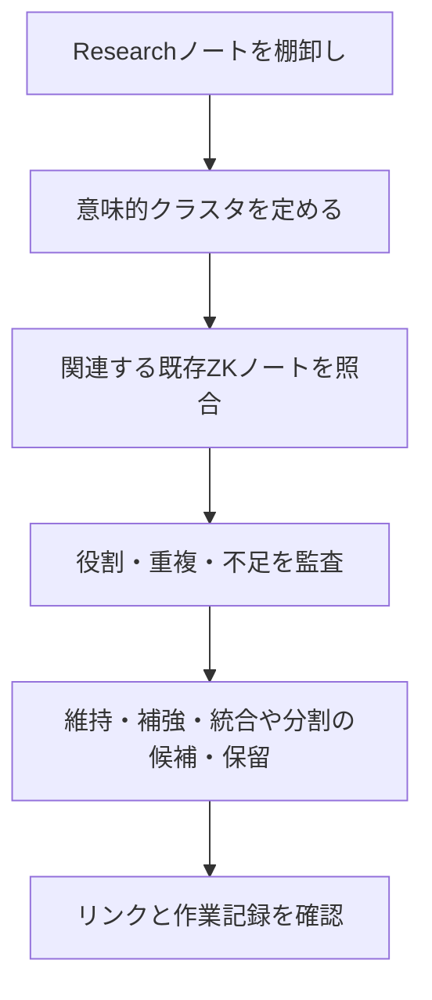

# ResearchとZettelkastenをクラスタ単位でリファクタリングする

> これは現在のリファクタリング運用が生まれた経緯と、初期の判断モデルを残す記録である。現行の作業手順・承認境界・完了条件は、Policy、Flow、各親クラスタ作業台を正本として確認する。

整理の単位は、Researchだけでも既存Zettelkastenだけでもない。同じ主題で結ばれるノート群をクラスタとして扱い、重複、補完関係、未整理の知識素材を一緒に確認する。

| 見る層 | 確認すること |
| --- | --- |
| 知識素材 | 出典、時点、未検証の情報 |
| 既存ノート | 主張、役割、重複、リンク |
| クラスタ | 近い主題をまとめる理由と境界 |
| 構造ノート | 読む順序と関係を説明できるか |
| 作業記録 | 判断、承認、未解決事項を追えるか |

既存ノートを機械的に昇格・降格・移動することは目的ではない。判断できない場合は保留し、ユーザー確認を優先する。
