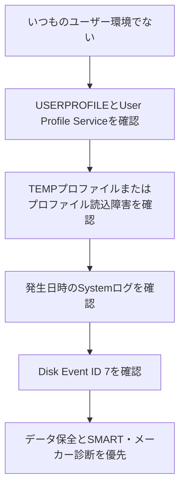

# WindowsのDiskイベントID 7とユーザープロファイル変更後の再発について

このノートは、Windowsのユーザープロファイル障害とDiskイベントID 7を、実際に観測した事実、そこから導いた仮説、AIと進めた確認手順に分けて残す。目的は、現在のストレージ故障を断定することではなく、同じような障害で何を観察し、どの順に安全確認したかを再利用できるようにすることである。

| 実際に確認したこと | 意味 |
| --- | --- |
| 旧アカウント使用中にDisk / Event ID 7が数日続き、1日100件以上発生した | ストレージI/O異常を優先して確認すべき材料 |
| 新しいWindowsユーザーアカウントへ移行した | ユーザー環境の切替が起きた |
| 約1か月後までID 7が発生していなかった | 新環境では再現していないという観測事実 |

AIと進めた切り分けは、次の流れだった。

旧プロファイルが頻繁にアクセスするファイルと問題領域が重なっていたためにID 7が多発し、新アカウントではその領域へアクセスしなくなった、という仮説は成り立つ。ただし、ID 7が止まったことだけでSSD/HDDが正常になったとは判断できない。SSD内部の代替処理、一時的I/O障害、問題領域への非アクセスなどもあり得る。

そのため、旧プロファイルを問題領域を塞ぐ安全策として残すのではなく、必要なら原因調査の比較対象として扱う。再発の有無を確認するだけでなく、重要データのバックアップ、直近のDisk関連イベント、SMART情報、メーカー診断を優先する。

## 関連ノート

- [Windowsプロファイル障害の確認・対処タイムライン](windows-profile-disk-incident-timeline.md)：実施済みの確認・処置と、提案段階の項目を時系列で区別する。
- [Windows障害の切り分け：症状から下位原因へ進む診断フロー](windows-troubleshooting-diagnostic-flow.md)：今回の経験から一般化した診断の考え方。
