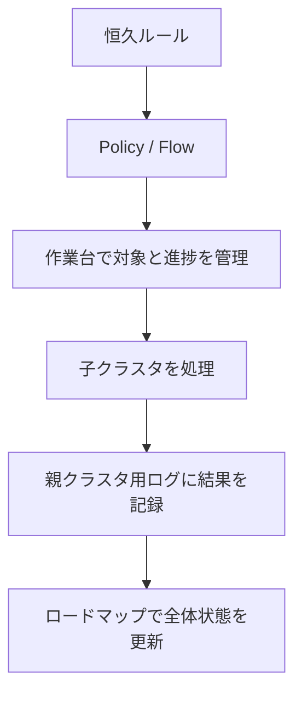

# Zettelkastenリファクタリングの作業管理記録を置く場所

Zettelkastenの長期リファクタリングでは、通常の知識ノートと、作業の進捗・判断・履歴を扱う管理記録を分ける。現在の作業管理領域は、次の構成で運用する。

```text
03_systems/
└─ research-zk-refactoring/
   ├─ research-zk-refactoring-policy.md
   ├─ Zettelkasten Refactoring Flow.md
   └─ work/
      ├─ research-zk-cluster-roadmap.md
      ├─ 親クラスタごとの作業台
      ├─ 親クラスタごとの作業ログ
      └─ 全体・内容別の台帳
```

この配置は、作業方法を定義する恒久ルールと、今回のリファクタリングに固有の進捗・履歴を分離するためのものである。現在の具体的な運用は、`research-zk-refactoring-policy.md`、`Zettelkasten Refactoring Flow.md`、各作業台、親クラスタ用ログを正本とする。

## 記録を分ける理由

作業管理を`30_Inbox`へ混在させると、未整理の知識と、リファクタリングのためだけに存在する作業物が区別しにくくなる。

| 種類 | 役割 | 保存先 |
| --- | --- | --- |
| 未整理のメモ・知識候補 | あとで判断・知識化する情報 | `30_Inbox` |
| 調査・資料 | 一次資料、調査結果、AI整理資料 | `31_Research` |
| Zettelkastenカード | Fleeting、Literature、Structure、Index等 | `32_Zk` |
| リファクタリングの恒久ルール | 目的、判断基準、手順 | `03_systems/research-zk-refactoring/` |
| リファクタリングの作業状態 | 対象一覧、進捗、作業台、親クラスタ用ログ | `03_systems/research-zk-refactoring/work/` |

`04_Context`はAI側のコンテキストであり、Zettelkasten側のフォルダ階層へ含めない。AI側とZK側は別ROOTとして扱い、番号の連続性から親子・兄弟関係を推測しない。

## ログの単位

ログを個別操作ごとにファイル化すると、判断経緯が分散し、再開時に必要な情報を探しにくくなる。一方で、Zettelkasten全体を一つの巨大なログにすると、再利用性が下がる。

そのため、記録単位は次のように分ける。

| 単位 | 役割 |
| --- | --- |
| 親クラスタ | 関連ノート群を扱う長期的な整理単位 |
| 子クラスタ | 内容監査・提案・実行・検証を行う基本単位 |
| Workスレッド | 会話上で共有する一時的な作業文脈 |
| 親クラスタ用ログ | 子クラスタごとの完了結果を蓄積する履歴ファイル |

原則は、**1子クラスタの完了 = 親クラスタ用ログへの1エントリ**、**1親クラスタ = 1つの親クラスタ用ログ**である。Workスレッドの開始・終了だけを理由にログファイルを増やさない。

各ログには、対象、実施した処理、主な判断、保留事項、次の対象を残す。操作の逐語的な履歴ではなく、後から作業状態を復元できる結果を記録する。

## 作業管理と長期ルールの関係



作業中に今後も繰り返し使う判断基準が確定した場合は、作業ログだけに閉じず、承認を得たうえで適切な恒久ルールへ反映する。個別の進捗、実施結果、保留事項は作業管理記録に留める。

## 現行の処理手順

子クラスタは、次の順序で扱う。

1. 対象ノートを読み、内容・関係・役割を監査する。
2. 変更候補を、対象・理由・影響が分かる一覧として提示する。
3. ユーザーの指示と必要な承認を受ける。
4. 承認範囲だけを実施し、YAML、リンク、内容保持を検証する。
5. 結果を一覧で提示し、ユーザー確認後に親クラスタ用ログと必要な管理情報を更新する。

統合、分割、削除、大きな本文再構成、title・type・draft・ファイル名の変更、移動は、`Obsidian Zettelkasten Ai Operations.md`に従って対象・理由・影響・退避方法を示し、必要な承認を得てから行う。

## `03_Work`案から現行構成へ

このノートの初稿では、作業管理専用の`03_Work`を新設する案を検討した。その狙いは、Inboxから作業管理物を分離することだった。

現在は、この目的を`03_systems/research-zk-refactoring/work/`で実現している。`03_Work`を追加で新設する必要はない。この判断は、管理領域を増やして役割を重複させず、恒久ルールと今回の実行記録を近接した構造で扱うためである。

## 判断記録

- 作業ログを「1作業1ファイル」にはしない。
- 作業結果は子クラスタ単位で記録し、ログファイルは親クラスタ単位で維持する。
- `30_Inbox`を作業管理専用の置き場にしない。
- 作業方法の正本と、現在の進捗・履歴の正本を混同しない。
- 作業管理領域の構造変更は、運用上の必要性と影響を示してから判断する。
