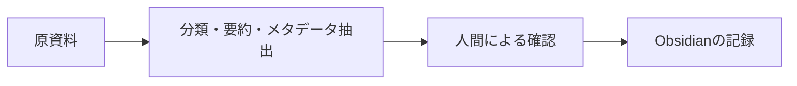

# AIサービスにおける性的・センシティブコンテンツのガードレール整理

## このノートの役割と時点

主要AIで性的・センシティブな内容を扱うとき、何が判断材料になり、情報整理ではどのように設計すればよいかをまとめる。元の調査は2026年9月時点の会話・資料に基づく。サービス別の可否は固定的な仕様ではなく、モデル、製品、国、機能、ポリシーで変わるため、実行時には公式資料を確認する。

2026年9月11日にOpenAIの公開Model Specを確認した。同資料は意図する振る舞いを示すもので、実運用モデルが完全に一致する保証ではないと明記している。一方、未成年の性的内容は架空・実在を問わず禁止し、成人の性的内容でも文脈と露骨さによって扱いが異なる、とする。[OpenAI Model Spec](https://model-spec.openai.com/2025-04-11.html) ほかのサービスの比較は、下記の調査時点の記録として残す。

## 結論：成人向けかどうかだけでは決まらない

AIの判定は「成人向け／一般向け」の二択ではなく、複数の軸の組合せで考える。

| 軸 | 確認すること |
| --- | --- |
| 年齢 | 成人、未成年、年齢不明・幼く見えるか |
| 実在性 | 架空人物か、実在人物か |
| 同意・プライバシー | 実在人物の同意、非合意の親密画像、ディープフェイクに関わるか |
| 露骨さ | 一般、露出、示唆的、性的、明示的のどこに近いか |
| 目的 | 医学・教育・研究・整理か、性的興奮目的か |
| 処理 | 新規生成、要約、分類、翻訳、検索、メタデータ抽出のどれか |
| 表現 | 2D、3DCG、フォトリアル、写真、動画のどれか |

このため、性教育、医学説明、成人産業の歴史、法規制、作品情報の整理は扱える余地がある一方、未成年の性的内容、非合意の性的加工、実在人物の脱衣・親密化、露骨な興奮目的の生成は強く制限される。

## 新規生成と既存資料の整理を分ける

元の議論で最も重要だったのは、同じ性的題材でも「何をさせるか」で扱いが変わる点である。

| 処理 | 例 | 判断上の注意 |
| --- | --- | --- |
| 新規生成 | 露骨な性交場面を書かせる | 強い制限を受けやすい |
| 既存資料の整理 | 登場人物、舞台、あらすじ、タグを抽出する | 入力、目的、年齢、出力の範囲を確認する |
| 変換 | 要約、翻訳、JSON化、Markdown化 | 新しい露骨表現を補わないことが重要 |
| 調査 | 産業、歴史、法規制、公開作品情報を調べる | 直接アクセスや興奮目的の探索とは区別する |

「整理なら必ず許可される」とは言えない。元の資料、出力の内容、サービスの安全設定、画像かテキストかによって結果は変わる。AIが拒否した場合は、回避を試すのではなく、研究・分類・情報管理という目的、対象年齢、文脈を明確にして依頼を見直す。

## 2D・実写・年齢の関係

成人の完全架空2Dでは、実在人物に伴う同意、肖像、プライバシー、リベンジポルノ、ディープフェイクの論点が少ない。しかし、2Dだから制限が消えるわけではない。露骨さと、未成年または若く見える表現が重要になる。

| 対象 | 主に追加で見る論点 |
| --- | --- |
| 成人の架空2D | 年齢の明確さ、露骨さ、性的示唆 |
| 3DCG・フォトリアルCG | 架空か実在かを区別しにくいこと |
| 実在人物の写真・動画 | 同意、プライバシー、性的加工、ディープフェイク |
| 未成年・年齢が曖昧な表現 | 架空・実在、2D・3Dを問わない強い安全上の制約 |

水着、グラビア、レースクイーン、コスプレのような境界的な表現も、「日本では一般流通している」ことだけではAIの扱いを決めない。衣装、ポーズ、露出、年齢感、文脈により、一般写真より示唆的と判定されることがある。

## 日本の区分とAIの安全分類のずれ

日本の「一般向け／18禁」と、AIの安全分類は同じものではない。元の検討では、AI側は `General → Revealing → Suggestive → Sexual → Explicit` のような連続的な見方に近い、と整理した。

そのため、日本では一般向けのグラビアやファンサービスでも、AIでは示唆的な表現として追加の安全処理が働く可能性がある。これは直ちにポルノ認定を意味しない。米国系のサービスが、法、未成年保護、アプリストア、決済、広告、ブランド、プライバシーなど複数の条件を考慮して、国別の慣習と一致しない共通寄りの線引きをするためである。

## 知識管理では原資料とメタデータを分ける

Obsidianなどで扱う場合は、原動画・原画像・原文を大量に複製するより、情報管理に必要なメタデータ、要約、出典、自分のメモを分けて残す。

```yaml
title:
creator:
publisher:
release_date:
media_type:
source:
content_rating:
sensitivity:
analysis_status:
tags:
```

成人向けだけの特殊形式ではなく、センシティブな資料全般に使える項目として設計する。`analysis_status` には `success`、`partial`、`blocked`、`review_required`、`error` などを置き、100件を処理しても全件が同じ結果になるとは見なさない。



センシティブな原資料を大量に扱う必要がある場合、クラウドAIに何を渡すかは、ポリシーだけでなく、プライバシー、データ保持、アカウント、アップロード範囲も考えて決める。一般情報・研究資料はクラウドで調査し、扱いに慎重さが必要な原資料はローカル処理を含めて検討する、という分業は候補になる。

## 拒否、再説明、回避を区別する

AIが一度拒否したことだけで、直ちに警告やアカウント停止を意味するわけではない。ただし、拒否された実在人物の性的加工や未成年性的内容を、言い換えやjailbreakで繰り返し出させようとする行為は、安全機構の回避として別の問題になる。

正当な再説明は、たとえば「成人の公開イベント写真を、性的評価ではなく水着・私服・ステージ衣装として分類したい」のように、目的、年齢、文脈を明確にすることである。これは制限解除を求めるのではなく、本来依頼したい情報整理の範囲を明示する行為である。

## 調査時点のサービス比較の扱い

当時はChatGPT、Claude、Gemini、Copilot、Grokを、成人向けの新規生成、研究・調査、既存資料の整理、画像の安全処理という軸で比較した。各社に差はあっても、未成年、非合意、実在人物の性的加工、保護機構の意図的回避を軽く扱えない点は共通する、と整理した。

この比較表を現行の機能一覧として利用しない。特定サービスの現在の可否が必要になった場合は、そのサービスの公式ポリシーを確認する。たとえば、Anthropicは未成年保護を含むポリシーを公開し、Microsoftは組織向けCopilotで性的資料を含む有害コンテンツ保護の扱いを説明し、xAIも実在人物の性的加工や保護機構の回避を禁止している。[Anthropic](https://www.anthropic.com/policy) [Microsoft](https://support.microsoft.com/en-us/microsoft-365-copilot/how-harmful-content-protection-works-in-microsoft-365-copilot-chat-and-agents) [xAI](https://x.ai/legal/acceptable-use-policy)

## まとめ

> センシティブな内容を扱うときは、成人向けかどうかだけで決めず、年齢、実在性、同意、露骨さ、目的、処理内容、媒体を分けて確認する。新規生成と既存資料の整理を混同せず、拒否されたときは回避ではなく目的と文脈の明確化へ戻る。
