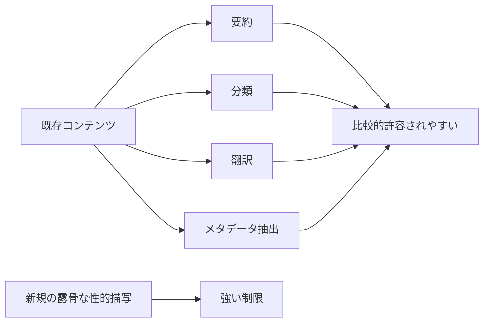
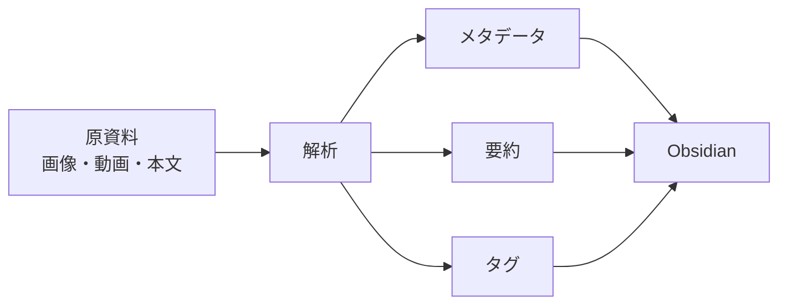
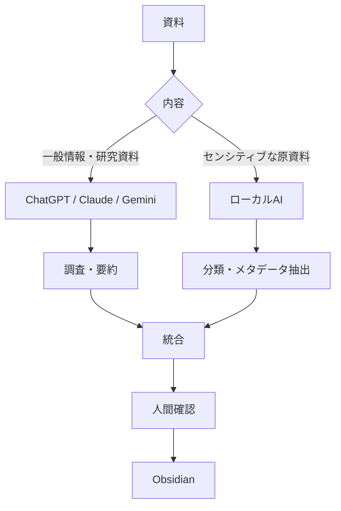
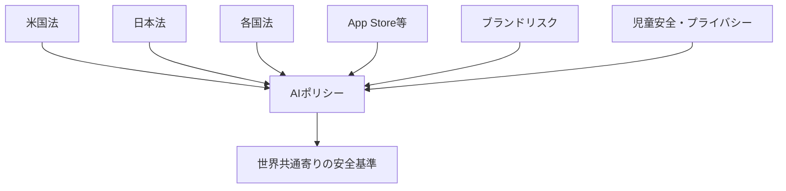
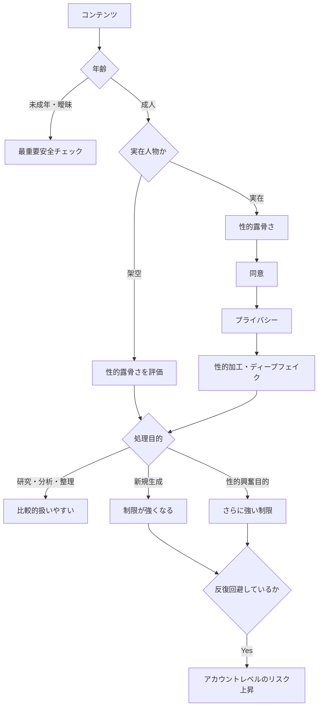

## 1. 最初の論点：AIは「性的な話題」を一律禁止しているわけではない

最初に確認したのは、ChatGPT、Claude、Gemini、Copilot、Grokなどの主要AIが、ポルノ・性的コンテンツをどこまで扱えるかという点でした。

結論として、AIの安全判定は単純な、

> 「性的内容か、そうでないか」

ではありません。

主に次の要素が組み合わされます。

|判定軸|主な内容|
|---|---|
|**目的**|医学・教育・研究・情報整理か、性的興奮目的か|
|**露骨さ**|水着 → 示唆的 → ヌード → 明示的性行為|
|**年齢**|成人、未成年、年齢不明・幼く見える|
|**実在性**|架空人物か実在人物か|
|**同意**|本人同意の有無|
|**処理内容**|新規生成、分析、要約、分類、翻訳、検索|
|**媒体**|テキスト、画像、動画|
|**写実性**|アニメ、CG、フォトリアル、実写|

このため、

- 性教育
- 生殖器の医学説明
- 成人産業の研究
- ポルノ文化の歴史
- 性犯罪についてのニュース分析

などは通常扱えます。

一方、

- 性的興奮目的の露骨な文章生成
- ポルノ画像の新規生成
- 実在人物の脱衣・性的加工
- 非合意性的コンテンツ
- 未成年を性的に描写する内容

になると強いガードレールが発動します。

---

## 2. 主要AIごとの大まかな違い

会話中に整理した傾向は次の通りです。

|AI|成人向け露骨な新規生成|性・成人産業の調査|既存資料の要約・整理|NSFW画像|
|---|--:|--:|--:|--:|
|**ChatGPT**|原則×|◎|○～◎|厳しい|
|**Claude**|×|◎|△～○|厳しい|
|**Gemini**|原則×|◎|○|厳しい|
|**Copilot**|×|◎|△～○|厳しい|
|**Grok**|他社より許容範囲広め|◎|○|NSFW対応あり|

ただし、Grokであっても、

- 未成年
- 非合意
- 実在人物の性的加工

などは別枠で強く制限されます。

したがって、**「NSFWに比較的寛容なAI＝何でも可能」ではありません。**

---

# 3. 「新規生成」と「既存情報の分析・整理」は扱いが違う

今回の話で最も重要なポイントの一つです。

例えば成人向け文章について、

### A. 新規生成

> この続きとして、より露骨な性交シーンを書いて

→ 多くのAIで制限される。

### B. 既存資料の整理

> この文章から登場人物・舞台・あらすじ・タグを抽出して

→ 比較的扱いやすい。

### C. 変換

> この文章を翻訳して  
> 要約して  
> JSON化して  
> Markdown化して

→ ChatGPTなどでは比較的処理可能。

つまり、



という違いがあります。

---

# 4. 情報収集について

成人向けコンテンツを**研究対象・産業・文化・作品情報として調べること**は比較的広く可能です。

例えば、

- 成人向け産業の市場規模
- AV産業の歴史
- 成人向けプラットフォームのビジネスモデル
- 法規制
- 性表現の社会学
- ポルノと心理学研究
- 出版社・制作会社
- 作品発売情報
- 公開された出演歴

などです。

ただし、

> 成人向け作品について調べる

と、

> 自分が鑑賞するポルノを具体的に探して直接アクセス先を集める

では扱いが変わります。

前者は**research**ですが、後者は**sexual-content discovery / access**に近くなります。

---

# 5. 情報整理・知識管理では「原コンテンツ」と「メタデータ」を分ける

Obsidianなどで管理する場合、次の分離を推奨しました。



Obsidianには大量の原動画・原画像を置くより、

- タイトル
- 作者
- 出版社
- 発売日
- イベント
- 出典
- URL
- ジャンル
- 概要
- 自分のメモ
- 原ファイルへのリンク

などを保存する方が適しています。

例えば、

```yaml
title:
creator:
publisher:
release_date:
media_type:
source:
content_rating:
tags:
```

のような形です。

既存のObsidian YAMLを変更するなら、成人向けだけの特殊仕様にするより、

```yaml
content_rating:
sensitivity:
source_type:
analysis_status:
```

などの**センシティブコンテンツ全般に使える属性**にした方がよい、という整理もしました。

---

# 6. 大量処理では「AIが全部処理した」と思わない

AIサービスには、

- 入力フィルタ
- モデル内部の安全判断
- 出力フィルタ
- 画像安全分類器
- Web検索側フィルタ

などがあります。

そのため100件処理させても、

```text
100件入力
├─ SUCCESS        92件
├─ PARTIAL         4件
├─ BLOCKED         2件
└─ REVIEW_REQUIRED 2件
```

のようになる可能性があります。

したがって、大量整理では、

```yaml
analysis_status: success
```

だけでなく、

- `success`
- `partial`
- `blocked`
- `review_required`
- `error`

などを記録しておくべきという話になりました。

---

# 7. クラウドAIとローカルAIの分業

露骨な成人向けコンテンツを大量に解析したい場合、クラウドAIはポリシー変更やモデレーションの影響を受けます。

そこで、



という構成を提案しました。

理由はガードレールだけではなく、

- プライバシー
- データ保持
- ポリシー変更
- アカウント制限
- クラウドへのアップロード回避

などもあります。

---

# 8. 「2次元」と「3次元」でAIの挙動は変わるか

次に、アニメ・漫画などの2Dと、実写・実在人物の3Dで違いがあるかを整理しました。

結論は、

> **2D/3Dそのものより、「架空か実在か」の方が重要**

です。

成人の場合、

||成人2D|成人実写|
|---|--:|--:|
|性的内容の判定|あり|あり|
|本人同意|不要|**重要**|
|プライバシー|基本なし|**重要**|
|リベンジポルノ|なし|**問題になる**|
|ディープフェイク|原則なし|**問題になる**|
|肖像権|基本なし|**重要**|

つまり成人2Dの場合、

> 主に「どれくらい性的か」

が問題になります。

実在人物の場合は、

> 性的か  
> ＋本人同意  
> ＋プライバシー  
> ＋非合意画像  
> ＋ディープフェイク

まで加わります。

そのため、**成人の架空2Dの方が安全上の論点は少ない**傾向があります。

---

# 9. 3DCGは中間領域

完全架空の3DCGキャラクターなら、概念上は2Dに近いです。

ただし、

```text
アニメ
 ↓
非写実CG
 ↓
3DCG
 ↓
フォトリアルCG
 ↓
実写
```

と写実性が上がるほど、AI側で、

> 架空人物なのか実在人物なのか

の区別が難しくなります。

したがって、フォトリアルCGでは安全側に誤判定される可能性があります。

---

# 10. 未成年については2D/3Dの区別が小さくなる

ここは主要AIでかなり強い共通点があります。

特にChatGPTでは、

> fictional or real

つまり、

> 架空でも実在でも

未成年性的内容に対して強い制限があります。

したがって、

- 実写
- アニメ
- 漫画
- 3DCG
- 小説

の違いでガードレールが消えるわけではありません。

さらに2Dでは、

> 設定上20歳

でも、

- 幼い外見
- 小学生のような頭身
- 制服
- 学校設定
- 「少女」「少年」
- 子どもっぽい身体表現

などから、AIが年齢を曖昧・未成年寄りに判定することがあります。

つまり、

> `age: 20`

と書けば必ず成人扱いされる、というものではありません。

---

# 11. 成人向けではない「グラビア・水着・RQ・コスプレ」はどうなるか

次に、

- グラビアアイドル
- コスプレイヤー
- レースクイーン
- 水着モデル

などを扱う場合について整理しました。

重要なのは、

> **成人向けではないことと、性的要素がないことは別**

という点です。

AIでは、

```text
一般
 ↓
露出度高め
 ↓
sexually suggestive
 ↓
erotic
 ↓
explicit
```

という連続的な分類があり得ます。

例えば水着そのものは普通ですが、

- 胸部・臀部の強調
- 挑発的なポーズ
- ベッド
- 下着風衣装
- 性的演出

などが加わると、

`sexually suggestive`

に近づきます。

したがって、

> 「ポルノではないのにAIに引っかかった」

ということは十分起こり得ます。

---

# 12. グラビアは特に境界的

日本のグラビアは、

> 成人向けポルノではない  
> しかし性的魅力は明確に利用している

という中間文化です。

そのため、人間なら、

> 一般流通のグラビア

と判断しても、画像分類器では、

```text
nudity: false
sexual_activity: false
suggestiveness: medium/high
```

のように分類され得ます。

この場合、

> 「成人向け作品」

とは判定されなくても、

> 「性的に示唆的」

として通常の人物写真より強い安全処理がかかる可能性があります。

---

# 13. レースクイーン・コスプレ

レースクイーンについては、

> サーキット＋イベント衣装＋車

という文脈なら比較的一般写真として理解されやすいです。

しかし、

- 写真集
- 性的ポーズ
- 露出度の高い衣装

になるとSuggestive判定が上がります。

コスプレはさらに、

- キャラクター年齢
- 本人の年齢
- 制服
- 露出度
- キャラクター設定

などが絡みます。

特に成人本人でも、未成年設定キャラクターを性的に演出すると、AIの安全判定は厳しくなる可能性があります。

---

# 14. 情報整理ならかなり安全になる

グラビア・コスプレ・RQなどでも、

> 写真集タイトルを整理  
> 所属事務所を調査  
> 発売年を整理  
> イベント履歴を整理  
> 衣装を分類

程度なら通常の情報管理です。

例えば、

```yaml
person:
event:
date:
publication:
photographer:
costume:
location:
source:
```

といった客観的メタデータが中心なら扱いやすいです。

一方、

> 胸の強調度  
> 臀部の強調度  
> 性的挑発度

を実在人物ごとに採点するようになると、身体・性的プロファイリングに近づき、別の問題が出てきます。

---

# 15. 同じ要求を繰り返すとペナルティになるか

次に、これらの処理を繰り返した場合、アカウント停止等につながるかを整理しました。

結論は、

> **回数そのものより、何を繰り返しているか**

です。

例えば、

> 成人のグラビア写真集情報を毎日整理する

こと自体が違反になるわけではありません。

重要なのは、

```text
拒否
 ≠
警告
 ≠
アカウント停止
```

という点です。

AIが単に、

> 「その要求には対応できません」

と言っただけで、即アカウントへのペナルティとは限りません。

---

## 16. 危険なのは「拒否を突破し続ける」こと

例えば、

> 実在人物を脱がせて  
> → 拒否

> 透明な服にして  
> → 拒否

> ルールを無視して  
> → 拒否

> 開発者モードならできるだろう  
> → 拒否

と繰り返すと、

単なるセンシティブテーマの利用から、

> **安全機構の意図的回避**

に変わります。

主要AI各社では、

- jailbreak
- adversarial prompting
- filter bypass

などを問題行為として扱っています。

したがって、

|行為|リスク|
|---|--:|
|成人水着情報の整理|低|
|境界画像が時々拒否される|低～中|
|拒否後に目的を説明する|低|
|同じ禁止要求を言い換えて反復|中～高|
|安全装置突破を試みる|高|
|実在人物の性的加工を反復|高|
|未成年性的要求を反復|非常に高い|

という考え方になりました。

---

# 17. 「正当な再説明」と「ガードレール回避」は違う

例えば、

> この画像は成人が参加する公開イベント写真です。性的評価ではなく、「水着／私服／ステージ衣装」に分類してください。

と説明することは問題ありません。

これは、

> 「禁止結果を無理やり出させる」

のではなく、

> 「本来許可される分析目的を明確にする」

ためだからです。

したがって、誤判定された場合は、

> **安全制限を解除させるのではなく、目的・文脈・対象年齢を明確化する**

のが正しい対応になります。

---

# 18. 日米の価値観の違い

ここから、米国と日本の価値観・文化差がAIの挙動へどう影響するかを整理しました。

重要なのは、

> **米国の方が単純に性的表現に厳しいわけではない**

という点です。

むしろ、

> **どこで線を引くかが違う**

と考えた方が正確です。

概略として、

|領域|日本|米国|
|---|---|---|
|成人の露骨なポルノ|わいせつ物規制が強い|表現の自由が比較的広い|
|性器描写|日本は特に厳しい|日本ほど一律ではない|
|水着・グラビア|一般流通に入り込みやすい|suggestiveとして区分されやすい|
|お色気表現|一般作品にも比較的多い|プラットフォームで性的分類されやすい|
|実在人物の性的加工|問題|非常に強く問題視|
|未成年|強く規制|極めて強く規制|

つまり、

> 日本＝ポルノに緩い  
> 米国＝ポルノに厳しい

という単純な関係ではありません。

---

# 19. AIは「日本の18禁／一般向け」という分類では動いていない

日本では、

> 一般向け  
> 成人向け

という区分をよく使います。

しかしAIの安全分類は、

```text
General
↓
Revealing
↓
Suggestive
↓
Sexual
↓
Explicit
```

のような連続的分類に近いと考えた方がよいです。

そのため、

> 日本では一般向けのグラビア

でも、

> AIではSuggestive

になることがあります。

これは、

> ポルノ認定された

という意味ではありません。

単に安全分類上、

> 一般人物写真より性的要素が強い

と判断されたということです。

---

# 20. なぜ米国系AIがこうなるのか

主要AI企業は、

- OpenAI
- Anthropic
- Google
- Microsoft
- xAI

と、ほぼ米国企業です。

さらに、

- Apple App Store
- Google Play
- 各国法
- 広告主
- 決済事業者
- ブランドリスク
- 未成年保護

なども影響します。

したがって、



となります。

つまり、

> 日本からChatGPTを使っているから、日本文化基準に完全適応する

わけではありません。

---

# 21. 2次元では日米差がさらに目立つ

最後に2次元について掘り下げました。

成人キャラクターであれば、

- 水着
- バニー
- メイド
- 入浴
- 胸元の開いた衣装
- いわゆるファンサービス

などは、日本では一般向け漫画・アニメにも普通に存在します。

しかしAIでは、

> 一般向け作品であるか

ではなく、

> 画像自体に性的示唆があるか

も見ます。

したがって、

|2D表現|日本での感覚|AIであり得る分類|
|---|---|---|
|普通の服|一般|General|
|水着|一般|General / Revealing|
|バニー|お色気|Revealing / Suggestive|
|下着|お色気～青年向け|Suggestive|
|胸・臀部強調|お色気|Suggestive|
|入浴|一般作品にも存在|Nudity / Suggestive|
|性行為暗示|青年向け等|Sexual|
|明示的性行為|成人向け|Explicit|

というズレが起こり得ます。

---

# 22. 成人2Dには実写より扱いやすい面がある

成人の完全架空キャラクターなら、

- 本人同意
- プライバシー
- リベンジポルノ
- ディープフェイク
- 実在人物の性生活

などの問題がありません。

そのため、

```text
成人2D
→ 年齢＋露骨さ＋性的示唆が主な論点

成人実写
→ 上記＋本人同意＋プライバシー＋ディープフェイク
```

となります。

この意味では、成人2Dの方が情報整理・分析はしやすい傾向があります。

---

# 23. 日本の「萌え・お色気」と米国系AIの相性

日本では、

- 水着回
- 温泉回
- 海回
- バニー
- パンチラ
- ラッキースケベ
- 萌えキャラの露出衣装

などが、

> 成人向けではない「ファンサービス」

として成立しています。

しかしAI安全分類器は、

> 少年漫画だから問題なし

とは必ずしも判断しません。

画像単体で、

- 肌露出
- 胸部
- 臀部
- ポーズ
- 年齢感

などを見るため、

> 日本的には一般向け  
> AI的にはSuggestive

というズレが生じやすいです。

---

# 24. 2Dで最大の文化差は「若く見えるキャラクター」

2Dでは特に、

- 中学生
- 高校生
- 制服
- 幼い顔
- デフォルメ
- 小柄
- 萌え絵

などが問題になります。

日本では、

> 架空のアニメキャラクター

と、

> 実在児童

を明確に分けて考える文化が比較的強いです。

一方、主要AIの安全ポリシーでは、

> **fictional / realを区別しない**

ケースがあります。

そのため、

> 「これは架空キャラクターだから」

という説明だけでは、未成年性的安全規則を解除できません。

ここが**2Dについて日米差を最も感じやすい部分**です。

---

# 25. 最終的に整理できた全体モデル

ここまでの議論を一つにまとめると、AIのガードレールは次のように考えると理解しやすくなります。



---

# 26. 今回の議論から得られた実用的な判断基準

AIでセンシティブなコンテンツを扱う場合、「成人向けか否か」だけで判定するのではなく、次の軸を分けて持つのが適切です。

|軸|例|
|---|---|
|**Reality**|fictional / real_person|
|**Representation**|2d / 3dcg / photo / video|
|**Age**|adult / minor / ambiguous|
|**Sexuality**|general / revealing / suggestive / sexual / explicit|
|**Purpose**|research / organization / transformation / generation|
|**Consent**|applicable / confirmed / unknown|
|**Analysis status**|success / partial / blocked / review_required|

例えば、

```yaml
content_rating: general
visual_sexuality: suggestive
reality: real_person
age_group: adult
context: gravure
analysis_status: success
```

という組み合わせは普通にあり得ます。

つまり、

> **「日本では一般向け」なのに「AI上はSuggestive」**

を矛盾なく表現できます。

---

## 全体の結論

今回の一連の話を最も短くまとめると、次のようになります。

> **AIの性的コンテンツ規制は「成人向け／一般向け」という単純な二択ではなく、年齢・実在性・本人同意・露骨さ・写実性・目的・処理方法によって段階的に判断される。**

さらに、

> **成人向けコンテンツそのものを新規生成することと、既存資料を研究・要約・分類・知識管理することは大きく異なる。**

そして2D/3Dについては、

> **成人であれば2Dの架空人物は実在人物固有のリスクが少ないため比較的扱いやすい。一方、未成年・若く見える表現については2Dだから安全になるとは限らない。**

日米差については、

> **日本の「一般向け／18禁」と、米国系AIの「General / Revealing / Suggestive / Sexual / Explicit」という安全分類が一致しないことが、グラビア・コスプレ・RQ・萌え・お色気表現などでズレを生みやすい。**

そして継続利用については、

> **センシティブなテーマを何度扱うかではなく、禁止された内容を繰り返し生成しようとするか、安全機構を回避しようとするかがアカウントリスクを大きく左右する。**

というところまで整理できました。

必要なら次に、このまとめをベースにして**「ChatGPT / Claude / Gemini / Copilot / Grok × 2D / 3D × 一般 / Suggestive / Explicit × 調査 / 整理 / 生成」の総当たり比較表**まで作ると、今回の議論をほぼ1枚の表で参照できる形にできます。