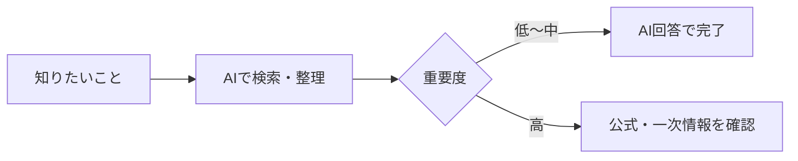
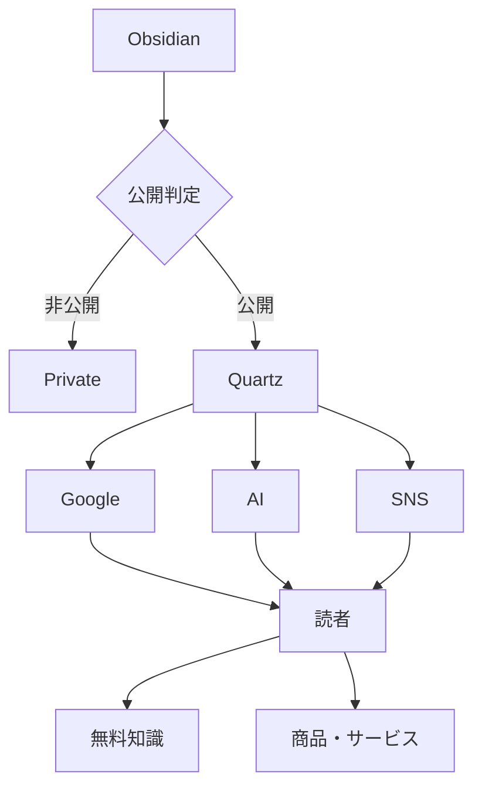
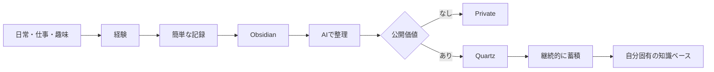
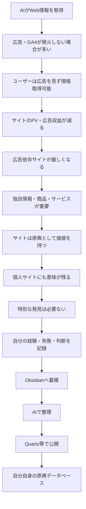

## 1. このチャットで考えた主題

今回の話は、もともと次の疑問から始まった。

> ChatGPTなどのAIが、まとめサイトやブログなどから情報を取得した場合、サイト側の広告やアクセス解析はどのように扱われるのか。

そこから話を発展させ、最終的には次の4つのテーマを整理した。

1. **AIによるWebアクセスと、AdSense・GA4などの計測の関係**
2. **広告を避けたいユーザーがAIをどう使えば効率よくWeb情報を得られるか**
3. **AIによってPVや広告収益を奪われるサイト運営者が、今後どう収益化するか**
4. **AI時代に個人サイトを持つ意味と、「自分自身の原典データベース」をどう育てるか**

全体を一言でまとめると、

> **AIは、ユーザーにとってはWeb上の広告や冗長な情報を飛ばして必要な情報だけ取得する手段になり、サイト運営者にとっては従来の「検索→PV→広告収益」モデルを根本から揺さぶる存在になっている。**

という話である。

---

## 2. AIがサイトを読むと、広告やGA4はどうなるのか

まず、人間による通常のWeb閲覧と、AIによる情報取得は同じではない。

### 通常の人間による閲覧

人間がChromeやSafariなどでサイトを開く場合は、

```text
ページ表示
↓
JavaScript実行
↓
GA4
↓
Google Tag Manager
↓
AdSense
↓
広告表示
↓
Cookie・各種計測
```

という流れになる。

そのため通常は、

- GA4のページビュー
- イベント
- 広告インプレッション
- 広告クリック
- アフィリエイト
- コンバージョン

などが計測される。

### AIクローラーやAIによるページ取得

AIは必ずしも通常のブラウザのようにページを表示するわけではない。

典型的には、

```text
AI
↓
HTTPでHTML取得
↓
本文抽出
↓
必要情報を取得
↓
終了
```

となる。

この場合、

- JavaScriptを実行しない
- GA4が発火しない
- AdSenseが表示されない
- 広告インプレッションにならない
- 広告クリックも発生しない

ことが多い。

そのため、

> AIが100回ページを取得しても、GA4では0PVに近い

ということもあり得る。

一方で、サーバーやCDN側にはHTTPリクエストそのものが届いているため、

- nginx / Apacheログ
- Cloudflare
- WAF
- CDNログ
- CloudFront
- ホスティングサービスのアクセスログ

などには残る可能性がある。

### 整理

|アクセス方法|サーバーログ|GA4|AdSense|広告収益|
|---|--:|--:|--:|--:|
|人間がブラウザ閲覧|○|○|○|○|
|AIクローラー|○|△〜×|基本×|基本×|
|AIが検索時にページ取得|○の場合あり|△〜×|基本×|基本×|
|AI回答のリンクを人間がクリック|○|○|○|○|

つまり、

> **AIがページを読むことと、人間がページを見ることは広告ビジネス上まったく別物**

と理解する必要がある。

---

## 3. AIから実際にユーザーがサイトへ来れば、通常の広告モデルに戻る

AIがサイト情報を取得して回答しただけでは、サイト側の広告収益にはほとんどつながらない。

しかし、

```text
ChatGPT
↓
出典リンク
↓
ユーザーがクリック
↓
通常のブラウザ
↓
サイト表示
```

となれば、そこからは通常のWebアクセスである。

そのため、

- GA4
- AdSense
- Cookie
- アフィリエイト
- コンバージョン計測

などが通常通り動く可能性がある。

ここから、

> **AIに読ませること自体ではなく、「AIから人を送ってもらえるか」が運営者側にとって重要**

という話につながった。

---

## 4. AIクローラーも用途によって違う

ChatGPT関連でも、すべてのAIアクセスが同じ目的ではない。

概念的には、

- AI検索用
- モデル学習・改善用
- ユーザーの要求に応じた取得

などを分けて考える必要がある。

例えばOpenAIでは、

- `OAI-SearchBot`
- `GPTBot`

などを別に管理できる。

そのためサイト運営者は、

```text
AI検索への掲載
→ 許可

モデル学習
→ 拒否
```

というような方針を取ることも可能になる。

今後は、

> **AI全部許可 / 全部拒否**

ではなく、

> **用途別にAIアクセスをコントロールする**

方向が重要になる。

---

# 5. ユーザー側：広告を避けながら効率よく情報を取得する方法

ユーザーから見ると、現在のWebは広告や追跡、SEO目的の冗長な文章が多い。

従来の情報取得は、

```text
Google検索
↓
サイト
↓
Cookieバナー
↓
ポップアップ
↓
広告
↓
スクロール
↓
記事本文
↓
欲しい情報を探す
```

という流れになりやすい。

AIを利用すると、

```text
質問
↓
AIが複数サイトを検索
↓
必要情報を抽出
↓
比較
↓
整理
↓
出典確認
```

に変えられる。

## 推奨した3段階の使い方

### レベル1：AIだけで情報収集

例えば、

- 用語の意味
- 複数商品の違い
- ニュース概要
- サービス比較
- 一般的なHow-to

などをAIに調査させる。

サイトを直接開く回数を減らせる。

### レベル2：URLをAIに渡して抽出

例えば、

> このページから「料金」「対象者」「注意事項」だけ抜き出して。

とする。

そうすれば、1万文字あるページから必要な数百文字だけ取得できる。

### レベル3：重要な内容だけ原典確認

次のようなものはAI回答だけで完結させない。

- 法律
- 医療
- 金融
- 契約
- 利用規約
- 行政情報
- 正確な料金
- 製品仕様
- 研究論文
- 重要な一次報道

つまり、



という使い方が効率的。

---

## 6. AIは「広告ブロッカー」より一段上の役割を持つ

広告ブロッカーは、

> ページを開いた上で広告を消す

仕組みである。

一方AIは、

> **そもそもページを人間が開かずに、必要情報だけ取り出す**

という使い方ができる。

そのため、

```text
広告ブロッカー
＝ Webページは見る

AI
＝ Webページを見る工程自体を減らす
```

という違いがある。

これはユーザー側には非常に便利だが、運営者側には大きな問題になる。

---

# 7. サイト運営者側：AI時代の問題

従来のWeb広告モデルは、

```text
Google検索
↓
ユーザー
↓
サイト
↓
広告
↓
広告収益
```

だった。

ところがAI時代は、

```text
サイト
↓
AIが情報取得
↓
AIが回答
↓
ユーザーはAI内で完結
```

となる可能性がある。

その場合、

- コンテンツは利用される
- サイトへの人間のPVは増えない
- GA4も増えない
- 広告表示されない
- 広告収入も入らない

という問題が起きる。

特に危険なのは、

> **他人の情報を整理し、検索流入を集め、そのページに広告を置く**

タイプのビジネスモデルである。

---

# 8. AI時代に厳しいサイトと強いサイト

大きく4種類に分けて検討した。

|サイト|AI代替リスク|将来性|
|---|--:|--:|
|まとめサイト|非常に高い|△〜×|
|個人ブログ|内容次第|△〜○|
|専門情報サイト|比較的低い|◎|
|企業オウンドメディア|比較的低い|◎|

## まとめサイト

最も影響を受けやすい。

例えば、

- おすすめ○選
- ○○とは
- ○○と△△の違い
- 芸能人プロフィールまとめ
- イベント日程まとめ

など。

AI自身が、

- 検索
- 要約
- 比較
- 条件絞り込み
- 再質問

までできるため、単純なまとめ記事の価値が薄れる。

### 生き残る条件

- 独自取材
- 実測
- 独自写真
- 独自ランキング
- 編集部レビュー
- データベース
- 現地確認

などが必要。

---

## 9. 個人ブログは二極化する

### AIに弱いブログ

```text
ネットで調べる
↓
要約
↓
記事を書く
```

タイプ。

例えば、

> ChatGPTとは  
> おすすめAI10選  
> 京都おすすめ観光地

など。

AI自身に書かせられるため、競争力が低い。

### AIに強いブログ

```text
自分が実際にやる
↓
記録
↓
考察
↓
公開
```

タイプ。

例えば、

- 実際に使ったレビュー
- 失敗記録
- 展覧会で見た感想
- 長期使用レビュー
- 実験
- 制作過程
- 運用変更履歴

など。

ここでは**Experience＝本人の経験**が価値になる。

---

# 10. 専門情報サイトはAI時代でも強い

例えば、

- 建築
- 製造
- 化学
- 法律
- 医療
- 金融
- 業界統計
- 技術情報

など。

一般論はAIに要約されても、

- 製品仕様
- 試験結果
- 技術資料
- 独自統計
- ケーススタディ
- 施工要領
- 実測
- 専門家見解

などは原典が必要になる。

AI自身も正確な回答をするためには、その専門サイトを参照しなければならない。

つまり、

> **人間だけでなく、AIからも参照される原典になる**

ことに価値がある。

---

# 11. 企業オウンドメディアは比較的強い

企業サイトは、そもそも広告PVだけが目的ではない。

例えば、

```text
技術記事
↓
製品ページ
↓
問い合わせ
↓
商談
↓
購入
```

という流れがある。

したがって、

```text
100,000PV
↓
広告収益
```

ではなく、

```text
1,000PV
↓
問い合わせ10件
↓
成約
```

でも成立する。

AIが企業の商品や技術情報を紹介してくれれば、

```text
AI
↓
企業サイト
↓
問い合わせ・購入
```

という新しい流入経路にもなり得る。

---

# 12. サイト運営者が取れる対策

大きく6つ挙げた。

## ① AIをブロックする

robots.txtやCDNなどでAIクローラーを拒否する。

ただし、

```text
AIを拒否
↓
AIに引用されない
↓
AIからの流入も失う
```

というデメリットがある。

そのため全面拒否が最善とは限らない。

---

## ② AIに見せる範囲を制御する

例えば、

```text
概要
タイトル
基本情報
↓
AIに公開

詳細分析
独自データ
有料情報
↓
サイトで提供
```

という構造。

検索・AIへの露出と、高価値情報の保護を分ける。

---

## ③ AIを送客装置として使う

従来のGoogle検索と同じように、

```text
AI回答
↓
出典
↓
サイト訪問
```

を狙う。

この考え方が、

- AEO
- GEO
- LLMO

などと呼ばれている領域につながる。

ただし、単なるAI向けSEOテクニックではなく、

- 一次情報
- 独自データ
- 明確な数字
- 著者
- 更新日
- 出典
- 専門性

などの方が重要。

---

## ④ 広告以外の収益を増やす

今後最も重要。

```text
広告100%
```

から、

```text
広告
+
アフィリエイト
+
有料会員
+
有料記事
+
商品
+
サービス
+
スポンサー
+
データ
+
API
+
ライセンス
```

へ分散する。

### AI時代との相性

|収益方法|相性|
|---|--:|
|AdSense|△|
|PV型広告|△|
|アフィリエイト|○|
|スポンサー|◎|
|会員|◎|
|商品販売|◎|
|サービス|◎|
|データ提供|◎|
|API|◎|

重要なのは、

> **PVそのものを商品にしない**

ことである。

---

## ⑤ AIクローラーから課金する

CloudflareのPay Per Crawlのように、

```text
AIがページ要求
↓
料金提示
↓
支払い
↓
コンテンツ取得
```

というモデルも出てきている。

これは、

> 「人間を送客してくれないなら、コンテンツ取得自体に料金を払ってもらう」

という考え方。

今後、AI企業とメディアの関係で重要になる可能性がある。

---

## ⑥ AIでは代替できないものを作る

最も本質的な対策。

AIが得意なのは、

> 文章で説明できる一般情報

である。

AIだけでは代替しにくいものは、

- 独自データベース
- 計算ツール
- シミュレーター
- 比較機能
- コミュニティ
- 掲示板
- 写真
- 動画
- インタラクティブ機能
- 商品
- SaaS
- テンプレート
- ダウンロードデータ

など。

つまりサイトを、

> 情報を読む場所

から、

> **何かをする場所**

へ変えていく。

---

# 13. AI時代に個人サイトを作る意味はあるのか

結論として、

> **ある。ただし目的が変わる。**

従来は、

```text
検索
↓
PV
↓
広告
```

だった。

今後は、

```text
自分の知識
↓
公開
↓
Google
ChatGPT
Gemini
SNS
↓
読者
↓
信用・仕事・販売・引用
```

という位置付けになる。

個人サイトは、

> 広告媒体

というより、

> **自分自身が所有するWeb上の知識基盤**

として価値を持つ。

---

# 14. Obsidian＋Quartzとの相性

Obsidianで普段から知識を蓄積している場合、

```text
調査
↓
Obsidian
↓
整理
↓
公開可能なものだけ
↓
Quartz
```

という構成ができる。

これは、

> 公開するために毎回ブログ記事を書く

のではなく、

> **普段の知識管理の一部をWebへ公開する**

という考え方になる。

そのため「ブログ」よりも、

> Personal Knowledge Website  
> Digital Garden  
> 公開Knowledge Base

と考えた方が近い。

---

# 15. 公開情報は3層に分ける

## Layer 1：Private

Obsidianだけ。

- 個人情報
- 仕事上の機密
- 未整理メモ
- パスワード
- 他人に関する情報

## Layer 2：Public Knowledge

Quartzへ公開。

- 調査
- AI活用
- Excel
- Power Query
- VBA
- Obsidian
- デザイン
- 展覧会記録
- 技術メモ
- 制作記録

## Layer 3：High Value

別途収益化。

- 有料データ
- テンプレート
- ツール
- 教材
- レポート
- サービス
- コンサル



---

# 16. 個人サイトでAdSenseを主目的にしない理由

主な理由は3つ。

1. **PV依存になる**
2. **読者体験を悪化させる**
3. **より高価値な収益経路がある**

例えば、

```text
1万PV
↓
広告
```

より、

```text
専門記事100PV
↓
問い合わせ
↓
仕事・購入
```

の方が価値が高い場合もある。

そのため広告は、

> 主収益

ではなく、

> 副収入

として扱う方が合理的。

---

# 17. 「自分自身の原典データベース」とは何か

ここで最後に問題になったのが、

> 原典を作れるような特別な人でなければ難しいのではないか。

という疑問。

これに対して重要だったのは、

> **原典＝世界初の発見ではない**

という整理。

必要なのは、

> **自分が直接確認した情報**

である。

---

## 18. 凡人でも作れる原典

例えば、

|一般的なまとめ|自分の原典になり得るもの|
|---|---|
|ChatGPTの使い方|自分の設定・失敗・改善|
|美術作品解説|実際に見た感想・観察|
|Power Query入門|実務エラーと解決|
|商品まとめ|半年間使用した記録|
|Obsidian設定|実際に残った運用ルール|
|AI比較|同条件で比較した結果|

つまり、

> **独自情報を発明する必要はない。**

重要なのは、

> **自分の経験を捨てずに記録すること**

である。

---

# 19. 「独自情報」ではなく「独自記録」を作る

考え方を、

```text
独自コンテンツを作る
```

から、

```text
自分がやったことを記録する
```

へ変える。

例えば、

```text
調べた
↓
試した
↓
結果
↓
失敗
↓
修正
↓
記録
```

この積み重ね自体が原典になる。

---

# 20. 原典には段階がある

## Level 1：観察

- 行った
- 見た
- 使った
- 失敗した

## Level 2：比較

同じ条件で複数のものを試す。

例：

> 同じ文章をChatGPT・Claude・Geminiに要約させた。

## Level 3：経過記録

時間を追う。

例：

> Obsidian運用を半年続け、残ったルール・廃止したルールを記録。

## Level 4：小規模データ

例えば、

```text
日付
AI
タスク
処理時間
成功/失敗
修正回数
感想
```

を数十件残す。

そうすると、

> 単なる感想

から、

> **個人の小規模実験データ**

になる。

---

# 21. AI時代には普通の人の実体験が逆に価値を持つ

AIは、

- 一般論
- 解説
- 要約
- 比較表
- SEO記事

を大量生成できる。

一方でAIは、

> 「自分が実際に2026年9月に試して失敗した」

という事実を持てない。

今後、

```text
AI生成一般論
AI生成一般論
AI生成一般論
```

がWeb上に増えるほど、

```text
実際にやった
↓
失敗した
↓
直した
↓
半年後こうなった
```

という情報の相対価値が高くなる可能性がある。

---

# 22. 専門家になる前から記録する

従来の考え方：

```text
勉強
↓
専門家
↓
発信
```

では時間がかかる。

代わりに、

```text
初心者
↓
試す
↓
記録
↓
少し詳しくなる
↓
また試す
↓
記録
```

とする。

初心者時代の失敗は、後から専門家になっても再現しにくい。

そのため、

> **学習過程自体も一次情報になる。**

---

# 23. 原典を作るための最低限の記録形式

何か意味のあることをしたら、最低限次の5項目を残す。

```markdown
## やったこと
何をしたか

## なぜやったか
目的

## 結果
どうなったか

## 気づいたこと
予想と違った点

## 次回
次に変えること
```

これだけでも十分。

---

# 24. AIの役割は「原典を作る」ことではない

悪い使い方：

```text
AI
↓
記事生成
↓
そのまま公開
```

これではAI生成コンテンツが増えるだけ。

良い使い方：

```text
自分
↓
経験
↓
雑なメモ
↓
AI
↓
整理・構造化
↓
自分が確認
↓
公開
```

役割分担としては、

> **人間＝事実・経験を提供する**
> 
> **AI＝編集・整理・分析コストを下げる**

という構造が適切。

---

# 25. 凡人が狙うべき5種類の一次情報

特別な才能がなくても、次の5つは作れる。

- **実測**：自分で測った
- **実践**：自分でやった
- **経過**：時間を追った
- **失敗**：何がダメだったか
- **判断**：なぜその選択をしたか

この5つだけでも、単純なまとめサイトとの差になる。

---

# 26. 最も重要なのは「累積」

1記事で強い内容を作る必要はない。

例えば、

```text
2026/09
Obsidian設定変更

2026/10
問題発生

2026/11
修正

2027/02
不要ルール削除

2027/06
10か月レビュー
```

と残す。

すると、

> 「10か月実際に運用した記録」

になる。

これはAIが一瞬で生成できない。

**時間経過そのものがデータになる。**

---

# 27. 原典データベースの最終的な意味

このチャットで最終的に整理した「自分自身の原典データベース」とは、

> **世界初の研究や特別な発見を集めたデータベースではなく、自分が人生・仕事・趣味の中で実際に確認した事実・経験・判断を、再利用できる状態で蓄積したもの。**

という意味である。



重要なのは、

> **コンテンツを作るためだけに新しい活動を大量に増やすのではなく、すでにやっている活動から情報を捨てずに残すこと。**

である。

---

# 28. 今回の議論全体を一つの流れにすると



---

# 29. 最終的な結論

今回の議論から導かれた結論は、大きく3点。

### ユーザー側

AIを、

> **検索＋閲覧＋要約＋比較の中間レイヤー**

として利用すれば、広告や冗長なWebページを直接見る回数を大幅に減らせる。

ただし重要情報は必ず原典を確認する。

### サイト運営者側

従来の、

> SEO → PV → AdSense

だけでは今後リスクが高い。

代わりに、

- 一次情報
- 独自データ
- 専門性
- 商品
- サービス
- 会員
- ツール
- AIからの送客
- AIへのコンテンツ提供

などへ価値を移す必要がある。

### 個人サイト側

個人がサイトを持つ目的は、

> 広告収入を得ること

から、

> **自分の経験・知識・判断の原典をWeb上に持つこと**

へ変わっていく。

そして、凡人がそこで必要なのは「世界初の発見」ではない。

> **日常の経験を記録し続けること。**

その蓄積をAIで整理・分析し、公開可能なものをQuartzなどでWebへ出す。

これが、

> **AI時代における個人のKnowledge Base／原典データベース**

という考え方になる。

このまとめは、このままObsidianのResearchノートとして保存できる粒度になっています。必要であれば次に、**「A4 1枚程度の要約版」**または**「Obsidian向けYAML付きノート形式」**に圧縮できます。