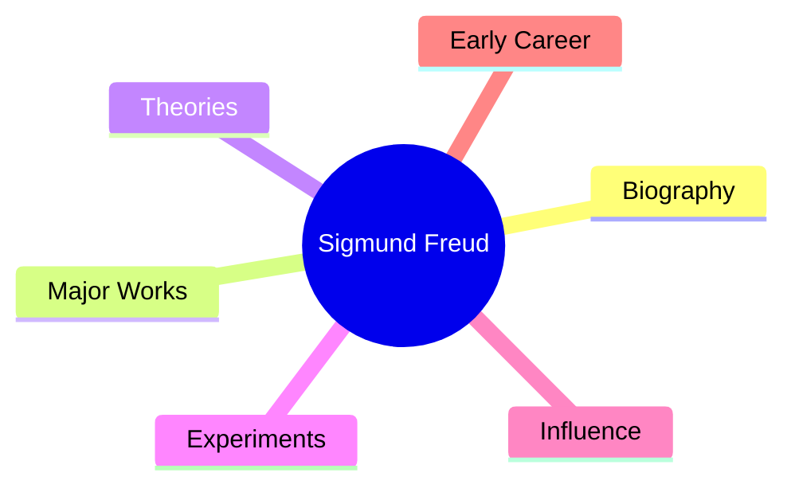
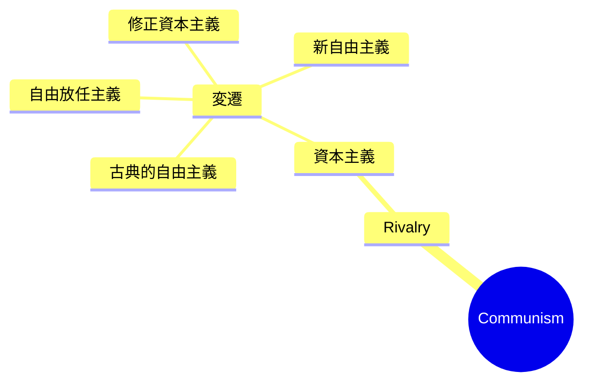
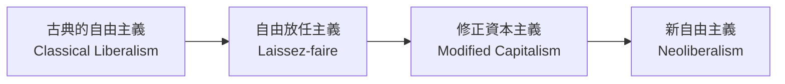
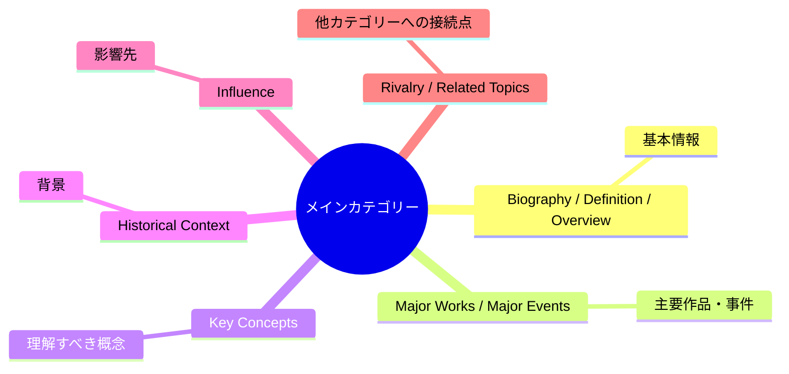
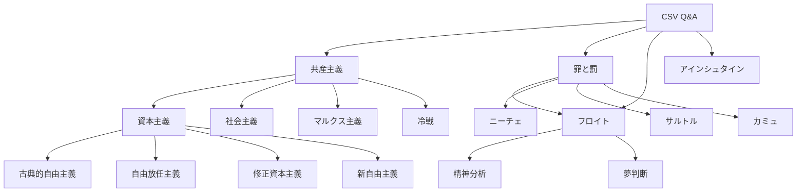

# CSV学習データを使った対話学習・マインドマップ作成の整理

## 1. このチャットでやりたかったこと

このチャットの中心目的は、アップロードしたCSV「1日1ページ - 世界の教養_現代編.csv」を単なるデータ加工対象として扱うのではなく、**学習素材として活用すること**だった。

最初はCSV内の`question`と`answer`を使って、ChatGPTを相手にクイズ形式で学習することを試した。その後、より体系的に知識を整理する方向へ進み、`category`ごとに質問と回答をまとめ、**Mermaid記法のマインドマップとして整理する運用**へ発展した。

最終的には、単にCSVのQ&Aをそのまま並べるのではなく、

- 同じ意味の質問を統合する
- 人物・作品・思想・歴史・影響関係などに分類する
- `remarks`の情報も必要に応じて取り込む
- 関連する別テーマへの接続点も残す
- Obsidian等で将来的にタグ・相互リンクとして再利用できる構造にする

という方向性が明確になった。


---

## 2. CSVデータの構造と理解

何度かCSVを再アップロードしながら内容を確認した。最新版では主に次の列が存在していた。

|列名|内容|
|---|---|
|`anki_uid`|各問題の一意ID|
|`question`|学習用の問題|
|`answer`|問題の答え|
|`remarks`|補足・備考|
|`img_url`|画像URL|
|`question_type`|問題タイプ|
|`category`|問題をまとめる主要カテゴリー|
|`c_uid`|カテゴリー内の識別コード|
|`tag`|タグ|
|`day`|日単位の分類|
|`day_series_number`|日内シリアル番号|
|`shared_img_url`|共有用画像URL|

特にこのチャットでは、

**`category` → `question` → `answer` → `remarks`**

の4項目が重要だった。

カテゴリーとして確認されたものには、たとえば以下があった。

`ジークムント・フロイト`、`フョードル・ドストエフスキー`、`ピョートル・イリイチ・チャイコフスキー`、`リュミエール兄弟`、`共産主義`、`ジェームズ・ネイスミス`、`コニーアイランド`、`アルベルト・アインシュタイン`、`アンナ・カレーニナ`、`スコットジョプリン`、`ラッダイト`、`サイ・ヤング`、`麻雀`、`パブロ・ピカソ`、`ウィリアム・バトラー・イェーツ`、`アルノルト・シェーンベルク`、`チャーリー・チャップリン`、`シオニズム`、`ジム・ソープ`など。

途中でCSVが更新され、`罪と罰`というカテゴリーも登場した。

---

## 3. 最初に行った「対話型学習」

最初はフロイトに関する問題から始めた。

たとえば、

- 「20世紀に精神分析を確立した精神科医は？」
- 「『自我とエス』の著者は？」
- 「フロイトの最も有名な著書は？」
- 「『自我とエス』における原始的な衝動の部位は？」
- 「現実と相互作用する意識とは？」

といった問題を出題した。

回答では、

- ジークムント・フロイト
- 『夢判断』
- エス（イド）
- 自我（エゴ）
- スーパーエゴ

などを確認した。

ただし途中から、ChatGPT側がCSVにない独自問題を出したり、フロイトだけに話題を固定してしまった。そのためユーザーから、

**「フロイトの問題から離れろというのは、他のカテゴリーの問題も出せという意味」**

と修正が入った。

ここで重要な方針が確定した。

> CSVをベースに学習するのであり、特定カテゴリーだけに固定しない。

---

## 4. マインドマップ作成への移行

その後、学習方法を単純なクイズから、**知識を構造化するマインドマップ**へ発展させた。

最初に「ジークムント・フロイト」カテゴリーの`question`と`answer`を抽出し、そのまま質問→回答として並べたMermaidを作成したが、それではマインドマップとして不自然だった。

そこでユーザーから、

> 「マインドマップにふさわしい形に整理してから書いて」

という修正が入った。

以降は、質問文そのものをノードにせず、知識を意味単位でまとめる形式に変えた。

たとえばフロイトなら、



というような幹を作り、その下へQ&Aを再配置する方式になった。

---

## 5. マインドマップの英語ノードについて

ユーザーから`Biography`などの意味が分からないとの質問があり、各幹の意味も確認した。

|英語|日本語|主な内容|
|---|---|---|
|Biography|伝記・人物情報|生没年、出身地、経歴|
|Major Works|主要作品|代表作、出版年|
|Theories|理論|思想・理論体系|
|Experiments|実験・研究|実験や研究活動|
|Influence|影響|後世への影響|
|Early Career|初期経歴|本格的活動以前の仕事|
|Legacy|遺産・後世への影響|歴史的評価|
|Achievements|業績|実績、記録|
|Historical Context|歴史的背景|時代背景や事件|
|Key Concepts|主要概念|理解に必要な概念|
|Rivalry|対立関係|思想・国家・制度間の対立|

この英語ノード名は、後のマインドマップでも継続的に利用した。

---

# 作成した各カテゴリーのマインドマップ

## ジークムント・フロイト

CSVではフロイトについてかなり多くのQ&Aが存在した。

整理した主な内容は、

**人物情報**

- オーストリア
- ユダヤ系オーストリア人
- 1856年 - 1939年

**主要著作**

- 『夢判断』：1900年
- 『自我とエス』：1923年
- 原題：`The Ego and the Id`
- 『トーテムとタブー』：1913年

**精神構造**

- エス（イド）
- 自我（エゴ）
- スーパーエゴ

**思想**

- 精神分析
- リビドー
- 夢分析

**初期研究**

- 神経病理学
- 動物学
- ウナギの生殖腺研究
- コカインの効果の実験

**弟子・関連人物**

- メラニー・クライン
- アルフレッド・アドラー
- カール・グスタフ・ユング

**影響**

- サルバドール・ダリ
- ウディ・アレン

など。

---

## 『罪と罰』／フョードル・ドストエフスキー

当初CSVではカテゴリー名が「フョードル・ドストエフスキー」だったため、そのカテゴリーで整理した。その後CSV更新で`罪と罰`カテゴリーが追加された。

最終的にはユーザーから直接Q&Aが再提示され、それをもとにマインドマップを作り直した。

中心情報は、

**作品**

- 『罪と罰』
- 1866年
- 主人公：ロジオン・ラスコーリニコフ
- 英訳：`The Crime and Punishment`

**テーマ**

- 殺人
- 罪悪感
- 疎外
- 贖罪

**著者**

- フョードル・ドストエフスキー
- 1821年 - 1881年
- ロシア

**作者の経験**

- ペトラシェフスキー事件
- 銃殺刑宣告
- ニコライ1世による恩赦
- シベリア・オムスクへ4年間流刑
- 流刑生活と贖罪意識が作品形成に影響
- てんかん
- ギャンブル依存症

**関連作品**

- 『賭博者』
- 1866年
- `The Gambler`

**文学史的影響**

- モダニズム文学
- 実存主義文学

**実存主義**

- 自由
- 自己決定
- 存在の意味
- 不条理
- 不安
- 孤独
- 選択の責任

**影響を受けた人物**

- ジークムント・フロイト
- フリードリヒ・ニーチェ
- ジャン＝ポール・サルトル
- アルベール・カミュ

**映画**

- 『ウディ・アレンの重罪と軽罪』
- 『マッチポイント』

**評価**

- レフ・トルストイが称賛

という構造になった。

---

## ピョートル・イリイチ・チャイコフスキー

整理した主な内容は、

**生没年**

- 1840年 - 1893年

**バレエ**

- 『白鳥の湖』1877年
- 『眠れる森の美女』1890年
- 『くるみ割り人形』1892年

**管弦楽**

- 『序曲1812年』
- ナポレオン戦争におけるロシアの勝利
- 大砲
- 教会の鐘

**交響曲**

- 『交響曲第6番「悲愴」』
- 最後の作品
- 葬儀でも演奏

**オペラ**

- 11本
- 『エフゲーニ・オネーギン』
- 『スペードの女王』

**プーシキン**

- 両作品の文学的背景
- チャイコフスキーが影響を受けた詩人

**支援者**

- ナジェジダ・フォン・メック
- 作曲活動を支援
- 娘のピアノ教師としてドビュッシーを雇った

**アメリカでの人気**

- 『序曲1812年』
- 『くるみ割り人形』

など。

---

## リュミエール兄弟

CSV更新後、情報が増えたため再整理した。

**人物**

- 兄：オーギュスト・リュミエール 1862–1954
- 弟：ルイ・リュミエール 1864–1948
- フランス
- ルイは化学者

**キネトスコープ**

- 発案：トーマス・エジソン
- 開発：ウィリアム・K・L・ディクソン
- 個別鑑賞装置

**キネトグラフ**

- 発案：エジソン
- 開発：ディクソン
- 撮影装置

**シネマトグラフ**

- 開発：リュミエール兄弟
- 1895年特許
- 撮影・再生を一台で実現
- 集団鑑賞可能

**映画誕生**

- 1895年12月28日
- 世界初の映画上映

**映画製作**

- 1900年まで約1,400～1,500本

**特徴的な皮肉**

- 彼ら自身は「映画は未来のない発明」と考え、スチール写真の改良にも注力した

という関係図になった。

---

## 共産主義

このテーマはチャット中でもっとも構造を何度も見直したものの一つ。

最初は「共産主義」だけを整理したが、その後ユーザーから大量の`question / answer / remarks`が提供され、さらに**資本主義との関係も入れたい**という要望が出た。

重要な情報は以下。

### 共産主義そのもの

- 英語：`Communism`
- 19世紀中盤に登場
- 労働者階級の貧困
- 資本主義の矛盾
- 階級のない社会
- 財産・生産手段の共同所有
- 社会全体の利益を重視

### マルクス主義

- 資本主義批判
- 労働者階級の解放
- 共産主義を実現するための理論・分析フレームワーク

ここでは、

> 共産主義＝理念・思想体系  
> マルクス主義＝分析・方法論・理論的枠組み

という区別が重要になった。

### マルクスとエンゲルス

**カール・マルクス**

- カール・ハインリヒ・マルクス
- プロイセン王国
- 『共産党宣言』
- 『資本論』全3巻
- 宗教を「人民のアヘン」と表現

**フリードリヒ・エンゲルス**

- プロイセン王国
- 『共産党宣言』共著

### 『共産党宣言』

- 1848年
- マルクスとエンゲルス
- 「ヨーロッパに幽霊が出没している――共産主義という幽霊である。」

### 社会主義革命

マルクスとエンゲルスは、

- 階級闘争
- 社会主義革命

を資本主義の矛盾への解決過程として考えた。

備考として、

> 共産主義への移行過程に「社会主義体制」が必要

という整理も入った。

### 歴史

- 1917年：ロシア革命
- 共産主義が最初に大勝利
- 冷戦：資本主義 vs 共産主義

### 求心力低下

- 経済の停滞
- 独裁政治
- 生活水準の低さ

### 社会主義

英語：`Socialism`

- 社会的平等
- 生産手段の共同所有
- 経済的平等

### 資本主義

英語：`Capitalism`

- 生産手段を個人・企業が所有
- 自由市場競争
- 富と資源の効率的配分
- 経済成長を目指す体制

---

## 共産主義マインドマップ内での「資本主義」の置き方

ここは重要な設計変更だった。

当初、資本主義を`Subnote`として置いたが、ユーザーの意図は、

> 将来「資本主義」を独立したメインノートにしたときに、相互リンクで接続できるようにしたい

というものだった。

さらに、

> 共産主義と資本主義は冷戦などを考えると歴史的な対立関係

であるため、ノード名`Subnotes`では弱いという話になった。

そこで、

**`Rivalry`**

を採用する方向になった。



この設計なら、将来的に別の「資本主義」ノートを作成した際、同じ概念をリンク対象にできる。

---

## 資本主義の変遷

ユーザー提供データから、次の流れとして整理された。



### 古典的自由主義

- `Classical Liberalism`
- 古典的資本主義
- アダム・スミス
- 「見えざる手」
- 市場の自己調整機能

### 自由放任主義

- `Laissez-faire`
- 19世紀
- 政府の干渉を極力排除
- 完全な自由競争
- フランス語で「なすに任せよ」

### 修正資本主義

- `Modified Capitalism`
- ケインズ経済学
- 政府による景気調整
- 社会保障
- 貧富の格差縮小

### 新自由主義

- `Neoliberalism`
- 1980年代以降
- 規制緩和
- 民営化
- 自由貿易
- マーガレット・サッチャー
- ロナルド・レーガン

---

## ジェームズ・ネイスミス

**人物**

- 1861–1939
- バスケットボールの生みの親

**誕生背景**

- 室内運動
- 退屈しないスポーツとして考案
- 当時は徒手体操・機器体操が中心

**最初の試合**

- 1891年12月21日

**最初のルール**

- 13か条
- ドリブル禁止
- 走りながらボールを運ぶことも禁止
- パス中心

**影響**

- バスケットボールはアメリカ3大スポーツの一つへ
- 他は野球・アメリカンフットボール

---

## コニーアイランド

**所在地**

- アメリカ
- ニューヨーク市ブルックリン区南端

**ホットドッグ早食い選手権**

- コニーアイランドで開催

**小林尊**

- 6回連続優勝
- 2024年引退

**ジョーイ・チェスナット**

- 小林尊を破った
- 2024年の最後の対決でも勝利

コニーアイランドはこのCSVでは、主に「遊園地・観光地」よりも、早食い選手権を通した人物関係で記憶する構成になっていた。

---

## アルベルト・アインシュタイン

**人物**

- 1879–1955
- ドイツ・ウルム
- ドイツ系ユダヤ人
- 物理学者
- 20世紀前半

**奇跡の年：1905年**  
5本の論文を発表。

1. 光電効果
    - 後の量子力学
    - ノーベル物理学賞につながる
2. ブラウン運動
    - 分子の存在を証明
3. 特殊相対性理論
4. 質量とエネルギーの等価性
    - `E=mc²`
5. 分子の新しい寸法測定

**一般相対性理論**

- 1915年
- 重力＝時空のゆがみ

**特殊相対性理論との違い**

- 特殊：等速直線運動
- 一般：重力を含む運動

**応用**

- GPS

**ノーベル賞**

- 1921年
- 光電効果

**人物面**

- 平和主義者
- 第二次世界大戦後、イスラエル大統領就任を打診された

---

## アンナ・カレーニナ

**作品**

- 1877年
- 小説
- 新聞連載として発表
- リアリズム文学

**著者**

- レフ・トルストイ
- 1828–1910
- ロシア
- 作家・思想家・哲学者

**テーマ**

- 不倫
- 悲劇
- 女性の自己決定
- フェミニズムの象徴

**関連作品**

- 『戦争と平和』
- ナポレオン戦争を背景にロシア社会の変遷を描く

**映画**

- キーラ・ナイトレイ主演

---

## スコット・ジョプリン

**人物**

- 1867–1917
- アフリカ系アメリカ人
- ラグタイム作曲家

**代表作**

- 『メイプル・リーフ・ラグ』
- 『ジ・エンターテイナー』

**ラグタイム**

- シンコペーションを多用
- 不規則なリズム
- 備考：「切れ目のある時間」

**影響**

- ジャズの発展に影響

**歴史**

- ジョプリン死後、ラグタイム人気が低下

---

## ラッダイト

**ラッダイト運動**

- 19世紀イギリス
- 機械破壊運動
- 労働者の権利保護
- 技術導入への反発

**ネッド・ラッド**

- 象徴的指導者
- 実在は確認されていない

**弾圧**

- 機械破壊を死罪とする法律
- 1813年ヨークで17人が絞首刑

**武器**

- ハンマー、槌
- 「イーノックのハンマー」
- イーノック・テイラー
- ヨークシャーの鍛冶職人

### ラッダイト主義・ネオラッダイト主義・反テクノロジー主義

区別も重要だった。

**ラッダイト主義**

- 労働者の権利保護
- 機械破壊を含む

**ネオ・ラッダイト主義**

- 倫理
- 社会のあり方
- 現代技術への広範な批判

**反テクノロジー主義**

- さらに広い概念
- AI
- 監視技術
- バイオテクノロジー  
    などへの反対も含みうる。

---

## サイ・ヤング

**人物**

- 本名：デントン・トゥルー・ヤング
- 1867–1955
- アメリカ
- 投手

**ニックネーム**

- サイクロン → `Cy`

**記録**

- 19世紀と20世紀の両方でノーヒット・ノーラン

**サイ・ヤング賞**

- MLB最優秀投手賞
- サイ・ヤングの功績を称えて設立
- シーズンを通じて優れた成績を残した投手に授与

---

## 麻雀

**基本**

- 中国の有名なボードゲーム
- 西洋へ1907年頃紹介
- 標準136枚
- 一部ルールでは144枚、152枚

**数牌**

- 索子＝ソーズ
- 筒子＝ピンズ
- 萬子＝ワンズ／マンズ

このカテゴリーは、現時点では麻雀そのもののルールよりも「名称と基礎知識」の比重が大きかった。

---

## パブロ・ピカソ

**人物**

- 1881–1973
- スペイン
- 非常に長い本名

**キュビスム**

- ジョルジュ・ブラックと創始
- 複数視点
- 幾何学的形状

**ゲルニカ**

- 1937年
- 約349.3cm × 776.6cm
- 350 × 777でも可
- 戦争の悲惨さ
- 無実の人々への暴力
- ナチス・ドイツ空軍による爆撃を背景

**牛**

- 力
- 犠牲
- 暴力
- スペイン文化
- 『ゲルニカ』の重要なシンボル

**評価**  
死後、

> 20世紀最初の4分の3の視覚芸術における、最も独創的で多彩で力に満ちた人物

という趣旨で評価された。

---

## ウィリアム・バトラー・イェーツ

**人物**

- 1865–1939
- アイルランド・ダブリン
- 詩人
- 劇作家
- 劇場経営者

**ノーベル賞**

- 1923年
- ノーベル文学賞

**ケルト復興運動**

- 19世紀末～20世紀初頭
- イェーツが中心人物
- アイルランド文化・民族意識の復興

**アイルランド独立運動**

- イギリスからの政治的独立
- ケルト復興運動と深く関連

**イースター蜂起**

- ダブリン
- アイルランド独立運動の重要な転機

**『1916年イースター』**

- 独立運動
- 犠牲者への追悼
- 「All changed, changed utterly」

**代表作**

- 『1916年イースター』
- 『ビザンティウムへの船出』
- 『第二の来臨』

**墓碑銘**

- 「冷たい目を向けよ / 生にも、死にも。」
- 「去れ、馬上の人よ！」

さらに、

- 墓石
- 墓碑
- 墓碑銘

の違いもCSV内で整理されていた。

---

## アルノルト・シェーンベルク

**人物**

- 1874–1951
- オーストリア・ウィーン
- オーストリア系ユダヤ人
- 作曲家
- 音楽理論家
- 教育者

**最大の業績**

- 無調音楽の確立
- 十二音技法の発明

**無調**

- 調性を持たない
- 従来の和音進行に縛られない
- 不協和音の解放
- 不安・緊張・恐怖の表現にも利用

**十二音技法**

- 12音を均等に扱う

**思想**

- 「過去の美学のあらゆる束縛」を超える

**反応**

- 伝統的音楽界から批判・拒絶

**対応**

- 私的演奏協会を設立
- 新音楽を公平に評価する環境を作る

---

## チャーリー・チャップリン

**人物**

- 1889–1977
- イギリス・ロンドン
- コメディアン
- サイレント映画の象徴

**特徴**

- ちょび髭
- 山高帽
- 杖
- コミカルな歩き方

**サイレント映画**

- 音声・セリフなし
- 視覚演技と字幕
- 1890年代～1920年代

**トーキー**

- 音声付き映画

**代表作**

- 『街の灯』
    - 愛
    - 自己犠牲
    - 貧困
    - 優しさ
- 『モダン・タイムズ』
    - 労働者
    - 工業化社会
- 『独裁者』
    - 独裁政治
    - 人権抑圧
    - ヒトラー風刺
    - 初めて本格的にセリフを話した作品

**政治問題**

- 社会主義的傾向
- 反権威的作品
- アメリカ政府に警戒された
- 反共主義によるブラックリスト
- 再入国できなかった時期がある

**ナイト**

- エリザベス2世からナイト称号

---

## シオニズム

**定義**

- ユダヤ人の民族的復興
- パレスチナへの帰還
- 故国再建

**シオニスト**

- シオニズムを支持・推進する人

**テオドール・ヘルツル**

- ハンガリー系ユダヤ人
- 近代シオニズム運動の中心人物
- 『ユダヤ人国家』1896年
- 「If you will it, it is no dream.」

**ドレフュス事件**

- 1894年
- フランス
- ユダヤ系軍人アルフレッド・ドレフュス
- スパイ容疑の冤罪
- 反ユダヤ主義の露呈
- ヘルツルの思想形成に影響

**ナータン・ビルンバウム**

- 「シオニズム」という語を生み出した
- ヘルツルの協力者

**WZO**

- 世界シオニスト機構
- `World Zionist Organization`
- 1897年

**1897年**

- パレスチナにユダヤ人の故国を建設する方針

**イスラエル**

- 1948年5月14日建国

このテーマは現在も政治的・歴史的論争が続いているため、今後ノート化する場合は「シオニズム」「イスラエル建国」「パレスチナ問題」「反シオニズム」を一つの概念として混同しない構造が必要。

---

## ジム・ソープ

**人物**

- 多競技選手
- 陸上
- アメリカンフットボール
- 野球
- バスケットボール

**評価**

- 20世紀の大半を通じ、アメリカ史上最高のスポーツ選手の一人と考えられた

**大学**

- 11競技で優秀選手

**APFA**

- American Professional Football Association
- 設立に尽力
- 後のNFL

**NFL**

- National Football League
- ナショナル・フットボール・リーグ

**後年**

- 経済的困窮
- アルコール依存症

---

# このチャットで確立したマインドマップ作成方針

最終的に、単純なQ&A列挙ではなく、次の形式がユーザーの意図に最も合っていることが分かった。



重要なのは、**CSVの問題文をそのままノード名にしないこと**。

たとえば、

> 「『罪と罰』の主人公の名前は？」

をそのまま入れるのではなく、

> 主人公  
> └ ロジオン・ラスコーリニコフ

に変換する。

つまり、

```text
Question / Answer形式
        ↓
知識の意味構造
        ↓
マインドマップ
```

という変換が必要。

---

# 今回判明した注意点・修正点

このチャットではいくつか重要な修正もあった。

1. **CSVに存在しない情報を安易に追加しない**
    - 初期には一般知識から補足した情報が混在した。
    - 後半は`question / answer / remarks`を優先する方向へ改善。
2. **CSVカテゴリー名は完全一致で確認する**
    - `スコット・ジョプリン`では見つからず、実際は`スコットジョプリン`だった。
    - `罪と罰`もCSVのバージョンによって存在しない時期があった。
3. **データ更新時はCSVを再読み込みする**
    - 途中で`GetDownloadLinkError`やPythonセッションの`NameError`が発生した。
    - 再アップロード・再読み込みで解消した。
4. **人物と作品のrootを混同しない**
    - 「ドストエフスキー」カテゴリーと「罪と罰」カテゴリーは別の整理単位になり得る。
    - 作品を中心にするならrootは`『罪と罰』`。
    - 人物中心ならrootは`Fyodor Dostoevsky`。
5. **関連情報は相互リンク前提で配置する**
    - 共産主義ノートに資本主義を入れる場合、資本主義を主題化するのではなく`Rivalry`配下に置く。
    - 将来の「資本主義」独立ノートへのリンクポイントになる。

---

# 現時点での知識管理イメージ

今回の方法は、単なるAnki用Q&Aではなく、将来的にObsidian等へ展開する場合、次のような構造に発展できる。



この形にすると、CSVでは独立しているQ&Aが、ノート側では**知識ネットワーク**になる。

---

## 現時点の決定事項・次のアクション

今回のチャットを通じて、`category`ごとのQ&Aを単純転記せず、**意味単位へ再構成したMermaidマインドマップへ変換する**方針が固まった。また、`remarks`も補助情報として利用し、別カテゴリーと関連が強い内容は将来の相互リンクを想定したノードとして残す。

特に「共産主義 ↔ 資本主義」のような関係では、`Subnote`ではなく**`Rivalry`など関係性を表す幹**を使う方向となった。

次に続ける場合は、残りのCSVカテゴリーについても同じ基準で整理していけば、最終的に「世界の教養_現代編」全体を、Anki用Q&AからObsidian向け知識ネットワークへ変換できる。