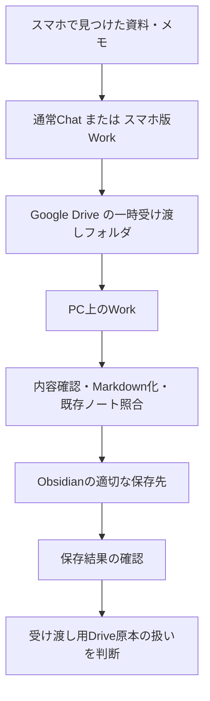

# ChatGPTで出来ること

## このノートの役割

これは、スマートフォン、デスクトップ、通常のChat、Work、外部サービス連携をどのように使い分けるかを検討した記録である。ここで扱うのは「どの機能が現在使えるか」の確定表ではなく、当時の検討をもとにした運用の考え方である。機能名、利用できる連携、権限、料金や提供範囲は変わり得るため、実行前には現行の公式案内を確認する。

出発点は、スマートフォンで見つけた資料やメモをGoogle Driveに渡し、最終的にはWindows PC上のObsidianへ登録する、という受け渡しを無理なく続けたいということだった。Driveを第二の知識ベースにせず、一時的な受信トレイとして扱う構成が前提にある。

## まず分けるべき三つの論点

当初は「通常Chatだから書き込める」「Workだから書き込める」という比較になりかけた。しかし、実際には次の三つを分けないと判断を誤る。

| 論点 | 決まること | この検討での意味 |
| --- | --- | --- |
| 外部サービス連携 | Drive、Gmail、Calendarなどを読めるか、書けるか | 接続したApp／プラグインが対応するActionと、与えた権限で決まる |
| ローカルPCへのアクセス | PC内のフォルダ、Obsidian、Excelを直接扱えるか | PC上で動く環境に、そのフォルダへの権限があるかで決まる |
| 作業の進め方 | 一問一答か、複数工程の作業として任せるか | 通常ChatかWorkかを選ぶ主な理由になる |

このため、通常ChatかWorkかだけで「Driveへの書き込み可否」を決めることはできない。外部サービスへの作成、更新、移動、削除は、連携側がその操作に対応し、必要な権限を与えた場合に初めて可能になる。重要な変更をする際には、実行前に対象と影響を確認する必要がある。

一方、PC内のObsidian VaultやExcelを扱うことは別の問題である。スマートフォンからクラウド上の会話を続けられても、それだけで自宅PCのローカルフォルダを読んだり更新したりできるわけではない。

## 検討した三つの利用形態

当時の整理では、スマホからの通常Chat、スマホからのWork、PC上のWorkを比較した。名称や画面構成は将来変わり得るが、役割の差は次のように整理できる。

| 利用形態 | 向いていること | 向かない／単独では解決しないこと | この運用での位置づけ |
| --- | --- | --- | --- |
| 通常Chat＋外部サービス連携 | 相談、単発の確認、Driveへの投入、短い変換 | PC内のObsidianを直接整理すること | スマホで資料を受け渡す入口 |
| スマホ版Work | 複数資料の比較、調査、クラウド上で完結する成果物づくり | 自宅PCのローカルフォルダを直接扱うこと | 外出先でまとまったクラウド作業をする選択肢 |
| デスクトップ版Work | クラウドの資料とPC上のファイルをまたぐ作業、最終的な登録と確認 | スマホだけで完結する軽い投入 | Obsidianへ正式に入れる工程の中心 |

比較の要点は、スマホ版Workと通常Chatのどちらが上かではない。Driveへメモを置くだけなら、通常Chatと連携で十分な場面がある。反対に、複数の資料を読んで比較し、まとめを作るところまでスマホで済ませたいなら、Workのように一連の作業として扱える環境が候補になる。

PC上のWorkが重要になるのは、ローカルの正式な保管先まで処理をつなげたいときである。ここでは、外部サービスへの書き込み能力ではなく、PC内のフォルダを確認し、既存ノートとの重複を見ながらObsidianへ保存できることが意味を持つ。

## 想定していた受け渡しの流れ

検討の対象は、単にファイルを移すことではなかった。スマホで生まれた情報を、未整理のまま知識ベースへ混ぜないために、受け取り、確認し、分類し、保存を確かめる流れを作ることが目的だった。

この図で重要なのは、Driveを最後の保存先にしない点である。Driveは、スマホとPCの間で資料を受け渡すための場所に限定する。正式な知識はObsidianに登録し、保存と内容を確認できて初めて、Drive側の一時ファイルを削除するか残すかを判断する。

たとえばPC側へ任せたい処理は、次のような一連のものだった。

1. Driveの受け渡しフォルダから未処理の資料を確認する。
2. 内容と形式を読み、Markdownにできるものは変換する。
3. Obsidian内の既存ノートと照合し、新規保存、追記、関連リンクの候補を分ける。
4. 適切な場所へ登録し、保存結果を確認する。
5. 正常に回収できたものだけ、Drive原本を削除するか保管するかを判断する。
6. 処理できなかったものは消さず、理由を残して次回へ回す。

この流れは、AIに無条件で削除を任せるための設計ではない。特にDrive原本の削除は、ローカルへの保存確認と、処理不能な資料を残すという条件がそろった後の操作として置いている。

## スマホで何をするか

スマホ側で最も頻度が高いと考えたのは、次のような軽い投入作業だった。

- 見つけたPDFや画像を受け渡しフォルダへ置く。
- 思いついたメモをMarkdownの素材として残す。
- 今日集めた資料の一覧や、未処理のものを確認する。
- 普通の相談や、短い情報整理をする。

この段階では、毎回Workを経由する必然性はない。単発の投入なら通常Chatと外部サービス連携の方が軽い。反対に、複数資料を読み、比較し、一つの調査メモとしてDriveへ残すところまでを外出先で行いたい場合は、スマホ版Workを使う理由が生まれる。

ここでの選択基準は「スマホでできるか」ではなく、作業が単発なのか、収集から比較・成果物作成までを一続きで扱いたいのかである。

## PC側で何をするか

PC側の役割は、受け渡しフォルダを片付けることだけではない。Obsidianを正式な保存先として扱う以上、既存ノートとの関係、保存先、文章の意味、リンク、削除してよい原本かどうかを確認する工程が必要になる。

そのためPC側では、次のような仕事をまとめて扱うことを想定した。

| 工程 | 判断すること |
| --- | --- |
| 回収 | Driveにあるものが未処理か、すでに登録済みか |
| 読み取り・変換 | どの形式で残すか、元の文脈を保てるか |
| 照合 | 既存ノートと重複するか、補足か、独立した記録か |
| 登録 | Obsidian内の保存先、タイトル、リンク、追記範囲 |
| 検証 | 保存に失敗していないか、意図しない変更がないか |
| 原本の扱い | 削除、保管、再処理のどれにするか |

スマホから投入することと、PCで正式登録することを分けることで、外出先では速度を優先し、PCでは内容と安全性を優先できる。

## この検討から得た判断

このノートで残したい結論は、特定の製品や画面の優劣ではない。

> Driveは受け渡しの受信トレイ、Obsidianは正式な知識の保存先として役割を分ける。スマホでは投入やクラウド作業を行い、ローカルの既存ノートを見ながら正式に登録する工程はPC側で扱う。

そのうえで、通常Chat、スマホ版Work、PC上のWorkを次のように選ぶ。

- **通常Chat＋外部サービス連携**：相談や単発の投入を素早く済ませたいとき。
- **スマホ版Work**：スマホだけで、収集から比較・整理・成果物作成までを進めたいとき。
- **PC上のWork**：ローカルのObsidianやExcelを含めて、確認・登録・検証までを行いたいとき。

この使い分けは、どれか一つに統一するためのものではない。作業の場所、情報の保存先、必要な判断の重さに合わせて、軽い入口と正式な登録工程をつなぐための設計である。
