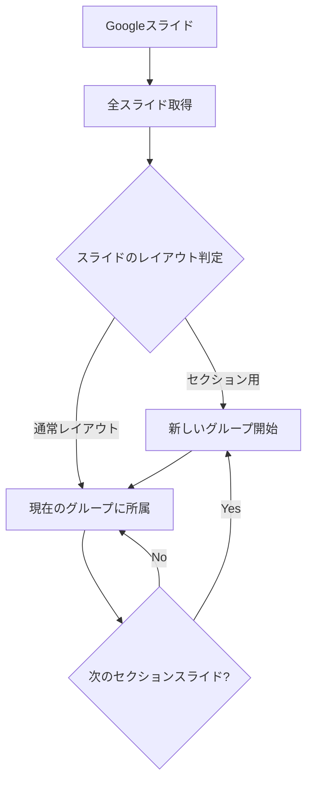
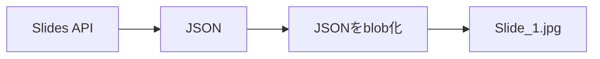
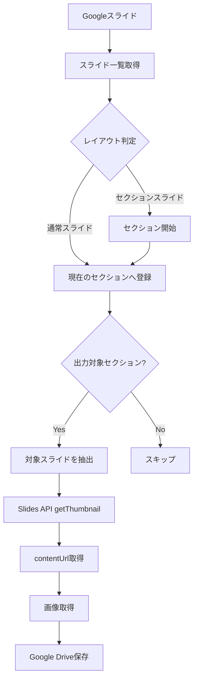

# Googleスライドの「セクション管理」と特定スライドの画像エクスポートまとめ

今回のチャットでは、主に次の2点を検討しました。

1. **Googleスライドで、PowerPointの「セクション」のようにスライドをグループ化できるか**
2. **特定のスライドだけをGASで画像として一括出力できるか**

結論として、Googleスライド自体にはPowerPointと同等の「セクション」機能はありませんが、**スライドのレイアウトをセクション境界として利用し、GASで特定グループのスライドだけを抽出・画像化する仕組みは構築可能**です。

## 1. GoogleスライドにはPowerPointの「セクション」機能がない

PowerPointには、スライド一覧を次のように論理的にまとめる「セクション」があります。

```text
▼ 導入
   1. タイトル
   2. 概要
   3. 背景

▼ 分析
   4. 分析概要
   5. 売上分析
   6. 顧客分析

▼ まとめ
   7. 結論
   8. 次のアクション
```

Googleスライドでは、2026年9月時点でも**スライド自体をこのようなセクション単位にグループ化する標準機能はありません**。Google側のコミュニティ回答でも、スライドの並べ替えやセクションタイトル用スライドを挿入する方法が代替策として案内されています。([Google ヘルプ](https://support.google.com/docs/thread/440834560/how-organize-slides-into-sections?hl=en&utm_source=chatgpt.com "How organize slides into \"Sections\" - Google Docs Editors Community"))

なお、「配置 → グループ化」は存在しますが、これは**スライド上の図形・画像などのオブジェクトをグループ化する機能**であり、スライドそのものをまとめる機能ではありません。([Google ヘルプ](https://support.google.com/docs/answer/1696521?co=GENIE.Platform%3DDesktop&hl=ja&utm_source=chatgpt.com "テキスト、図形、図、図形描画、線を挿入して配置する - パソコン - Google ドキュメント エディタ ヘルプ"))

### 現実的な代替方法

Googleスライドでは、次のような構造にするのが分かりやすいです。

```text
1  タイトルスライド

2  セクションスライド「商品紹介」
3  商品A
4  商品B
5  商品C

6  セクションスライド「施工事例」
7  施工事例A
8  施工事例B

9  セクションスライド「まとめ」
10 結論
```

この**「セクションスライド」自体を境界マーカーとして利用する**考え方が、GASとの組み合わせでは特に有効です。

## 2. 「アウトライン表示」について

途中で「アウトライン表示」について話しましたが、ここは整理しておく必要があります。

Googleスライドには、PowerPointのアウトライン表示のような専用モードはありません。

基本となるのは左側の**フィルムストリップ（スライド一覧）**です。

そのため、

- セクションスライドを目立つデザインにする
- スライドタイトルを統一する
- 必要なら目次スライドを作る

といった方法で、構造を視覚的に表現することになります。

## 3. Googleスライドには「レイアウト」という概念がある

Googleスライドで「＋」や「レイアウト」からスライドを追加すると、たとえば次のような種類があります。

|レイアウト|用途例|
|---|---|
|タイトル スライド|プレゼン冒頭|
|タイトルと本文|通常の説明|
|セクション ヘッダー|章・セクションの開始|
|タイトルのみ|自由配置|
|1列のテキスト|説明|
|メインポイント|強調表示|
|空白|完全自由|

Google公式でも、**レイアウトは「スライド上のテキストと画像の配置」**として定義されています。テンプレートはテーマ・レイアウト・背景・フォントなどを組み合わせたものです。([Google ヘルプ](https://support.google.com/docs/answer/1705254?co=GENIE.Platform%3DDesktop&hl=ja&utm_source=chatgpt.com "Google スライドでテンプレートを使用したり、テーマ、背景、レイアウトを変更したりする - パソコン - Google ドキュメント エディタ ヘルプ"))

この「レイアウト」をGASから取得すれば、

> このスライドはセクション用なのか、通常本文なのか

という判定に利用できます。

したがって今回の目的では、

```text
セクション用レイアウト
        ↓
セクション開始
        ↓
通常スライド
通常スライド
通常スライド
        ↓
次のセクション用レイアウト
```

という構造を利用できます。

## 4. GASでの「擬似セクション管理」

GASそのものを使ってGoogleスライドUIにPowerPoint型の折りたたみセクションを追加することはできません。

しかし、内部的には次のような管理ができます。



たとえば、

```text
Slide 1  タイトル

Slide 2  SECTION_HEADER
Slide 3  TITLE_AND_BODY
Slide 4  TITLE_AND_BODY
Slide 5  TITLE_AND_BODY

Slide 6  SECTION_HEADER
Slide 7  TITLE_AND_BODY
Slide 8  TITLE_AND_BODY
```

なら、

```text
Section A
 ├─ Slide 2
 ├─ Slide 3
 ├─ Slide 4
 └─ Slide 5

Section B
 ├─ Slide 6
 ├─ Slide 7
 └─ Slide 8
```

というグループとしてGAS側で解釈できます。

これは今回話していた**画像一括出力との相性がかなり良い方式**です。

## 5. 特定スライドだけを画像として一括出力する

Googleスライドでは標準UIから、

> スライド3、5、8、9だけをJPEGとして一括保存

のような操作は基本的に用意されていません。

少数なら、

**ファイル → ダウンロード → JPEG / PNG**

で現在のスライドを1枚ずつ保存できます。

大量に処理するなら、GAS + Google Slides APIを使う方法が現実的です。

例えば、

```javascript
var slideNumbers = [1, 3, 5];
```

のように指定して、

```text
Slide 1
Slide 3
Slide 5
```

だけを処理できます。

さらに発展させれば、

```text
「商品紹介」セクション
```

に属するスライドだけを自動判定して、

```text
product_01.jpg
product_02.jpg
product_03.jpg
```

のように出力することも可能です。

## 6. 最初に発生した403エラー

最初のコードを実行した際、

```text
Exception: Request failed for https://slides.googleapis.com
returned code 403

Google Slides API has not been used in project ...
or it is disabled.
```

というエラーが発生しました。

原因は、

**Google Slides APIが対象のGoogle Cloudプロジェクトで有効化されていなかったこと**

です。

このためGoogle Slides APIを有効化しました。

Slides APIへのアクセスには、DriveまたはPresentations系のOAuthスコープが必要です。([Google Developers](https://developers.google.com/workspace/slides/api/reference/rest/v1/presentations/get?utm_source=chatgpt.com "Method: presentations.get  |  Google Slides  |  Google for Developers"))

## 7. 次に発生した400エラー

APIを有効化したところ、次は、

```text
400
Invalid JSON payload received.
Unknown name "thumbnailProperties.width"
```

というエラーになりました。

原因は、最初のコードで、

```text
thumbnailProperties.width
thumbnailProperties.height
```

を指定していたことです。

Google Slides APIの`getThumbnail`で利用できる主なオプションは、

```text
thumbnailProperties.mimeType
thumbnailProperties.thumbnailSize
```

です。任意の`width`と`height`を直接指定する方式ではありません。([Google Developers](https://developers.google.com/resources/api-libraries/documentation/slides/v1/php/latest/class-Google_Service_Slides_PresentationsPages_Resource.html?utm_source=chatgpt.com "Class Google_Service_Slides_PresentationsPages_Resource | Google Slides API"))

したがって、

```text
width=1920
height=1080
```

のような指定方法は誤りでした。

この部分を削除したことでAPIリクエスト自体は成功しました。

## 8. 「JPEGを保存したのに中身がJSON」になった理由

次に発生した問題が今回最も重要でした。

Drive上には、

```text
Slide_1.jpg
```

というファイルが作成されましたが、中身を見ると画像ではなく、

```json
{
  "width": 1600,
  "height": 900,
  "contentUrl": "https://lh7-us.googleusercontent.com/..."
}
```

となっていました。

これは正常なSlides APIの挙動です。

`presentations.pages.getThumbnail`は、

**画像そのものを返すAPIではありません。**

返すのは、

```text
Thumbnail情報
 ├─ width
 ├─ height
 └─ contentUrl
```

です。Google公式ドキュメントでも、`getThumbnail`は**サムネイル画像へのURLを生成して返す**APIとされています。

つまり最初の処理は、



となっていました。

拡張子だけ`.jpg`に変えても、中身はJSONなので画像にはなりません。

## 9. 正しい画像取得フロー

正しくは2段階で取得します。


つまり、

### 第1段階

Slides APIから、

```json
{
  "width": 1600,
  "height": 900,
  "contentUrl": "https://..."
}
```

を取得。

### 第2段階

```javascript
var imageUrl = json.contentUrl;
```

でURLを取得し、

```javascript
var imageResponse = UrlFetchApp.fetch(imageUrl);
```

として**実画像データを再取得**します。

最後に、

```javascript
var blob = imageResponse.getBlob()
  .setName("Slide_" + slideNumber + ".jpg");

DriveApp.createFile(blob);
```

とすることで、本物の画像としてGoogle Driveへ保存できます。

なお、`contentUrl`は永続URLではなく、Googleのドキュメントでは**標準で約30分の有効期限を持つ一時URL**と説明されています。生成したら、その処理内ですぐに画像を取得するのが適切です。

## 10. 今回最終的に成立した処理

今回の流れをコード構造として整理すると、概ね次の処理になりました。

```javascript
function exportMultipleSlidesAsJPG() {
  var presentation = SlidesApp.getActivePresentation();
  var presentationId = presentation.getId();
  var slides = presentation.getSlides();

  var slideNumbers = [1, 3, 5];

  slideNumbers.forEach(function(slideNumber) {

    var slideIndex = slideNumber - 1;

    if (slideIndex < 0 || slideIndex >= slides.length) {
      return;
    }

    var slideId = slides[slideIndex].getObjectId();

    // Slides APIからサムネイル情報を取得
    var apiUrl =
      "https://slides.googleapis.com/v1/presentations/" +
      presentationId +
      "/pages/" +
      slideId +
      "/thumbnail?access_token=" +
      ScriptApp.getOAuthToken();

    var response = UrlFetchApp.fetch(apiUrl);
    var json = JSON.parse(response.getContentText());

    // 実画像のURL
    var imageUrl = json.contentUrl;

    // 実画像を取得
    var imageResponse = UrlFetchApp.fetch(imageUrl);

    var blob = imageResponse
      .getBlob()
      .setName("Slide_" + slideNumber + ".jpg");

    // Google Driveへ保存
    DriveApp.createFile(blob);
  });
}
```

今回確認できた重要なポイントは、

> **Slides API → JSON取得 → `contentUrl`取得 → 実画像取得**

という2段階処理が必要であることです。

## 11. 今回の目的を発展させるなら

今回の会話を通じて、単なる「指定番号の画像出力」よりも、次の仕組みに発展させる余地が出てきました。



たとえばGoogleスライドを、

```text
1  タイトル

2  【SECTION】Webサイト用画像
3  商品紹介
4  商品一覧
5  使用例

6  【SECTION】楽天市場用画像
7  商品メイン画像
8  商品説明画像
9  使用方法

10 【SECTION】社内資料
11 売上分析
12 原価分析
```

と作っておけば、

```text
「楽天市場用画像」セクションだけJPEG化
```

という操作をGASで自動化できます。

これは単なる番号指定よりも、

- スライド追加による番号ズレに強い
- セクション単位で再利用できる
- 用途別画像出力を自動化できる
- プレゼン資料と画像素材を同じGoogleスライドで管理できる

という利点があります。

## まとめ

今回の検討結果を簡潔にすると次のとおりです。

|項目|結論|
|---|---|
|PowerPoint型のセクション|Googleスライドにはない|
|スライドのグループ化|標準UIでは不可|
|GASによる擬似グループ化|可能|
|セクション判定|セクション用レイアウト等を利用可能|
|特定番号だけ画像化|GASで可能|
|複数スライド一括画像化|可能|
|Slides APIの戻り値|画像ではなくJSON|
|JSON内の`contentUrl`|実画像取得用URL|
|正しい処理|API → `contentUrl` → 画像取得 → Drive保存|
|任意のwidth/height指定|`thumbnailProperties.width/height`では不可|
|今後の有力案|セクションレイアウトを境界として画像出力を自動化|

今回の会話から考えると、最も実用的なのは**「スライド番号を直接指定する方式」から、「セクションスライドを基準に自動抽出する方式」へ発展させること**です。

これならGoogleスライドを単なるプレゼン資料ではなく、**用途別の画像素材をまとめて管理・書き出すための作業ファイル**としても使えるようになります。