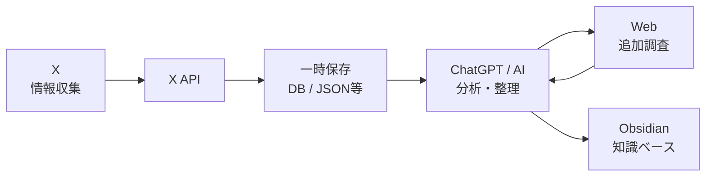
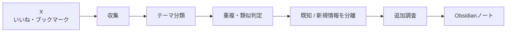
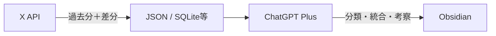

このチャットでは、**X（旧Twitter）上で収集した情報をChatGPTで分析・整理し、単なる「いいね」「ブックマーク」の蓄積ではなく、自分の知識として再利用できる仕組みにできないか**を検討した。

全体として、目的は「Xを管理すること」そのものではなく、**Xを情報収集用Inboxとして利用し、AIで重複整理・統合・追加調査・知識化すること**へと整理された。



## 1. 最初の疑問：ChatGPTはXアカウントと直接連携できるか

最初に確認したのは、ChatGPTからXアカウントへ直接接続して、以下のようなことができるかという点だった。

- 投稿の取得
- いいねした投稿の取得
- ブックマークの取得・整理
- フォロー／フォロワーの取得
- フォロー／解除などの管理

### 現時点での整理

**ChatGPT標準機能として、Xアカウントを直接接続して自由に読み書きする公式連携は確認できなかった。**

一方で、**X APIを利用すれば、技術的にはかなりの範囲を実現できる**。

|やりたいこと|ChatGPT単体|X API経由|
|---|--:|--:|
|公開投稿の調査・要約|△|◎|
|自分のいいね取得|×|◎|
|自分のブックマーク取得|×|◎|
|いいね内容の分析|データがあれば◎|◎|
|ブックマーク分析|データがあれば◎|◎|
|フォロー一覧取得|×|◎|
|フォロワー一覧取得|×|◎|
|フォロー関係の分析|データがあれば◎|◎|
|フォロー／解除|×|API上は可能|
|大量自動フォロー／解除|×|規約上注意|

つまり、

> **X API = データ取得・操作の入口**  
> **ChatGPT = 取得したデータを理解・分析・整理する頭脳**

という役割分担になる。

---

## 2. ブックマークや「いいね」をAIで分析できるか

次に、単なる取得ではなく、

> 「AIについて調べていて、良さそうな投稿を何度もいいね・ブックマークした結果、似た内容が大量に保存されている。それを整理したい」

という具体的な目的に話が進んだ。

結論として、**これは十分可能であり、X API × AIの用途として非常に相性がよい**。

### 対象にできるデータ

X APIから取得したデータをAIへ渡すことで、例えば以下を分析できる。

- 自分のブックマーク
- 自分がいいねした投稿
- 特定ユーザーの投稿
- 投稿日時
- 投稿者
- 投稿本文
- 投稿内URL
- 投稿への反応数
- 自分がどのテーマを頻繁に保存しているか

さらにリンク先の記事本文などを別途取得できれば、投稿本文だけでなく**元記事を含めた分析**も可能になる。

---

## 3. 最も重要な用途：意味的な重複の整理

今回特に重要だったのが、**単純な重複ではなく「意味的な重複」を検出すること**。

例えば以下の投稿があったとする。

- 「Claude Codeが○○に対応した」
- 「Claude Codeで○○が使えるようになった」
- 「新機能○○をClaude Codeで試してみた」

文章自体は違っても、根本的には同じ情報を扱っている可能性がある。

AIなら、このような投稿をまとめて、

> 同一テーマ  
> 同一主張  
> 類似情報  
> 新しい補足情報

として分類できる。

### 単純に削除するのではなく、情報を統合する

今回の整理で特に重要なのは、

> **似ている投稿を消す**

のではなく、

> **共通部分と各投稿固有の情報を分離する**

という考え方。

例えばMCPについて3投稿あった場合、

|投稿|内容|
|---|---|
|A|MCPからGoogle Driveへ接続できる|
|B|MCPとはAIと外部サービスをつなぐ仕組み|
|C|MCPサーバーから社内DBへ接続した事例|

これらは「MCP」という点では似ているが、完全重複ではない。

AIで整理すると、

```text
MCP

共通知識
- AIと外部サービスを接続する仕組み

投稿A固有
- Google Drive連携

投稿B固有
- MCPの基本概念

投稿C固有
- 社内DBとの実装事例
```

のように、**一つの知識へ統合しながら固有情報を残す**ことができる。

この方式なら、単純な重複排除より知識価値が高い。

---

## 4. 「自分の関心」を分析するデータとしても使える

いいねやブックマークは、

> 自分が実際に「価値がある」「後で見たい」と判断した情報

なので、自分の関心領域を分析するデータにもなる。

例えば半年分を分析して、

```text
AI
├─ AIエージェント
│  ├─ MCP
│  ├─ Claude Code
│  └─ Browser Agent
│
├─ Knowledge Management
│  ├─ Obsidian
│  ├─ RAG
│  └─ Personal Knowledge
│
├─ Automation
│  ├─ n8n
│  ├─ Make
│  └─ Apps Script
│
└─ AI Coding
   ├─ Claude Code
   ├─ Codex
   └─ Cursor
```

のような**自分自身の関心マップ**を作ることも可能。

その上で、

- 最近関心が高まったテーマ
- 何度も同じ情報を保存している分野
- 保存量の割に理解が浅いテーマ
- 継続的に追っている人物
- 新規性が高い投稿
- 既に知っていることの繰り返し

などを分析できる。

---

## 5. 特定ユーザーの投稿分析も可能

X APIを利用すれば、特定ユーザーの投稿を取得してAIに分析させることも可能。

例えば、

> 「このAI研究者・エンジニアの投稿をまとめて分析したい」

という用途。

AI側では以下のような分析が考えられる。

- 主な投稿テーマ
- 頻繁に言及する技術
- 推奨ツール
- 否定的に評価している技術
- 主張の傾向
- 時系列での考え方の変化
- 頻出リンク
- 頻繁に言及する人物
- 重要投稿
- 同じ主張の繰り返し
- 自分の関心と重なる投稿

さらに、

```text
特定ユーザーの投稿
        ×
自分のブックマーク
        ↓
自分が関心を持っている論点
        ↓
不足している情報
        ↓
Web追加調査
```

という使い方も考えられる。

---

## 6. Xの中で整理するより、外へ出した方がよい

話を進める中で、今回の目的は単純な

> Xのブックマーク整理

ではないことが明確になった。

本当にやりたいことは、

1. 気になる情報を保存する
2. 後で取り出す
3. 重複を整理する
4. 複数の情報を統合する
5. 新しい情報だけ見つける
6. 足りない情報を追加調査する
7. 自分なりに考える
8. 知識として残す

という流れ。

そのため、**X内部のブックマークフォルダだけで管理するより、外部の知識管理システムへ移す方が適している**という整理になった。

特に現在使っているObsidianとの相性がよい。



---

## 7. Obsidianへ持っていく場合のイメージ

例えば、XでMCP関連投稿を何十件も保存していた場合、それをそのまま50件のノートにするのではなく、AIが統合して、

```markdown
# MCPによるAIツール連携

## 概要
MCPとは……

## 基本概念
- 投稿A
- 投稿B

## 実装事例
- Google Drive
- 社内DB
- ローカルMCP

## ChatGPT関連
- 投稿C
- 投稿D

## Claude関連
- 投稿E
- 投稿F

## 重複していた情報
A・B・Hはほぼ同じ内容。

## 各投稿固有の情報
- A：Google Drive
- C：OAuth
- H：ローカル環境

## 追加調査
公式ドキュメントでは……

## 自分の考察
……
```

のような**統合知識ノート**にする方向が考えられる。

つまり、

> 50ブックマーク → 50ノート

ではなく、

> **50ブックマーク → 数個のまとまった知識**

へ変換する。

今回の目的にはこちらの方が合っている。

---

## 8. X APIは有料なのか

最後に確認したのが費用。

イーロン・マスクによるTwitter買収後、X APIが有料化された記憶があるため、

> ChatGPTとの連携でもX API料金が必要なのか

を確認した。

### 結論

**必要。**

ChatGPT Plusを契約していても、X APIの利用料金は含まれない。

```text
ChatGPT Plus
    ≠
X API利用料
```

X側とOpenAI側は別サービス。

### このチャット内で確認した現在の料金体系

2026年9月3日時点では、従来の固定月額プラン中心ではなく、**X APIは基本的に従量課金（Pay-per-use）型**として整理した。

特に、自分自身のデータを自分のDeveloper Appから読む「Owned Reads」については、このチャットでは、

> **1リソースあたり $0.001**

として確認した。

単純計算では、

|取得データ|概算|
|---|--:|
|自分のブックマーク1,000件|約$1|
|自分のいいね2,000件|約$2|
|自分の投稿1,000件|約$1|
|ブックマーク1,000 + いいね2,000|約$3|

という規模。

一度過去分を取得した後は、**新規分だけ差分取得する**方式にすれば、継続費用を抑えられる。

一方、他人の投稿を大量に取得する場合は、自分自身のOwned Readとは異なる料金になるため注意が必要。

---

## 9. ChatGPT側でも「Plus」と「API」は別

ここも重要な整理。

### 手動・半自動方式

```text
X API
 ↓
JSON / CSV
 ↓
ChatGPT Plusへ渡す
 ↓
分析
```

この場合、

- X API料金：必要
- ChatGPT Plus：現在の契約
- OpenAI API料金：不要

となる。

### 完全自動化方式

```text
X API
 ↓
Python / n8n / Make
 ↓
OpenAI API
 ↓
自動分析
```

この場合は、

- X API料金
- OpenAI API料金
- 必要に応じてn8n / Make等の費用

がそれぞれ発生する。

ChatGPT Plus料金はOpenAI API利用料には充当されない。

---

## 10. 現時点で最も合理的な方向性

今回の用途なら、最初から完全自動システムを作る必要はない。

まずは、



という小さな構成で試すのが合理的。

### 初期検証

例えば、

- ブックマーク：1,000〜2,000件
- いいね：1,000〜3,000件

程度を一度取得する。

そのデータに対してChatGPTで、

1. AI関連投稿だけ抽出
2. テーマ分類
3. 意味的重複を検出
4. 同じ主張をまとめる
5. 各投稿固有の新情報を抽出
6. 古い情報を判定
7. 追加調査すべきテーマを出す
8. Obsidianノート化する

という処理を試す。

この結果が有用なら、その後に自動化を検討する。

---

## 11. 今回の構想を一言で表すなら

当初は、

> 「ChatGPTからXを整理できるか？」

という話だった。

しかし、検討を進めると目的はもっと大きい。

### Xブックマーク管理ではない

```text
× X Bookmark Manager
```

ではなく、

```text
X
↓
Personal Knowledge Inbox
↓
AIによる知識統合
↓
Obsidian
```

という構想に近い。

つまり、Xを**情報の最終保存場所ではなく、一次収集場所**として位置付ける。

AIは、

> 「この投稿を保存した」

という事実を起点に、

- 以前にも同じことを保存していないか
- 新しい情報はどこか
- 既存知識とどうつながるか
- 何がまだ分かっていないか
- 次に何を調べるべきか

まで踏み込んで処理する。

これによって、Xの「いいね」「ブックマーク」を**知識を更新するための入力データ**として利用できる。

---

## 現時点で決まっていること・未決定事項

|項目|状態|
|---|---|
|Xを情報収集Inboxとして使う|有力|
|いいね／ブックマークをAI分析する|可能|
|意味的重複を整理する|主要目的|
|重複を単純削除する|非推奨|
|共通知識＋固有情報へ統合|推奨|
|特定ユーザー投稿の分析|可能|
|Obsidianへの知識化|相性が良い|
|ChatGPT標準のX直接連携|現状なし|
|X API利用|必要|
|X API料金|別途必要|
|最初から完全自動化|不要|
|Python / n8n / Make等の採用|未決定|
|保存先DB形式|未決定|
|Obsidianへの具体的な格納ルール|未決定|
|どの範囲まで自動処理するか|未決定|

### 次に検討するなら

最も自然なのは、**実装に入る前に「X → AI → Obsidian」の具体的な運用設計を決めること**。

特に、

- いいねとブックマークをどう扱い分けるか
- どこまでX APIから取得するか
- 投稿本文だけか、リンク先記事まで取得するか
- 何を「重複」と判定するか
- Obsidianへ1投稿1ノートで入れるのか、テーマ単位で統合するのか
- 元投稿URLや投稿者情報をどう保持するか
- 一時DBをSQLite等で持つか
- AI分析をChatGPT Plusで手動実行するか、OpenAI APIで自動化するか

を決める必要がある。

今回の会話で一番重要だった方向性は、**「Xの整理」ではなく「Xから得た情報を、自分の既存知識へどう統合するか」を主眼に置く**という点だと思う。