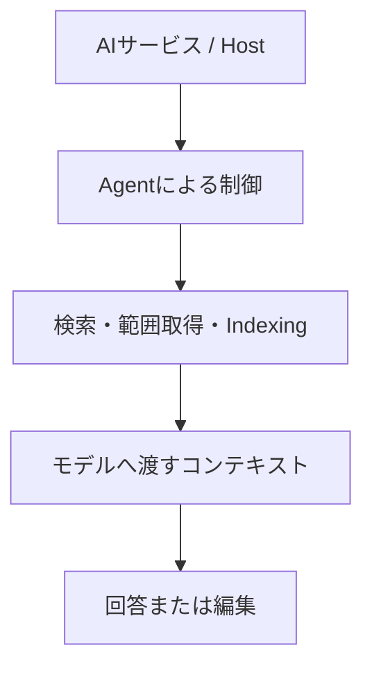

# AIサービス・モデル別「ファイル部分読み込み」とトークン消費の比較調査

これは、AIがローカルファイルや接続先のファイルを扱う際、モデルへ実際に渡される情報量をどう抑えられるかを調べるための**調査設計書**である。サービス名やモデル名だけで判断せず、検索・範囲取得・インデックス・エージェント制御を分けて比較する。

> 調査基準：2026年9月時点で利用可能な情報を確認する。内部実装が公開されていない場合は、推測で埋めず「不明」と記録する。

## 中心となる問い

大きなMarkdown、PDF、テキストファイルに対して「第3章だけ読んで説明してください」と指示したとき、次のどちらが起きるかを確認する。

```text
パターンA：全文取得 → モデルへ入力 → 必要箇所を探索 → 回答
パターンB：検索・見出し検出・範囲取得 → 必要箇所だけ抽出 → モデルへ入力 → 回答
```

知りたいのは単に長いファイルを読めるかではない。**モデルへ実際に投入されるコンテキスト量と、その前段の取得・検索機構**を分けて比較することである。AIへ「必要部分だけ読んで」と指示しても、必ずパターンBになるとは限らないため、実装・ツール能力・エージェント挙動を確認する。

## 比較の単位

「AIサービス」「モデル」「ファイル取得機構」は別の層である。したがって、「GPTは部分読みできる」「Claudeは全文を読む」のように、モデル単体の性質として断定しない。



調査では次を分離する。

- モデルそのものの能力
- ChatGPT、Claude、Geminiなどサービス側の実装
- Work、Code、Agentなどのエージェント制御
- 文字列検索、見出し・行・ページ単位の範囲取得
- semantic search、RAG、indexing、コンテキストキャッシュ
- MCP、独自API、ローカルファイル操作、クラウドストレージ接続

## 対象と比較表

最低限、OpenAI、Anthropic、Googleを調査する。比較に意味がある場合だけ、Cursor、GitHub Copilot、Windsurf、Perplexity、Mistral、中国系の主要AIエージェントやコーディング環境を加える。

| 確認項目 | 記録する内容 |
| --- | --- |
| サービスと使用モデル | ChatGPT Work、Claude Code、Gemini CLIなどの実行環境とモデル |
| ファイル操作 | ローカル操作の可否と条件 |
| 取得方法 | 全文、部分、見出し、行、PDFページ、grep、semantic search、RAG、indexing |
| 制御主体 | モデル、Agent、サービス側実装、ユーザー指定のどれが取得方法を選ぶか |
| 全文投入の保証 | 可能、不可能、不明のいずれか |
| コスト・利用量 | モデル入力、API課金、利用上限、Context Cacheの関係 |
| 可視性 | 内部挙動を公式情報・実測・ユーザー報告のどこまで確認できるか |

モデル差も確認対象にする。高性能、軽量、reasoning、coding agent向けのモデルで、ツールの選択や検索の先行、全文取得の回避に差が出る可能性はある。ただし「高性能なモデルほど必ず部分読みする」とは仮定しない。

## API、MCP、RAGを混同しない

部分読みは、MCPでなければ実現できない機能ではない。独自APIでも次のような操作を提供できる。

```text
search()
read_range()
read_page()
grep()
```

調査では、APIだけで実現できること、MCPが追加する価値、MCP Serverが公開する検索・読み込み機能による差、MCP Host／Client／Server／Modelの役割を分ける。MCP利用時でも全文取得になる可能性を確認し、MCP自体を部分読みやRAGの同義語として扱わない。

トークン消費も、次の三つを別に記録する。

1. ストレージ上のファイルサイズ
2. 検索・インデックス・ツール側が処理したデータ量
3. モデルのコンテキストへ実際に投入されたトークン量

たとえば100ページから第3章の10ページだけ抽出した場合、検索システムが100ページを処理していても、モデルに入るのは10ページだけという構造があり得る。部分取得がモデル入力を減らしても、サービスの利用制限やAgent／Workの利用量が必ず同じ比率で減るとは限らない。

## 共通実験

同じ問いを、可能な範囲で同じ条件にそろえて比較する。

| テスト | 入力 | 指示 | 比較する取得方式 |
| --- | --- | --- | --- |
| Markdown | 100ページ相当、4章構成 | 第3章だけ読んで要約する | 全文、部分、検索→部分、RAG |
| ログ | 数十万文字 | 2026-09-05のSmartEX関連ログだけ確認する | 全文、部分、検索→部分、RAG |
| PDF | 300ページ | 第5章だけ読んで説明する | 全文、部分、検索→部分、RAG |

実測データがある場合は優先する。公式に公開されない内部挙動については、実測・開発者報告・ユーザー報告を公式事実と混同しない。

## 情報源と出力

情報源は、公式ドキュメント、公式技術ブログ・仕様、GitHub公式リポジトリやIssue、信頼できる技術検証、開発者実測、ユーザー報告の順に扱う。

最終成果物では、最初に結論を示したうえで、仕組み、サービス・モデル比較、API／MCP／RAGの役割、共通実験、実測・ユーザー報告、不明点、実運用への示唆を整理する。比較表では次を明示的に区別する。

| 情報の性質 | 扱い |
| --- | --- |
| 公式に確認済み | 仕様・提供条件として記録する |
| 実測・ユーザー報告 | 条件付きの観測として記録する |
| 推測不能・非公開 | 不明として残す |

この調査から得たいのは、単に「どのAIが部分読み込みに強いか」という順位ではない。モデル差とサービス差のどちらが大きいか、ユーザー側で全文投入を構造的に避ける方法、巨大な一ファイルを維持するか小さな複数ファイルへ分けるかを、AI向けローカルファイル設計として判断できる状態である。
