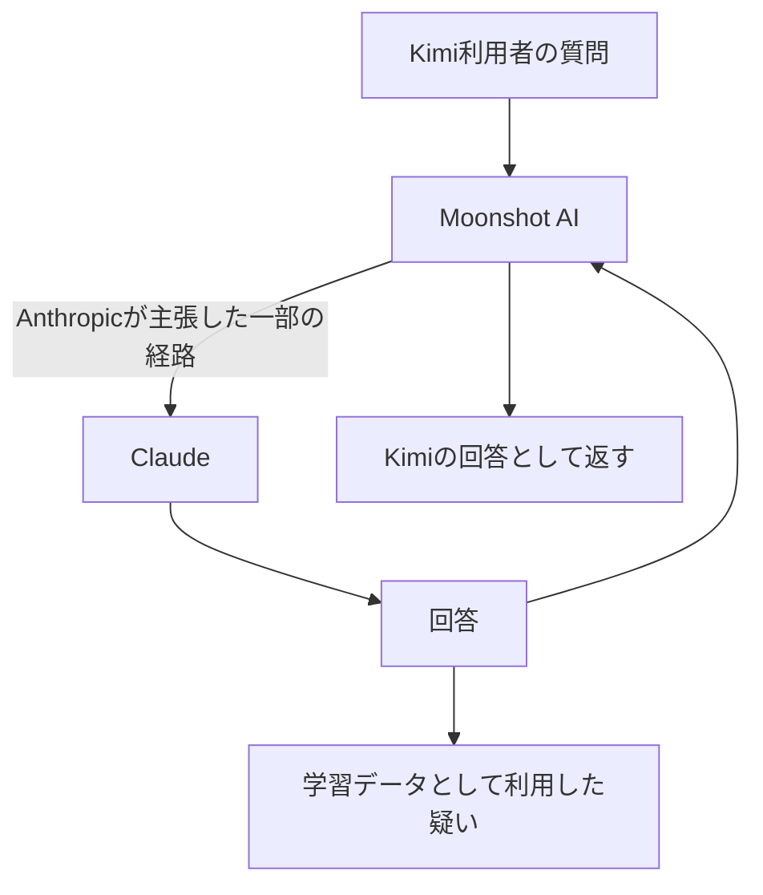
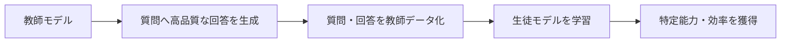
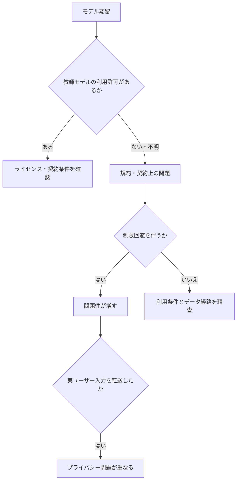

2026年9月にAnthropicがMoonshot AI / Kimiについて行ったとする主張を、AIモデルの蒸留、利用規約、アクセス制限、ユーザーデータの経路という複数の論点に分けて整理する。このノートは当事者による主張を要約したものであり、独立監査で確定した事実として扱わない。

## 最初に避けるべき単純化

| 表現 | このノートでの扱い |
|---|---|
| Kimiは実はClaudeだった | 言い過ぎ。Kimiの自前モデルの存在とは別問題 |
| Kimiの全回答をClaudeが生成した | 確認されていない |
| 一部の利用者入力がClaudeへ転送された | Anthropicの主張 |
| Claudeの出力がKimiの学習に使われた | Anthropicの主張 |
| アカウント・アクセス制限の回避を伴う抽出があった | Anthropicの主張 |

問題の中心は「Kimiに自前モデルがあるか」ではない。競合モデルであるClaudeを、誰の権限で、どの方法で、回答生成や学習データに使ったのかである。



元の記録には、特定の10日間に約30万件のリクエストがClaudeへ転送されたというAnthropicの数値があった。この数値は対象期間・対象ケースに限られ、Kimiの全リクエストを表すものではない。

## 蒸留は技術であり、問題性は利用方法で決まる

知識蒸留は、高性能な教師モデルの出力を使い、より小さい生徒モデルを学習させる一般的な技術である。自社モデル間、許諾されたモデル、ライセンスに従ったデータで行う蒸留自体を不正とみなすべきではない。



Google・Meta・OpenAI・大学研究・OSSコミュニティを含め、蒸留や合成データは広く使われてきた。Stanford AlpacaやVicunaのように、他社AIの出力や公開会話を利用して別モデルを強化した事例もある。これらは、利用規約・ライセンス・公開性・商用利用条件によって評価が変わる。

## 問題性は連続的に評価する

| 利用形態 | 主な論点 |
|---|---|
| 自社大型モデル → 自社小型モデル | 通常の開発手法 |
| 許諾済みモデルを教師にする | ライセンス条件への適合 |
| 他社AIの出力を教師データ化 | 契約・規約・データ利用条件 |
| 競合AIから大規模に能力を抽出する | モデル抽出・競争上の問題 |
| 偽装アカウントやプロキシで制限を回避する | 規約違反・不正なアクセスの問題 |
| 実ユーザー入力を第三者AIへ転送する | プライバシー・データガバナンスの問題 |



## 利用者にとって重要なのはデータ経路

もし利用者がKimiに入力した内容が、想定していない第三者のモデルへ送信されたなら、企業間の蒸留問題とは別に、利用者の情報がどこへ渡ったかという問題が生じる。コード、APIキー、個人情報、社外秘情報、財務情報などを扱う場合、入力先のAIだけでなく、外部転送の有無と利用規約を確認する必要がある。

```text
利用者が想定する経路
利用者 → Kimi

主張が事実だった場合に生じ得る経路
利用者 → Moonshot AI → 外部のAIサービス → 回答
```

この事例から得るべき一般則は、「中国AIか西側AIか」で単純に判断しないこと。蒸留の有無ではなく、教師モデルの権限、規約順守、制限回避、ユーザーデータの転送、透明性を個別に確認する。
