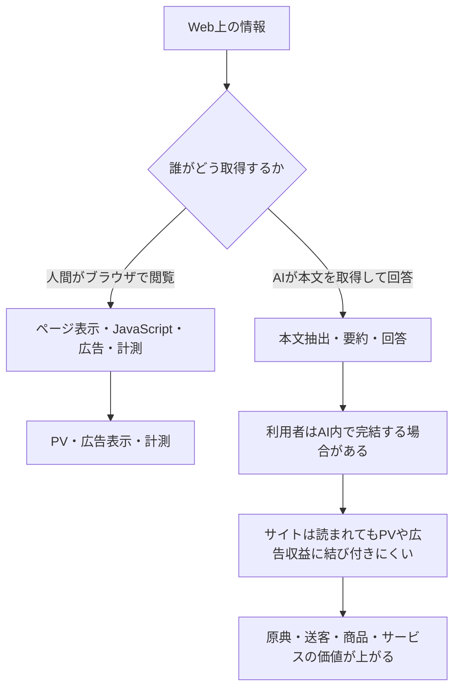
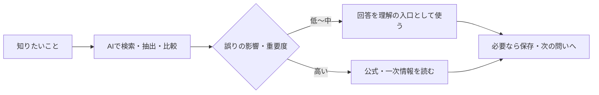
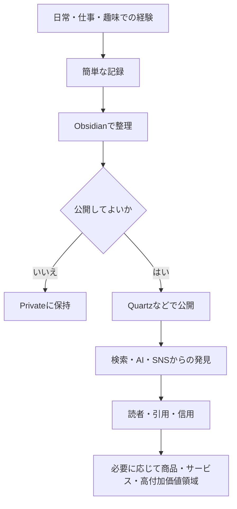
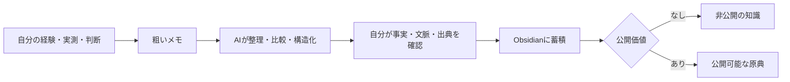

## この議論の出発点と、ここで扱う範囲

出発点は、ChatGPTのようなAIがまとめサイトやブログから情報を取得したとき、そのサイトの広告やアクセス解析がどう扱われるのか、という疑問だった。そこから、広告を見たくない利用者はAIをどのように使えば効率的か、AIが回答内で完結するほどPVを失うサイトは何で収益を得るのか、そしてAI時代に個人サイトを持つ意味は何か、という問いへ広がった。

このノートは、2026年9月時点での仕組みと考え方を整理した調査・検討の記録である。特定のAIサービスや広告計測製品の実装は変わり得るため、「すべてのAIアクセスが必ずこうなる」という断定ではなく、従来の人間によるブラウザ閲覧と、AIによる本文取得・要約では、収益と計測の経路が異なる、という構造を押さえることを目的にする。



この図が示すように、AIは利用者にとっては広告や冗長なSEO文章を飛ばして必要な情報へ近づく入口になり得る。他方、サイト運営者にとっては、従来の「検索 → 訪問 → 広告表示 → 収益」という流れを弱める存在になり得る。個人サイトについて考えるときも、PVを集める広告媒体としてだけでなく、自分が直接確かめた事実・経験・判断を所有し、必要に応じて公開する知識基盤として考え直す必要がある。

## 利用者が読む経路と、サイト側で起きること

通常、人がChromeやSafariでページを開くと、HTMLだけでなくJavaScript、GA4、Google Tag Manager、広告タグ、Cookieなどが読み込まれる。実装や同意設定による差はあるものの、ページビュー、イベント、広告インプレッション、広告クリック、アフィリエイトやコンバージョンといった指標は、この「人が表示可能なブラウザでページを開く」経路に依存している。

一方、AIクローラーやAI検索がページを参照するときは、HTTPでHTMLを取り、本文を抽出して必要箇所を処理するだけの場合がある。その場合はJavaScriptが動かず、GA4や広告タグも発火しないため、サーバーやCDNにはリクエストが残っても、アクセス解析上のPVや広告収益にはほぼ反映されないことがある。したがって、AIが何度コンテンツを取得しても、通常のPVとしては見えない、あるいは極めて見えにくいという非対称性が起きる。

|アクセスの経路|サーバー／CDNのログ|GA4等のブラウザ計測|広告表示・広告収益|意味|
|---|---|---|---|---|
|人が通常のブラウザで閲覧|残り得る|動き得る|発生し得る|従来のPV型モデル|
|AIクローラーが本文を取得|残り得る|動かないことが多い|基本的に発生しない|情報は読まれても広告価値になりにくい|
|AI検索が回答のために参照|残る場合がある|動かないことが多い|基本的に発生しない|検索・引用のための参照|
|AI回答の出典を人がクリック|残り得る|動き得る|発生し得る|通常の送客として扱える|

重要なのは、AIが読んだことと、人がサイトを見たことは、広告ビジネス上では別の出来事だという点である。AIが回答に出典リンクを示し、利用者がそのリンクを開けば、その後は通常のブラウザ閲覧に戻る。GA4、広告、Cookie、アフィリエイト、問い合わせ計測などは、そこで初めて機能する可能性がある。運営側にとって焦点になるのは、AIに読まれるかだけでなく、**AIから人を送ってもらえるか、または読まれること自体に別の価値を設定できるか**である。

AIからのアクセスも、目的を一つにまとめない方がよい。概念的には、AI検索に掲載するための取得、モデルの学習・改善のための取得、利用者の質問に答えるための一時的な取得があり得る。OpenAIの `OAI-SearchBot` と `GPTBot` のように、提供者が用途別のクローラーを分けている例もある。そのため、サイト側の選択肢は「AIを全部許可する」か「全部拒否する」かだけではない。

```text
AI検索への掲載は許可する
→ 回答からの送客や発見を期待する

モデル学習は拒否する
→ 長期的な利用範囲を分ける

高付加価値の詳細はサイト内または有料領域に残す
→ 露出と保護を両立させる
```

実際に何を制御できるか、どのボットがどのように動くかは、サービス、robots.txt、CDN、契約、時点によって異なる。したがって、運営方針を決める際は「自分は何のアクセスを許可・拒否したいのか」を先に言語化し、その時点の公式仕様を確認する必要がある。

利用者にとってAIは、単なる広告ブロッカーより一段深い役割を持つ。広告ブロッカーはページを開いた上で広告を非表示にするのに対し、AIはページを開く工程自体を減らし、必要な箇所だけを抽出・比較させられるからである。ただし、便利さは原典確認を不要にすることではない。料金、製品仕様、利用規約、法律、医療、金融、行政情報、研究論文、重要な一次報道のように誤りの影響が大きい情報は、AIの回答を入口にして公式・一次情報へ戻る。

|情報の性質|まずAIでできること|最後に必要な確認|
|---|---|---|
|用語、一般的な方法、概要比較|要約、比較、関連語の発見|必要に応じて代表的な出典|
|長いページの料金・対象者・注意事項|URLから必要箇所を抽出し、比較表にする|原ページの該当箇所と更新日|
|ニュースの概略|複数報道の整理、争点の抽出|一次報道・公式発表|
|法律、医療、金融、契約、規約|論点と確認箇所の整理|公式文書・専門家・原典|

利用者側の実務は、次の三段階に分けられる。第一に、用語の意味や一般的なHow-toのような低〜中程度の重要度の問いは、AIに検索・要約・比較させる。第二に、長い記事や公式ページはURLを渡し、「料金」「対象者」「注意事項」など必要な項目に限定して抜き出させる。第三に、重要度が高いものだけは出典を開いて原文を確かめる。この順序にすれば、広告・ポップアップ・長い前置きを通過する回数を減らしながら、重要な判断で原典を手放さずに済む。



## AI時代に揺らぐ広告モデルと、運営者側の選択肢

従来の多くの情報サイトは、検索から人を集め、ページ表示に広告を載せることで収益を得てきた。ところが、AIが他者の情報を検索・要約・比較し、利用者がAIの画面内だけで答えを得るようになると、コンテンツは利用されていても人間のPV、広告表示、広告収入が増えない。特に、既存情報を集めて「おすすめ○選」「○○とは」「○○と△△の違い」「イベント日程」などに再編集し、検索流入と広告で成立していたモデルは、AIが得意とする要約・比較・条件絞り込みと重なるため影響を受けやすい。

|サイトの種類|AIによる代替リスク|残りやすい価値|
|---|---|---|
|まとめサイト・一般的な比較記事|高い|独自取材、実測、独自写真、現地確認、編集部レビュー、独自DB|
|個人ブログ|内容により大きく異なる|実際の利用記録、失敗、制作過程、長期レビュー、運用変更履歴|
|専門情報サイト|比較的低い|仕様、試験結果、技術資料、統計、ケーススタディ、専門家見解|
|企業オウンドメディア|比較的低い|製品理解、問い合わせ、商談、購入へつながる情報|

専門サイトが比較的強いのは、AIが一般論を要約できても、正確な製品仕様、試験結果、施工要領、独自統計、研究や実測の原典までは自力で生み出せないためである。企業メディアも広告PVだけが目的ではなく、技術記事から製品ページ、問い合わせ、商談、購入へ進む経路を持てる。広告収益では10万PVを必要とするように見える場面でも、専門性のある1,000PVから問い合わせ10件、成約へつながるなら成立する。ここでの価値はPV数ではなく、誰に何を理解してもらい、次にどの行動をしてもらうかにある。

運営側の対策は、単独で一つを選ぶものではなく、コンテンツの性質と収益源の組み合わせとして考える。

|選択肢|狙い|利点|注意点|
|---|---|---|---|
|AIクローラーを拒否する|無断取得を減らす|コンテンツの露出範囲を狭められる|AI検索で引用されず、送客も失う可能性|
|AIに見せる範囲を分ける|概要は公開し、詳細・独自データは保護する|発見と高付加価値領域を両立しやすい|公開範囲の設計と更新が必要|
|AIを送客経路として扱う|回答・出典からサイトを訪れてもらう|人の閲覧、問い合わせ、購入へつなげられる|単なるAI向けSEOでは足りない|
|広告以外へ収益を分散する|PV依存を下げる|会員、商品、サービス、データ等を組み合わせられる|提供価値と運用コストを設計する必要|
|AIクローラーへの課金を検討する|取得自体に対価を求める|送客がない利用への新しい対価になり得る|仕組み・採用状況・交渉力に左右される|
|AIが代替しにくい機能を作る|読むだけで終わらない価値にする|ツール、DB、コミュニティ、商品へ広げられる|コンテンツ以外の運用も必要|

AIから送客されるサイトになるために重要なのは、テクニックだけではない。一次情報、独自データ、明確な数値、著者、更新日、出典、専門性といった、読者にもAIにも「何を根拠にしているか」が追える情報の方が基礎になる。AEO、GEO、LLMOといった言葉で語られる領域も、実質的にはこの原典性と説明責任を整える問題として考える方がよい。

収益については、広告100%から、広告、アフィリエイト、有料会員、有料記事、商品、サービス、スポンサー、データ提供、API、ライセンスへと分散する発想が必要になる。AdSenseやPV型広告を完全に否定する必要はないが、AIが情報を吸収しやすい環境では、PVそのものを唯一の商品にしない方が安定する。CloudflareのPay Per Crawlのように、AIのコンテンツ取得に対価を求めるモデルも現れているが、これは「人を送客できないなら取得自体に料金を払ってもらう」という可能性の一つであり、すべての個人サイトがすぐ採れる答えではない。

最も本質的なのは、サイトを「情報を読む場所」だけで終わらせず、「何かをする場所」へ広げることである。AIが一般的な説明文を出せても、独自データベース、計算ツール、シミュレーター、比較機能、コミュニティ、掲示板、写真、動画、テンプレート、ダウンロードデータ、商品、SaaSまでは代替しにくい。人間が訪れる理由を、広告を見ることではなく、その場所でしかできない行為に置く。

## 個人サイトを、所有する知識基盤として運用する

個人サイトを作る意味は残る。ただし、主目的を「検索流入を集め、PVを広告収益に変えること」だけに置くと脆い。より持続的な位置付けは、日々の調査、仕事、趣味、制作、試行錯誤から得た知識を自分で所有し、公開できるものだけを外へ出す基盤である。

```text
従来の見方
検索 → PV → 広告

これからの位置付け
自分の知識・記録 → 公開 → 検索／AI／SNS → 読者
→ 信用・引用・仕事・商品・サービス
```

ObsidianとQuartzの組み合わせは、この考え方と相性がよい。公開用の記事を毎回ゼロから量産するのではなく、Obsidianに蓄積した知識のうち、事実確認と公開判断を終えたものをQuartzへ出す。これは「ブログ」というより、Personal Knowledge Website、Digital Garden、公開Knowledge Baseに近い。

|層|置くもの|扱い|
|---|---|---|
|Private|個人情報、仕事上の機密、未整理メモ、パスワード、他者に関する情報|Obsidian内に留める|
|Public Knowledge|調査、AI活用、Excel、Power Query、VBA、Obsidian、デザイン、展覧会記録、技術メモ、制作記録|整理・確認したものをQuartz等へ公開|
|High Value|有料データ、テンプレート、ツール、教材、レポート、サービス、コンサル|無料公開と別の提供形態を検討|



この構成では、個人サイトでAdSenseを主目的にしない方が合理的である。理由は、PV依存になりやすいこと、読者体験を悪化させ得ること、そして専門記事を読んだ少数の人が問い合わせや購入に至る方が価値の高い場合があることだ。広告は副収入として残してもよいが、主な判断軸は「どれだけ読まれたか」ではなく、「自分の知識がどう再利用され、どんな関係や仕事につながるか」に置く。

## 「自分自身の原典データベース」を育てる実務

ここで生じる不安は、世界初の発見や専門家だけが原典を作れるのではないか、というものである。しかし、このノートでいう原典は、特別な研究成果だけを指さない。**自分が直接確認した情報、実際に試したこと、失敗したこと、比較したこと、判断した理由を、後から追える形で残したもの**である。

|一般的なまとめ記事になりやすい題材|自分の原典になり得る記録|
|---|---|
|ChatGPTの使い方|自分の設定、失敗、改善、運用変更|
|美術作品の解説|実際に見た感想、観察、比較|
|Power Query入門|実務で出たエラーと解決までの経過|
|商品紹介|半年間使った際の条件別の記録|
|Obsidianの設定|実際に残った運用ルールと廃止した理由|
|AI比較|同じ条件で複数AIに試した結果|

発想を「独自コンテンツを発明する」から「すでに行ったことを捨てずに記録する」へ変える。調べた、試した、結果が出た、失敗した、修正した、という連続を残せば、それ自体が他人の一般論ではない情報になる。原典には強さの段階があるため、最初から大規模な検証を目指す必要もない。

|段階|残す内容|例|
|---|---|---|
|観察|行った、見た、使った、失敗した|展示を見た、ツールを導入した|
|比較|条件をそろえて複数を試す|同じ文章をChatGPT・Claude・Geminiに要約させる|
|経過記録|時間が経った後の変化を追う|Obsidian運用を半年続け、残ったルールと廃止したルールを書く|
|小規模データ|日時、条件、結果を数十件残す|AI、タスク、処理時間、成功／失敗、修正回数、感想を記録する|

AI生成の一般論やSEO記事が増えるほど、「実際に2026年9月に試して失敗し、どう直したか」「半年後に何が残ったか」といった経験の相対的な価値は上がり得る。専門家になってから発信を始めるのではなく、初心者として試し、記録し、少し詳しくなり、また試すという学習過程そのものを残す。後から専門家になっても、初心者だったときの迷い・誤り・判断材料は再現しにくいからである。

最低限、何か意味のある作業をしたときに次の五つを残せば、後から知識へ育てやすい。

```markdown
## やったこと
何をしたか

## なぜやったか
目的・困っていたこと

## 結果
どうなったか

## 気づいたこと
予想と違った点、条件、失敗

## 次回
次に変えること、確認したいこと
```

AIの役割は、この原典を代わりに作ることではない。AIに記事を生成させてそのまま公開すれば、一般論を増やすだけになりやすい。自分が経験と雑なメモを出し、AIに整理・構造化・比較の負担を下げてもらい、最後は自分が事実・文脈・公開範囲を確認する、という役割分担が適している。



特別な才能がなくても、実測、実践、経過、失敗、判断という五種類の一次情報は作れる。重要なのは、一記事で完成品を作ることではなく、時間をまたいで積み上げることだ。たとえばObsidianの設定変更、問題の発生、修正、不要ルールの削除、十か月後のレビューを時系列で残せば、「十か月実際に運用した記録」になる。時間経過そのものは、AIがその場で生成できないデータである。

このノートでいう「自分自身の原典データベース」とは、世界初の研究や発見の集まりではない。人生、仕事、趣味の中で直接確認した事実・経験・判断を、将来の自分が再利用でき、必要なら他者も参照できる形で蓄積したものを指す。コンテンツのためだけに新しい活動を増やすのではなく、すでに行っている活動から情報を捨てずに残す。その蓄積をObsidianで育て、AIで編集コストを下げ、公開できる部分をQuartzなどへ出すことが、AI時代の個人サイトに残る具体的な意味になる。
