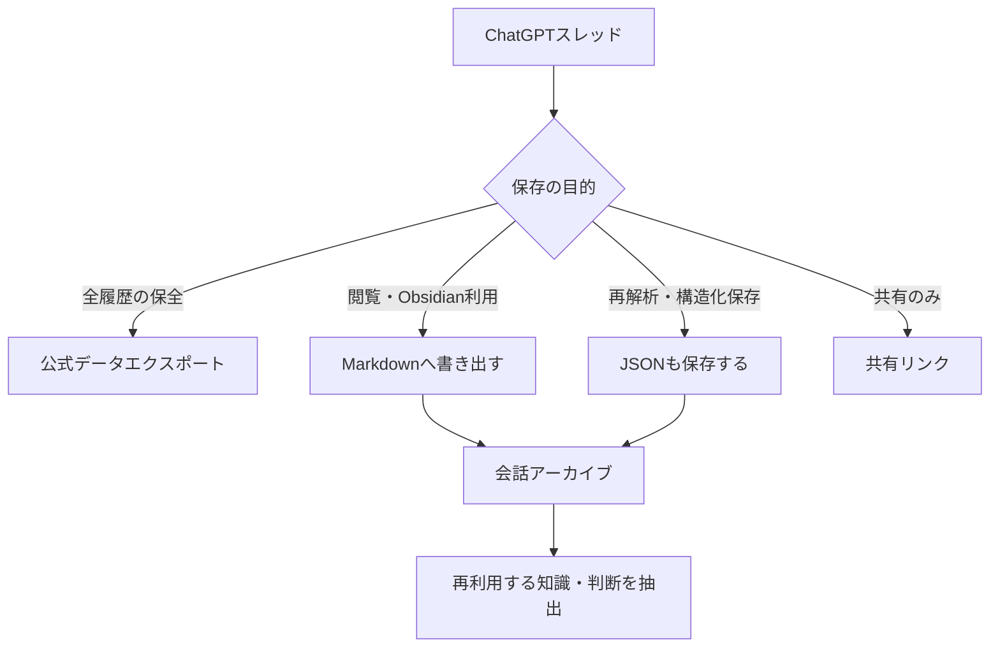

特定のChatGPTスレッドを、Obsidianで再利用できる1ファイルとして保存するための調査記録。検討時点では、ChatGPT標準機能に「現在の1スレッドだけをMarkdownへ直接書き出す」用途に特化した機能はなく、公式の全データエクスポート、共有リンク、ブラウザ拡張などを使い分ける必要があった。現在の提供機能は変わり得るため、実行前に確認する。

## 何を保存したいかで方法を選ぶ

| 目的 | 形式・方法 | 利点 | 制約 |
|---|---|---|---|
| アカウント全体の原データを保全する | 公式データエクスポート | 公式経路で会話履歴を取得できる | 特定スレッドだけを即座に保存する用途には重い |
| 特定スレッドを共有する | 共有リンク | 閲覧・共有が容易 | ローカルファイルのアーカイブではない |
| Obsidianで読む・引用する | Markdown | 人間が読みやすく、編集・リンクしやすい | 構造化メタデータは限定的 |
| 将来の再解析・変換に備える | JSON | 発言者・構造・メタデータを扱いやすい | そのまま読む用途には向かない |
| 元画面に近く保管する | HTML / PDF | 表示を残しやすい | 知識としての再利用は難しい |

1ファイルだけを残すならMarkdownを優先する。重要な会話では、Markdownを閲覧用、JSONを原データ用として並べて残す選択肢がある。



## 個別エクスポートには完全性と安全性を求める

検討時には、ブラウザ拡張による個別エクスポートが日常利用の候補だった。例として、VMSTE ChatGPT Exporter、`maks-bond/chatgpt-conversation-exporter`、Markdown特化型Exporter、複数AI対応のTrifall Chat Exportなどを調べた。これらは当時の候補名であり、現在の公開状況・保守状況・安全性を保証しない。

| 選び方 | 向く用途 |
|---|---|
| 導入の容易さと形式の多さを優先 | 一般的な個別エクスポート |
| 長い会話の欠落を避けることを優先 | 会話データ取得や仮想化メッセージの読込を明示する実装 |
| Obsidian取り込みを最優先 | YAMLやコードブロックを整えてMarkdown化する実装 |
| ChatGPT以外も保存したい | 複数の生成AIに対応する実装 |

長いスレッドでは、画面上のDOMだけを変換する実装に注意する。表示高速化のため過去メッセージが仮想化されている場合、現在描画されている範囲だけを保存すると途中の発言が抜ける可能性がある。完全性を重視するなら、取得方式と欠落時の扱いを確認する。

## 「完全保存」の範囲を正しく定義する

通常の会話エクスポートで保存できるのは、ユーザーとAIの間で表示・アクセスできる会話である。

| 保存を期待できるもの | 通常は完全保存を期待しないもの |
|---|---|
| ユーザー発言、AIの最終回答、Markdown、コード、表、リンク | システムプロンプト、内部推論、非表示コンテキスト |
| 一部の引用・添付情報 | 選ばれなかった再生成回答、一部の対話UI、一時URL |

したがって「完全なスレッド保存」とは、内部状態のバックアップではなく、**表示された会話を最初から最後まで可能な限り欠落なく残すこと**と定義する。

## 拡張機能は会話を読む権限を持つ

ブラウザ拡張はChatGPTページ内の会話を取得するため、機密性の高い会話にもアクセスできる。導入前には次を確認する。

1. ソースコードが公開されているか。
2. 会話内容を外部サーバーへ送らないか。
3. 要求するブラウザ権限が必要最小限か。
4. 保守・更新が継続しているか。
5. プライバシーポリシーと実装の説明が矛盾していないか。

ストア上の「データを収集しない」という表示だけで安全性を確定しない。機密情報を含むスレッドでは、実装を検証できるオープンソースか、公式エクスポートを優先する。

## Obsidianでは会話と知識を分離する

会話全文には、質問、試行錯誤、誤答、一時的な判断、採用しなかった案も含まれる。Markdown化した会話をそのままPermanent Noteにせず、会話アーカイブとして残し、再利用する知識と判断だけを別ノートに抽出する。

```text
ChatGPTスレッド
  ↓ Markdown / JSONで保存
会話アーカイブ
  ↓ 判断・根拠・再利用可能な知見を抽出
Research / Permanent Note
```

この分離により、判断過程を追跡できる一方で、知識ベースを会話ログの断片で埋めずに済む。
