## 記録の性質

このノートは、「以前の説明がぼんやりしていたため、デジタルメモ術としてのボクシング・メソッドを由来・やり方・向き不向きまで整理してほしい」という依頼に対するAIの回答を再構成したものです。以下の説明はAIによる整理であり、Fukkamaru自身が検証・採用済みの結論ではありません。

元の回答ではGoodnotes、E-Student、Lifehackerへの言及があるものの、出典URLと確認時点は記録されていません。外部資料に関する記述は、必要になった時点で別途確認します。

## 概要

AIの説明では、ボクシング・メソッドは格闘技ではなく、情報を箱（box）や枠で囲み、話題ごとに整理するノート術として扱われています。中心となる考え方は、一つの箱に一つの話題を入れ、あとから見返しや再利用をしやすくすることです。

## 基本イメージ

普通のメモは、こうなりがちです。

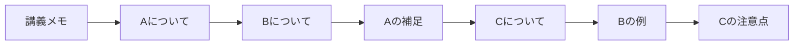

ボクシング・メソッドでは、こう分けます。

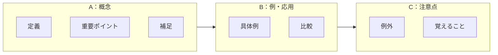

つまり、**1つの箱に1つの話題**を入れます。  
E-Studentも、同じ話題に関する考え・アイデア・概念を縦に並べて「トピックごとの情報クラスター」を作り、新しい話題に移ったら前のまとまりを箱で閉じる、と説明しています。

## 具体的なやり方

### 1. まずページを2〜4列くらいに分ける

最初からきれいな箱を作ろうとしなくてOKです。  
画面が縦長なら2列、横長なら3〜4列くらいに分けると使いやすい、と紹介されています。

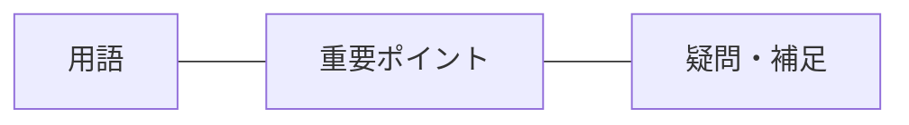

### 2. 見出しを先に置く

箱のタイトルになる見出しを作ります。

読書メモなら、たとえばこうです。

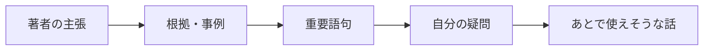

ここがミソです。  
ボクシング・メソッドは「ただ囲む」のではなく、**先に分類の箱を用意して、情報の置き場所を決める**のが本体です。

### 3. 中身は短く書く

箱の中には、長文ではなく短い文・キーワード・箇条書きで入れます。  
E-Studentも、短く情報量のある文、略語、記号などを使うと相性がよいと説明しています。

悪い例：

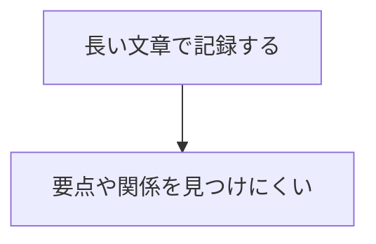

よい例：

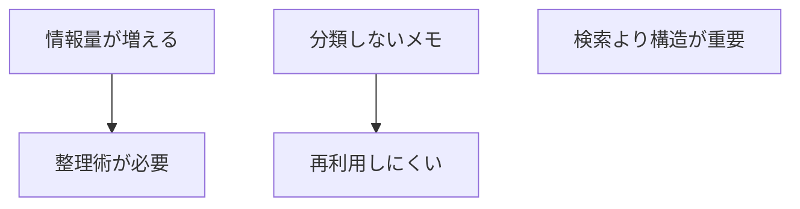

### 4. 後から箱を整える

リアルタイムで完璧に分類しようとすると、メモに気を取られて内容を聞き逃します。  
Lifehackerも、リアルタイムで全部分類しようとせず、あとで適切なボックスに移動する時間を作ることをすすめています。

なので実際の運用は、

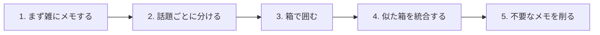

この順番がラクです。

### 5. 関係する箱を線・色・タグでつなぐ

ボクシング・メソッドは、マインドマップに近い面もあります。  
Lifehackerでは、同じようなアイデアや概念をボックスでグループ化し、関連するボックスを線でつないだり、色分けしたりできると説明されています。

たとえば読書メモなら、

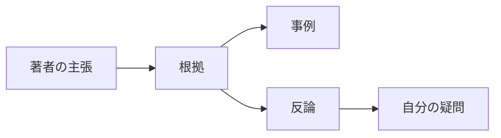

こんな感じで、**箱同士の関係**を見えるようにします。

## デジタルメモと相性がいい理由

紙でもできますが、ボクシング・メソッドは特にデジタル向きです。  
理由は、箱の中身をあとから移動・追加・削除・拡張しやすいからです。Lifehackerも、デジタルならコピー＆ペースト、テキスト追加、ボックスサイズの拡張が簡単だと説明しています。

紙だとこうなりがちです。

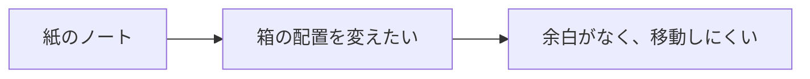

デジタルなら、

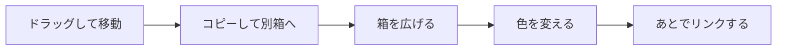

ができます。だから、OneNote、Goodnotes、Notion、Obsidian Canvas、Miro、Apple Freeform みたいなツールと相性がいいです。

## Obsidianでやるなら

Obsidianなら、通常ノートでは「見出し＋箇条書き」でボックス風にできます。

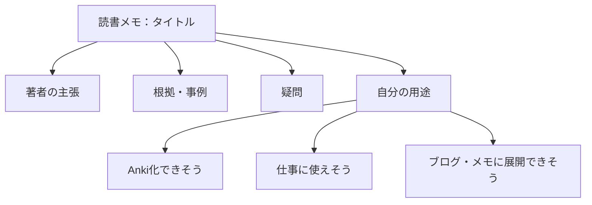

視覚的にやるなら **Obsidian Canvas** のほうがボクシング・メソッドに近いです。  
1カード＝1箱として、カードを並べて、線でつなぐイメージです。

## 向いているもの

ボクシング・メソッドが向いているのは、**話題が複数に分かれる情報**です。

たとえば、

- 読書メモ
- 講義メモ
- 資格勉強
- 商品・市場調査
- 会議メモ
- 比較表の前段階
- Anki化する前の整理

逆に、時系列が大事な日記や、手順を上から順に追うマニュアル作成だけなら、普通のアウトラインのほうが向いています。E-Studentも、ボクシングは万能ではなく、速い講義や構造が弱い教材では使いにくい場合があると整理しています。

## 使いどころのコツ

ボクシング・メソッドは、**最初から完成ノートを作る方法ではなく、あとで再利用しやすい形に情報を分ける方法**です。

なので、読書ならこの流れがかなり使いやすいです。

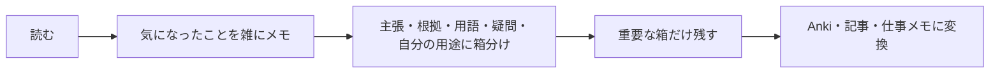

一言でまとめるなら、

> **ボクシング・メソッドは、メモを“文章の流れ”ではなく、“意味のかたまり”で整理する方法。**

です。  
読書メモや学習メモにはかなり相性いいです。特に「あとでAnki化したい」「あとでブログや資料に使いたい」タイプのメモには、なかなか強いです。
