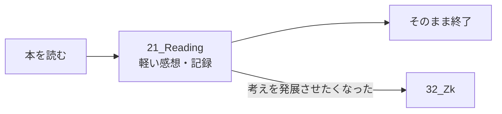

新規フォルダを作るのがよいと思います。位置づけとしては **Journalの近く、Zkとは別** が自然です。

第一候補はこれです。

```text
01_Templates
02_Images
10_Analytics
20_Journal
21_Reading
30_Inbox
31_Research
32_Zk
```

### なぜ `21_Reading` か

今回残したいものは、ZettelkastenでいうLiterature Noteとは少し違います。

目的は、

> 本の内容を正確に抽出・構造化すること

ではなく、

> **自分がその本を読んだときに何を感じたか、何が引っかかったかを、負担なく残すこと**

だからです。

数ページしか読まなくても成立する。

```text
本を少し読む
↓
1〜数行だけ残す
↓
それで完了
```

これでよい。

その意味では、`Research`よりも`Journal`に近い性質があります。ただしJournalへ全部入れるより、**読書だけ独立させた方がQuartzでもObsidianでも一覧性が高い**です。

### `Books`より`Reading`を推す

例えば、

```text
21_Books
21_Book_Notes
21_Reading
```

なら、私は`Reading`を選びます。

`Books`だと「蔵書管理」「読了本データベース」のニュアンスが強くなります。

`Book_Notes`も、少し「ちゃんとノートを書かなければ」という方向に寄りやすい。

一方、

> `Reading` = 読んだという活動の記録

なら、

- 3ページしか読んでいない
- 途中で読むのをやめた
- 目次だけ眺めた
- 一部分だけ面白かった
- 久しぶりに再読した

でも全部正当な記録になります。

今回の「読書習慣を戻したい」という目的にも合っています。

### 1冊1ノートもよい

これは今回かなり重要だと思います。

たとえば一つの巨大な読書ログに、

```text
8/30 Aという本
8/31 Bという本
9/1 Cという本
```

と書くのではなく、

```text
21_Reading
├── 『○○○○』
├── 『△△△△』
└── 『□□□□』
```

とする。

これならQuartzでも、

> 「読んだ本が1冊＝1ページ増えた」

と視覚的に分かります。

しかも「読了した本」だけでなく、**触れた本が蓄積していく**ので、達成感を作りやすいです。

一冊を何度か読む場合は、その本のノートに追記して構わないと思います。

```markdown
## 2026-08-30
最初の20ページほど。
○○という考え方が面白かった。

## 2026-09-03
40ページ付近まで。
前回気になった○○について、著者はここで〜。
```

この程度で十分です。

### Zkとの関係

ここもResearchと似た構造にできます。

```text
21_Reading
    ↓
「これは自分の思考として残したい」
    ↓
32_Zk
```

つまり、



例えばReadingには、

> 「この著者の『習慣は環境に依存する』という話が気になる。自分のObsidian運用にも似ている。」

くらいを書いておく。

後日ちゃんと考えたくなったら、Zkに

> 「継続を意思ではなく環境設計で支える」

のようなカードを作り、元の読書ノートへリンクする。

これで十分です。

### 以前の重い読書ノートは別物として扱う

Notionでやっていた、

- テーマ
- 命題
- ティンバーゲンの4事象
- 各章ごとの整理

は捨てる必要はありません。

ただし、これは**通常の読書記録ではなく「精読・分析」**として扱った方がよいです。

つまり、

```text
軽い通常運用
21_Reading
→ 数ページでもOK
→ 感想だけでもOK

必要な本だけ
精読・分析
→ 従来の詳細なフレームワーク
```

と分離する。

「本を読むたびに分析しなければならない」をやめることが重要です。

現時点では、**`21_Reading`を新設し、「1冊1ノート・数行でも完成・必要になったものだけZkへ」という運用**が最も合っていると思います。