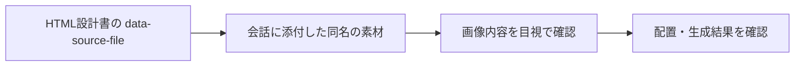

# ChatGPTにアップロードしたファイル名を認識できる条件

## 検討の背景

サムネイル生成では、HTML設計書に素材画像のファイル名を書き、同じ素材を会話へ個別にアップロードする方式を検討した。目的は、HTMLが指定する画像と実際に添付した画像を取り違えず、どのスロットに何を配置するかを確認できるようにすることである。

ここで確認したかったのは、PC内のファイル名や保存場所をAIが自動的に見つけられるかではない。同じ会話へ渡した設計書と素材の間で、ファイル名を照合の手掛かりにできるかである。ファイル名だけに依存すると、似た構図の画像や同名ファイルを取り違えたまま生成へ進む危険があるため、設計書、添付状態、内容の三つを別々に確認する必要がある。

## 結論

同じ会話にアップロードされ、ChatGPTが参照できる状態のファイルは、ファイル名を手掛かりに区別できる。HTMLなどに書かれたファイル名との照合もできるため、設計書と素材を結び付ける実務上の手掛かりになる。この方法は、会話の中で素材の対応を確認するための運用であり、PC全体を検索する仕組みでも、永続的なファイル管理の仕組みでもない。

ただし、ファイル名だけで対応関係を確定してはいけない。添付状態とファイル内容を合わせて確認し、不一致や不足があれば推測で補わない。

## 確認できる範囲と限界

| 対象 | 扱い |
| --- | --- |
| 会話にアップロードしたファイル名 | 添付ファイルを区別する手掛かりとして利用できる。 |
| HTML内のファイル名との照合 | 添付済みの同名ファイルであれば、対応候補として照合できる。 |
| ファイル内容との確認 | 画像や文書の内容も合わせて、対応関係を確認できる。 |
| PC上の元の保存場所 | アップロードだけでは通常わからない。 |
| アップロードしていないPC内の別ファイル | 通常は参照できない。 |

同名ファイルが複数ある場合、アップロードに失敗している場合、ファイル名と内容が一致しない場合は、ファイル名だけでは判定しない。

## HTML設計書と素材を対応付ける方法

HTML側には、素材を指定する属性を置く。

```html
data-source-file="塗料混合シーン.jpg"
```

素材画像を元のファイル名のまま個別にアップロードすれば、`data-source-file`を照合キーとして使える。ここでのキーは、データベース上の恒久的な主キーではなく、会話内で素材を確認するための運用上のキーである。



ファイル名が一致しても、古い版の画像を添付していたり、別の素材に同じ名前を付けていたりすれば、対応関係は確定しない。照合キーは確認の入口であり、内容確認を省くためのものではない。

## 実際の確認手順

1. HTMLに記載されたファイル名を読む。
2. 同じ会話に、対応する添付ファイルが存在するか確認する。
3. ファイル名と画像内容が、意図した素材に一致するか確認する。
4. 一致しない場合は、別素材で代用せず、必要な画像または指示を確認する。
5. 生成・配置後にも、HTMLの指定と出力結果を照合する。

途中で不足や不一致を見つけた場合は、似た素材で補完したり、AIに推測させたりせず、必要なファイルを再添付するか、設計書を修正する。対応付けを曖昧なまま進めないことが、この方式の目的である。

## 運用上の注意

- ファイル名を変更した場合は、HTML側の記載も同時に更新する。
- ファイル名は内容の保証ではないため、特に似た素材では画像内容も確認する。
- 正確な配置が必要な成果物では、設計書・添付素材・最終出力の三者を確認する。
