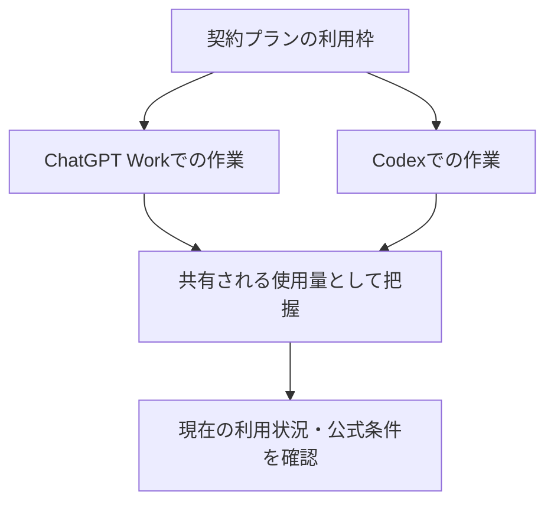

ChatGPT WorkとCodexの利用枠について生じた誤解を正すための記録。確認時点のOpenAI公式情報では、両者の料金体系、クレジット、使用量上限は独立した残量ではなく、共有される前提で扱う。したがって「Codexだけの週間枠をWorkとは別に使える」とは考えない。[OpenAI公式](https://learn.chatgpt.com/docs/enterprise/work-admin-faq)

> 利用枠やリセット条件は変更され得る。実際の契約・追加利用の判断では、その時点の公式画面と利用条件を確認する。

| 区分 | このノートでの整理 |
|---|---|
| WorkとCodex | 共有される利用枠を使う作業環境 |
| 使用量上限 | 依頼の複雑さ、推論量、ファイル・ツール利用、実行回数、契約条件で変動する制限 |
| 完全リセット・追加クレジット | 利用条件に基づく別の仕組み。固定Token量や固定作業時間としては扱わない |

利用量を見積もるときは、WorkとCodexの残量を足し合わせるのではなく、同じ作業用の利用枠をどの作業が使うかとして考える。表示上の割合を、固定のToken数や処理時間へ機械的に換算することはできない。

この整理の目的は利用枠を回避する方法を設計することではない。通常Chat、Work、Codexの使い分けを通じて作業量を見積もり、必要なら実行時期や作業単位を調整するための前提である。
