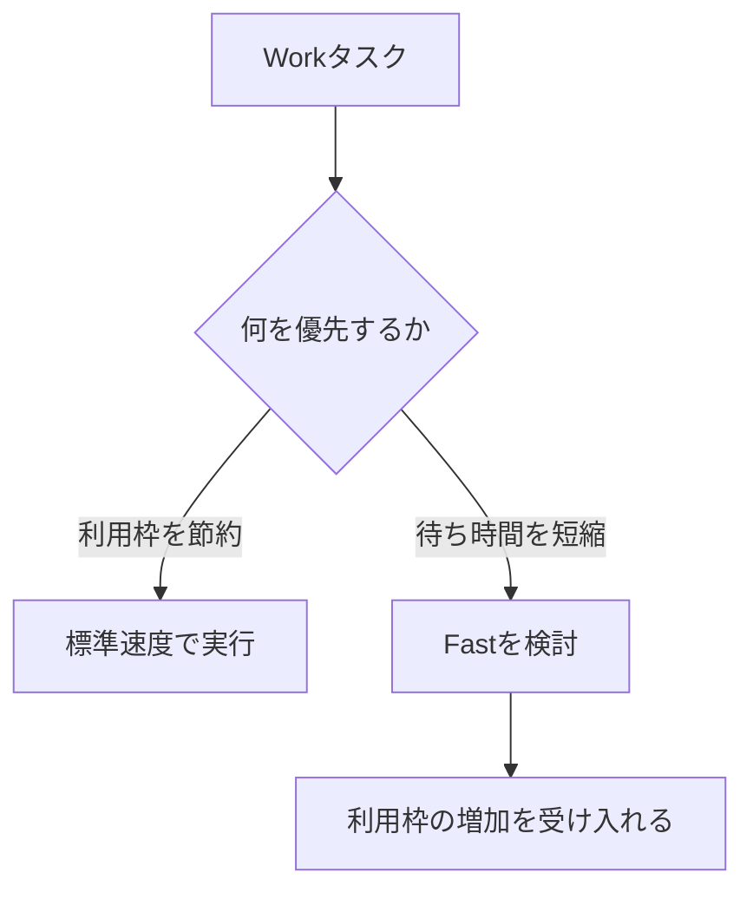

Fastモードは、検討時点のChatGPT Workで「より多くのプラン使用量を消費する代わりに、処理完了までの待ち時間を短くする」選択肢として表示された。具体的な速度倍率・利用枠への影響・対象プランは変わり得るため、実際に使うときは画面上の説明と現在の利用条件を確認する。

このノートの結論は、Fastを性能の上下ではなく、**時間と利用枠の交換**として判断することである。

| 比較軸 | 標準 | Fast |
|---|---|---|
| 処理時間 | 通常 | 短縮を狙う |
| モデル・推論設定 | 選択した設定に従う | 基本的には別物に置き換える機能ではない |
| 利用枠の消費 | 通常 | 増える可能性がある |
| 向く場面 | 利用枠を節約したい | 待ち時間が次の作業を止めている |

## Fastを使う判断

Fastは「処理能力を増やす」より、作業の待ち時間を減らすための選択肢として使う。大量処理や急ぎでないバックグラウンド処理では、標準速度で十分なことが多い。一方、結果を確認して次の指示を出す往復が続き、10〜20分単位の待ちが作業のボトルネックになるなら価値が上がる。

| 標準を優先する状況 | Fastを検討する状況 |
|---|---|
| 大量ノートのクラスタリング | 結果待ちの間に次の判断が止まる |
| 大量ファイルの調査 | 修正・確認を短い周期で何度も往復する |
| 寝る前など、完了を急がない処理 | 限られた時間内に作業完了が必要 |
| 利用枠の残量を優先したい | 追加の枠消費を許容できる |

## Fastの案内画面は機能と分けて読む

検討時には、過去の利用履歴を基に「Fastを使っていればどれだけ時間を短縮できたか」を示す案内が表示された。これは単なる状態通知ではなく、Fastの利用を促すプロダクト内プロモーション（アップセルUI）と見るのが適切である。

| 対象 | 役割 |
|---|---|
| Fastモード | 時間短縮と利用枠消費を交換する実行機能 |
| Fastの案内 | 過去の利用状況を根拠に、その機能の利用を促す表示 |

第三者の外部広告とは異なるが、「OpenAI自身の機能利用を増やすための自社プロモーション」という理解でよい。案内に表示された節約時間は参考値であり、常時Fastを有利にする根拠にはしない。

## 運用ルール

1. Fastを既定で常用しない。
2. 待ち時間が次の判断や作業を止める場合だけ検討する。
3. 利用枠の残量が少ないときは標準を優先する。
4. 実際の速度差と消費の表示を一度記録し、自分の作業で得かを判断する。

Fastの価値は「速いか」だけで決まらない。短縮された時間が実際に次の仕事へ使われるか、そして増える利用枠消費を許容できるかで決める。
