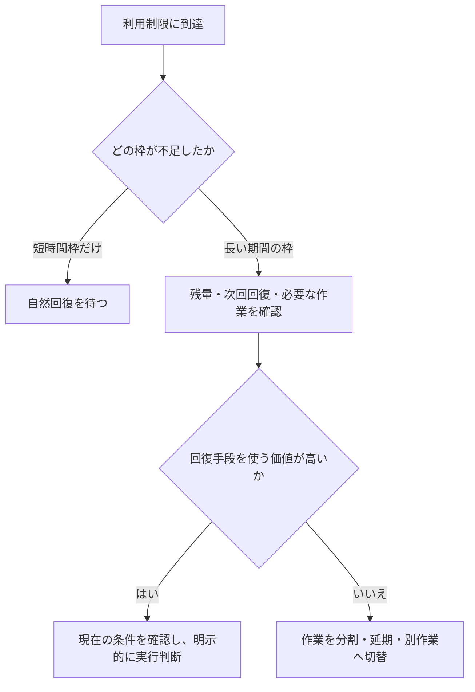
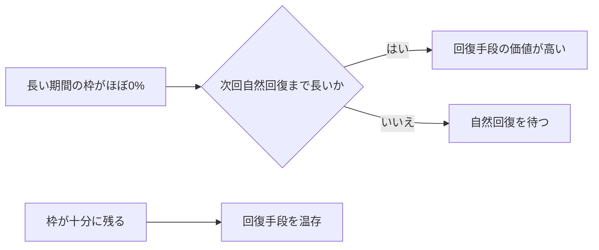
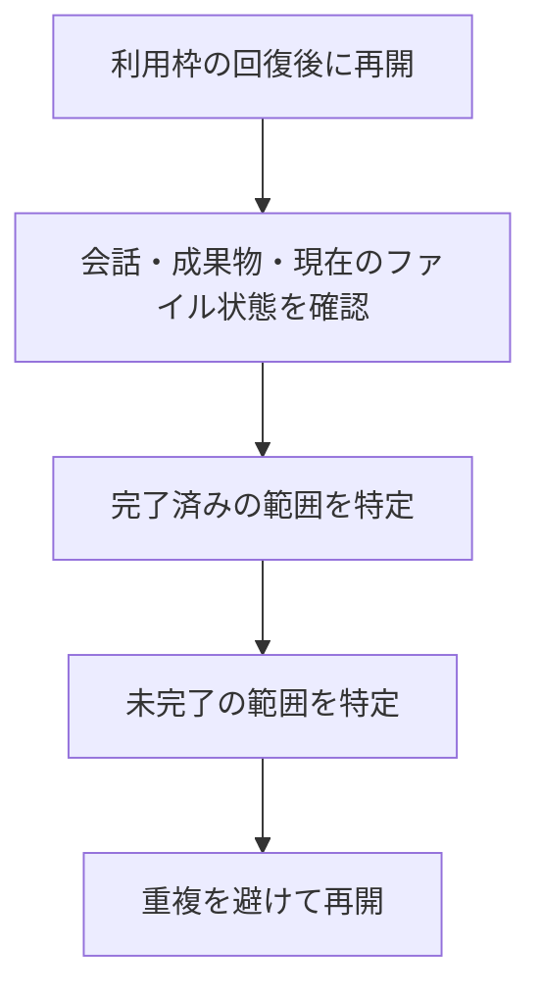
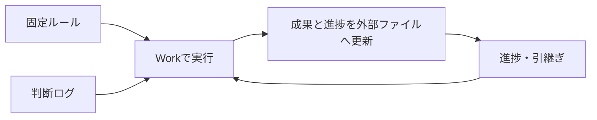

長時間のChatGPT Work運用で扱うべきなのは、短い時間枠、長い期間の利用枠、利用枠を回復させる仕組み、そして中断後に作業を正しく再開する方法である。このノートは検討時点の運用記録であり、枠の種類・残量・リセット条件はプランや時期で変わり得る。実際の利用・リセットは、その時点の画面と公式条件を確認して判断する。

> 基本方針：短時間枠の枯渇は原則として自然回復を待ち、長い期間の利用枠が尽きて影響が大きいときだけ、利用可能な回復手段を慎重に検討する。

## 利用枠と回復手段を混同しない

| 区分 | 検討時の捉え方 | 基本対応 |
|---|---|---|
| 5時間単位などの短時間枠 | 使い切ると数時間の待機が生じる場合がある | 緊急でなければ自然回復を待つ |
| 週間などの長い期間の枠 | 使い切ると次の周期まで影響が長い | 作業計画を見直し、必要なら回復手段を検討 |
| 完全リセット等の回復手段 | 残量を積み増すのではなく、枠を回復・周期を切り替えるものとして扱う | 残量と次回自然回復までの時間を見て判断 |

完全リセットの可否、個数、期限、実際に何を回復するかはアカウントや時期に依存する。保存されている回復手段を「毎月必ず一定数得られる通常枠」とは見なさない。



## 回復手段の価値は「残量」と「待ち時間」で決まる

当時の考え方では、完全リセットは残っている利用率へ100%を加算する仕組みではなく、現在の枠を回復させるものとして理解した。したがって、長い期間の枠が大きく残っている状態で使うほど、残量を捨てる可能性がある。

| 状況 | 検討時の価値判断 |
|---|---|
| 長い期間の枠がほぼ0%、次回自然回復まで長い | 高い。必要な作業があれば検討する |
| 長い期間の枠がほぼ0%、次回回復まで数時間 | 低い。待機が合理的なことが多い |
| 枠が40%以上残っている | 低い。残量を失う可能性が大きい |
| 短時間枠だけが0% | 原則として自然回復を待つ |



回復手段の実行は、通常の作業操作とは別に、常に明示的な確認を伴うものとして扱う。期限が近いことだけを理由に使うのではなく、失われる残量と作業上の必要性を比べる。

## 中断後は「状態確認」から再開する

利用制限で作業が止まっても、会話・過去の指示・保存済み成果物・ファイルへ反映済みの変更は残り得る。一方、実行中の内部処理位置、未保存の一時状態、AI内部だけの進捗が完全に復元されるとは前提にしない。



再開時の依頼は「続きをしてください」だけにしない。次のように明示する。

```text
これまでの成果物と現在のファイル状態を確認してください。
完了済みの変更を繰り返さず、未完了の範囲と次の作業を特定してから再開してください。
```

予約実行を使う場合も、利用制限そのものを迂回する手段とは見なさない。回復予定の後に再開を試みる補助であり、実行時点の利用可能性を確認する必要がある。

## 長期作業では会話を唯一の正本にしない

同じWorkスレッドを長く使い続けると、古い指示の優先度が相対的に下がる、最近の指示へ引っ張られる、細かい例外を見落とす、といった判断の揺れが起こり得る。対策は、会話を無限に伸ばすことではなく、作業状態を外部のMarkdownへ分けて残すことにある。

| 外部化する情報 | 役割 |
|---|---|
| Master Instructions / Policy | 恒久ルール、禁止事項、命名規則、判断基準 |
| Decision Log | 作業中に確定した判断、その理由、以前の判断からの変更 |
| Progress / Handoff | 完了済み、現在位置、未処理、次に行うこと |



これにより、短時間の中断、新規スレッドへの切替、作業者の変更があっても、同じ作業状態から復帰しやすくなる。

## スレッドは意味上の区切りで分ける

「何時間使ったか」「何メッセージになったか」だけでは分けない。1クラスタ、複数の子クラスタ、1作業フェーズ、大きな判断が確定した地点など、成果物にとって意味のある境界で新しいWorkへ切り替える。

```text
親クラスタA
├─ Work 1：子クラスタA1〜A3
├─ Work 2：子クラスタA4〜A6
└─ Work 3：親クラスタ全体の統合監査
```

この分割が機能する前提は、固定ルール・判断ログ・進捗が外部にあること。Workは実行環境、外部Markdownは作業状態の正本、という役割分担にすると長期運用が安定する。
