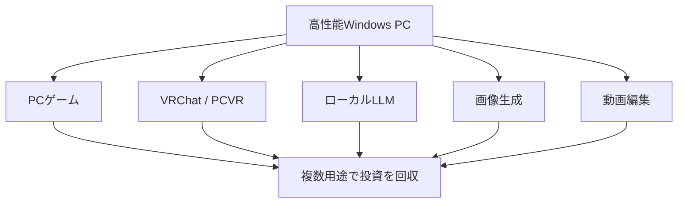
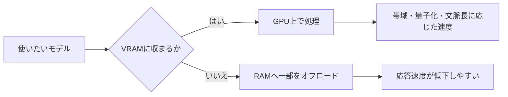

ローカルLLMだけの専用機ではなく、PCゲーム・VRChat・PCVR・画像生成・動画編集も担う高性能Windows PCとして選ぶための基準。GPU型番・価格・各製品の仕様は検討時点の記録なので、購入時には最新の仕様、実売価格、電源容量、ケース寸法、対応ソフトを再確認する。

## 投資判断は「共用する用途」から始める

AIだけのために高額なPCを買うのではなく、同じCPU・GPU・ストレージを複数用途で使う。ローカルLLMでは、モデルがVRAMに収まる容量と、生成速度に影響するメモリ帯域を分けて考える。

| 要素 | 主な役割 | 優先度 |
|---|---|---:|
| VRAM容量 | 常用するモデル規模を決める | 最優先 |
| VRAM帯域 | 生成速度へ影響する | 高 |
| RAM容量 | ゲーム・VR・OS・RAG・オフロードの余裕 | 高 |
| GPUの演算性能 | ゲーム・PCVR・画像生成・長い入力の処理 | 高 |
| CPU | VRChat、ゲーム、周辺処理 | 中〜高 |
| プラットフォーム・電源・ケース | 将来のGPU・CPU・ストレージ更新 | 高 |

## GPUはVRAM容量と帯域を別に比較する

モデルがVRAMに収まらなければRAMへ一部を逃がせる場合があるが、速度は落ちる。帯域は、VRAMに収まったモデルをどれだけ速く読めるかに影響する。

元の比較では、16GB VRAMでも帯域の異なるGPUを比べ、容量が同じならLLMで扱えるモデル上限は近い一方、ゲーム・PCVR・画像生成・生成速度には差が出ると整理した。32GB級VRAMはLLMでは別のモデル規模を狙えるが、価格帯も変わる。

## 兼用PCとしての構成基準

| 項目 | 検討時の基準 | 理由 |
|---|---|---|
| CPU | AMD Ryzen X3D系を有力候補 | ゲーム・VRChatでのCPU負荷を重視 |
| CPUプラットフォーム | AM5 | 将来のCPU交換余地を期待 |
| マザーボード | B850級ATXを基準候補 | 拡張性と価格のバランス |
| RAM | DDR5 64GB（32GB×2） | ゲーム・VR・LLM・RAGの同時利用に余裕を持たせる |
| GPU | 新品の16GB VRAM級を基準候補 | LLMとゲームを両立させる |
| ストレージ | NVMe SSD 2TB、空きM.2を確保 | モデル、ゲーム、RAG、映像素材を保存する |
| 電源・ケース | 将来の大型GPUに余裕を持たせる | GPUだけを更新しやすくする |

AMD X3Dを有力候補としたのは、LLM性能だけでなくVRChat・PCVR・ゲームでの優先度による。Quick Sync等の動画処理を重視する場合はIntelにも意味があるため、用途の比重で選ぶ。

RAMは、AM5で4枚挿しを前提にせず`32GB × 2 = 64GB`を基本とする。128GBが必要なら`64GB × 2`を検討する。M.2とPCIeのレーン共有、大型GPU装着後に残る拡張スロット、BIOS Flashback、LAN、USB-Cなどは候補マザーボードごとのマニュアルで確認する。

## 予算は「LLMのモデル規模」で段階を分ける

| 位置付け | 構成の考え方 |
|---|---|
| 入門 | 16GB VRAM未満〜16GB級、ローカルLLMは補助用途 |
| 総合バランス | 16GB VRAM、64GB RAM、ゲーム・VRChat・LLMを併用 |
| ゲーム・PCVR重視 | 同じVRAM容量でもGPU演算性能・帯域を上げる |
| LLMを大きく拡張 | 24〜32GB以上のVRAMを優先し、予算帯を上げる |
| ワークステーション級 | 70B級等をGPU中心で扱うための大容量VRAM |

元の候補では、Ryzen 7 X3D、AM5、B850、DDR5 64GB、RTX 5070 Ti 16GB、NVMe 2TBを総合バランス案とした。これは当時の価格・製品群を前提にした例であり、固定の購入推奨ではない。

## 結論

優先順位は、**VRAM容量 → RAM容量と増設性 → GPU性能・帯域 → CPU → SSD・電源・冷却**。ローカルLLMは最上位クラウドAIの全面的な代替ではなく、機密資料、個人ノート、RAG、定型分類、繰り返し処理を補う環境として設計する。最新情報・高度な推論・総合的なAgent作業はクラウドAIと併用する。
