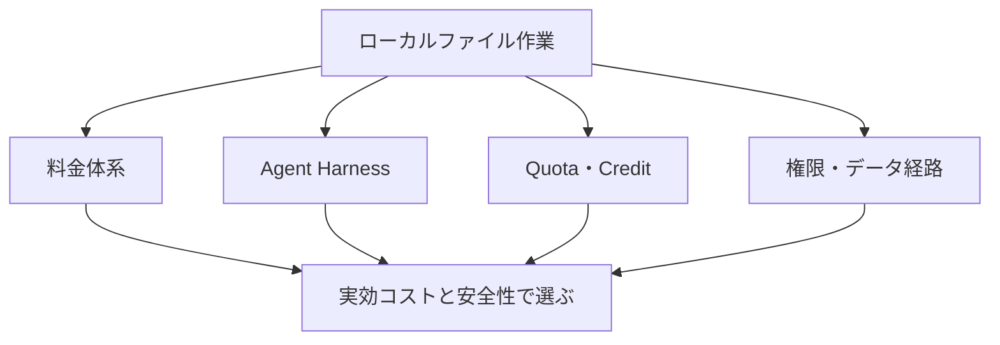
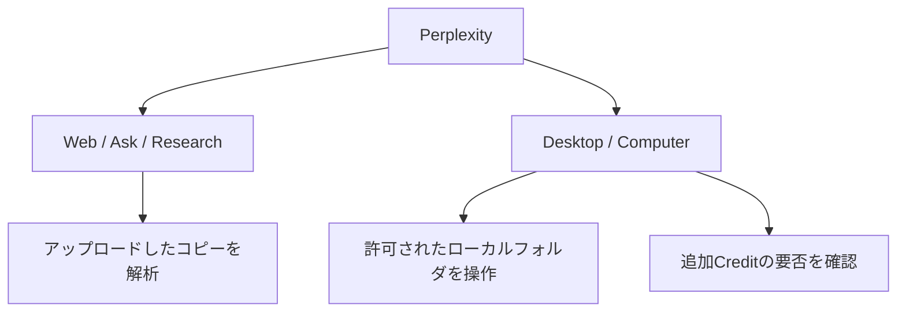

PC上のローカルファイルやObsidian VaultをAIに扱わせるとき、選定基準をモデル性能だけに置くと判断を誤りやすい。このノートでは、**料金体系、Agent Harness、利用枠（Quota）、権限・データ経路**を分けて評価する。

価格・利用枠・機能は検討時点の記録であり、導入直前には公式情報を確認する。特に「ローカルファイルを扱える」と「ファイル内容がPC外へ出ない」は別の条件である。

## 選定の中心に置く4つの問い

| 問い | 確認すること |
|---|---|
| 月額内でどこまで動くか | 定額枠、従量課金、追加Creditの有無 |
| 何を実行できるか | 読み取り、編集、Terminal、Git、差分確認、外部ツール |
| 枠の減り方を説明できるか | 時間枠・週次枠・Credit・Token・Cacheの扱い |
| データはどこを通るか | クラウド送信、保持、学習利用、オプトアウト、地域 |



## Perplexityは検索とComputerを分けて扱う

当時の把握では、Perplexity Proでの検索・Researchと、Desktop / Computerによるローカル操作は同じ料金枠ではなかった。ファイルをアップロードして解析することと、ローカルフォルダを許可して検索・作成・編集・整理することも別機能である。



検討時点では、Consumer向けProのComputerには恒常的な月次Creditが付かず、Credit残高が0と表示されることがあった。新規Pro向けのCredit付与があっても、恒常特典ではなく期間限定のプロモーションとして扱う。通信会社経由のProでCreditが0でも、直ちに通信会社版の機能制限とは結論づけない。

この前提では、Perplexityの担当は次のように置くのが合理的だった。

> PerplexityはWeb検索・Research担当。大量のローカル編集は、定額枠または従量制を明示できる別サービスで比較する。

本番Vaultを最初に渡さず、専用テストフォルダで「読み取り → 新規作成 → コピー編集 → 移動・リネーム → 本番データ」の順に検証する。

## 定額Agent枠の比較は「同額なら同量」ではない

検討時点での比較では、ChatGPT PlusのWork / Codex、Claude ProのClaude Code / Cowork、Google AI ProのAntigravityは、月額に基本的なAgent利用枠を含む候補だった。一方Perplexity Computerは別途Creditを確認する必要があった。

| サービス | ローカル作業の候補 | 検討時点の料金構造 | 運用上の見方 |
|---|---|---|---|
| ChatGPT Plus | Work / Codex | 月額内の利用枠 | 5時間・週次・推論・ツール利用などの複合要因を確認 |
| Claude Pro | Claude Code / Cowork | 月額内の利用枠 | チャットとコード作業の枠の関係を確認 |
| Google AI Pro | Antigravity | 月額内のBaseline Quota | 実行作業量に応じた消費と、追加Credit可否を確認 |
| Perplexity Pro | Computer | 別途Creditを確認 | 検索・Researchと混同しない |

同じ月額帯でも、利用枠の透明性と枯渇時の選択肢は異なる。具体的なToken量が公開されていない場合は、固定の「何ノート処理できるか」を推測せず、同一ベンチマークで測る。

## Agent Harnessとモデルを混同しない

CodexやClaude Codeは、単一モデルではなく、ファイル探索・読取・編集・Terminal・Git・差分・ツール呼び出し・文脈管理を担う実行基盤（Agent Harness）である。推論を担うモデルは、その下で差し替え可能な場合がある。

```text
Agent Harness
├─ ファイル探索・読取・編集
├─ Terminal / Git / diff
├─ ツール実行と文脈管理
└─ 推論モデル
   ├─ 各社の標準モデル
   └─ API経由の別モデル
```

したがってDeepSeek・MiniMax・GLMなどは、ChatGPTやClaudeの単純な代替としてだけでなく、既存Harnessを動かす低価格な推論エンジン候補としても比べる。実際に接続できるか、品質・安全性・料金がどう変わるかは、Harnessごとに検証する。

## 中国系モデル候補は料金モデルと透明性で見る

| 候補 | 検討時の位置付け | 判断に効く点 |
|---|---|---|
| DeepSeek | 低価格な従量API | Fresh Input、Cached Input、Outputの単価とCache Hit率 |
| MiniMax | 大きな定額枠を持つ候補 | 表示上のToken枠と実際のCache消費を分けて確認 |
| GLM / Z.ai | 低価格・Quota計算が比較的明瞭な候補 | Fresh / Cached / Outputの係数、モデル分業 |
| Kimi | Work・Code等を持つ候補 | 機能間で共有されるCreditと高性能モデルの消費 |
| Qwen / Alibaba | 多数モデルを大量利用する候補 | 5時間・週次・月次枠と契約帯 |
| ByteDance Seed / TRAE | 低コストで試す入口候補 | 内部モデルの単価、機能拡張の実態 |

各候補の価格や枠は変動するため、ここでは優劣を確定しない。DeepSeekではCache Hit率、MiniMaxでは大きな定額枠の実態、GLMではQuota計算の説明可能性が、比較の中心になる。

## 実効コストはCacheと人間の確認時間で決まる

Agentは、ファイルを読む、考える、別ファイルを読む、修正する、確認する、過去の文脈を再利用する、という循環を行う。そのため単純なInput / Output Token単価だけでは不十分である。

```text
実効AIコスト
= モデル単価 × Cache単価 × Context再利用量

実効作業コスト
= AI料金 + 人間のレビュー時間 + 誤編集の修正時間
```

| 指標 | 確認する理由 |
|---|---|
| 正しい変更率 | 必要な編集を正確にできるか |
| 誤編集・不要変更率 | ノートを壊さず、変更範囲を守れるか |
| 文脈理解 | ノート間の意味的な差異を扱えるか |
| Cache効率 | 同じ内容の再読を抑えられるか |
| Agent安定性 | 長時間作業で脱線しないか |
| diff / Gitの使いやすさ | 人が変更を検証・復元できるか |
| 人間の確認・修正時間 | 安いAIが実際に安いかを判断するため |

AI料金が半額でもレビュー時間が2倍なら、Zettelkasten整理では安い選択肢とは限らない。意味的な差異、Permanent化、統合かリンクか、発言者と資料由来の区別は、人間のレビュー負荷を特に左右する。

## 同一の小規模ベンチマークで比較する

本番Vaultではなく、代表的な約100ノートのコピーを用意し、同じ条件で各候補を比較する。元ノートでは「1,000ノートを走査し、関連・重複・YAML・リンクを確認して約100ファイルを整理する」という大きな想定も置いていたが、まずは小さく測る。

| 測定項目 | 記録する内容 |
|---|---|
| 処理範囲 | 読み込んだファイル数、編集ファイル数 |
| 品質 | 正しい変更数、誤編集数、不要変更数 |
| 実行量 | Fresh Input、Cached Input、Output、Credit・実費 |
| 利用枠 | 5時間・週次・月次Quotaの消費率 |
| 人間負荷 | レビュー時間、修正時間、復元のしやすさ |


## データ経路を最後に確認する

ローカルファイルを直接編集できても、クラウドモデルを使うなら必要な文脈は外部サーバーで処理され得る。OpenAI、Anthropic、Google、DeepSeek、MiniMax、GLM、Kimiなどを使う前に、少なくとも次を確認する。

- AI学習への利用とオプトアウト
- データ保持期間とログ
- APIデータの扱い
- 保存地域
- 機密情報の扱い
- 接続するフォルダと権限の最小化

## 暫定的な役割分担と次の判断

| 役割 | 暫定候補 |
|---|---|
| Web検索・Research | Perplexity Pro |
| 総合作業 | ChatGPT PlusのWork / Codex |
| ローカルファイル・コード作業 | Claude Code / Coworkを有力候補として検証 |
| Google連携を伴う作業 | Google AI Pro / Antigravityを比較 |
| 低価格な大量処理 | DeepSeek、MiniMax、GLMを同一条件で比較 |

結論は、サービスを一つに統一することではない。検索、総合作業、ローカル編集、大量処理を役割で分け、100ノートの実測で「正しい編集1件あたりの実効コスト」とプライバシー条件を確認してから本番Vaultへ進む。
