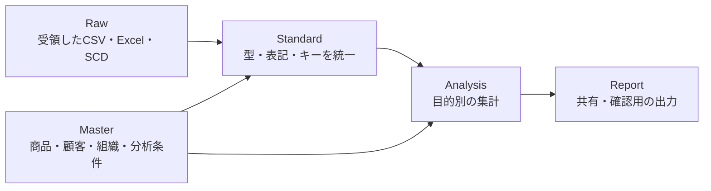

# データクレンジングのファイル構成と命名を考える

## このノートの位置付け

このノートは、売上分析に使う受領データ、標準化したデータ、分析用出力をどのように分けるかを整理する資料である。ここで扱うKPK、KPSC、SCなどの用語と架空事業の前提は、[Kyoto Patty 029の架空事業設定とデータ設計](kyoto-patty-029-sample-business.md)を参照する。

実在のフォルダ構成、ファイル名、データ処理の現状を記録するものではない。実務の構成を公開用サンプルへ置き換えるときに、どのデータをどの層へ置くかを判断するための設計例として使う。

## 解決したい問題

同じ受領データに対して、分析ごとに似たPower Queryの変換を作ると、修正漏れや処理の差異が起きやすい。一方で、用途の異なるデータまで一つに統合すると、変換や管理の理由が分かりにくくなる。

重要なのは、ファイル数を減らすことではなく、次の3点を分けることである。

1. 受領した値を残す場所
2. 分析に使える形へ変換する場所
3. 特定の問いに答えるために集計する場所

## 採用する構成

データはRaw、Standard、Analysis、Reportの4層で扱う。RawからReportへ直接つなげず、結合・表記統一・型変換などの共通処理はStandardに集める。



| 層 | 保存するもの | 変更時に確認すること |
| --- | --- | --- |
| Raw | 販売、仕入、在庫、SCDなどの受領データ | 元データの構造・受領時点を保てているか |
| Standard | 型変換、名称統一、結合キー、共通分類を加えたデータ | 変換の根拠と適用範囲が明確か |
| Analysis | 商品別、顧客別、地域別、チャネル別などの集計 | 集計粒度と対象条件が目的に合うか |
| Report | 定例資料、確認表、ダッシュボード用の出力 | 作業用列を出し過ぎず、解釈できるか |

## ファイルを共通化する判断

「同じデータを読むなら必ず一つのクレンジングファイルにする」とは限らない。次の条件で決める。

| 状況 | 推奨 | 理由 |
| --- | --- | --- |
| 同じRawデータに、同じ型変換・表記統一・結合を繰り返す | Standardを共通化する | 修正箇所を一つにし、変換のずれを防ぐ |
| Rawデータの列構成や更新頻度、品質条件が異なる | Standardを分ける | 無理な共通化で条件分岐を増やさない |
| 分析目的だけが異なる | Analysisを分ける | 目的ごとの集計条件を独立して説明できる |
| 出力先や閲覧者だけが異なる | Reportを分ける | 同じ分析結果を用途に応じて見せ分けられる |

たとえば、KPK、KPSC、地域別の分析が同じ売上データを読み、同じ商品・得意先マスタで標準化できるなら、共通のStandardを作る。その後、各分析は別のAnalysisとして持つ。

```text
Raw sales data
  ↓
sales-standard.xlsx
  ├─ sales-analysis-kpk.xlsx
  ├─ sales-analysis-kpsc.xlsx
  ├─ sales-analysis-region-monthly.xlsx
  └─ sales-analysis-region-cumulative.xlsx
```

## 命名の選択肢と判断

### `organization`と`org`

`organization_kpk_data.xlsx`のように完全な単語を使う案と、`org_kpk_data.xlsx`のように短縮する案を比較した。

`organization`は初見でも意味を読み取りやすい。`org`はフォルダ名、Power Queryのステップ名、ファイル名を短くでき、同じ意味で統一できるなら入力ミスも減らせる。

このサンプルでは、組織を表す接頭辞が必要な場合は`org_`を採用する。ただし、データが組織別であることがパスや親フォルダから明らかな場合は、接頭辞を重ねず`kpk`、`kpsc`のように短くしてよい。どちらを使う場合も、同じ階層で混在させない。

### 月次と累計

月ごとの受領データは`monthly`、期間をまたいで蓄積したデータは`cumulative`で分ける。名称だけでなく、更新方法も区別する。

| 区分 | 例 | 更新の考え方 |
| --- | --- | --- |
| 月次 | `raw/kpk/monthly/` | 対象月のファイルを追加する |
| 累計 | `raw/kpk/cumulative/` | 同じ対象期間の全件を置き換えるか、更新履歴を残す |

### クレンジングと分析

`sales-standard.xlsx`は共通の標準化結果を表す。`sales-analysis-*.xlsx`は、標準化結果を入力にして集計・条件設定を行う分析用ファイルを表す。ファイル名だけで、変換を担うのか、問いに答える集計を担うのかを判別できる。

## フォルダとファイル名の例

```text
data/
├─ raw/
│  ├─ kpk/
│  │  ├─ monthly/
│  │  └─ cumulative/
│  ├─ kpsc/
│  │  ├─ monthly/
│  │  └─ cumulative/
│  └─ scd/
├─ master/
│  └─ SalesAnalysisMaster.xlsx
├─ standard/
│  └─ sales-standard.xlsx
├─ analysis/
│  ├─ sales-analysis-kpk.xlsx
│  ├─ sales-analysis-kpsc.xlsx
│  ├─ sales-analysis-region-monthly.xlsx
│  └─ sales-analysis-region-cumulative.xlsx
└─ report/
   └─ sales-report-monthly.xlsx
```

この例では、RawとStandardを混ぜない。分析条件を変更するときは、まず`master/`とAnalysisの条件を確認し、Rawを直接編集して帳尻を合わせない。

## 判断基準

- 同じ変換を複数の分析で使うなら、Standardとして一度だけ定義する。
- 分析条件が異なるだけなら、変換を複製せずAnalysisで分ける。
- ファイル名は、対象、役割、更新単位が区別できる程度に具体的にする。
- 略語は、架空事業設定の用語表に定義されたものだけを使用する。
- 実際のパス、組織名、商品名、数値を公開用の例へ持ち込まない。
