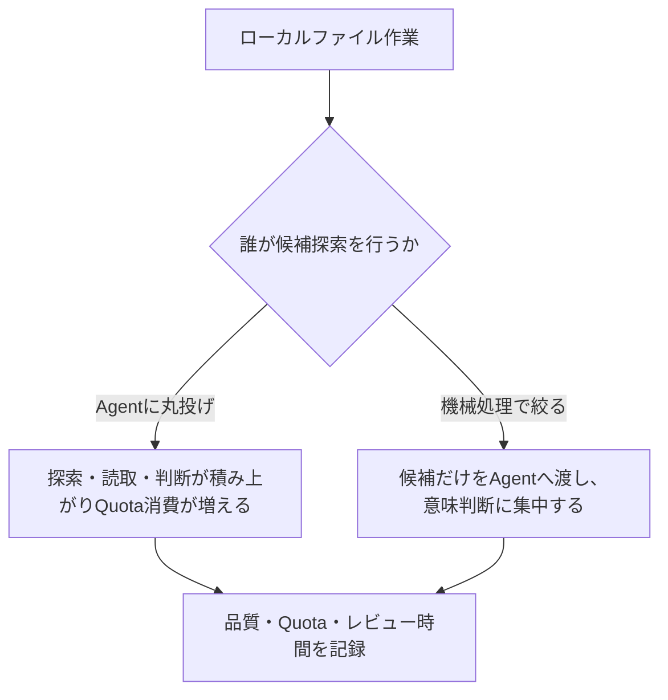
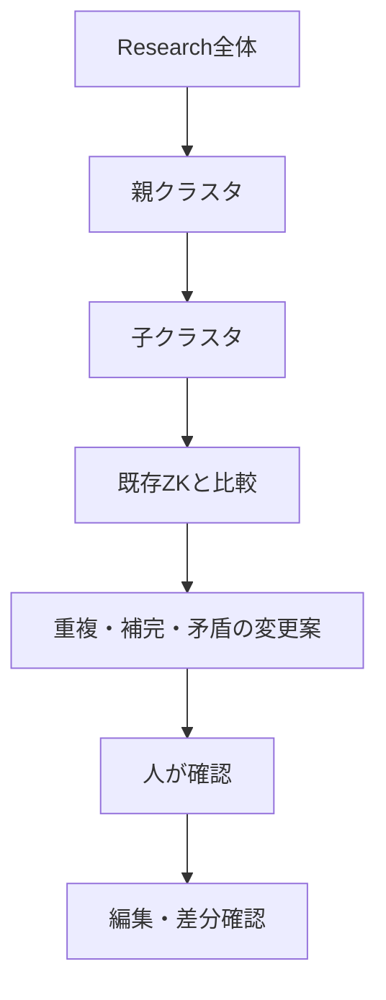

Antigravityの個人向け無料枠を、ローカルファイルを扱うAgentとして評価した記録。検討時点の結論は、読み取り・検索・編集・Terminal・Gitなどの操作可否よりも、Agentが探索・推論・実行に使う週次Quotaが実用上のボトルネックになる、というものだった。現在の機能とQuotaは必ず現行の条件で確認する。

> 無料版を「機能制限版」とだけ見るのではなく、「処理量を管理する必要がある実行環境」として扱う。

## ファイル数ではなくAgentに任せる仕事量が消費を決める

| 作業 | 相対的なAgent負荷 |
|---|---|
| 1ファイルの軽微な修正 | 小 |
| 数ファイルの比較・修正 | 小〜中 |
| 数十ファイルの意味的比較 | 中 |
| 数百〜千ファイルをAgent自身が探索 | 大 |
| Workspace全体の構造分析 | 大 |
| 大量探索・意味判断・編集・複数Agent | 非常に大 |



検討時の公開利用例では、約1,095ファイル・18.5MBのObsidian Vaultを扱い、Agent自身に広く探索させると1タスクで週次枠の20%超を消費する場合があった。一方、Python・PowerShell・grep相当の機械処理で候補を絞ると約1〜7%程度という報告もあった。これは固定保証ではなく、タスク・モデル・探索量・実行回数で変わる目安である。

## 機械処理と意味判断を分ける

| 機械処理へ寄せるもの | Agentへ任せるもの |
|---|---|
| ファイル名・YAML・文字列・リンク・更新日の検索 | 実質的な重複・補完・矛盾の判断 |
| ファイル一覧、条件による絞り込み | Permanent化、統合、接続、クラスタ所属の判断 |
| 集計、差分の抽出、候補表の作成 | 変更案の説明、例外の扱い |

```text
対象Vault
  ↓ 機械的な検索・集計
候補ファイルを絞る
  ↓ Agentへ渡す
意味的な比較・変更案
  ↓ 人が確認
編集・diff確認
```

これは無料枠を節約するだけでなく、AIが読む範囲と変更範囲を小さくし、誤編集のレビューを容易にする。

## Obsidianでは小さな作業単位を優先する



無料枠で大規模Vaultを扱う場合は、Vault全体を一度に解析させない。親クラスタ、子クラスタ、比較対象という意味上の単位で区切り、各回の実測を残す。

| 記録する値 | 理由 |
|---|---|
| 対象ファイル数・読取範囲 | Agent作業量の説明に必要 |
| Quota消費率 | 実行計画を立てるため |
| 正しい変更・誤編集・不要変更 | 品質を判断するため |
| 人間のレビュー時間 | 実効コストを判断するため |

結論として、無料枠の実用性は「何ファイル触れるか」では決められない。検索と集計は機械へ、意味判断はAgentへ、最終承認は人へ置く分業ができるなら、無料枠でも有用な検証環境になり得る。
