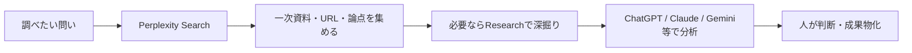
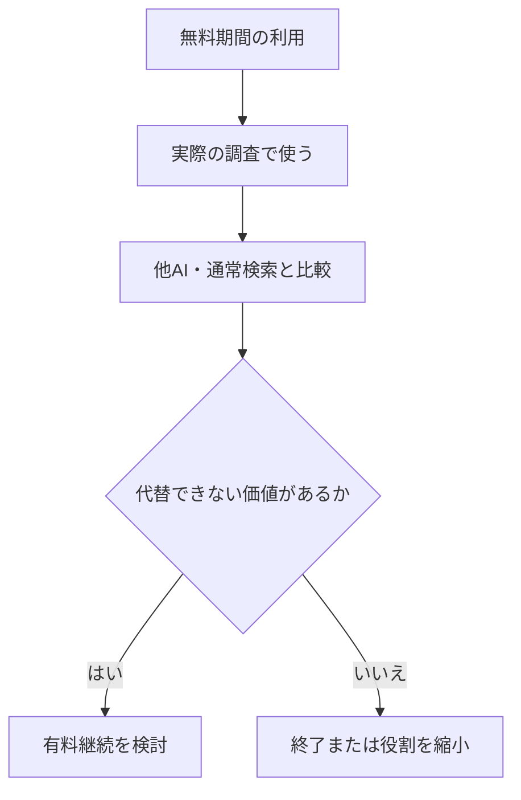

2026年9月時点のPerplexityの位置づけと、Y!mobileの最大6か月無料特典をどう評価するかの記録。主張は、Perplexityを第4の万能AIとしてではなく、検索・調査・一次資料探索を担う専門AIとして評価する、である。製品機能、利用枠、キャンペーン、他者の発言は時点情報として扱う。

## 役割を万能AIと混同しない

| AI環境 | 検討時の主な役割 |
|---|---|
| Perplexity | Web検索、リサーチ、一次資料探索、出典確認 |
| ChatGPT | 総合分析、作業実行、成果物作成 |
| Claude | 長文、文章、コーディング、Agent作業 |
| Gemini | Google連携、検索、マルチモーダル |

Perplexity Proで複数社のモデルを選べても、Claude ProやChatGPT Plusをそのまま置き換えるものではない。検索、引用、システム指示、UI、ツール、利用枠、文脈処理がPerplexityの環境を通るため、「同じ基盤モデルだから同じサービス」とは扱わない。

## 競合の追随によって役割は相対化した

2024〜2025年に見られた「リサーチならPerplexity一択」という評価は、2026年9月時点ではそのまま使えない。ChatGPT、Claude、Geminiも検索・Research機能を強化しており、Perplexityだけが調査を提供する状況ではなくなった。

> Perplexityの検索能力が失われたのではなく、競合が追いついた。そのため、個人のワークフローで代替できない部分があるかを検証する必要がある。

他者の利用事例については、安野貴博、クウキデザイン / Rio、チャエン、Zenn・Qiita等を調べた。当時の観察として、AI上級者は1サービスへ統一せず、Perplexityをリサーチ担当の専門職として置く例があった一方、ChatGPT・Gemini・Claudeの調査機能へ移る例も見られた。個人や時期ごとの発信から一般結論を導かない。

## 無料特典は比較実験として使う

通常料金を追加で払うなら、既存のAIと重複するかを慎重に判断する。一方、Y!mobileの無料期間が実際に適用できるなら、独立した検索・調査環境をワークフローで比較する期間として価値がある。

| 使う場面 | 役割 |
|---|---|
| 日常的な最新情報・URL探索 | Search / Pro Search |
| 多数の根拠を要する比較 | Research |
| 結果の検証・意思決定 | 他AIと人による分析 |
| ローカルファイルの編集 | 別のローカル作業環境 |

具体的なPro Search・Researchの回数は固定値として扱わない。当時の利用者報告では、Pro Searchは週約200回、Researchは月約20回前後という目安があったが、公式保証ではなくアカウント表示を優先する。

継続判断で見るのは検索回数ではない。Perplexityを外すと、一次資料の発見、出典確認、調査速度が明確に悪化するかを確認する。Research枠を無理に消化することは目的にしない。

## 結論

Perplexityは、万能AIを追加するためではなく、外部情報を探し、根拠を追い、調査の入口を作るための専門環境として置く。無料期間は「元を取る」ためでなく、半年後に不在でも困らないかを判断する比較実験として使う。
