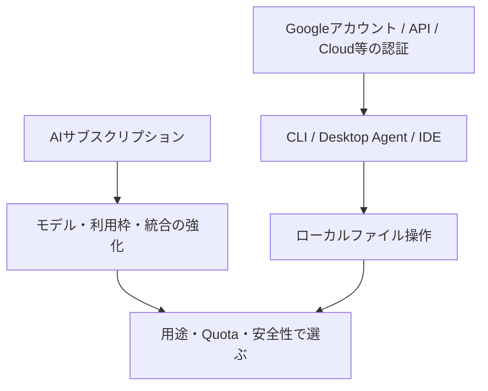
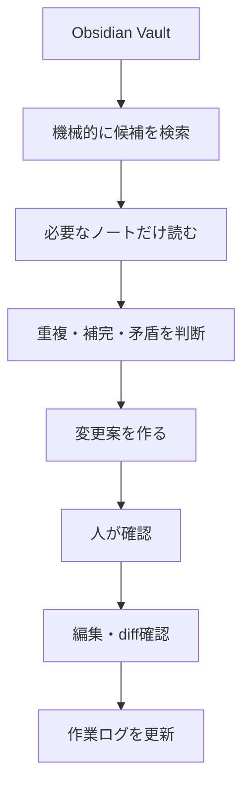

Google AI ProとPerplexity Proを「ファイルをアップロードして分析するWebチャット」とだけ見ると、ローカル操作の比較を誤る。検討時点では、ローカルファイルを扱うのはプランそのものではなく、CLIやデスクトップAgentなどの別実行環境だった。機能・料金・利用枠は変わるため、実行前に各製品の現行条件を確認する。

## 比較の前提：プラン、実行環境、認証を分ける



| 観点 | Google側の検討 | Perplexity側の検討 |
|---|---|---|
| Webでのファイル利用 | アップロードして分析 | アップロードして分析 |
| ローカル作業の候補 | Gemini CLI、Antigravity等 | Desktop / Personal Computer系機能 |
| 主な作業環境 | ターミナル・開発環境寄り | デスクトップ操作・検索寄り |
| 重要な確認点 | Google AI ProとAPI料金・認証の関係 | ProとComputerのCredit・利用枠の関係 |

「Google AI Proならローカルファイルを操作できる」よりも、「Gemini CLI等を使えばローカル操作ができ、AI Proはモデル・利用枠・Google連携の評価対象になる」と理解する方が安全である。

## Gemini CLIをObsidian作業に使う場合

検討時には、Gemini CLIをファイル探索、読取、編集、Terminal、Git、スクリプト実行を組み合わせるAgent Harnessとして捉えた。リネーム・移動・削除などは、CLI自身またはシェル操作を経由する可能性があるため、個別の権限・承認設計が必要になる。



Vault全体を毎回コンテキストへ入れる必要はない。検索で候補を絞り、必要なノートだけを読み、意味判断だけをAIへ任せる。これが大規模Vaultでの基本的な効率・安全設計になる。

| 操作 | 基本方針 |
|---|---|
| 読取・検索 | 比較的広く許可できるが、除外対象を設定する |
| 本文編集 | 変更案または承認を挟む |
| 移動・リネーム | 参照リンクへの影響を確認してから行う |
| 削除 | 必ず人が確認し、復元可能な手段を用意する |
| Git | 作業前の状態とdiffを確認する |

`.geminiignore`等の除外設定、秘密情報の分離、作業前後の`git status`と`git diff`は、実装の仕様を確認したうえで使う。

## Gemini CLIとAntigravity、Perplexityの役割差

| 候補 | 得意と考えた方向 | Obsidianでの使いどころ |
|---|---|---|
| Gemini CLI | Terminal、ファイルシステム、Git、スクリプト | 検索・Markdown編集・差分確認を伴う作業 |
| Antigravity | エディタ、Terminal、Browser、Agentを組み合わせる開発環境 | GUIでの開発・複数工程作業を検証する候補 |
| Perplexity Desktop / Computer | Web調査と一般的なデスクトップ操作 | 調査からPC作業へつなぐ候補。Credit条件を別途確認 |

Gemini CLIはCLI・開発・ファイル操作寄り、Perplexityは検索と一般的なデスクトップ作業寄り、と捉えた。ただし製品の対応範囲は変わり得るため、固定的な優劣ではなく同一ベンチマークで比較する。

## Google AI ProとGemini APIは別の契約経路

Google AI Proの月額契約がGemini APIを無制限に使えることを意味するとは限らない。Gemini CLIではGoogleアカウント、Gemini API、Google Cloud / Vertex AIなど複数の認証・課金経路を取り得るため、どの経路で利用枠・費用が発生するかを実行前に明確にする。

```text
Google AI Pro     : サブスクリプションの機能・利用枠
Gemini API        : APIとしての別料金・別上限
CLI / Antigravity : 実行環境。認証方法により費用・制約が変わり得る
```

## この用途での結論

ローカル操作の可否だけでは選ばない。次を同じ小規模コピーで比較する。

1. 必要なノートを正しく発見できるか。
2. 変更範囲と既存ルールを守れるか。
3. diffが人間にとって検証しやすいか。
4. 利用枠・Credit・実費を説明できるか。
5. 外部へ送信されるデータと権限を許容できるか。

Google AI ProはGeminiの会話性能だけでなく、Gemini CLI、Deep Research、Google連携を含む作業環境として評価する。Perplexityは、検索・調査とPC操作を分け、Computer用Creditを含む料金体系を確認してから比較する。
