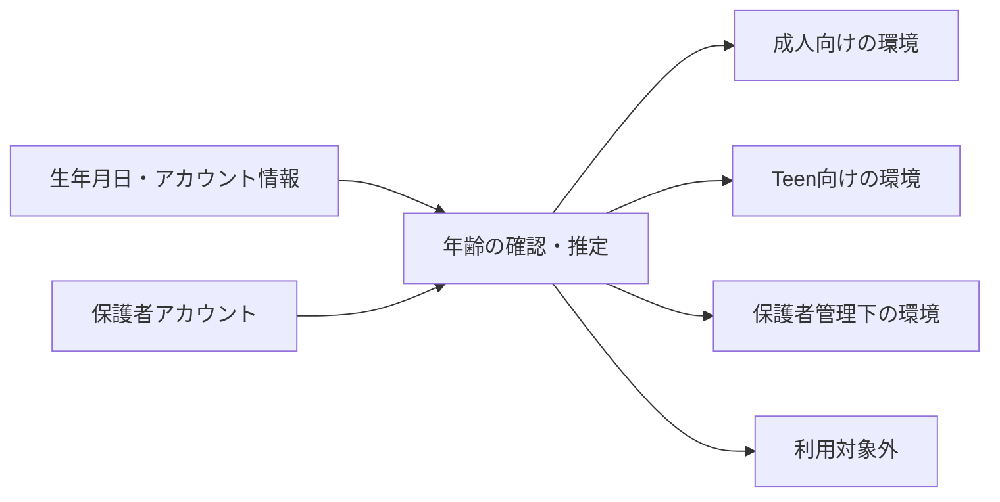

# 主要生成AIの年齢制限・ペアレンタルコントロールと、子どもへの使わせ方

## このノートの役割と調査時点

このノートは、主要生成AIの年齢条件・保護者向け機能を比較した調査記録と、子どもにAIをどう使わせるかについての考え方を、同じノート内で区別して残すものである。

サービス別の年齢、利用可能な国、Family機能、Teen向け設定は変わりやすい。以下のサービス比較は**2026年9月に確認した時点の整理**であり、現在の利用可否や設定画面を保証するものではない。実際に子どものアカウントを作成・変更するときは、対象サービスの現行規約と保護者向け案内を確認する。

一方、後半の「年齢が上がるにつれて制限を減らし、検証と責任を増やす」という家庭での考え方は、サービス固有の仕様とは別の、長く使える判断材料として扱う。

## 調査時点のサービス比較

2026年9月時点では、未成年への方針は大きく三つに分かれていた。

1. 13歳前後から利用を認め、未成年向けの安全設定を置く。
2. 保護者が管理する子ども用アカウントで利用を認める。
3. 消費者向けサービスでは18歳未満を原則対象外とする。

| サービス | 当時の年齢の目安 | 未成年への扱い | 保護者管理の位置づけ |
| --- | --- | --- | --- |
| ChatGPT | 13歳以上 | 13〜17歳は保護者または法定代理人の同意を前提 | Teen向け保護と親子連携を重視 |
| Gemini | 原則13歳以上 | Family Link管理下では13歳未満の利用も検討対象 | Googleアカウント全体の管理に組み込む |
| Microsoft Copilot | 13歳以上 | 13〜17歳に異なる扱いがある | Family Safetyなど端末・アカウント管理と接続 |
| Claude | 18歳以上 | 未成年は原則として消費者向け対象外 | 未成年向け管理機能より利用対象外という方針 |
| Grok | 13歳以上 | 13〜17歳は保護者の許可を前提 | 体系的な親子管理は比較的限定的 |
| Perplexity | 13歳以上 | 未成年は保護者同意を前提 | 体系的な親子管理は比較的限定的 |

この表の役割は、どれが常に最善かを決めることではない。小学生の共同利用を考えるのか、中高生の本人利用を考えるのか、家庭で時間・機能・アカウントをどこまで管理したいのかによって、見るべきサービスが変わることを示す。

## サービスごとの考え方を分けて読む

### ChatGPT

当時の理解では、ChatGPTは13歳以上を基本対象とし、13〜17歳には保護者同意を求めていた。Teen向けの扱いでは、センシティブな内容、画像生成、音声、メモリ、モデル改善への会話利用、Webやクラウドブラウザー、利用時間などを、年齢に応じて調整する考え方が中心にあった。

重要なのは、保護者向け機能が「親が子どもの会話を常時読む仕組み」と同義ではないことだった。機能や時間を管理しつつ、会話内容の全面監視ではなく、重大な安全上の問題への対応と家庭での対話を重視する設計として理解した。

### Gemini

Geminiでは、AI単独の保護者機能というより、GoogleアカウントとFamily Linkの管理の中で利用を考える形だった。子どものGoogleアカウント、Android、Chrome、Web利用などをまとめて管理する家庭では、AIだけを別に設定しない利点がある。

当時の検討では、13歳未満の小学生にAIを使わせるなら、親の管理下で共同利用できる選択肢として比較しやすいと考えた。ただし、利用可能な年齢や国、機能は変わり得るため、現行のFamily LinkとGeminiの案内を確認する。

### Microsoft Copilot

Copilotも、AI単独のサービスとしてではなく、Microsoftアカウント、Windows、端末利用時間、Family Safetyなどの管理と合わせて考える位置づけだった。13〜17歳には、パーソナライズや広告、会話データの扱いで成人と異なる制限を設けるという当時の説明があった。

### Claude、Grok、Perplexity

Claudeは、未成年向け保護を充実させるより、消費者向けClaudeを18歳未満の対象外とする点が、他社との大きな違いだった。

GrokとPerplexityは、当時は概ね13歳以上・未成年は保護者の許可や同意を前提とする整理だった。ただし、ChatGPTの親子連携、Google Family Link、Microsoft Family Safetyのような管理構造が中心とは限らないため、家庭で細かく管理したい場合には、設定の実在と範囲を個別に確認する必要がある。

## 年齢制限を「自己申告だけの数字」と見ない

この調査では、生成AIの年齢確認が、単に「13歳以上と規約に書く」段階から変化していることも確認した。生年月日、アカウント情報、保護者アカウント、年齢推定・確認などを通して、成人向け、Teen向け、保護者管理下、利用不可を分ける方向へ進んでいる。



そのため、年齢を形式的に入力することだけでなく、保護者の同意、アカウントの種類、利用地域、機能ごとの設定を含めて確認する必要がある。

## 家庭での判断：何歳からより、どう使わせるか

ここからはサービスの調査結果ではなく、家庭でAIを使うときの考え方である。結論は、年齢が上がるほど禁止を減らし、その分だけ本人が情報を検証し、成果物に責任を持つ範囲を増やす、というものだった。

| 段階 | AIとの関係 | 保護者の関与 | 学ばせたいこと |
| --- | --- | --- | --- |
| 小学生 | 親と一緒に使う道具 | 強い | AIの答えを正解と決めず、別の資料も見る |
| 中学生 | 学習・思考の補助 | 中〜強 | 自分で考えた後に質問し、答えを検証する |
| 高校生 | 実務ツールの練習 | 中 | AIを使った成果物に本人が責任を持つ |
| 成人 | 本人管理の汎用ツール | 原則不要 | 目的、リスク、結果を自分で判断する |

### 小学生：親子共同利用から始める

小学生では、一人で自由にAIを使わせるより、親子で質問し、答えを本・図鑑・公式情報などと照合する流れが適している。

```text
子どもの疑問
→ 親と一緒にAIへ質問
→ 答えを読む
→ 別の資料でも確かめる
```

ここで育てたいのは、AIを使いこなす速さより、「AIも普通に間違える」「分からなくても分かったように答えることがある」と知る習慣である。

### 中学生：答えを出す機械ではなく家庭教師として使う

中学生では、宿題を丸ごと生成して提出する使い方ではなく、まず自分で考え、分からない箇所の説明、別解、採点、文章の確認にAIを使う形を目指す。

```text
問題を読む
→ まず自分で考える
→ 分からない点をAIに尋ねる
→ 説明を読み直す
→ 自分で解く
→ 必要なら別解・採点を聞く
```

Teen向け設定、センシティブな内容の低減、夜間の利用時間、メモリや会話の利用設定などは、家庭の方針に合わせて選ぶ。ただし、特定の設定名が現在も同じとは限らないため、画面を確認して設定する。

### 高校生：自由度と責任を同時に増やす

高校生では、情報収集、文章作成、翻訳、要約、データ分析、プログラミング、プレゼン、アイデア整理などへ積極的に使う練習が価値を持つ。一方で、AIに書かせた文章をそのまま提出するのではなく、仮説を立て、一次情報を読み、自分で結論を出したうえで、AIを整理や推敲に使うことが必要になる。

## 年齢を問わず最初に共有する五つ

1. AIは普通に間違える。
2. 分からないことでも、もっともらしく答えることがある。
3. 個人情報をむやみに入力しない。
4. 重要な情報は別の資料で確認する。
5. AIに考えてもらうのではなく、自分が考えるために使う。

特に、AIを「非常に物知りで説明もうまいが、ときどき堂々と間違える相談相手」と理解することが重要である。これは、学習だけでなく、健康、いじめ、強い不安、家庭問題、犯罪被害、性的トラブルなどの相談にも関わる。AIに相談することを一律に禁じるより、大事なことは必ず人間にも相談する、というルールを持つ方が現実的である。

## 家庭の利用ルールを考えるための表

| 項目 | 小学生 | 中学生 | 高校生 |
| --- | --- | --- | --- |
| 利用形態 | 親子共同 | 本人利用可 | 原則自由 |
| 学習 | 親と一緒に使う | 説明・添削・確認に使う | 調査・制作・分析に使う |
| 宿題の丸投げ | しない | しない | しない |
| 個人情報 | 入力しない | 原則入力しない | 最小限にする |
| 出典確認 | 親が担当 | 一緒に確認 | 本人が担当 |
| 感情相談 | 人間中心 | AIは補助 | AIは補助 |
| 利用時間 | 強めに管理 | 生活に合わせて管理 | 必要に応じて調整 |

全面的に会話を監視するより、使える機能・時間を調整し、困った内容を人に相談できる関係を作る方が、成長に合わせて自立へ移りやすい。

## まとめ

このノートでは、時点を伴うサービス比較と、家庭で長く使える判断を混同しない。

> 年齢制限と保護者機能は契約・国・設定画面に依存するため、その都度確認する。家庭では年齢だけで一律に禁止するのではなく、成長に合わせて制限を減らし、検証・個人情報保護・最終判断の責任を本人へ移していく。
