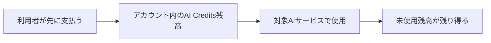
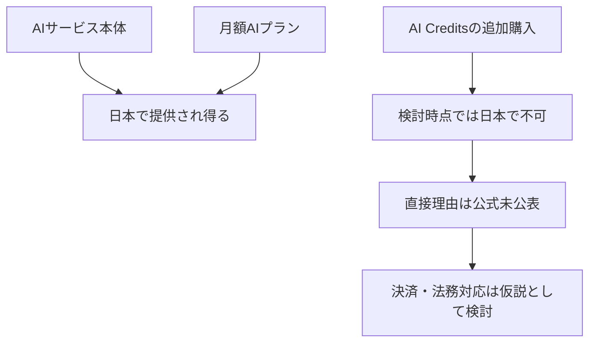

Google AI Creditsの日本での追加購入について、検討時点で確認できた提供状況と、法制度との関係についての推測を分けて残すノート。これは法的助言ではなく、契約・運用を判断するための論点整理である。現在の提供地域、価格、利用条件は必ずGoogleの公式画面・利用規約で再確認する。

## まず、確定していたことと推測を分ける

| 内容 | このノートでの扱い |
|---|---|
| 検討時点で、日本ではAI Creditsを追加購入できなかった | 当時の提供状況の記録 |
| Googleが日本未提供の直接理由を公表していなかった | 当時の確認結果 |
| 前払いで残高を持ち、後から対象サービスで消費する仕組みは、前払式支払手段に近い | 仕組みの構造に関する整理 |
| 日本の前払式支払手段には利用者保護・決済に関する制度がある | 一般的な制度上の論点 |
| 資金決済法等がGoogleの未提供を直接引き起こした | 未確認。断定しない |
| 決済・法務対応の負担が背景にある可能性 | 提供状況からの推測 |

> 「日本の法律でAI Creditsが禁止されている」とは結論づけない。Googleが直接理由を公表していない限り、法規制との因果関係は仮説として扱う。

## AI Creditsを前払い残高として理解する

AI Creditsは、使用後に料金を請求する従量課金とは異なり、先に購入した残高を後から対象サービスで消費する型として整理できる。



| 方式 | お金と利用の順序 | 残高の扱い |
|---|---|---|
| 従量課金 | 使用 → 利用量計測 → 請求 | 原則として前払い残高を持たない |
| AI Credits型 | 購入 → 残高を保有 → 使用時に消費 | 未使用残高が残り得る |

未使用残高を利用者が保有する構造は、プリペイドカード、電子マネー、有料ポイント、ゲーム内通貨、チャージ型残高などと似た論点を持つ。日本で提供する場合には、残高管理、利用者保護、表示、払戻し、会計・法務などの対応が必要になる可能性がある。ただし、個別サービスがどの制度にどう該当するかは、事業者の公式説明や専門家の判断なしには確定できない。

## 「日本で販売できない」と「提供されていない」は違う

日本には前払い型サービスが多数存在するため、前払い残高そのものが禁止されているわけではない。したがって、当時のAI Credits未提供は、法的に不可能だという意味ではなく、Googleが日本向けの提供・決済・サポート体制を用意していない、または提供しない判断をしていた可能性として理解する。



サービス本体や月額プランが利用可能でも、追加の前払いCredit購入だけが利用できないことはあり得る。この構造は、生成AI一般の規制より、決済・残高の運用条件が関係するという仮説とは整合するが、原因の証明にはならない。

## VPNや決済地域の操作を解決策として扱わない

VPNで変えられるのは主に接続元IPアドレスであり、決済地域の判断にはGoogle Payments Profile、Google Playの国、支払い方法の発行国、請求先住所、通貨、アカウントの決済情報、実際の利用地域などが関わり得る。

```text
日本在住
  + VPNで海外IP
  + 日本のPayments Profile
  + 日本発行の支払い方法
  + 日本の請求先
  = 海外ユーザーとして扱われるとは限らない
```

海外への実際の移住に伴う正規の地域変更と、地域制限を回避するための架空情報・VPN・不整合な決済プロファイルの組合せは区別する。後者は規約、決済、既存アカウントのサービス利用に影響し得るため、このノートでは推奨しない。

## Google AI Proの運用判断へどう影響するか

検討時点では、AI Creditsを追加購入できないなら、付属Quotaを使い切った後の選択肢は、自然回復を待つか、当時利用可能な上位プラン等を確認することに限られると考えられた。

| 比較項目 | 契約前に確認すること |
|---|---|
| 月額料金 | 基本プランの価格と更新後の価格 |
| 基本利用枠 | 月額に含まれる利用量とリセット周期 |
| 上限到達後 | 追加購入、回復待ち、上位プランの可否 |
| 従量課金 | 少額で追加できるか、地域制限はあるか |
| 作業の中断コスト | 上限到達時に重要作業が止まる影響 |

結論として、Google AI ProやUltraを比較するときは月額だけを見ない。日本で追加Creditが利用可能か、上限到達後に何ができるかを、実際の契約画面で確認して利用計画に含める。
