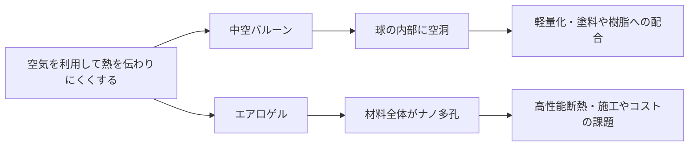

# 中空バルーンとエアロゲルの構造・性能・用途の比較

## 問い

中空バルーンは特殊セラミックスなのか。エアロゲルとは別なのか。

結論からいうと、**中空バルーン（中空セラミックバルーン）は特殊セラミックスの一種**と考えてよいですが、**エアロゲルは別の材料カテゴリ**です。

両者を同じ「軽量で断熱に使われる材料」として混同せず、空気をどのように保持するか、どの性能を優先するかで分けて捉える。

|判断したいこと|中空バルーン|エアロゲル|
|---|---|---|
|基本構造|球殻の内側に空洞をもつ|材料全体がナノ多孔構造をもつ|
|主な強み|軽量化、施工性、他材料への配合|高い断熱性能|
|検討時の焦点|強度・コスト・配合しやすさ|断熱性能・脆さ・コスト|



## 比較

整理すると次のようになる。

|項目|中空バルーン|エアロゲル|
|---|---|---|
|分類|特殊セラミックス（無機フィラー）|超多孔質材料（ナノ材料）|
|主材料|シリカ、アルミノシリケートなど|シリカ、カーボン、ポリマーなど|
|構造|中が空洞の球|ナノレベルのスポンジ構造|
|密度|軽い|非常に軽い|
|断熱性|高い|非常に高い|
|強度|比較的高い|非常にもろい（改良品あり）|
|コスト|比較的安価|高価|

## 中空バルーン

中空バルーン（Hollow Microspheres）は、直径20～150μm程度の**中が空洞になった微小な球**です。

イメージとしては

```
○
```

という球の中が空気になっています。

この空気層のおかげで

- 軽量化
- 断熱
- 遮熱
- 樹脂や塗料の軽量化

に利用されます。

塗料では

- 断熱塗料
- 遮熱塗料
- 軽量パテ
- FRP

などで非常によく使われています。

---

## エアロゲル

一方エアロゲルは

```
□□□□□□□□□■■■■■■□□■□□□□■□□■■■□□■□□□□□□□□□
```

のように、ナノレベルで無数の穴が開いたスポンジ構造です。

体積の95〜99%以上が空気なので、

熱が伝わる経路が極端に少なく、

**現在実用化されている断熱材の中でも最高クラス**

の断熱性能になります。

---

## 構造が性能へ与える違い

中空バルーンは

**「空気を球の中に閉じ込める」**

という考え方です。

エアロゲルは

**「材料全体がナノサイズの空気の集合体」**

という考え方になります。

つまり、

```
中空バルーン○ ○ ○ ○ ○エアロゲル██████░░░███░███░░░██████
```

のように空気の持ち方そのものが違います。

---

## 断熱塗料での利用

現在市販されている断熱塗料の多くは

- 中空セラミックビーズ
- 中空ガラスバルーン
- 中空シリカ

などを採用しています。

エアロゲル入り塗料も存在しますが、

- 非常に高価
- 分散技術が難しい
- 施工性の確保が難しい

ため、現時点では一般向けよりも

- プラント
- LNG設備
- 石油・化学設備
- 航空宇宙
- 高性能断熱

などの用途が中心です。

## ロックウール系との関係

以前お話ししていた**ロックウール系のパテ状断熱材**と比較すると、

- **ロックウール**：繊維で熱を遮る
- **中空バルーン**：空洞で熱を遮る
- **エアロゲル**：ナノ多孔構造で熱を遮る

というように、断熱の仕組みそのものが異なります。

将来的には、高性能な断熱塗料やパテでは**中空セラミックバルーンとエアロゲルを組み合わせる**ことで、施工性・強度・断熱性能のバランスを取る製品がさらに増える可能性があります。特に配管や曲面への施工では、こうした複合化は今後も注目される技術の一つです。
