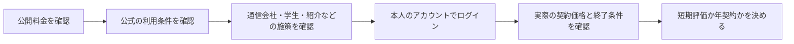
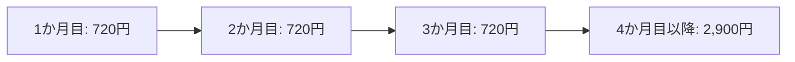

Claude Pro、Google AI Pro、Perplexity Proの割引・キャンペーンを比較した検討時点（2026年9月）の記録。価格、特典、対象条件、申込期限は変動するため、契約判断には使わず、**何を確認してから契約するか**を残すノートとして扱う。

結論は単純である。公開料金だけでは不十分で、公式条件、提携施策、そして本人がログインした契約画面の順に確認する。とくにGoogle AI Proは、一般公開価格とアカウントに表示される個別オファーが異なる場合があった。



## 当時の料金メモと、扱い方

| サービス | 当時の通常料金メモ | 割引の性質 | 契約前の最優先確認 |
|---|---:|---|---|
| Claude Pro | 月額20ドル、年額200ドル | 年払いが中心 | 長期利用が確定しているか |
| Google AI Pro | 月額2,900円 | 個別オファー、キャリア、学生、端末特典など条件依存 | ログイン後の表示と適用条件 |
| Perplexity Pro | 月額20ドル、年額200ドル程度 | 紹介、Promotion Code、通信会社・教育施策 | 提携・紹介対象か、対象外条件は何か |

ここにある金額は当時の比較値であり、現在の価格ではない。比較の目的は「一番安いサービスを探す」ことではなく、実際に使う期間とワークフローに対して、不要な年契約を避けることである。

## サービスごとの判断方法

### Claude Pro：年払いを選ぶかだけを先に考える

当時の記録では、月払いは20ドル × 12か月で240ドル、年払いは200ドルで、差額は40ドル（約16.7%）だった。一般向けの恒常クーポンや大きなキャリア施策を前提にせず、短期利用なら月払い、継続が確定してから年払い、と考える。

### Perplexity Pro：通常契約の前に外部施策を探す

検討対象は、SoftBank / Y!mobile / LINEMO向け施策、紹介、パートナーPromotion Code、公式プロモーション、Education Proだった。当時は、対象回線向けに「6か月無料」の施策が存在した記録がある。ただし過去の同系列施策利用などで対象外になる場合があるため、現在の条件を確認する。

> Perplexityは、通常料金を払う前に、紹介・提携コード・通信会社キャンペーンを一度確認する価値が高い。

### Google AI Pro：アカウント画面を最終的な根拠にする

当時、対象アカウントのGoogle公式料金ページには、Google AI Proが「3か月間は月額720円、その後は月額2,900円」と表示された。3か月の支払は2,160円、通常料金での3か月分は8,700円という比較で、差額6,540円、約75%の割引という記録だった。

この数字は一般条件ではなく、特定アカウントに表示されたオファーである。全ユーザー対象か、新規限定か、いつまで申し込めるかは確認できていなかった。



「割引が3か月続く」ことと、「その割引へいつまで申し込めるか」は別である。前者は適用期間、後者は申込期限として分けて記録する。

## キャリア施策とGoogleの個別オファーは分ける

au / UQ mobile向けのGoogle AI Pro施策があっても、povo2.0はKDDI系列であることだけを理由に対象とみなさない。当時の整理では、au / UQの対象プランとpovo2.0は別扱いだった。一方、Google自身がアカウントへ直接提示する割引は、通信会社の契約と別に評価する。

| 確認する施策 | 判定に必要な情報 |
|---|---|
| 通信会社の特典 | 回線種別、対象プラン、契約時期、過去利用条件 |
| 学生・端末の特典 | 資格、地域、対象端末、利用期限 |
| Googleの個別オファー | ログイン中のアカウント、価格、適用期間、申込期限、終了後の価格 |
| 紹介・Promotion Code | 発行元、対象プラン、併用可否、失効条件 |

## キャンペーンは評価期間として使う

複数のAIへ同時に課金する場合、比較前から年払いへ固定しない。短期割引は、機能表では見えない適合性を測るための評価期間として使う。

```text
ChatGPT Plus      : 日常利用の基準
Google AI Pro     : Google連携・NotebookLM等を短期評価
Perplexity Pro    : 検索・Research用途を評価
Claude Pro        : 長文・コード・エージェント用途を評価
```

評価対象はモデル性能だけではない。Research、検索、文脈保持、ファイル操作、外部連携、利用制限、UI、ローカル作業への統合を、実際に行う仕事で比べる。

## 次回の契約前チェック

1. 公開料金と、ログイン後の最終価格を記録する。
2. 割引適用期間と申込期限を別々に記録する。
3. 対象資格、過去の利用歴、解約・再契約時の条件を確認する。
4. 1〜3か月の評価で使う仕事と、継続・停止の判断基準を決める。
5. 年払いは、評価を終え、継続利用が確定してから選ぶ。

未解決として残すのは、当時のGoogle AI Pro「3か月720円」オファーの申込期限、対象条件、過去のGoogle One / Google AI Pro利用者への扱い、再表示の可否、年払いとの関係である。
