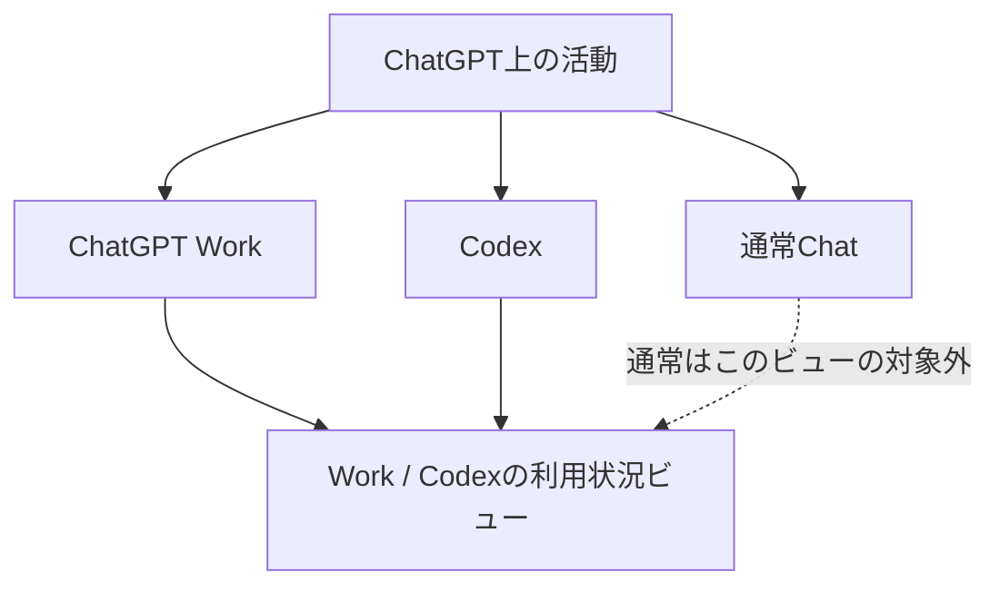
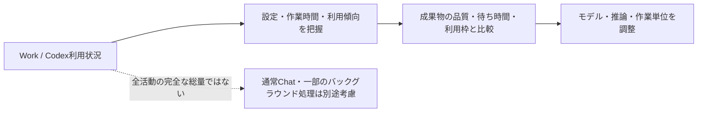

確認時に表示された利用状況画面をどう読むかの記録。この画面は通常のChatGPTチャット全体ではなく、WorkとCodexの利用傾向を対象にしている。表示対象や集計方法は変更され得るため、現在の画面と公式説明を優先する。[OpenAI公式：ChatGPTの利用方法](https://learn.chatgpt.com/docs/use-chatgpt)

## 画面の数値が表す範囲

| 画面の項目 | 読み方 |
|---|---|
| 累計トークン数、最大トークン消費 | Work / Codex側で集計された利用傾向 |
| 最長チャット、連続利用日数、ヒートマップ | Work / Codexの活動パターン |
| 最もよく使う推論レベル | 対象となるWork / Codex活動での設定傾向 |
| 総チャット数 | 通常Chat全体を含む数とは限らない |
| Skill・Pluginの利用回数 | Work / Codex内でのツール利用傾向 |

元のスクリーンショットでは、累計トークン数1.8億、最大トークン消費7,772.6万、最長チャット1時間59分、推論レベル「高」81%、総チャット数144などが表示されていた。これらは当時の画面の記録であり、現在の利用量や全ChatGPT活動の総計を示すものではない。

## 利用統計を意思決定に使うときの注意

この画面は、「Obsidian作業で高い推論レベルを使い続けたことが、成果物と待ち時間に見合っていたか」を検討する材料になる。ただし、通常Chatを含む全利用量、すべてのサブエージェント・ツール・バックグラウンド処理を完全に表す数値とは断定しない。

利用状況を見る目的は、利用枠を回避することではない。実際に価値が高かった作業、過剰な推論を使った作業、より小さく分けられた作業を見つけ、WorkとCodexの設定・作業単位を改善することにある。
