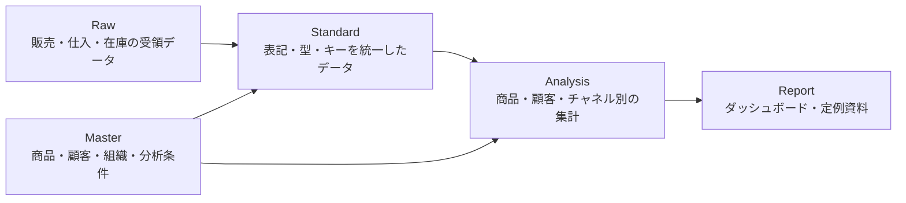

# Kyoto Patty 029の架空事業設定とデータ設計

## このノートの役割

Kyoto Patty 029は、売上分析、仕入、在庫、商品管理、販売チャネル、業務自動化を説明するための架空事業である。実在の会社、商品、顧客、担当者、数値を置き換え、公開可能なデータ構造と処理例をつくるための共通設定として使う。

ここに定める名称・略語・サンプルレコードは、実在の組織や現行システムを表すものではない。実務由来のノートを公開用へ作り直す場合は、この設定を参照しつつ、固有名詞、数値、関係性を個別に置き換える。

## 事業モデル

Kyoto Patty 029は、冷凍・冷蔵のパティと関連食品を企画、製造、販売する架空の食品事業である。直販、卸売、外部販売チャネルを併用し、製造から仕入、在庫、受注、出荷、売上分析までを扱う。

| 領域 | 架空事業で扱う内容 | 主なデータ |
| --- | --- | --- |
| 商品企画・製造 | パティ、ソース、包装資材の企画・製造 | 商品、規格、原材料、製造ロット |
| 調達 | 原材料・容器・包装資材の仕入 | 仕入先、発注、入荷、単価 |
| 在庫・出荷 | 原材料・完成品の在庫と出荷 | 在庫残、倉庫、ロット、出荷指示 |
| 直販 | 自社EC・自社店舗での販売 | 注文、顧客、商品明細、決済 |
| 卸売・外部チャネル | 取引先・提携先を通じた販売 | 販売先、受注、請求、返品 |
| 分析 | 商品・顧客・地域・チャネル・期間別の集計 | 売上、数量、粗利、返品、在庫回転 |

## 架空スタッフ

役割を伴う人物名が必要なサンプルでは、[Kyoto Patty 029の架空スタッフ一覧](kyoto-patty-029-fictional-staff.md)に定義した人物だけを使う。人物を増やすより、部門・役割・IDで表現できる場合を優先する。

## 略語と用語

既存の略語に加えて、サンプルのデータ構造を説明するために次の用語を使う。略語は架空事業の識別子であり、実在の会社名・部署名・システム名とは関係しない。

| 略語 | 正式名称 | このノートでの意味 |
| --- | --- | --- |
| KP | Kyoto Patty | ブランドおよび事業全体を指す基本表記 |
| SC | Sales Channel | 販売経路を表す共通語。直販・卸売・外部チャネルを含む |
| KPK | Kyoto Patty Kitchen | 製造・厨房部門 |
| KPSC | Kyoto Patty Sales Channel | 外部販売チャネルの運用部門 |
| KPF | Kyoto Patty Foods | 架空事業を運営する法人・事業主体 |
| KPD | Kyoto Patty Direct | 自社EC・自社店舗などの直販部門 |
| KPW | Kyoto Patty Wholesale | 卸売・業務用販売を扱う部門 |
| KPL | Kyoto Patty Logistics | 倉庫、在庫、出荷を扱う物流部門 |
| KPP | Kyoto Patty Procurement | 原材料・資材の購買を扱う部門 |
| KQC | Kyoto Patty Quality Control | 品質確認、ロット、規格を扱う部門 |
| KPA | Kyoto Patty Analytics | データ整形、集計、レポート作成の分析領域 |
| SCP | Sales Channel Partner | 外部の販売パートナー |
| SCD | Sales Channel Data | 販売パートナーから受け取る売上・在庫などのデータ |
| SCR | Sales Channel Return | 販売パートナー経由の返品・返金・在庫戻りの記録 |

## データ設計の基本形

データは、入力元を残す層、分析に使える形へ整える層、レポートに使う層を分ける。元データを加工で上書きせず、結合や集計に必要な列を段階ごとに追加する。

| 層 | 役割 | 変更の考え方 |
| --- | --- | --- |
| Raw | 受領したCSV、Excel、外部チャネルのSCDを保持する | 元の列名・値をできるだけ維持する |
| Standard | 型、表記、結合キー、分類を統一する | 変換内容をPower Queryのステップとマスタで追えるようにする |
| Analysis | 売上・在庫・仕入を目的別に集計する | 集計粒度と対象条件を明示する |
| Report | 意思決定・確認に使う出力を作る | 必要な列だけを表示し、作業用キーは原則出さない |

## 主要マスタと取引データ

| 種別 | テーブル名の例 | 主な列 | 用途 |
| --- | --- | --- | --- |
| 商品 | `MstProducts` | 商品ID、商品名、カテゴリ、規格、分析対象 | 商品別集計と商品分類 |
| 顧客 | `MstCustomers` | 顧客ID、顧客名、区分、地域、分析対象 | 顧客別・地域別集計 |
| チャネル | `MstChannels` | チャネルID、名称、区分、担当部門 | 直販・卸売・外部チャネルの比較 |
| 組織 | `MstOrganizations` | 組織ID、名称、役割 | KPK、KPD、KPLなどの役割管理 |
| 分析条件 | `MstAnalysisRules` | 分析名、対象区分、開始日、終了日 | 対象外条件や定例分析の制御 |
| 売上 | `FactSales` | 売上ID、日付、商品ID、顧客ID、チャネルID、数量、金額 | 売上分析の基礎 |
| 仕入 | `FactPurchases` | 仕入ID、日付、資材ID、仕入先ID、数量、金額 | 原価・調達の分析 |
| 在庫 | `FactInventory` | 基準日、商品ID、倉庫ID、ロットID、数量 | 在庫と出荷の分析 |
| 返品 | `FactReturns` | 返品ID、売上ID、理由、数量、金額 | SCRを含む返品・返金の分析 |

## サンプルレコード

以下の値は、データの形と関係を説明するためだけの架空データである。

### 商品マスタ

| 商品ID | 商品名 | カテゴリ | 規格 | 分析対象 |
| --- | --- | --- | --- | --- |
| PRD-001 | 京香るクラシックパティ | 冷凍パティ | 120g × 8枚 | 対象 |
| PRD-002 | 柚子胡椒アクセントパティ | 冷凍パティ | 120g × 8枚 | 対象 |
| PRD-003 | 野菜のうまみミニパティ | 冷凍パティ | 60g × 12枚 | 対象 |
| MAT-001 | 保冷配送用ボックス | 包装資材 | 1箱 | 対象 |

### 顧客・チャネル・組織

| ID | 名称 | 区分 | 関連する略語 |
| --- | --- | --- | --- |
| CUS-001 | 山科フードサービス | 卸売顧客 | KPW |
| CUS-002 | 洛北デリマーケット | 販売パートナー | SCP、KPSC |
| CH-001 | Kyoto Patty Online | 自社EC | KPD |
| CH-002 | 業務用卸売 | 卸売 | KPW |
| CH-003 | Partner Market | 外部チャネル | SCP、SCD、SCR |
| ORG-001 | Kyoto Patty Kitchen | 製造 | KPK |
| ORG-002 | Kyoto Patty Logistics | 物流 | KPL |
| ORG-003 | Kyoto Patty Analytics | 分析 | KPA |

### 売上と返品

| 売上ID | 日付 | 商品ID | 顧客ID | チャネルID | 数量 | 売上金額 |
| --- | --- | --- | --- | --- | ---: | ---: |
| SAL-2026-0001 | 2026-04-03 | PRD-001 | CUS-001 | CH-002 | 24 | 28,800 |
| SAL-2026-0002 | 2026-04-05 | PRD-002 | CUS-002 | CH-003 | 12 | 16,800 |
| SAL-2026-0003 | 2026-04-06 | PRD-003 | CUS-002 | CH-001 | 20 | 18,000 |

| 返品ID | 売上ID | 区分 | 理由 | 数量 | 返金額 |
| --- | --- | --- | --- | ---: | ---: |
| RET-2026-0001 | SAL-2026-0002 | SCR | 配送時の外装破損 | 2 | 2,800 |

## 利用時の判断基準

- 実務ノートをサンプルへ置き換えるときは、名称だけでなく、数値、時期、取引関係、地域、パスを組み合わせても実在の対象を推測できないか確認する。
- サンプルコードでは、商品ID、顧客ID、チャネルIDを使い、実在の名称やコードを直接埋め込まない。
- `key_`などの結合用列はStandard層で作り、出力用のReport層には必要な場合だけ残す。
- 新しい略語は、この一覧へ意味と役割を定義してから使う。意味が重なる略語を増やさない。
- ここで定めた架空設定を、実在の業務環境や現在の運用手順として扱わない。
