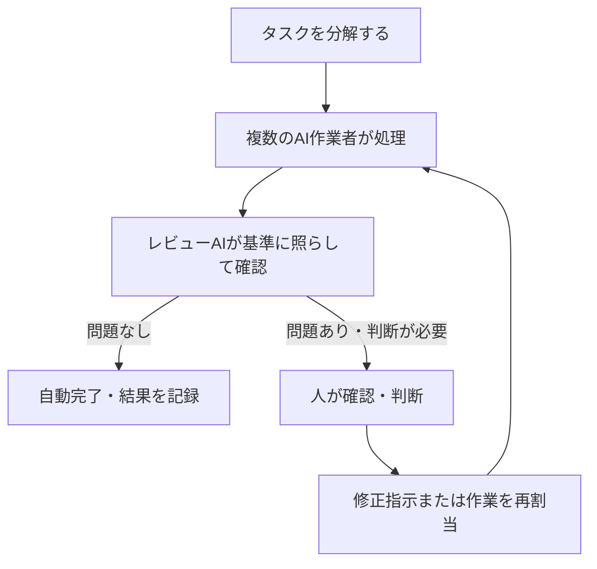
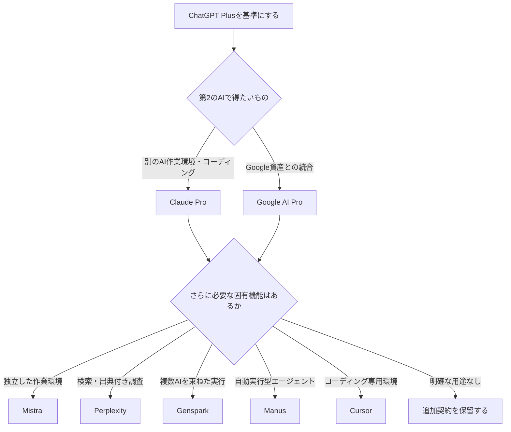

ChatGPTを中心に、Claude・Google・その他のAIサービスをどこまで追加契約するかを検討するためのノート。料金・機能・利用条件は変動するため、ここに残す金額や仕様は**検討時点の比較材料**であり、契約前に公式情報で再確認する。

この検討の焦点は「最も高性能なモデルを増やすこと」ではなく、すでに使うAIと役割が重ならず、作業の流れを実際に良くできるかに置く。

## まず決めること

1. ChatGPTを個人利用のまま継続するか、複数アカウントまたはBusinessを必要とするか。
2. 第2のAIは、独立した作業環境を得るためにClaudeを選ぶか、Google資産との統合を得るためにGoogle AI Proを選ぶか。
3. 3サービス目以降は、モデル名ではなく検索・自動実行・コーディングなどの固有ワークフローで判断するか。

> 判断基準：追加費用に見合う「代替できない作業」と「実際の利用頻度」があるか。回答品質が少し増すだけなら、契約を増やす理由としては弱い。

## ChatGPTの契約形態をどう見るか

検討時点では、個人で1アカウントを使うならPlusが基準になる。2つの独立したアカウントを使う場合は、Plusを2契約する費用とBusinessの最小席数を比較する。ただしBusinessの席数・利用条件・個人利用との境界は契約前に確認が必要であり、上限回避を目的に複数契約する前提にはしない。

| 選択肢 | 当時の比較額 | 向いている状況 | 留意点 |
|---|---:|---|---|
| ChatGPT Plus | 月額20ドル | 個人で1アカウントを使う | 作業と私用を同じ空間で扱う |
| Plusを2契約 | 月額40ドル | 作業空間と個人の調査空間を明確に分けたい | 契約・履歴・記憶をそれぞれ管理する |
| ChatGPT Business（月払い） | 1席月額25ドル、最小2席で月額50ドル | 複数人・組織の管理機能が必要 | 個人1人での最小席数、利用条件を要確認 |
| ChatGPT Business（年払い換算） | 1席月額20ドル相当、最小2席で月額40ドル相当 | 年契約と組織機能を受け入れられる | 年額ではPlusを2契約した場合と同額水準 |

Businessに価値が出るのは、ワークスペース、共有可能な知識、管理・認証、データ取り扱い、組織向けの利用枠といった**管理上の要件**がある場合である。1人での作業分離だけなら、個人アカウントを2つにする案と同じ土俵で比較する。

ChatGPT WorkとCodexについては、検討時点の把握として「標準利用枠やエージェント利用枠の一部が近い、または共有される」と認識していた。ここはプラン・時期で変わり得るため、実運用に入る前に現行の利用上限と料金体系を別途確認する。

### 2アカウントを使う場合の役割

| 空間 | 主な役割 | 分離する理由 |
|---|---|---|
| A：作業用 | コーディング、文書作成、プロジェクトの実行 | 長期プロジェクトの文脈を安定させる |
| B：個人・調査用 | 調査、試行、私的な対話 | 作業空間に不要な履歴を混ぜない |

個人アカウントをBusinessへ統合するかは、過去の記憶・履歴の扱いと、統合後に元へ戻しにくい可能性を確認してから決める。利便性だけで急いで統合しない。

## 第2のAI：ClaudeかGoogle AI Proか

ChatGPTを主軸にする前提では、Claudeは別の作業環境とコーディング・エージェント系の選択肢を、Google AI ProはGoogleの情報資産とNotebookLMを含む統合を提供する。どちらが優位かは、モデル一般の優劣より、どちらの環境で仕事を完結させたいかで決まる。

| 比較軸 | ChatGPT + Claude | ChatGPT + Google AI Pro |
|---|---|---|
| 独立したAI作業空間 | Claude側に持てる | Google側に持てる |
| コーディング／エージェント | Codex と Claude Code・Coworkを併用 | Codex と Antigravityなどを併用 |
| Google Workspaceとの統合 | 限定的 | Gmail・Drive・Docs・Sheetsとの連携が中心 |
| 長文・大量文脈 | Claudeの長文利用を評価対象にする | Geminiの長文利用を評価対象にする |
| NotebookLM | なし | 利用判断の大きな要素 |
| MCP・開発者向け連携 | 強みとして評価 | 実装・運用の確認が必要 |
| ChatGPTとの重複 | 比較的少ない可能性 | Google作業が多いほど小さくなる |

当時の料金メモでは、Claude Proは月額20ドル、年額200ドル（年払いで月額約16.67ドル）として比較していた。Google AI Proの価格・提供内容は地域・時期で変わるため、決定時に現行プランを確認する。

```text
ChatGPT中心で、別のAI作業環境・Claude Code・MCP活用を増やしたい
  → Claudeを優先候補にする

Gmail / Drive / Docs / Sheets / NotebookLMを作業の中心にしたい
  → Google AI Proを優先候補にする
```

## AIを「人員配置」として設計する

複数AIの運用は、AIを増やすことではなく、担当と確認経路を決めることに近い。

| 組織上の比喩 | AI運用で対応するもの |
|---|---|
| 作業者 | エージェント、サブエージェント、特化AI |
| 管理者 | 自分、または統括用のAI |
| レビュー担当 | 出力の検証、例外の抽出を担うAI |
| 手順書 | Skills、プロンプト、定型ワークフロー |
| 部署 | Project、Workspace、用途別の作業空間 |
| 権限 | Connector、MCP、ファイル・外部サービスへのアクセス |
| 定期業務 | Scheduled Task、定期実行のフロー |

通常の作業をすべて人が読み直すのではなく、問題のある出力だけを人へ渡す「例外管理」に寄せる。ただし、外部送信・削除・金銭・権限変更など不可逆な操作は、例外でなくても人の承認を残す。



たとえば27件中23件が通常処理として完了し、4件だけを人が確認するなら、管理者の仕事は全件の再実行ではなく、その4件の判断に集中することになる。これは理想状態の例であり、実際にはレビュー精度と失敗時の影響を見ながら自動化の範囲を決める。

## 3つ目以降は「固有の仕事」で選ぶ

第4のAIを追加するなら、「第4の意見」を買うのではなく、既存の3サービスで代替しにくい仕事を買う。

| 候補 | 期待する固有価値 | 重複・確認点 |
|---|---|---|
| Mistral | 独立したモデル群、Work・Code・Deep Research・Skills・Projects・Scheduled Tasks・Connector・MCPなどの作業環境 | 単に別モデルの意見が増えるだけなら価値は弱い |
| Perplexity | Web検索、出典付き調査、リサーチの入口 | ChatGPT・Claude・Geminiの調査機能と重なる範囲を測る |
| Genspark | 複数モデルを組み合わせるスーパーエージェント型の作業 | 成果物の品質・再現性・料金を確認する |
| Manus | 自動実行寄りのエージェント作業 | 実行権限、失敗時の回復、料金を確認する |
| Cursor | コーディング中心の統合環境 | Codex・Claude Codeとの役割分担を明確にする |
| Poe | 複数モデルへの入口 | 各社公式サービス固有の機能とは別物として扱う |

> Poe上で使えるClaudeなどは、Claude.aiそのものの機能・上限・連携をそのまま受け取るものではない。モデルへのアクセスと、公式サービスの作業環境を混同しない。

当時の価格メモには、Perplexity・Poe・Cursorは月額20ドル前後、Gensparkは月額20〜25ドル前後、Manusは月額20ドル前後、Mistralは月額15ドル前後、Grokは月額30ドル前後、Microsoft 365は月額20ドル前後という記録がある。いずれも現行価格としては扱わず、候補を絞るための過去メモに留める。



## 現時点の判断と保留

| 項目 | 暫定判断 | 理由・確認事項 |
|---|---|---|
| ChatGPT Pro | 優先しない | 現状の利用目的に対して費用対効果が不明 |
| ChatGPT Business | 優先しない | Work／Codexと重なる利用枠や、個人での席数・契約条件を要確認 |
| 作業用と個人用の2アカウント | 必要性が出た時に再検討 | 文脈分離の価値と管理負荷を比べる |
| Claude Pro | 有力候補 | ChatGPTと異なる作業環境、Claude Code・Cowork・MCP活用を期待 |
| Google AI Pro | Google作業が増えた場合の候補 | Workspace統合とNotebookLMが決め手になる |
| 第4のAI | 低優先・用途起点で選ぶ | 「独立モデル」ではなく固有ワークフローを確認する |
| レビューAI | 実験する価値あり | 例外管理をどこまで安全に任せられるかを小さく測る |

未解決の点は、(1) ChatGPT Businessの現行条件、(2) 作業／個人アカウントを本当に分ける頻度、(3) ClaudeとGoogleのどちらを日常作業で使うか、(4) 年額合計の上限、(5) 第4サービスに代替不可能な用途があるか、である。

次に比較する際は、各候補について「年額」「実際に使える上限」「既存サービスとの重複」「代替できない機能」「月あたりの利用頻度」を1行ずつ記録し、使わない月が続くサービスは停止候補として扱う。
